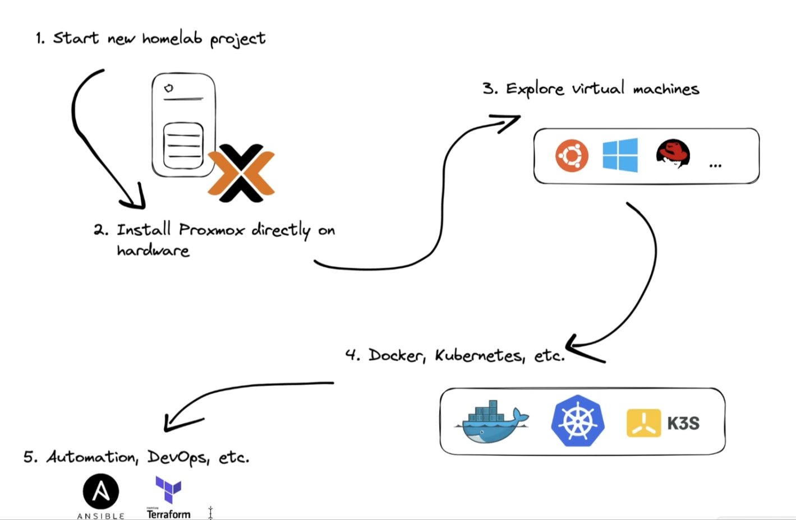

# Proxmox로 홈서버 구축

> **Summary**
> Proxmox를 이용한 홈서버 구축에 대한 가이드를 제공하며, 도메인, 방화벽, 프록시 설정 및 다양한 튜토리얼 링크를 포함하고 있습니다. 또한, Proxmox에서의 Docker 활용 아이디어와 Synology 설치 방법에 대한 자료도 제시됩니다.

---

# 정리문서

> 💡 **[https://svrforum.com/proxmox_guide](https://svrforum.com/proxmox_guide)**

# 도메인 & 방화벽 & 프록시

> 💡 **[https://blog.dalso.org/article/서버포럼-홈서버-메인시스템자랑😭](https://blog.dalso.org/article/%EC%84%9C%EB%B2%84%ED%8F%AC%EB%9F%BC-%ED%99%88%EC%84%9C%EB%B2%84-%EB%A9%94%EC%9D%B8%EC%8B%9C%EC%8A%A4%ED%85%9C%EC%9E%90%EB%9E%91%F0%9F%98%AD)**

# 개요

> 💡 **[https://www.youtube.com/watch?v=SlImxtdCFSo](https://www.youtube.com/watch?v=SlImxtdCFSo)**

[https://www.youtube.com/watch?v=yDkc3D3BFhM](https://www.youtube.com/watch?v=yDkc3D3BFhM)

[https://youtu.be/_sfddZHhOj4?si=aRqLo9TfW9ogOjrJ](https://youtu.be/_sfddZHhOj4?si=aRqLo9TfW9ogOjrJ)

[https://www.youtube.com/watch?v=Be-J6OgreLY](https://www.youtube.com/watch?v=Be-J6OgreLY)

# 튜토리얼

> 💡 **기본 튜토리얼 시리즈 **
> ---
>
> [https://svrforum.com/svr/626324](https://svrforum.com/svr/626324)
>
> [https://youtu.be/Ax86ygBvQxE?si=kvTMjnjcm2aOvtfC](https://youtu.be/Ax86ygBvQxE?si=kvTMjnjcm2aOvtfC)
>
> [https://www.youtube.com/watch?v=YAuOhHiFBgs&t=329s](https://www.youtube.com/watch?v=YAuOhHiFBgs&t=329s)
>
> [https://www.youtube.com/watch?v=DGGo1R-DM8Y&t=1s](https://www.youtube.com/watch?v=DGGo1R-DM8Y&t=1s)
>
> [https://www.youtube.com/watch?v=yUf0OnyWNUg&t=289s](https://www.youtube.com/watch?v=yUf0OnyWNUg&t=289s)
>
> [https://youtu.be/GoZaMgEgrHw?si=wqAwaQ95R8Dsgm-u](https://youtu.be/GoZaMgEgrHw?si=wqAwaQ95R8Dsgm-u)
>
>

> 💡 **엔터프라이즈 설정 제거 관련**
> ---
>
> [https://nad4.tistory.com/entry/Proxmox-설치-및-초기-필수-설정](https://nad4.tistory.com/entry/Proxmox-설치-및-초기-필수-설정) ⭐⭐⭐
>
>

> 💡 **포트포워딩 관련**
> ---
>
> [https://velog.io/@minboykim/더-이상-프리티어는-그만.-나만의-사설-클라우드-구축하기](https://velog.io/@minboykim/더-이상-프리티어는-그만.-나만의-사설-클라우드-구축하기) 
>
>

> 💡 **방화벽 관련**
> ---
>
> [https://velog.io/@minboykim/더-이상-프리티어는-그만.-나만의-사설-클라우드-구축하기](https://velog.io/@minboykim/더-이상-프리티어는-그만.-나만의-사설-클라우드-구축하기) 
>
>

> 💡 **백업 & 복원 관련**
> ---
>
> [https://www.youtube.com/watch?v=Xt-A-g1L72A](https://www.youtube.com/watch?v=Xt-A-g1L72A)
>
>

> 💡 **마이그레이션 관련**
> ---
>
>
>

# 홈서버와 도커

[https://blog.koder.page/selfhosting-guideline/](https://blog.koder.page/selfhosting-guideline/)

# 활용 아이디어

## Proxmox에 헤놀로지

[https://www.youtube.com/watch?v=yUf0OnyWNUg](https://www.youtube.com/watch?v=yUf0OnyWNUg)

[https://velog.io/@kisuk623/Proxmox에-Xpenology-설치하기](https://velog.io/@kisuk623/Proxmox에-Xpenology-설치하기)

[https://it-svr.com/proxmoxe-henolroji-seolcihagi-dsm-7-2/](https://it-svr.com/proxmoxe-henolroji-seolcihagi-dsm-7-2/)

