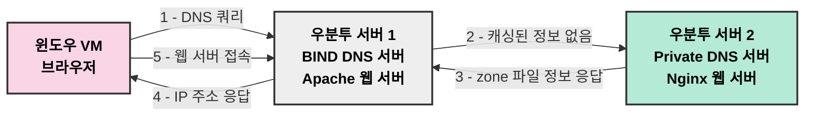
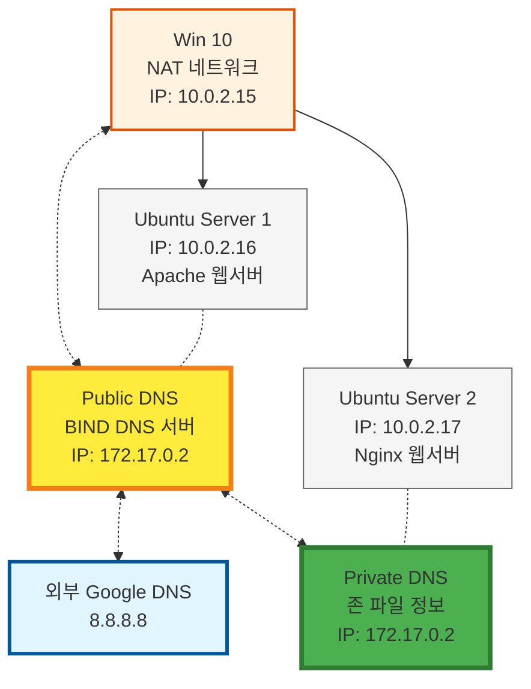

# Public DNS와 Private DNS의 우선순위 게임 : 호스트는 DNS 서버를 어떻게 선택할까?

> **Summary**
> DNS의 기본 원리와 Public DNS 및 Private DNS의 상호작용을 이해하는 실습을 통해, 호스트가 어떤 DNS 서버를 참조하는지 확인하는 것이 핵심입니다. Windows VM에서 Ubuntu 서버를 통해 DNS 요청이 처리되는 흐름을 설명하며, 각 서버의 역할과 DNS 쿼리 처리 과정을 정리합니다. 실습을 통해 DNS 동작 방식, Public과 Private DNS의 차이점, 네트워크 문제 해결 능력을 향상시킬 수 있습니다.

---


> 💡 **목차**
> ---
>
>

# DNS 동작 방식을 직접 이해해 봅시다!

## Public DNS와 Private DNS

해당 실습을 통해 DNS(Domain Name System)의 기본 원리와 함께 Public DNS와 Private DNS가 함께 사용될 때 호스트는 DNS 정보를 어느 시점에 참조하는가?? 를 직접 눈으로 확인해보았으면 하는 마음에 정리해본 문제입니다.


**DNS란 무엇일까요?**

모두가 아시겠지만… 한번 더 사전적으로 정리해보도록 하겠습니다. 

DNS는 웹사이트 주소(예: google.com)를 컴퓨터가 이해할 수 있는 IP 주소(예: 142.250.190.14)로 변환해주는 역할을 합니다. 

전화번호부와 비슷하다고 생각하면 됩니다. DNS는 계층 구조로 이루어져 있으며, 크게 루트 DNS 서버, TLD(Top-Level Domain) 서버, 권한 있는 DNS 서버로 나뉩니다.

- **루트 DNS 서버:** 최상위 도메인(.com, .org 등)에 대한 정보를 제공합니다.
- **TLD 서버:** .com, .org와 같은 최상위 도메인을 관리합니다.
- **권한 있는 DNS 서버:** 특정 도메인(예: google.com)의 IP 주소를 가지고 있습니다.

**자, 그럼 이제 Public DNS와 Private DNS을 함께 사용하는 문제를 풀어봅시다..**

이번 문제에서는 Public DNS와 Private DNS가 함께 사용되는 환경에서, 호스트는 어떤 DNS 서버를 먼저 참조하는지 확인하는 것이 핵심입니다. 아래와 같은 환경을 가정합니다.

1. **윈도우 VM:** 기본 DNS 서버로 우분투 서버1을 사용합니다. 
  - (윈도우든, 우분투 데스크탑이든 상관 없습니다)
1. **우분투 서버1:**
  - 기본 DNS 서버로 우분투 서버2(Public DNS)를 사용합니다.
  - Apache 웹 서버가 설치되어 있습니다.
  - 내부 DNS 서버(bind)가 설치되어 있지만, 존 파일은 설정되어 있지 않고, naver.com 또는 google.com에 대한 응답만 하도록 설정되어 있습니다.
1. **우분투 서버2:**
  - Private DNS 서버(컨테이너 기반)로 동작합니다.
  - Nginx 웹 서버가 설치되어 있습니다.
  - 존 파일 정보를 가지고 있습니다.
이 상황에서 윈도우 VM이 특정 도메인에 접속하려고 할 때, 어떤 DNS 서버를 거쳐 최종 IP 주소를 얻게 되는지, 각 서버의 역할은 무엇인지 이해하는 것이 중요합니다.


### 즉! 간단하게 흐름도를 그리면, 다음과 같겠죠?



- **윈도우 VM (클라이언트):** 웹 브라우저에서 DNS 쿼리를 발생시킵니다.
- **우분투 서버 1 (중간 서버 & 웹 서버):** 윈도우 VM의 DNS 서버 역할을 하며, 자체 DNS 서버 (bind)가 특정 도메인 (naver.com, google.com)에 대해서만 응답하도록 설정되어 있습니다. 만약 요청된 도메인이 자체적으로 응답할 수 없으면 우분투 서버 2로 쿼리를 전달합니다. Apache 웹 서버도 호스팅합니다.
- **우분투 서버 2 (Public DNS & 웹 서버):** Private DNS 서버로, 전체 존 파일 정보를 가지고 있으며, 외부 DNS 요청에 응답합니다. Nginx 웹 서버도 호스팅합니다.
- **흐름:**
  1. 윈도우 VM이 특정 도메인에 대한 IP 주소를 요청합니다.
  1. 요청은 우분투 서버 1의 DNS 서버로 전달됩니다.
  1. 우분투 서버 1의 DNS 서버가 해당 도메인에 대한 정보를 가지고 있지 않으면 우분투 서버 2로 쿼리를 전달합니다.
  1. 우분투 서버 2 (Private DNS)가 존 파일 정보를 기반으로 IP 주소를 찾아 응답합니다.
  1. 우분투 서버 1은 응답을 윈도우 VM에 전달합니다.
  1. 윈도우 VM은 얻은 IP 주소를 사용하여 해당 웹 서버에 접속합니다.

### **그래서, 이 문제의 의의는 무엇일까요?**

이 문제의 의의는 뭐 그냥 DNS를 참조하는 주체는 누구에게 있는가? 정도인데.. 한번 그래도 사전적으로 정리나 해볼까요?

- **DNS 동작 방식 이해:** DNS 쿼리가 어떻게 전달되고 처리되는지 이해할 수 있습니다.
- **Public DNS와 Private DNS의 차이점 이해:** 각각의 역할과 장단점을 파악할 수 있습니다.
- **네트워크 문제 해결 능력 향상:** DNS 관련 문제 발생 시 원인을 파악하고 해결하는 능력을 키울 수 있습니다.

# 자, 그러면 본격적으로 실습을 시작해봅시다!

> 참고로 아래 튜토리얼은 단순히 VirtualBox 기준이기에, Proxmox 용으로 실습하시려면 알잘딱으로 네트워크 설정을 다르게 가져가야하는데… 




## VM 정리

> 요약 Ver

---

> **조금 더 정리해보자면…**


## IP 설정

### Ubuntu Desktop 1 (Host) `10.0.2.15`

```docker
sudo nano /etc/netplan/01-network-manager-all.yaml

```

```docker
network:
  version: 2
  renderer: NetworkManager
  ethernets:
    enp0s3:
      dhcp4: false
      addresses:
        - 192.168.104.100/24

    enp0s10:
      dhcp4: true
      addresses:
        - 10.0.2.15/24
      routes:
        - to: default
          via: 10.0.2.1
      nameservers:
        addresses:
          - 10.0.2.16

```

```docker
sudo netplan apply
```


### Ubuntu Server 1 (Private DNS) `10.0.2.17`

```docker
sudo nano /etc/netplan/00-installer-config.yaml
```

```docker
network:
  version: 2
  ethernets:
    enp0s3:
      addresses:
        - 192.168.100.100/24
      routes:
        - to: 192.168.100.0/24
          via: 192.168.100.254
          table: 100
      dhcp4: no

    enp0s10:
      dhcp4: true
      addresses:
        - 10.0.2.17/24
      routes:
        - to: default
          via: 10.0.2.1
      nameservers:
        addresses:
          - 10.0.2.17
          - 8.8.8.8

```

```docker
sudo netplan apply
```


### Ubuntu Server 2 (PublicDNS) `10.0.2.16`

```docker
sudo nano /etc/netplan/00-installer-config.yaml
```

```docker
network:
  version: 2
  ethernets:
    enp0s3:
      dhcp4: false
      addresses:
        - 192.168.102.100/24

    enp0s10:
      dhcp4: true
      addresses:
        - 10.0.2.16/24
      routes:
        - to: default
          via: 10.0.2.1
      nameservers:
        addresses:
          - 8.8.8.8

```

```docker
sudo netplan apply
```


## 웹서버 설정

### Ubuntu Server 1 (Apahce)  `10.0.2.17`

```bash
sudo systemctl stop nginx
sudo killall nginx

```

```bash
sudo systemctl status nginx
sudo systemctl start apache2
sudo systemctl status apache2
```

```bash
sudo netstat -tulpn | grep :80

```

```bash
curl http://localhost

```


### Ubuntu Server 2 (Nginx) `10.0.2.16`

```bash
sudo systemctl stop apache2
sudo killall apache2

```

```bash
sudo systemctl status apache2
sudo systemctl start nginx
sudo systemctl status nginx

```

```bash
sudo netstat -tulpn | grep :80

```

```bash
curl http://localhost

```


## DNS 설정 (온프레미스 네이티브)

```bash
http://10.0.2.16 을 www.BABO1.com 으로 해줘야함.
http://10.0.2.17 을 www.BABO2.com 으로 해줘야함.
```

### Ubuntu Server 2 (PublicDNS) `10.0.2.16` 
DNS 서버 구축 (via **BIND9**)

우분투 서버에서 **BIND9**를 사용하여 DNS 서버를 구축하는 방법을 간략히 정리했습니다.

1. **BIND9 설치 및 실행**

```shell
sudo apt update
sudo apt install bind9
sudo systemctl start bind9
sudo systemctl enable bind9
```

2. **DNS 존 설정**

`/etc/bind/named.conf.local` 파일에 관리할 도메인(zone)을 추가합니다.

```plain text
sudo nano /etc/bind/named.conf.local

```

아래처럼 수정합니다.

```shell
// 정방향(FWD) 존 설정
zone "BABO.com" {
    type master;
    file "/etc/bind/db.BABO.com";
};

// 역방향(REV) 존 설정 (10.0.2.x 대역)
zone "2.0.10.in-addr.arpa" {
    type master;
    file "/etc/bind/db.2.0.10";
};

```

- `zone "BABO.com"`:
  - `type master`: 이 BIND 서버가 마스터 서버임을 의미.
  - `file "/etc/bind/db.BABO.com"`: 정방향(Forward) DNS 조회를 위한 파일.
- `zone "2.0.10.in-addr.arpa"`:
  - `2.0.10.in-addr.arpa`는 `10.0.2.x` IP 대역의 역방향 DNS 조회를 담당.
  - `file "/etc/bind/db.2.0.10"`: 역방향(Reverse) DNS 조회를 위한 파일.
3. **DNS 존 파일 생성**

[BABO1.com](http://babo1.com/) 존 파일 생성

정방향 존파일

```plain text
sudo nano /etc/bind/db.BABO.com
```

```shell
$TTL 86400
@   IN  SOA  ns1.BABO.com. admin.BABO.com. (
            2024022602  ; Serial (증가 필요)
            3600        ; Refresh
            1800        ; Retry
            604800      ; Expire
            86400 )     ; Minimum TTL

; 네임서버 설정
@       IN  NS  ns1.BABO.com.

; A 레코드 (정방향)
ns1     IN  A   10.0.2.1
www.BABO1 IN  A   10.0.2.16
www.BABO2 IN  A   10.0.2.17

```

역방향

```plain text
sudo nano /etc/bind/db.2.0.10

```

```shell
$TTL 86400
@   IN  SOA  ns1.BABO.com. admin.BABO.com. (
            2024022601  ; Serial
            3600        ; Refresh
            1800        ; Retry
            604800      ; Expire
            86400 )     ; Minimum TTL

; 네임서버 설정
@       IN  NS  ns1.BABO.com.

; PTR 레코드 (IP → 도메인 매핑)
16  IN  PTR  www.BABO1.com.
17  IN  PTR  www.BABO2.com.
1   IN  PTR  ns1.BABO.com.

```

```bash
sudo named-checkzone 2.0.10.in-addr.arpa /etc/bind/db.2.0.10
sudo systemctl restart bind9

```

```plain text
sudo systemctl restart bind9
sudo rndc flush

```

```bash
nslookup www.BABO2.BABO.com 127.0.0.1

```

4. **BIND9 옵션 설정**

`/etc/bind/named.conf.options` 파일을 수정하여 네트워크 및 포워딩 옵션을 설정합니다.

```plain text
sudo nano /etc/bind/named.conf.options
```

아래처럼 수정합니다.

```shell
options {
    directory "/var/cache/bind";
    recursion yes;
    allow-query { any; };
    forwarders { 8.8.8.8; 8.8.4.4; };
    dnssec-validation no;
    listen-on-v6 { any; };
};
```

5. **DNS 서비스 재시작 및 방화벽 설정**

```shell
sudo systemctl restart bind9
```


### Ubuntu Desktop 1 (Host) `10.0.2.15`**DNS 서버 테스트**

클라이언트에서 `/etc/resolv.conf` 파일에 다음을 추가:

```plain text
sudo nano /etc/resolv.conf
```

아래 내용을 추가:

```shell
nameserver 10.0.2.16
```

그리고 아래 명령어로 테스트:

```shell
nslookup www.BABO1.com
dig BABO1.com
```

정상적인 IP 주소가 반환되면 설정이 완료된 것입니다.


## DNS 설정 (도커) Ubuntu Server 1 (Private DNS)  `10.0.2.17`

```bash
하지만 사실 10.0.2.16 은 www.BABO1.BABO.com 하고 www.BABO2.BABO.com 을 응답할 수 없다.

www.google.com 과 같이 공신력 있는 사이트만 반환할 수 있음.

그래서, 만약 10.0.2.16을 네임서버로 둔 10.0.2.15가 www.BABO1.BABO.com 하고 www.BABO2.BABO.com 를 요청한다면, 10.0.2.16은 해당 도메인이 없기 떄문에, 10.0.2.16dl 또 다시 10.0.2.17에게 BABO1 과 BABO2 도메인을 요청해야한다.
아래에 10.0.2.16에 설정한 BABO와 관련된 설정은 전부 10.0.2.17에 있어야하고, 10.0.2.16은 BABO1,2에대한 요청이 들어온다면, 10.0.2.17에 질의해야한다.

이를 맞춰 10.0.2.17 bind9 설정에 대한 가이드와, 10.0.2.16이 BABO와관련된 도메인이 없을떄10.0.2.17에 어떻게 질의하는지에대해 작성해보고자한다.
```

### 도커 생성 전 bind9 설정

- 가정: 10.0.2.17 서버 위에 Docker가 설치되어 있으며, 여기서 bind9 DNS 컨테이너를 구동
- 가정: `www.BABO1.com` 은 실제 IP가 `10.0.2.16`, `www.BABO2.com` 은 `10.0.2.17`
- 만약 10.0.2.16(다른 DNS)에서 `BABO1.com / BABO2.com` 요청이 들어오면 10.0.2.17(이 컨테이너)로 질의(포워드)한다고 설정할 수도 있음.
호스트 측에서 작업할 디렉터리를 준비합니다.

예시: `/home/youruser/mybind9/`

```shell
mkdir -p /root/mybind9
cd /root/mybind9

```

디렉터리 구조 예시:

```plain text
mybind9/
 ├── Dockerfile
 ├── named.conf.options
 ├── named.conf.local
 ├── db.BABO1.com
 └── db.BABO2.com

```

DNS 포워딩, 재귀 쿼리 설정 등을 담는 옵션 파일입니다.

```shell
nano named.conf.options

```

내용 예시:

```plain text
options {
    directory "/var/cache/bind";
    recursion yes;
    allow-query { any; };
    listen-on { any; };
    listen-on-v6 { any; };
    forwarders { 8.8.8.8; 8.8.4.4; };
    dnssec-validation no;
};

```


우리 DNS가 직접 관리할 **정방향 존**(BABO1.com, BABO2.com)을 선언합니다:

```bash
nano named.conf.local


```

```bash
zone "BABO1.com" {
    type master;
    file "/etc/bind/zones/db.BABO1.com";
};

zone "BABO2.com" {
    type master;
    file "/etc/bind/zones/db.BABO2.com";
};

```

존파일 제작

```bash
nano db.BABO1.com

```

```bash
$TTL 86400
@   IN  SOA  ns.BABO1.com. admin.BABO1.com. (
            2025022701   ; Serial(필요 시 증가)
            3600         ; Refresh
            1800         ; Retry
            604800       ; Expire
            86400 )      ; Negative Cache TTL

; 네임서버(NS) 설정
@       IN  NS   ns.BABO1.com.

; 네임서버 IP (컨테이너/마스터 DNS가 위치한 IP)
ns      IN  A    10.0.2.17

; A 레코드: www.BABO1.com → 10.0.2.16 (예시)
www     IN  A    10.0.2.16

```

```bash
nano db.BABO2.com

```

```bash
$TTL 86400
@   IN  SOA  ns.BABO2.com. admin.BABO2.com. (
            2025022701   ; Serial(필요 시 증가)
            3600         ; Refresh
            1800         ; Retry
            604800       ; Expire
            86400 )      ; Negative Cache TTL

; 네임서버(NS) 설정
@       IN  NS   ns.BABO1.com.

; 네임서버 IP (컨테이너/마스터 DNS가 위치한 IP)
ns      IN  A    10.0.2.17

; A 레코드: www.BABO1.com → 10.0.2.16 (예시)
www     IN  A    10.0.2.17

```


### Dockerfile 설정

```bash
nano Dockerfile

```

```bash
FROM ubuntu:latest

# 패키지 설치
RUN apt-get update && apt-get install -y bind9 dnsutils && apt-get clean

# 실행 파일 경로 설정
ENV PATH="/usr/sbin:${PATH}"

# 존(zone) 파일용 디렉터리 생성
RUN mkdir -p /etc/bind/zones

# 설정 파일 복사
COPY named.conf.options /etc/bind/named.conf.options
COPY named.conf.local   /etc/bind/named.conf.local
COPY db.BABO1.com       /etc/bind/zones/db.BABO1.com
COPY db.BABO2.com       /etc/bind/zones/db.BABO2.com

# 53번 포트(TCP/UDP) 개방
EXPOSE 53/tcp
EXPOSE 53/udp

# bind9를 포그라운드로 실행
CMD ["/usr/sbin/named", "-c", "/etc/bind/named.conf", "-g"]

```

빌드

```bash
cd /root/mybind9
docker build -t mybind9 .

```

53포트 싹다 닫기

```bash
sudo netstat -tulpn | grep 53

```

```bash
sudo systemctl stop systemd-resolved
sudo systemctl stop named
sudo systemctl stop bind9
```

**호스트(10.0.2.17)에서**: 컨테이너 실행

```bash
docker run -d --name bind9 \
    -p 53:53/tcp \
    -p 53:53/udp \
    mybind9

```

- 호스트의 53 포트를 컨테이너 53과 바인딩 → 외부에서 `10.0.2.17` IP로 DNS 요청 가능
- 컨테이너 이름: `bind9`
```bash
docker exec -it bind9 /bin/bash
named-checkconf                # BIND 메인 설정파일 문법 체크
named-checkzone BABO1.com /etc/bind/zones/db.BABO1.com
named-checkzone BABO2.com /etc/bind/zones/db.BABO2.com

```


### Ubuntu Server 2 (PublicDNS) `10.0.2.16` 에서 포워드 설정하기

만약 10.0.2.16(기존 DNS)에서 [BABO1.com](http://babo1.com/), [BABO2.com](http://babo2.com/) 요청을 받을 때마다
10.0.2.17(도커 컨테이너 DNS)로 넘기려면 아래처럼 forward 또는 delegate 설정을 합니다.

`**/etc/bind/named.conf.local**` (10.0.2.16 쪽 BIND):

```bash
sudo nano /etc/bind/named.conf.local
```

```bash
zone "BABO1.com" {
    type forward;
    forwarders { 10.0.2.17; };
};

zone "BABO2.com" {
    type forward;
    forwarders { 10.0.2.17; };
};

```

```bash
sudo systemctl restart bind9
```

이후, 10.0.2.16에서 sudo systemctl restart bind9 해주면
10.0.2.16에 온 [BABO1.com](http://babo1.com/), [BABO2.com](http://babo2.com/) 질의는 10.0.2.17(도커 컨테이너)로 전달되어 응답받게 됩니다.


### 테스트

10.0.2.17 호스트 측에서

```bash
nslookup www.BABO1.com
nslookup www.BABO2.com
```

```bash
root@dytl:~/mybind9# nslookup www.BABO1.com
nslookup www.BABO2.com
Server:         127.0.0.53
Address:        127.0.0.53#53

Name:   www.BABO1.com
Address: 10.0.2.16

Server:         127.0.0.53
Address:        127.0.0.53#53

Name:   www.BABO2.com
Address: 10.0.2.17

```

10.0.2.15 , 10.0.2.16 호스트 측에서

```bash
nslookup www.BABO1.com
nslookup www.BABO2.com

```

```bash
root@dytl-VirtualBox:~# nslookup www.BABO1.com
nslookup www.BABO2.com
Server:         10.0.2.16
Address:        10.0.2.16#53

Non-authoritative answer:
Name:   www.BABO1.com
Address: 10.0.2.16

Server:         10.0.2.16
Address:        10.0.2.16#53

Non-authoritative answer:
Name:   www.BABO2.com
Address: 10.0.2.17

```


## 패킷분석 

```bash
sudo tcpdump -i enp0s10 tcp -w UbuntuDesktop.pcap
```

```bash
sudo tcpdump -i enp0s10 tcp -w UbuntuServer2.pcap
```

```bash
sudo tcpdump -i enp0s10 tcp -w UbuntuServer1.pcap
```

### 10.0.2.15(클라이언트) 에서, [www.google.com](http://www.google.com/) 에 접속하면, 10.0.2.16(PublicDNS) 가 응답해줄까?

### 10.0.2.15(클라이언트) 에서, www.BABO1.BABO.com에 접속하면, 10.0.2.16(PublicDNS) 가 응답해줄까?

### 10.0.2.15(클라이언트) 에서, www.BABO1.com에 접속하면, 10.0.2.17(PrivateDNS) 가 응답해줄까?


