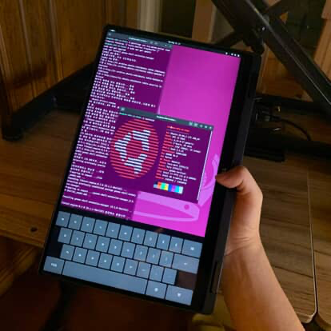
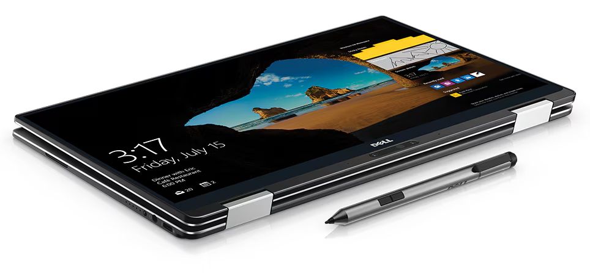
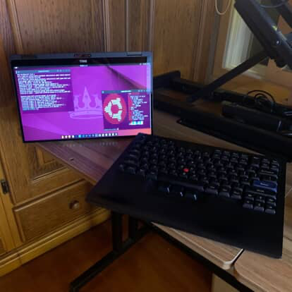
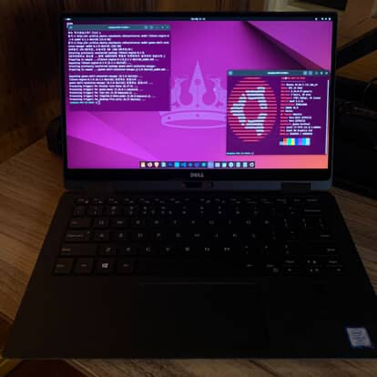

# RST와 AHCI가 도대체 뭔데 날 이리 괴롭힐까? - Dell XPS 13 9365에 Ubuntu 듀얼부팅하기

> **Summary**
> Dell XPS 13 9365에서 Windows 10과 Ubuntu의 듀얼 부팅을 설정하는 과정에서 Intel RST 모드로 인한 문제를 해결하기 위한 경험을 공유한다. AHCI 모드로 변경하기 위해 BIOS 설정을 조정하고, Windows 안전 모드를 활성화한 후 Ubuntu 설치를 진행하는 정확한 절차를 설명하며, 이 과정에서의 시행착오와 배운 점을 기록한다.

---



[https://www.perplexity.ai/search/dell-xps-9365eseo-biosyi-sata-tMMr3dGITjOAuTTjQedoYQ](https://www.perplexity.ai/search/dell-xps-9365eseo-biosyi-sata-tMMr3dGITjOAuTTjQedoYQ)

최근 Dell XPS 13 9365 2-in-1을 무려 5만원에 장터에서 구했다. 그래서 나는 Windows 10과 Ubuntu의 듀얼 부팅 환경을 구성하고자 했다. 그렇다… 시작은 단순했다. 허나, Ubuntu를 설치하려는데, Ubuntu 설치 화면에서 다음과 같은 메시지가 떴다.

> “Intel RST가 활성화되어 있어 설치가 불가능합니다. AHCI 모드로 변경하십시오.”

여기서부터 나의 길고 긴 시행착오가 시작되었다. 결론부터 말하면, 성공했다. 하지만 그 과정에서 겪은 문제와 해결법, 그리고 그 이유에 대해 기록을 남기고자 한다. 같은 문제로 고생하는 사람들에게 작은 도움이라도 되었으면 하는 마음으로 정리한다.

---

## **왜 문제가 발생했는가?**

우선 Dell XPS 시리즈(특히 9365 모델)는 Intel Rapid Storage Technology(RST)라는 RAID 모드를 기본적으로 사용하고 있다. 이 모드는 Windows에서 NVMe SSD의 성능을 최적화하는 목적으로 쓰이지만, Linux 커널이 RST 모드를 제대로 인식하지 못한다. 즉, Ubuntu 설치 프로그램에서는 SSD가 없는 것처럼 보이는 것이다.

그래서 나는 이 RAID(RST) 모드를 AHCI로 변경하려고 했다. AHCI 모드는 표준 방식이기 때문에 Ubuntu에서도 문제가 없다. 하지만 여기서 문제의 시작이었다. BIOS에서 RAID를 AHCI로 직접 바꾸면 Windows가 부팅되지 않는 심각한 문제가 발생하기 때문이다.

---

## **어떻게 문제를 해결했는가?**

처음에는 단순히 BIOS에서 SATA 옵션을 AHCI로 변경했다. 그러나 곧바로 문제가 발생했다. PCIE 초기화 과정에서 멈추고, BIOS 화면 이후 부팅 과정이 진행되지 않았다. 당황한 나는 다음 행동들을 순차적으로 했다.

1. SSD를 인식하지 못하는 것 같아 PCIE 슬롯을 뺐다 끼워봤다. → 실패
1. BIOS 설정을 전부 공장 초기화해봤다. → 부분 성공 (BIOS로 진입은 되었지만 여전히 부팅은 불가능)
1. 다시 SATA Operation을 AHCI에서 RAID(RST)로 변경했다. → 일단 PCIE 초기화는 넘겼다.
1. 이 시점에서 윈도우 자체가 완전히 지워져 있었기 때문에, 윈도우 설치 USB를 제작해 Windows를 재설치했다. → 성공
여기서 크게 배운 점은, Dell XPS 13 9365의 BIOS에서 RAID(RST)를 AHCI로 전환할 때 반드시 Windows에서 미리 ‘안전 모드 부팅’을 설정하고 변경해야 한다는 것이다.

이렇게 얻은 경험을 바탕으로 나는 다음과 같은 정확한 절차를 정리했다. 기존 자료를 참조하며 추가로 중요한 경험을 녹여냈다.

---

## **Dell XPS 13 9365 2-in-1: Windows 10 + Ubuntu 듀얼 부팅 가이드**



> 내 경험을 바탕으로, 바로 따라할 수 있도록 가이드를 남겨두도록 하겠다.

### **준비 단계**

- 중요한 데이터 백업(외장 USB 디스크 권장).
- 8GB 이상의 Ubuntu 부팅용 USB.
- 최신 BIOS 업데이트 권장.
- 전원 어댑터 연결.
### **Windows에서 반드시 해야 할 작업 (중요)**

- Windows에서 안전모드 부팅 설정하기
  윈도우 검색창에 msconfig(시스템구성) 검색 → 부트 탭 → ‘안전 부팅’ 체크 → 최소 선택 → 재부팅

- 또는 관리자 권한 PowerShell에서
```plain text
bcdedit /set {current} safeboot minimal
```

### **BIOS 설정 변경하기**

- 안전부팅으로 재부팅 중 F12를 눌러 BIOS 진입
- System Configuration → SATA Operation에서 RAID(RST) → AHCI로 변경
- Advanced Boot Options에서 Legacy Option ROM을 반드시 비활성화
  (활성화 상태에서는 AHCI로 전환 후 BIOS에서 5분 정도 지연이 발생함.)

- F10을 눌러 변경사항 저장 후 재부팅
### **다시 Windows로 정상 복귀하기**

- 안전모드에서 다시 일반 모드로 복구 (이때, 윈도우는 안전부팅으로 부팅되어야한다)
  msconfig → ‘안전 부팅’ 체크 해제 후 재부팅

또는 관리자 권한 PowerShell에서

```plain text
bcdedit /deletevalue {current} safeboot
```

여기까지 진행했다면 RAID에서 AHCI로 정상 전환이 완료된다.

### **이제 Ubuntu 설치하기**

- BIOS에서 USB를 최우선 부팅 디바이스로 설정
- Ubuntu USB를 꽂고 재부팅 후 F12로 부팅 디바이스 선택
- 설치 과정에서 “Install Ubuntu alongside Windows Boot Manager”를 선택하거나 직접 파티션을 설정해 Ubuntu 설치를 진행
  - [해당 블로그](https://blog.naver.com/PostView.naver?blogId=gong_lan&logNo=223394097279&redirect=Dlog&widgetTypeCall=true&topReferer=https%3A%2F%2Fwww.google.com%2F&trackingCode=external&directAccess=false)가 정리를 잘 했다.
- 설치 후 Grub 메뉴에서 Windows와 Ubuntu를 모두 확인할 것
---

## **그래서, 어떤 결과를 얻었나?**





이 과정을 따라 마침내 나는 Dell XPS 13 9365에서 Windows 10과 Ubuntu의 완벽한 듀얼 부팅 환경을 구축했다. 이전의 실패에서 배운 중요한 포인트는 다음과 같다.

- AHCI 모드 전환 전에 반드시 Windows 안전모드 활성화 후 BIOS 설정을 변경해야 한다는 점.
- BIOS에서 Legacy Option ROM을 활성화하면 AHCI 전환 시 매우 긴 지연이 발생한다는 점.
- 모든 과정에서 발생할 수 있는 잠재적 문제점을 미리 예측하고 대처 방법을 준비해야 한다는 점.
결과적으로 나는 이번 시행착오를 통해, 하드웨어와 운영체제의 관계, 그리고 BIOS 옵션 하나가 미치는 영향력에 대해 깊이 이해하게 되었다. 기술적 난제를 극복한 이 경험이 앞으로의 문제해결 능력에도 많은 도움이 될 거라고 믿는다.

---

## **마치며**

이 기록은 단순히 문제 해결 방법뿐만 아니라, 하나의 문제를 마주하고 해결하기 위한 사고 과정과 배움을 담고 있다. 앞으로도 기술적 도전을 마주할 때마다, 그 과정을 상세히 기록해두고 공유하여 비슷한 문제를 겪는 사람들에게 도움을 줄 수 있기를 희망한다.

이번 경험이 같은 문제를 가진 누군가에게 유용한 자료로 남기를 바란다.

<details>
<summary>**참고사이트**</summary>

[https://help.ubuntu.com/rst/](https://help.ubuntu.com/rst/)[https://wiki.archlinux.org/title/Dell_XPS_13_2-in-1_(9365)](https://wiki.archlinux.org/title/Dell_XPS_13_2-in-1_(9365))[https://blog.workinghardinit.work/2018/11/25/move-from-raid-to-ahci/](https://blog.workinghardinit.work/2018/11/25/move-from-raid-to-ahci/)[https://blog.csdn.net/qq_42008300/article/details/123152734](https://blog.csdn.net/qq_42008300/article/details/123152734)[https://www.dell.com/community/en/conversations/laptops-general-locked-topics/dell-xps-13-9365-wont-boot-usb-in-sata-mode-ahci-trying-to-install-ubuntu/647f6d91f4ccf8a8deae21df](https://www.dell.com/community/en/conversations/laptops-general-locked-topics/dell-xps-13-9365-wont-boot-usb-in-sata-mode-ahci-trying-to-install-ubuntu/647f6d91f4ccf8a8deae21df)[https://www.dell.com/community/en/conversations/xps/xps-13-9365-hard-disk-not-found-when-choosing-ahci/647f7cc5f4ccf8a8deb276d0](https://www.dell.com/community/en/conversations/xps/xps-13-9365-hard-disk-not-found-when-choosing-ahci/647f7cc5f4ccf8a8deb276d0)[https://learn.microsoft.com/en-us/answers/questions/3776028/changing-intel-rst-to-ahci-in-bios-menu-causes-win](https://learn.microsoft.com/en-us/answers/questions/3776028/changing-intel-rst-to-ahci-in-bios-menu-causes-win)[https://www.dell.com/community/XPS/XPS-13-9365-2-in-1-RAID-Windows-10-SSD-not-recognized/m-p/5732865](https://www.dell.com/community/XPS/XPS-13-9365-2-in-1-RAID-Windows-10-SSD-not-recognized/m-p/5732865)[https://www.dell.com/support/manuals/en-us/xps-13-9365-2-in-1-laptop/xps_9365_servicemanual/system-setup-options?guid=guid-c468c18f-267a-40db-b764-eacaf50f8db8&lang=en-us](https://www.dell.com/support/manuals/en-us/xps-13-9365-2-in-1-laptop/xps_9365_servicemanual/system-setup-options?guid=guid-c468c18f-267a-40db-b764-eacaf50f8db8&lang=en-us)[https://www.dell.com/community/General/BIOS-Bug-in-XPS-13-9365-Stall-of-5-minutes-in-Dell-logo-in-AHCI/td-p/5091272](https://www.dell.com/community/General/BIOS-Bug-in-XPS-13-9365-Stall-of-5-minutes-in-Dell-logo-in-AHCI/td-p/5091272)[https://i.dell.com/sites/csdocuments/Shared-Content_data-Sheets_Documents/en/XPS-9365-2-in-1-spec-sheet.pdf](https://i.dell.com/sites/csdocuments/Shared-Content_data-Sheets_Documents/en/XPS-9365-2-in-1-spec-sheet.pdf)[https://winraid.level1techs.com/t/how-to-modify-dell-d620-a10-bios-to-support-ahci-on-windows-10/31105](https://winraid.level1techs.com/t/how-to-modify-dell-d620-a10-bios-to-support-ahci-on-windows-10/31105)[https://superuser.com/questions/1559194/how-can-i-safely-disable-intel-rst](https://superuser.com/questions/1559194/how-can-i-safely-disable-intel-rst)[https://www.reddit.com/r/linuxquestions/comments/1ipf8fl/disabling_intel_rst_on_a_windows_10_laptop_want/](https://www.reddit.com/r/linuxquestions/comments/1ipf8fl/disabling_intel_rst_on_a_windows_10_laptop_want/)[https://www.youtube.com/watch?v=iHbGQV3ugRg](https://www.youtube.com/watch?v=iHbGQV3ugRg)[https://blog.csdn.net/qq_40907977/article/details/106551311](https://blog.csdn.net/qq_40907977/article/details/106551311)[https://community.intel.com/t5/Rapid-Storage-Technology/Dell-XPS-8500-destop-Win7-Uninstall-RST-to-dual-boot-with-Linux/m-p/591081?profile.language=ja](https://community.intel.com/t5/Rapid-Storage-Technology/Dell-XPS-8500-destop-Win7-Uninstall-RST-to-dual-boot-with-Linux/m-p/591081?profile.language=ja)[https://www.dell.com/community/en/conversations/xps/unable-to-reset-xps-13-9365/647f9fc7f4ccf8a8de4b006b](https://www.dell.com/community/en/conversations/xps/unable-to-reset-xps-13-9365/647f9fc7f4ccf8a8de4b006b)[https://www.youtube.com/watch?v=UTXXvxUjd-A](https://www.youtube.com/watch?v=UTXXvxUjd-A)[https://www.youtube.com/watch?v=In-7OsQ3vLQ](https://www.youtube.com/watch?v=In-7OsQ3vLQ)[https://www.reddit.com/r/linux4noobs/comments/he3ujk/ubuntuwindows_dual_boot_challenge_due_to_intel_rst/](https://www.reddit.com/r/linux4noobs/comments/he3ujk/ubuntuwindows_dual_boot_challenge_due_to_intel_rst/)[https://www.dell.com/community/en/conversations/locked-topics-desktops-general/how-do-i-enable-ahci-mode/647f200cf4ccf8a8de39df3e](https://www.dell.com/community/en/conversations/locked-topics-desktops-general/how-do-i-enable-ahci-mode/647f200cf4ccf8a8de39df3e)[https://www.reddit.com/r/Ubuntu/comments/iu6gf9/issues_disabling_rst_on_dell_xps_9300/](https://www.reddit.com/r/Ubuntu/comments/iu6gf9/issues_disabling_rst_on_dell_xps_9300/)[https://www.dell.com/community/en/conversations/linux-general/15-r4-ubuntu-install-disable-irst/647f8979f4ccf8a8de915050](https://www.dell.com/community/en/conversations/linux-general/15-r4-ubuntu-install-disable-irst/647f8979f4ccf8a8de915050)[https://community.intel.com/t5/Rapid-Storage-Technology/Dual-Boot-RAID-SATA-driver-installation-in-ubuntu-RST/m-p/1468278](https://community.intel.com/t5/Rapid-Storage-Technology/Dual-Boot-RAID-SATA-driver-installation-in-ubuntu-RST/m-p/1468278)[https://dev.to/lakshmiwarrier/dual-booting-windows-10-and-ubuntu-20-04-with-rst-issue-fixed-4le8](https://dev.to/lakshmiwarrier/dual-booting-windows-10-and-ubuntu-20-04-with-rst-issue-fixed-4le8)[https://www.youtube.com/watch?v=6dYa4c0Naeg](https://www.youtube.com/watch?v=6dYa4c0Naeg)[https://www.youtube.com/watch?v=W1MYQI96gaE](https://www.youtube.com/watch?v=W1MYQI96gaE)[https://www.youtube.com/watch?v=2-cCcMIwDKU](https://www.youtube.com/watch?v=2-cCcMIwDKU)[https://www.youtube.com/watch?v=5D3ejEReOSg](https://www.youtube.com/watch?v=5D3ejEReOSg)[https://www.youtube.com/watch?v=EB_1J8x9mFw](https://www.youtube.com/watch?v=EB_1J8x9mFw)[https://www.youtube.com/watch?v=fLC-NMz7O8A](https://www.youtube.com/watch?v=fLC-NMz7O8A)[https://www.dell.com/community/en/conversations/laptops-general-locked-topics/dell-xps-13-9365-wont-boot-usb-in-sata-mode-ahci-trying-to-install-ubuntu/647f6d91f4ccf8a8deae21df?commentId=647f6e13f4ccf8a8deb71632&page=3](https://www.dell.com/community/en/conversations/laptops-general-locked-topics/dell-xps-13-9365-wont-boot-usb-in-sata-mode-ahci-trying-to-install-ubuntu/647f6d91f4ccf8a8deae21df?commentId=647f6e13f4ccf8a8deb71632&page=3)[https://www.reddit.com/r/Dell/comments/6i1sc3/problem_booting_usb_install_on_dell_xps_13_9365/](https://www.reddit.com/r/Dell/comments/6i1sc3/problem_booting_usb_install_on_dell_xps_13_9365/)[https://www.dell.com/community/General/Dell-XPS-13-9365-Won-t-boot-USB-in-SATA-Mode-AHCI-Trying-to/td-p/5119108/page/3](https://www.dell.com/community/General/Dell-XPS-13-9365-Won-t-boot-USB-in-SATA-Mode-AHCI-Trying-to/td-p/5119108/page/3)[https://www.dell.com/community/en/conversations/locked-topics-laptops-general/dell-xps-13-9365-wont-boot-usb-in-sata-mode-ahci-trying-to-install-ubuntu/647f6d91f4ccf8a8deae21df](https://www.dell.com/community/en/conversations/locked-topics-laptops-general/dell-xps-13-9365-wont-boot-usb-in-sata-mode-ahci-trying-to-install-ubuntu/647f6d91f4ccf8a8deae21df)[https://www.dell.com/community/en/conversations/laptops-general-locked-topics/dell-xps-13-9365-wont-boot-usb-in-sata-mode-ahci-trying-to-install-ubuntu/647f6d91f4ccf8a8deae21df?page=2](https://www.dell.com/community/en/conversations/laptops-general-locked-topics/dell-xps-13-9365-wont-boot-usb-in-sata-mode-ahci-trying-to-install-ubuntu/647f6d91f4ccf8a8deae21df?page=2)[https://www.youtube.com/watch?v=YPDiSPKr9Uc](https://www.youtube.com/watch?v=YPDiSPKr9Uc)[https://www.dell.com/support/manuals/en-ee/xps-13-9320-laptop/xps-13-9320-setup-and-specifications/memory?guid=guid-05867936-5f4f-49a0-aba0-bdb592fd6959&lang=en-us](https://www.dell.com/support/manuals/en-ee/xps-13-9320-laptop/xps-13-9320-setup-and-specifications/memory?guid=guid-05867936-5f4f-49a0-aba0-bdb592fd6959&lang=en-us)[https://downloads.dell.com/manuals/all-products/esuprt_laptop/esuprt_xps_laptop/xps-13-9360-laptop_administrator guide_en-us.pdf](https://downloads.dell.com/manuals/all-products/esuprt_laptop/esuprt_xps_laptop/xps-13-9360-laptop_administrator%20guide_en-us.pdf)[https://www.dell.com/community/en/conversations/windows-general/solved-xps-13-9365-2-in-1-131-bios-stuck-on-dell-logo/647f79f9f4ccf8a8de821922](https://www.dell.com/community/en/conversations/windows-general/solved-xps-13-9365-2-in-1-131-bios-stuck-on-dell-logo/647f79f9f4ccf8a8de821922)[https://hetmanrecovery.com/recovery_news/how-to-enable-ahci-mode-for-sata-in-the-bios-without-reinstalling-windows.htm](https://hetmanrecovery.com/recovery_news/how-to-enable-ahci-mode-for-sata-in-the-bios-without-reinstalling-windows.htm)[https://superuser.com/questions/452384/how-is-the-extra-msata-ssd-disk-used-configured-in-a-dell-xps-laptop](https://superuser.com/questions/452384/how-is-the-extra-msata-ssd-disk-used-configured-in-a-dell-xps-laptop)[https://www.dell.com/support/kbdoc/ko-kr/000132475/제외-bios-설정-변경으로-xps-노트북에서-시작-오류가-발생함?lang=ko](https://www.dell.com/support/kbdoc/ko-kr/000132475/%EC%A0%9C%EC%99%B8-bios-%EC%84%A4%EC%A0%95-%EB%B3%80%EA%B2%BD%EC%9C%BC%EB%A1%9C-xps-%EB%85%B8%ED%8A%B8%EB%B6%81%EC%97%90%EC%84%9C-%EC%8B%9C%EC%9E%91-%EC%98%A4%EB%A5%98%EA%B0%80-%EB%B0%9C%EC%83%9D%ED%95%A8?lang=ko)[https://community.acer.com/en/kb/articles/13993-how-to-change-sata-mode-to-ahci](https://community.acer.com/en/kb/articles/13993-how-to-change-sata-mode-to-ahci)

</details>

