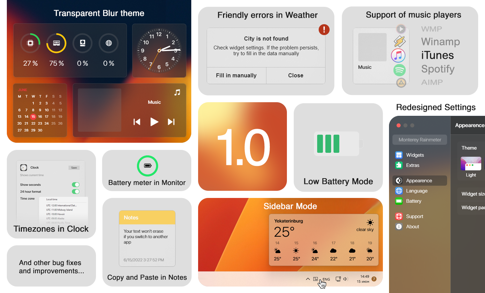

# Rainmeter - 윈도우에 MAC 스타일 위젯 추가하기

> **Summary**
> Rainmeter를 설치한 후, MAC 스타일 위젯을 추가하기 위해 필요한 GitHub 파일을 다운로드할 수 있습니다. Rainmeter는 데스크탑 커스터마이징 도구입니다.

---

### Rainmeter 설치 후 아래 깃허브 파일 다운로드 

🔗 [https://www.rainmeter.net/](https://www.rainmeter.net/)

🔗 [https://github.com/creewick/MontereyRainmeter](https://github.com/creewick/MontereyRainmeter)

