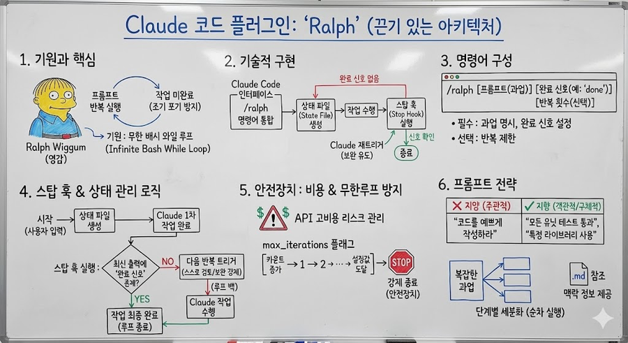

# Ralph By Anthropic : 불멸의 AI에게 멈춤없이, 영원히 일을 시켜보자!

> **Summary**
> Ralph 플러그인은 Anthropic의 Claude를 위한 도구로, 작업이 완료될 때까지 동일한 프롬프트를 반복 실행하여 조기 포기를 방지합니다. 사용자는 

---

## [주제 1: Ralph 플러그인의 기원과 핵심 개념]

Anthropic의 Claude를 위한 코드 플러그인인 'Ralph'는 심슨 가족의 캐릭터 랄프 위검(Ralph Wiggum)에서 영감을 얻어 제작되었습니다. 이 도구의 핵심은 인공지능 모델이 과업을 완료하지 못하고 조기에 포기하는 문제를 해결하기 위해, 작업이 실제로 완료될 때까지 동일한 프롬프트를 반복해서 실행하는 끈기 있는 아키텍처에 있습니다. 본래 이 개념은 제프리 헌틀리(Jeffrey Huntley)가 제안한 '무한 배시 와일 루프(infinite bash while loop)' 기술에서 시작되었으며, 에이전트에게 프롬프트를 전달한 후 응답을 대기하고 다시 동일한 프롬프트를 피드백하는 단순하지만 강력한 논리적 구조를 지니고 있습니다.

## [주제 2: Claude Code 내 기술적 구현 방식]

Anthropic 팀은 단순히 한 줄의 배시 스크립트를 사용하는 대신, 이를 Claude Code에 정교하게 통합하여 'Ralph' 슬래시 명령어를 구현하였습니다. 이 시스템은 사용자가 'complete' 또는 'done'과 같은 완료 신호(Completion Promise)를 설정하면 상태 파일(State File)을 생성하며 작동합니다. 기술적으로는 Claude Code의 '스탑 훅(stop hook)'을 활용하는데, 이는 Claude가 작업을 마쳤을 때 실행되어 상태 파일을 파싱하고 최신 출력물에서 완료 신호를 확인합니다. 만약 완료 신호가 발견되지 않으면 스탑 훅이 자동으로 Claude를 다시 트리거하여 동일한 프롬프트를 기반으로 기존 코드를 개선하거나 누락된 부분을 보완하도록 유도합니다.

## [주제 3: 실행 명령어 및 필수 매개변수 구성]

Claude Code 인터페이스 내에서 Ralph 기능을 활성화하기 위해서는 `/ralph` 슬래시 명령어를 사용해야 합니다. 이 명령어는 크게 세 가지 구성 요소로 이루어지는데, 수행할 과업을 명시한 프롬프트, 작업 완료를 인식할 지표인 '완료 신호(Completion Promise)', 그리고 선택 사항인 반복 횟수 제한입니다. 사용자는 'done'이나 'complete'와 같은 특정 단어를 완료 신호로 설정함으로써, 에이전트가 해당 단어를 출력할 때까지 작업을 멈추지 않고 지속하도록 제어할 수 있습니다.

## [주제 4: 자동 반복을 위한 스탑 훅(Stop Hook) 및 상태 관리]

Ralph의 운용 논리는 사용자의 입력과 동시에 생성되는 상태 파일(State File)과 Anthropic의 '스탑 훅' 기술을 기반으로 작동합니다. Claude가 프롬프트에 따른 일차적인 작업을 마치면 스탑 훅이 실행되어 상태 파일을 파싱하고, 최신 출력물 내에 사용자가 지정한 완료 신호가 존재하는지 검사합니다. 만약 신호가 발견되지 않으면 시스템은 즉시 다음 반복 단계를 트리거하여 Claude가 이전 결과물을 스스로 검토하고 보완하도록 강제하며, 이 과정은 신호가 확인될 때까지 자동으로 반복됩니다.

## [주제 5: 비용 제어 및 무한 루프 방지 설정]

API 기반의 고비용 모델을 사용할 때 발생할 수 있는 경제적 리스크를 관리하기 위해 `max_iterations` 플래그 설정을 권장합니다. 사용자는 이 플래그에 숫자를 할당하여 최대 반복 횟수를 명시할 수 있으며, 시스템은 매 반복 시마다 카운트를 증가시켜 설정된 수치에 도달하면 작업을 강제로 종료합니다. 이는 모델이 논리적 오류로 인해 완료 신호를 내뱉지 못하고 무한 루프에 빠져 과도한 비용이 청구되는 상황을 방지하는 안전장치 역할을 합니다.

## [주제 6: 효율적인 과업 수행을 위한 프롬프트 전략]

Ralph 플러그인의 성능을 극대화하기 위해서는 정교한 프롬프트 엔지니어링과 작업 세분화가 필요합니다. '코드를 예쁘게 작성하라'와 같은 주관적인 요청은 지양해야 하며, 대신 '모든 유닛 테스트를 통과할 것'이나 '특정 라이브러리를 사용하여 구현할 것'과 같이 객관적으로 검증 가능한 완료 기준을 제시해야 합니다. 특히 복잡도가 높은 과업은 한 번에 처리하기보다 논리적 단계별로 쪼개어 순차적으로 실행하는 것이 모델의 정확도를 높이는 데 유리하며, 필요한 경우 별도의 프롬프트 파일(.md)을 참조하도록 설정하여 맥락 정보를 상세히 제공하는 것이 효과적입니다.

