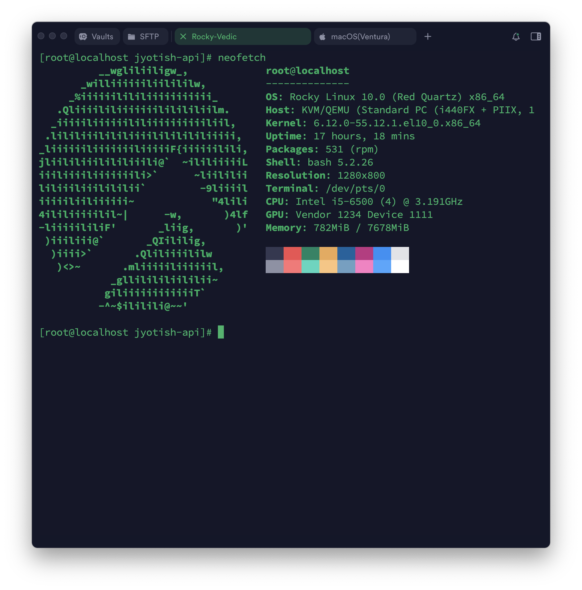

# Rocky10 에서 neofetch 직접 빌드하여 사용하기

> **Summary**
> Rocky Linux 10에서 neofetch 패키지가 EPEL 저장소에 포함되어 있지 않아 설치 오류가 발생하며, GitHub에서 소스를 직접 다운로드하여 설치하는 방법을 설명합니다. 설치 후 neofetch를 실행하면 시스템 정보를 확인할 수 있습니다.

---

> Neofetch 왜 안깔림?



```shell
$ sudo dnf install neofetch -y
마지막 메타자료 만료확인(0:00:11 이전): 2025년 07월 31일 (목) 오전 11시 09분 10초.
일치하는 인수가 없습니다: neofetch
오류: 일치하는 항목을 찾을 수 없습니다: neofetch
```

Rocky Linux 10용 EPEL 저장소에는 아직 neofetch 패키지가 공식 포함되어 있지 않아, dnf install neofetch 시 "일치하는 항목을 찾을 수 없습니다" 오류가 발생합니다. 대신 GitHub 공식 소스를 직접 받아 스크립트를 덮어쓰는 방법으로 neofetch를 사용할 수 있습니다. Fedora 공식 neofetch 스크립트를 덮어써서 사용 가능하며, 최신 neofetch 스크립트에는 Rocky 로고 지원이 포함되어 있습니다.

```shell
sudo curl -s \
  https://raw.githubusercontent.com/dylanaraps/neofetch/master/neofetch \
  -o /usr/bin/neofetch
sudo chmod +x /usr/bin/neofetch
neofetch
```

그러면 성공했습니다~

```shell
[root@localhost jyotish-api]# neofetch
          __wgliliiligw_,             root@localhost 
       _williiiiiiliilililw,          -------------- 
     _%iiiiiilililiiiiiiiiiii_        OS: Rocky Linux 10.0 (Red Quartz) x86_64 
   .Qliiiililiiiiiiililililiilm.      Host: KVM/QEMU (Standard PC (i440FX + PIIX, 1 
  _iiiiiliiiiiililiiiiiiiiiiliil,     Kernel: 6.12.0-55.12.1.el10_0.x86_64 
 .lililiiilililiiiilililililiiiii,    Uptime: 17 hours, 18 mins 
_liiiiiiliiiiiiiliiiiiF{iiiiiilili,   Packages: 531 (rpm) 
jliililiiilililiiili@`  ~ililiiiiiL   Shell: bash 5.2.26 
iiiliiiiliiiiiiili>`      ~liililii   Resolution: 1280x800 
liliiiliiilililii`         -9liiiil   Terminal: /dev/pts/0 
iiiiiliiliiiiii~             "4lili   CPU: Intel i5-6500 (4) @ 3.191GHz 
4ililiiiiilil~|      -w,       )4lf   GPU: Vendor 1234 Device 1111 
-liiiiililiF'       _liig,       )'   Memory: 782MiB / 7678MiB 
 )iiiliii@`       _QIililig,
  )iiii>`       .Qliliiiililw                                 
   )<>~       .mliiiiiliiiiiil,                               
            _gllilililiililii~
           giliiiiiiiiiiiiT`
          -^~$ililili@~~'

[root@localhost jyotish-api]# 

```

