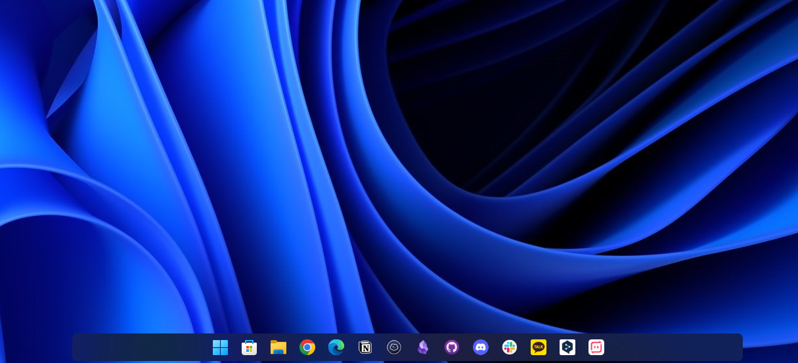

# RoundedTB - 윈도우 작업표시줄 

> **Summary**
> 태스크바를 이쁘게 꾸미기 위한 RoundedTB 커스터마이징 방법과 관련된 내용이 포함되어 있으며, 최신 버전은 GitHub에서 확인할 수 있습니다.

---

둥글게 커스터마이징

🎥 [동영상 보기](https://www.youtube.com/watch?v=2AawuA9Qs2I)

🔗 [https://github.com/RoundedTB/RoundedTB/releases/tag/R3.1](https://github.com/RoundedTB/RoundedTB/releases/tag/R3.1)

