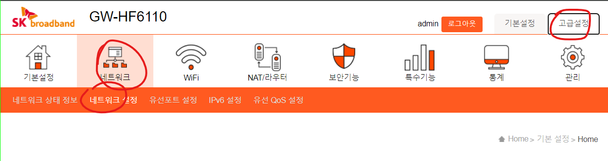
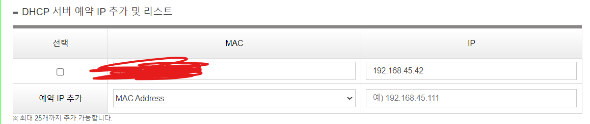
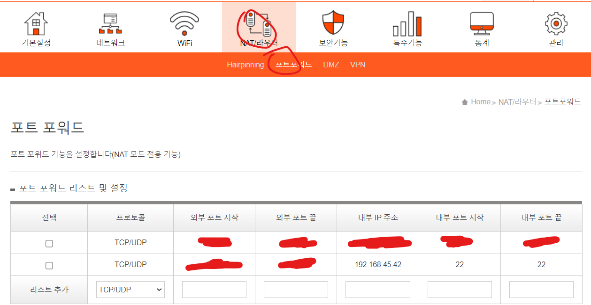

# SK공유기 고정아이피, 포트포워딩

> **Summary**
> 고정 IP 주소를 할당하고 포트 포워딩을 설정하는 방법에 대한 단계별 안내. DHCP 서버에 MAC 주소와 고정 IP 주소를 등록한 후, 외부에서 SSH 접속을 위해 포트 포워딩을 설정하고, 확인한 IP 주소와 포트 번호를 사용하여 SSH 연결을 수행합니다.

---


🔗 [https://velog.io/@dev2820/raspberry-pi-고정-ip-할당하기](https://velog.io/@dev2820/raspberry-pi-고정-ip-할당하기)

🔗 [https://velog.io/@dev2820/raspberry-pi-ssh-연결하기](https://velog.io/@dev2820/raspberry-pi-ssh-연결하기)

🔗 [https://poalim.tistory.com/12](https://poalim.tistory.com/12)

## [192.168.45.1](192.168.45.1) 접속 후 네트워크 설정 이동



## DHCP 서버에 나의 MAC 주소와 사용할 고정 ip주소 등록



## 포트포워딩 설정



## 이제 아래 사이트에서 내 찐 아이피 확인

🔗 [https://www.whatismyip.com/](https://www.whatismyip.com/)

## 이제 외부 네트워크에서 내 찐 아이피와 포트번호로 ssh 접속

```latex
ssh pi@<찐 아이피> -p <외부포트번호>
```

