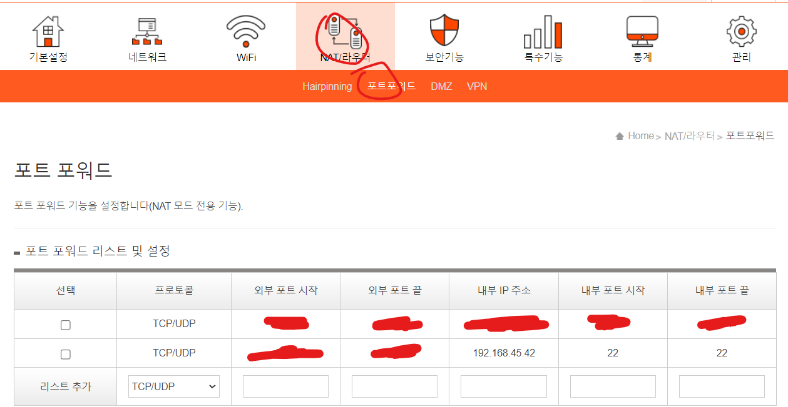

# SK공유기 고정아이피, 포트포워딩

> **Summary**
> SK 공유기에서 고정 IP를 할당하고 SSH 연결 및 포트 포워딩을 설정하는 방법에 대한 안내. DHCP 서버에 MAC 주소와 고정 IP를 등록한 후, 외부에서 사용할 포트와 내부 SSH 포트 22를 설정하여 SSH 접속을 가능하게 함.

---


🔗 [https://velog.io/@dev2820/raspberry-pi-고정-ip-할당하기](https://velog.io/@dev2820/raspberry-pi-고정-ip-할당하기)

🔗 [https://velog.io/@dev2820/raspberry-pi-ssh-연결하기](https://velog.io/@dev2820/raspberry-pi-ssh-연결하기)

🔗 [https://poalim.tistory.com/12](https://poalim.tistory.com/12)

## [192.168.45.1](192.168.45.1) 접속 후 네트워크 설정 이동


## DHCP 서버에 나의 MAC 주소와 사용할 고정 ip주소 등록


## 포트포워딩 설정



## 이제 아래 사이트에서 내 찐 아이피 확인

🔗 [https://www.whatismyip.com/](https://www.whatismyip.com/)

## 이제 외부 네트워크에서 내 찐 아이피와 포트번호로 ssh 접속

```latex
ssh pi@<찐 아이피> -p <외부포트번호>
```

