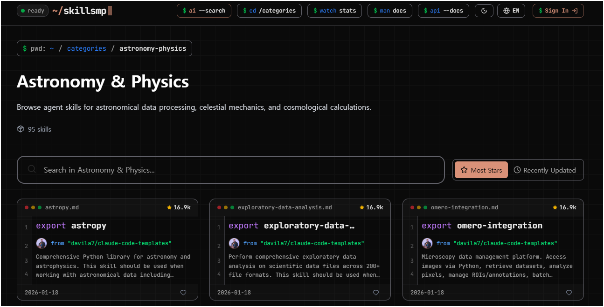
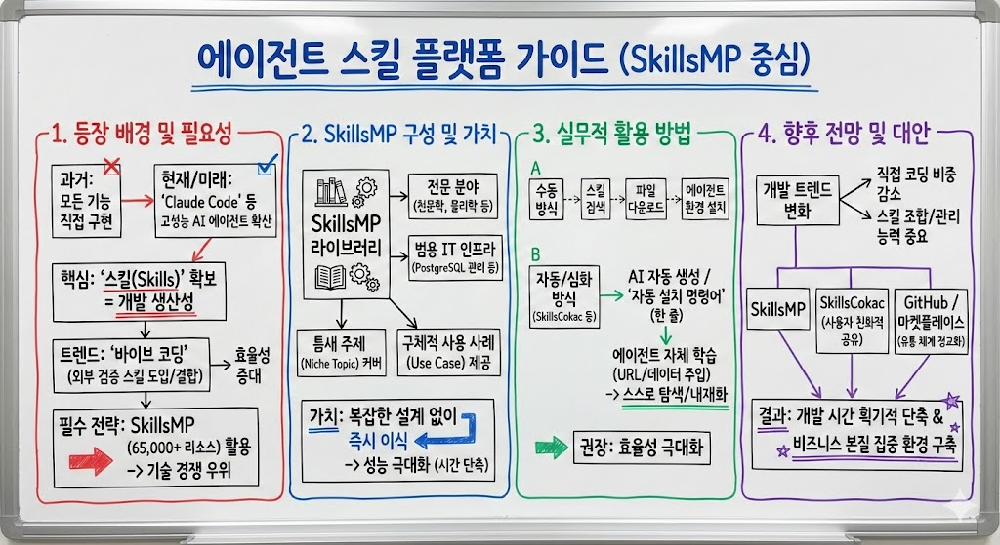

# Skills를 다운로드 받아 사용하자! SkillsMP

> **Summary**
> 고성능 AI 에이전트의 활용이 증가함에 따라, SkillsMP 플랫폼은 65,000개 이상의 스킬을 제공하여 개발자들이 효율적으로 기능을 구현할 수 있도록 돕는다. 이 플랫폼은 천문학, 물리학 등 다양한 전문 분야의 스킬 라이브러리를 갖추고 있으며, 사용자는 필요한 스킬을 검색하여 다운로드 후 설치할 수 있다. 또한, AI를 통한 자동 설치 기능을 제공하는 대안 플랫폼도 등장하고 있으며, 향후 에이전트 스킬 시장은 기존 스킬의 조합과 관리에 중점을 두게 될 전망이다.

---

[https://www.threads.com/@choi.openai/post/DTochmuDcf7?xmt=AQF05-OUiXJGzCHvYt3KPPApsagQ6WqkpHgz2r3vLX-T1A](https://www.threads.com/@choi.openai/post/DTochmuDcf7?xmt=AQF05-OUiXJGzCHvYt3KPPApsagQ6WqkpHgz2r3vLX-T1A)

🔗 [https://skillsmp.com/categories/astronomy-physics](https://skillsmp.com/categories/astronomy-physics)

## [주제 1: 에이전트 스킬 플랫폼의 등장 배경과 필요성]

최근 'Claude Code'와 같은 고성능 AI 에이전트의 활용이 확산되면서, 사용자가 에이전트에게 부여할 수 있는 '스킬(Skills)'의 확보가 개발 생산성의 핵심 요소로 부상하였다. 과거에는 개발자가 모든 기능을 직접 구현해야 했으나, 이제는 검증된 스킬 셋을 외부에서 도입하거나 결합하여 사용하는 이른바 '바이브 코딩(Vibe Coding)'이 주류를 형성하고 있다. 이러한 환경에서 개별 개발자가 모든 도구를 독자적으로 구축하는 것은 시간적, 비용적 측면에서 비효율적이며, 이미 최적화된 65,000개 이상의 리소스를 보유한 SkillsMP와 같은 플랫폼을 활용하는 것이 기술적 경쟁 우위를 점하는 필수적인 전략이 되었다.

## [주제 2: SkillsMP의 상세 구성 및 기술적 가치]

SkillsMP는 천문학(Astronomy), 물리학(Physics)과 같은 고도의 전문 분야부터 PostgreSQL 관리와 같은 범용적인 IT 인프라 영역에 이르기까지 매우 광범위하고 세분화된 스킬 라이브러리를 구축하고 있다. 이 플랫폼의 가치는 단순히 양적인 방대함에 그치지 않고, 일반적인 검색으로는 접근하기 어려운 틈새 주제(Niche Topic)와 구체적인 사용 사례(Use Case)를 모두 커버한다는 점에 있다. 사용자는 이를 통해 복잡한 에이전트 기능을 바닥부터 설계할 필요 없이, 이미 정의된 스킬을 즉시 이식하여 에이전트의 성능을 단기간에 극대화할 수 있다.

## [주제 3: 플랫폼의 실무적 활용 방법 및 절차]

SkillsMP의 기본적인 활용 방식은 사용자가 필요한 스킬을 검색하여 해당 파일을 수동으로 다운로드한 후 에이전트 환경에 설치하는 과정을 거친다. 다만, 수동 설치 방식의 번거로움을 해결하기 위해 SkillsCokac과 같은 대안 플랫폼은 AI를 통한 스킬 자동 생성 기능과 더불어 한 줄의 명령어로 스킬을 도입할 수 있는 '자동 설치 명령어' 기능을 제공하고 있다. 보다 심화된 활용법으로는 에이전트 자체에 해당 플랫폼의 URL이나 데이터를 직접 학습(Context 주입)시켜, 에이전트가 스스로 필요한 스킬을 탐색하고 내재화하도록 유도하는 방식이 권장된다.

## [주제 4: 에이전트 스킬 생태계의 향후 전망과 대안 리소스]

에이전트 스킬 시장은 향후 개발자가 직접 코드를 작성하는 비중이 줄어들고, 기존에 구축된 오리지널 스킬들을 얼마나 잘 조합하고 관리하느냐에 초점이 맞춰질 것으로 예측된다. 현재 SkillsMP 외에도 SkillsCokac과 같은 사용자 친화적 공유 플랫폼이 선두 주자로 자리 잡고 있으며, 깃허브(GitHub) 저장소나 별도의 마켓플레이스를 통한 스킬 유통 체계가 더욱 정교해질 전망이다. 사용자는 이러한 다각적인 리소스를 활용함으로써 개발 시간을 획기적으로 단축하고, 비즈니스 로직의 본질에 더욱 집중할 수 있는 환경을 구축할 수 있다.

