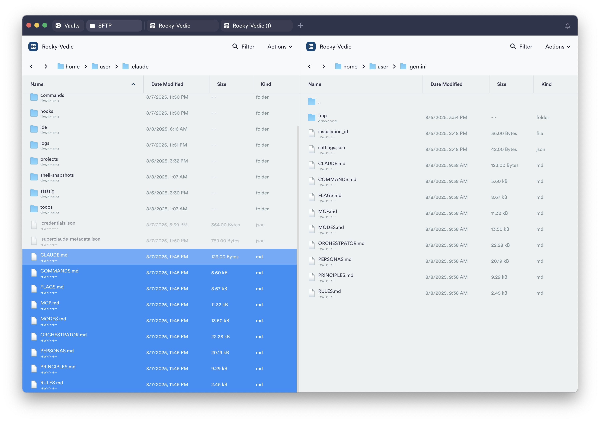
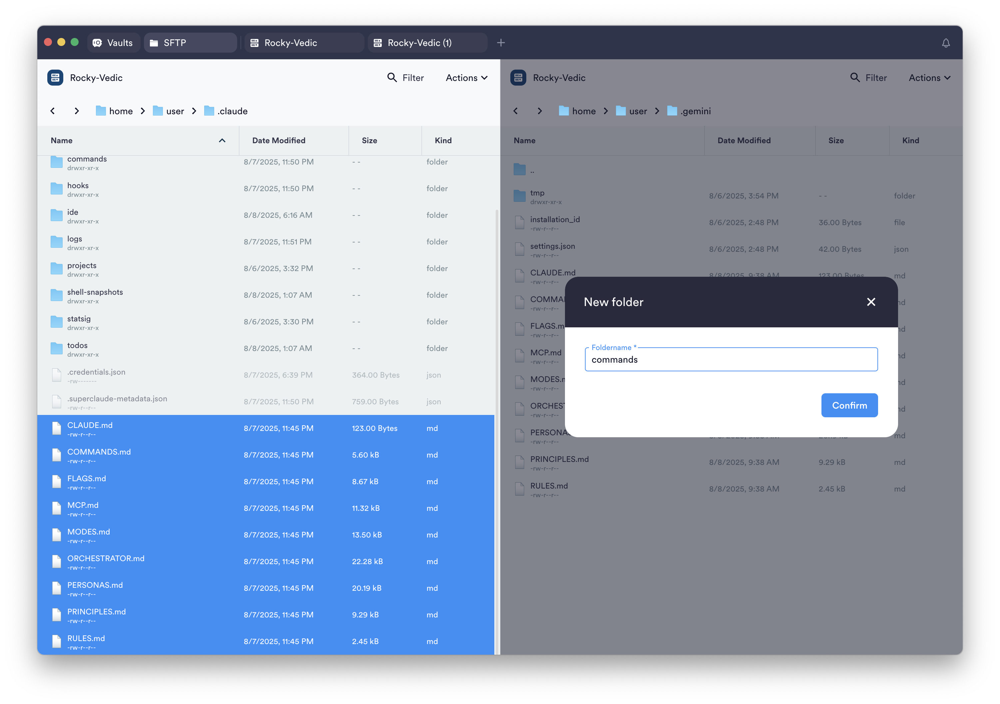
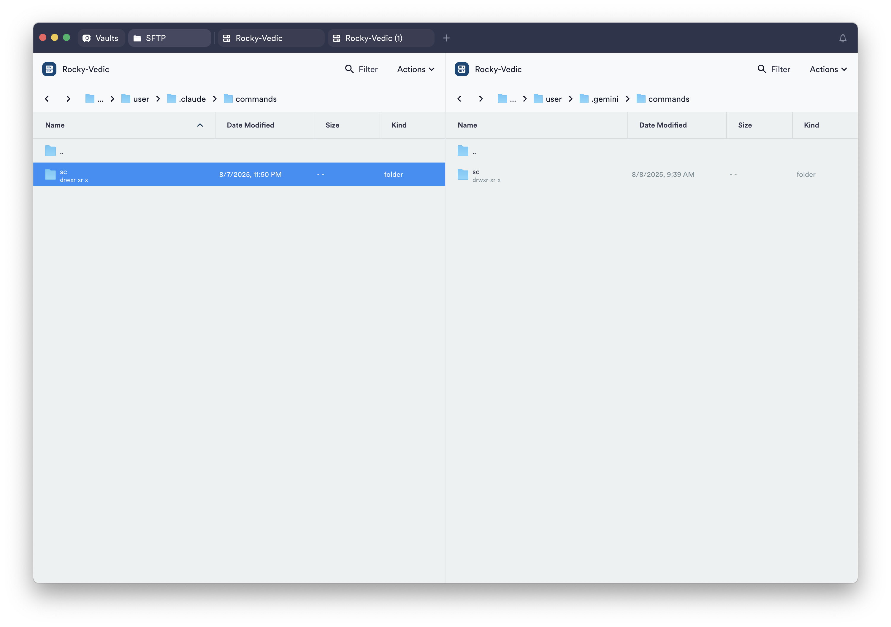

# Super Claude + Gemini CLI 강력한 기능을 Gemini의 방대한 Context에서 사용해보자.

> **Summary**
> 슈퍼클로드와 제미나이 CLI의 통합을 통해 강력한 AI 코딩 환경을 구축하는 방법을 설명한다. 슈퍼클로드는 16개의 슬래시 커맨드와 11개 분야의 전문가 페르소나를 활용하여 개발 효율성을 극대화하며, 제미나이는 방대한 컨텍스트를 무료로 제공하여 토큰 소모 문제를 해결한다. 설치 및 설정 과정이 상세히 안내되며, 최종적으로 두 AI의 장점을 결합한 혁신적인 코딩 경험을 제공한다.

---

## 슈퍼클로드의 정교함과 제미나이의 광활함을 한 곳에 담다

[https://www.youtube.com/watch?v=YxjLqtFGh1c](https://www.youtube.com/watch?v=YxjLqtFGh1c)

[https://www.youtube.com/watch?v=whLEc7lO_xY&t=246s](https://www.youtube.com/watch?v=whLEc7lO_xY&t=246s)

결론부터 말하자면, 슈퍼클로드의 뛰어난 성능과 제미나이의 방대한 컨텍스트, 이 두 가지 장점을 결합한 최고의 AI 통합 환경을 구축하는 데 성공했다. 코딩의 판도를 바꿀 수도 있는 이 조합은, 각 AI의 단점은 상쇄하고 장점은 극대화하는 완벽한 시너지를 보여주었다. 이 글은 그저 단순한 튜토리얼이 아닌, 한 개발자의 집요한 탐구 과정이 담긴 결과물을 따라가며 느꼈던 감탄과 그 과정을 기록한 회고다.

---

### 1단계 전에, 슈퍼클로드란 무엇인가?

코딩 작업을 하다 보면 누구나 막히는 순간을 경험한다. 코드가 복잡해질수록 사소한 수정 하나가 예상치 못한 버그를 낳고, 결국 처음부터 다시 짜는 막막한 상황에 놓이기도 한다. 최근 이런 문제에 대한 해답으로 개발자들 사이에서 입소문을 타기 시작한 도구가 있다. 바로 ‘슈퍼클로드(Super Claude)’다. 이 도구는 단순한 코드 어시스턴트를 넘어, 개발의 전 과정을 돕는 강력한 동반자로서의 가능성을 보여주었다. 그 정교함과 세심함은, 이것이 단순한 프로그램이 아니라 수많은 고민과 노력이 집약된 결과물임을 느끼게 했다.

슈퍼클로드의 핵심은 세 가지로 요약할 수 있다. 첫째, **16개가 넘는 강력한 슬래시 커맨드**다. 마치 집을 수리할 때 연장이 많으면 든든하듯, `/analyze`, `/design`, `/implement` 등 개발 단계별로 특화된 명령어들은 생산성을 극적으로 끌어올린다. 둘째, **11가지 분야의 전문가 페르소나**다. 사용자가 처한 상황을 스스로 분석해 데이터 분석가, 아키텍트, 보안 전문가 등 최적의 전문가 모드로 변신하여 답변을 제공한다. 마지막으로, 개발 효율을 극대화하는 **4대 MCP(Model Context Protocol)**, 즉 Context7, Sequential, Magic, Playwright를 실용적인 도구로 활용한다는 점이다. 이 모든 것이 유기적으로 결합되어 개발자에게 전에 없던 경험을 선사한다.

---

### **슈퍼클로드(Super Claude)란?**

슈퍼클로드는 클로드 코드(Claude Code)의 생산성을 극대화하는 확장 도구입니다. 설치 시 다음과 같은 세 가지 주요 이점을 제공합니다.

1. **16개의 강력한 슬래시 커맨드:** 디자인, 빌드, 테스트, 분석 등 개발의 전 과정을 돕는 16가지의 명령어를 사용할 수 있습니다.
1. **11개 분야 전문가 페르소나:** 질문이나 명령에 맞춰 데이터 분석가, 개발자, 보안 전문가 등 11개 분야의 전문가 모드가 자동으로 활성화되어 최적의 답변을 제공합니다.
1. **4대 필수 MCP(Model Context Protocol) 활용:** 개발 효율을 극대화하는 Context7, Sequential, Magic, Playwright 4가지 MCP를 활용하여 코딩 경험을 한 단계 끌어올립니다.
---

### **1. 슈퍼클로드(Super Claude) 자동 설치**

클로드 코드의 'Plan Mode'를 사용하여 슈퍼클로드를 자동으로 설치할 수 있습니다.

1. 클로드 코드를 실행하고 `plan mode on`을 입력하여 플랜 모드를 활성화합니다.
1. 아래의 명령어를 복사하여 입력창에 붙여넣고 실행합니다. 약 5분 정도 소요되며, 클로드가 스스로 공식 문서를 확인하여 설치부터 검증까지 완료합니다.
```plain text
https://github.com/SuperClaude-Org/SuperClaude_Framework 이 내용 확인한 후 슈퍼 클라우드 풀 설치로 설치해줘. 검증은 Task를 써서 백그라운드에서 확인해줘.
```

설치가 완료되면 클로드 코드를 종료했다가 다시 실행하세요. 프롬프트에 `/sc`를 입력했을 때 다양한 명령어 목록이 나타나면 성공적으로 설치된 것입니다.

---

### **2. MCP(Model Context Protocol) 자동 설치**

영상에서 소개된 4가지 필수 MCP (Context7, Sequential, Magic, Playwright)를 자동으로 설치하는 방법입니다.

1. 먼저, 클로드 코드에 아래의 가이드 내용을 붙여넣어 MCP 설치 환경을 설정합니다. 이 내용은 MCP 설치에 필요한 환경 확인, 주의사항, 설치 방법, 검증 절차 등을 클로드에게 안내하는 지침입니다.
> 참고: 아래 내용을 CLAUDE.md 파일에 추가하라고 요청하며, 한국어 인코딩(UTF-8)에 주의해달라고 명시하면 더 정확하게 작업을 수행합니다.

```plain text
## 클로드 코드에서의 mcp-installer를 사용한 MCP (Model Context Protocol) 설치 및 설정 가이드
공통 주의사항
1. 현재 사용 환경을 확인할 것. 모르면 사용자에게 물어볼 것.
2. OS(윈도우,리눅스,맥) 및 환경들(WSL,파워셀,명령프롬프트등)을 파악해서 그에 맞게 세팅할 것. 모르면 사용자에게 물어볼 것.
3. mcp-installer을 이용해 필요한 MCP들을 설치할 것
   (user 스코프로 설치 및 적용할것)
4. 특정 MCP 설치시, 바로 설치하지 말고, WebSearch 도구로 해당 MCP의 공식 사이트 확인하고 현재 OS 및 환경 매치하여, 공식 설치법부터 확인할 것
5. 공식 사이트 확인 후에는 context7 MCP 존재하는 경우, context7으로 다시 한번 확인할 것
6. MCP 설치 후, task를 통해 디버그 모드로 서브 에이전트 구동한 후, /mcp 를 통해 실제 작동여부를 반드시 확인할 것
7. 설정 시, API KEY 환경 변수 설정이 필요한 경우, 가상의 API 키로 디폴트로 설치 및 설정 후, 올바른 API 키 정보를 입력해야 함을 사용자에게 알릴 것
8. Mysql MCP와 같이 특정 서버가 구동중 상태여만 정상 작동한 것은 에러가 나도 재설치하지 말고, 정상 구동을 위한 조건을 사용자에게 알릴 것
9. 현재 클로드 코드가 실행되는 환경이야.
10. 설치 요청 받은 MCP만 설치하면 돼. 혹시 이미 설치된 다른 MCP 에러 있어도, 그냥 둘 것
11. 일단, 터미널에서 설치하려는 MCP 작동 성공한 경우, 성공 시의 인자 및 환경 변수 이름을 활용해, 올바른 위치의 json 파일에 MCP 설정을 직접할 것

** OS 공통 주의사항**
1. Node.js가 %PATH%에 등록되어 있는지, 버전이 최소 v18 이상인지 확인할 것
2. npx -y 옵션을 추가하면 버전 호환성 문제를 줄일 수 있음

### MCP 서버 설치 순서

1. 기본 설치
	mcp-installer를 사용해 설치할 것

2. 설치 후 정상 설치 여부 확인하기
	claude mcp list 으로 설치 목록에 포함되는지 내용 확인한 후,
	task를 통해 디버그 모드로 서브 에이전트 구동한 후 (claude --debug), 최대 2분 동안 관찰한 후, 그 동안의 디버그 메시지(에러 시 관련 내용이 출력됨)를 확인하고 /mcp 를 통해(Bash(echo "/mcp" | claude --debug)) 실제 작동여부를 반드시 확인할 것

3. 문제 있을때 다음을 통해 직접 설치할 것

	User 스코프로 claude mcp add 명령어를 통한 설정 파일 세팅 예시
	예시1:
	claude mcp add --scope user youtube-mcp \\
	  -e YOUTUBE_API_KEY=$YOUR_YT_API_KEY \\

	  -e YOUTUBE_TRANSCRIPT_LANG=ko \\
	  -- npx -y youtube-data-mcp-server


4. 정상 설치 여부 확인 하기
	claude mcp list 으로 설치 목록에 포함되는지 내용 확인한 후,
	task를 통해 디버그 모드로 서브 에이전트 구동한 후 (claude --debug), 최대 2분 동안 관찰한 후, 그 동안의 디버그 메시지(에러 시 관련 내용이 출력됨)를 확인하고, /mcp 를 통해(Bash(echo "/mcp" | claude --debug)) 실제 작동여부를 반드시 확인할 것


5. 문제 있을때 공식 사이트 다시 확인후 권장되는 방법으로 설치 및 설정할 것
	(npm/npx 패키지를 찾을 수 없는 경우) pm 전역 설치 경로 확인 : npm config get prefix
	권장되는 방법을 확인한 후, npm, pip, uvx, pip 등으로 직접 설치할 것

	#### uvx 명령어를 찾을 수 없는 경우
	# uv 설치 (Python 패키지 관리자)
	curl -LsSf <https://astral.sh/uv/install.sh> | sh

	#### npm/npx 패키지를 찾을 수 없는 경우
	# npm 전역 설치 경로 확인
	npm config get prefix


	#### uvx 명령어를 찾을 수 없는 경우
	# uv 설치 (Python 패키지 관리자)
	curl -LsSf <https://astral.sh/uv/install.sh> | sh


	## 설치 후 터미널 상에서 작동 여부 점검할 것 ##

	## 위 방법으로, 터미널에서 작동 성공한 경우, 성공 시의 인자 및 환경 변수 이름을 활용해서, 클로드 코드의 올바른 위치의 json 설정 파일에 MCP를 직접 설정할 것 ##


	설정 예시
		(설정 파일 위치)
		*리눅스, macOS 또는 윈도우 WSL 기반의 클로드 코드인 경우*
		- **User 설정**: `~/.claude/` 디렉토리
		- **Project 설정**: 프로젝트 루트/.claude

		*윈도우 네이티브 클로드 코드인 경우*
		- **User 설정**: `C:\\Users\\{사용자명}\\.claude` 디렉토리
		- User 설정파일  C:\\Users\\{사용자명}\\.claude.json
		- **Project 설정**: 프로젝트 루트\\.claude

		1. npx 사용

		{
		  "youtube-mcp": {
		    "type": "stdio",
		    "command": "npx",
		    "args": ["-y", "youtube-data-mcp-server"],
		    "env": {
		      "YOUTUBE_API_KEY": "YOUR_API_KEY_HERE",
		      "YOUTUBE_TRANSCRIPT_LANG": "ko"
		    }
		  }
		}


		2. cmd.exe 래퍼 + 자동 동의)
		{
		  "mcpServers": {
		    "mcp-installer": {
		      "command": "cmd.exe",
		      "args": ["/c", "npx", "-y", "@anaisbetts/mcp-installer"],
		      "type": "stdio"
		    }
		  }
		}

		3. 파워셀예시
		{
		  "command": "powershell.exe",
		  "args": [
		    "-NoLogo", "-NoProfile",
		    "-Command", "npx -y @anaisbetts/mcp-installer"
		  ]
		}

		4. npx 대신 node 지정
		{
		  "command": "node",
		  "args": [
		    "%APPDATA%\\\\npm\\\\node_modules\\\\@anaisbetts\\\\mcp-installer\\\\dist\\\\index.js"
		  ]
		}

		5. args 배열 설계 시 체크리스트
		토큰 단위 분리: "args": ["/c","npx","-y","pkg"] 와
			"args": ["/c","npx -y pkg"] 는 동일해보여도 cmd.exe 내부에서 따옴표 처리 방식이 달라질 수 있음. 분리가 안전.
		경로 포함 시: JSON에서는 \\\\ 두 번. 예) "C:\\\\tools\\\\mcp\\\\server.js".
		환경변수 전달:
			"env": { "UV_DEPS_CACHE": "%TEMP%\\\\uvcache" }
		타임아웃 조정: 느린 PC라면 MCP_TIMEOUT 환경변수로 부팅 최대 시간을 늘릴 수 있음 (예: 10000 = 10 초)

*중요사항*
	윈도우 네이티브 환경이고 MCP 설정에 어려움이 있는데 npx 환경이라면, cmd나 node 등으로 다음과 같이 대체해 볼것:
	{
	"mcpServers": {
	      "context7": {
		 "command": "cmd",
		 "args": ["/c", "npx", "-y", "@upstash/context7-mcp@latest"]
	      }
	   }
	}

	claude mcp add-json context7 -s user '{"type":"stdio","command":"cmd","args": ["/c", "npx", "-y", "@upstash/context7-mcp@latest"]}'

(설치 및 설정한 후는 항상 아래 내용으로 검증할 것)
	claude mcp list 으로 설치 목록에 포함되는지 내용 확인한 후,
	task를 통해 디버그 모드로 서브 에이전트 구동한 후 (claude --debug), 최대 2분 동안 관찰한 후, 그 동안의 디버그 메시지(에러 시 관련 내용이 출력됨)를 확인하고 /mcp 를 통해 실제 작동여부를 반드시 확인할 것


** MCP 서버 제거가 필요할 때 예시: **
claude mcp remove youtube-mcp

```

1. 환경 설정이 끝나면, 원하는 MCP 이름을 말하며 설치를 요청합니다.
  - `Context7 MCP 설치해줘.`
  - `Sequential MCP 설치해줘.`
  - `Playwright MCP 설치해줘.`
1. **Magic MCP 설치 (API 키 필요):**
  - Magic MCP는 API 키가 필요하므로 별도 과정이 있습니다.
  - 먼저, [https://21st.dev/magic/console](https://21st.dev/magic/console) 에 방문하여 회원가입 후 로그인합니다.
  - `Setup Magic MCP` 버튼을 누르고, `Manual` 탭으로 이동하여 `Add MCP Server Configuration` 아래의 설정 코드를 복사합니다.
  - 클로드 코드로 돌아와 `Magic MCP 설치해줘` 라고 말한 뒤, 복사한 설정 코드를 붙여넣어 주면 설치가 완료됩니다. (API 키가 포함되어 있으므로 외부에 노출되지 않도록 주의하세요.)
이제 슈퍼클로드와 4개의 핵심 MCP를 모두 사용하여 더욱 스마트하고 효율적인 코딩을 경험할 수 있을것이다.

---

### 왜 이 조합을 고민하게 되었나?

이렇게 강력한 슈퍼클로드를 경험하고 나니 한 가지 고민이 생겼다. 바로 토큰 소모의 문제였다. 슈퍼클로드의 정교한 시스템 프롬프트는 뛰어난 성능을 보장하는 만큼, 상당한 양의 토큰을 소모했다. 코딩을 시작하기도 전에 컨텍스트의 20%가 사라지는 것은 비용 부담으로 다가왔다.

바로 이 지점에서 제미나이 CLI가 해결책으로 떠올랐다. 방대한 컨텍스트를 무료로 제공하는 제미나이의 환경 위에서 슈퍼클로드의 시스템을 구동할 수 있다면, 토큰 걱정 없이 최고의 성능을 누릴 수 있을 것이라는 확신이 들었다.

---

### 어떻게 가능했을까? - 슈퍼클로드의 비밀을 파헤치다

이 아이디어를 실현하기 위해 먼저 슈퍼클로드의 작동 방식을 깊이 들여다봤다. 며칠간 코드를 분석한 결과, 그 핵심이 사용자 디렉토리의 `.claude` 폴더 안에 숨겨진 마크다운(.md) 파일들에 있다는 것을 발견했다. 총 26개의 파일로 구성된 이 시스템 프롬프트들은 단순한 설정 파일이 아니었다. 페르소나, MCP 연동, 명령어별 가이드라인 등 슈퍼클로드의 모든 행동을 정의하는, 그야말로 ‘뇌’와 같은 역할을 하고 있었다.

이 파일들의 내용을 ChatGPT를 통해 번역해보니, 단순한 대화형 프롬프트가 아닌 체계적이고 효율적인 방법론이 적용된 ‘컨텍스트 엔지니어링’의 정수임을 알 수 있었다. 긴 설명을 핵심 단어만으로 기발하게 표현하여 토큰을 절약하면서도 AI가 명확하게 의도를 파악하도록 설계되어 있었다. 베테랑 개발자의 정교한 손길과 깊은 고민의 흔적이 고스란히 느껴지는 순간이었다.

---

### 그래서, 완벽한 조합을 구축하는 방법은?

이제 제미나이 CLI 환경에 슈퍼클로드의 영혼을 불어넣는 여정을 시작해보자.

### **1단계: 제미나이(Gemini) CLI 설치**

먼저, 명령 프롬프트(cmd)를 열고 다음 명령어를 입력해 제미나이 CLI를 설치한다.

```bash
npm install -g @google/gemini-cli

```

설치가 완료되면 `gemini`를 입력해 실행한다. 처음 실행하는 경우, 구글 계정 로그인 과정이 나타날 수 있다. 안내에 따라 인증을 완료하면 된다.

### **2단계: 슈퍼클로드 시스템 프롬프트 이식**

제미나이 CLI가 설치되면 사용자 폴더에 `.gemini`라는 새 폴더가 생성된다. 이제 슈퍼클로드의 시스템 파일을 이곳으로 옮겨야 한다.

1. **지침 파일 복사**: 기존의 `.claude` 폴더에서 `CLAUDE.md`, `COMMANDS.md`, `FLAGS.md`, `MCP.md`, `MODES.md`, `ORCHESTRATOR.md`, `PERSONAS.md`, `PRINCIPLES.md`, `RULES.md` 총 9개의 파일을 복사하여 `.gemini` 폴더에 붙여넣는다.


1. **커맨드 파일 복사**:
  - `.gemini` 폴더 안에 `commands`라는 이름의 새 폴더를 만든다.


  - `.claude/commands` 폴더 안에 있는 `sc` 폴더 전체를 복사하여 방금 만든 `.gemini/commands` 폴더에 붙여넣는다.


---

### **3단계: 에러 수정 및 파일 형식 변환**

이 상태로 제미나이를 실행하면 `monorepo` 관련 에러가 발생할 수 있다. 제미나이는 `@` 기호를 파일 참조로 인식하는데, 슈퍼클로드의 프롬프트에는 이 기호가 포함되어 있기 때문이다.

1. [**ORCHESTRATOR.md**](http://orchestrator.md/)** 파일 수정**: 텍스트 편집기로 `.gemini/ORCHESTRATOR.md` 파일을 열고, `@monorepo`를 포함한 모든 `@` 기호를 찾아 삭제한 후 저장한다.
```plain text
sed -i.bak 's/@//g' ~/.gemini/ORCHESTRATOR.md
```

1. **파일 형식 자동 변환**: 슈퍼클로드의 커맨드 파일은 마크다운(.md) 형식이지만, 제미나이는 TOML(.toml) 형식을 사용한다. 17개의 파일을 일일이 변환하는 것은 번거로우니, 제미나이에게 직접 시켜보자. 제미나이 CLI를 실행하고 아래의 프롬프트를 그대로 복사하여 붙여넣는다.
```plain text
~/.gemini/commands 폴더에 마크다운 파일들이 있어. 각 파일의 확장자를 toml로 바꾸고, 아래의 예시를 보고 각 파일의 내용도 바꿔줘.

예시:
~/.gemini/commands/sc/build.md 파일의 변경전 내용:
---
/description: "Build, compile, and package projects with error handling and optimization"
---

# /sc:build - Project Building

## Purpose
Build, compile, and package projects with comprehensive error handling and optimization.

## Usage
```
/sc:build [target] [--type dev|prod|test] [--clean] [--optimize]
```

## Arguments
- `target` - Project or specific component to build
- `--type` - Build type (dev, prod, test)
- `--clean` - Clean build artifacts before building
- `--optimize` - Enable build optimizations
- `--verbose` - Enable detailed build output

## Execution
1. Analyze project structure and build configuration
2. Validate dependencies and environment setup
3. Execute build process with error monitoring
4. Handle build errors and provide diagnostic information
5. Optimize build output and report results

## Claude Code Integration
- Uses Bash for build command execution
- Leverages Read for build configuration analysis
- Applies TodoWrite for build progress tracking
- Maintains comprehensive error handling and reporting

~/.gemini/commands/sc/build.md 파일의 변경후 내용:
# ~/.gemini/commands/sc/build.toml
description="Build, compile, and package projects with error handling and optimization"
prompt = """
---
allowed-tools: [Read, Bash, Glob, TodoWrite, Edit]
description: "Build, compile, and package projects with error handling and optimization"
---

# /sc:build - Project Building

## Purpose
Build, compile, and package projects with comprehensive error handling and optimization.

## Usage
/sc:build [target] [--type dev|prod|test] [--clean] [--optimize]

## Arguments
- target - Project or specific component to build
- --type - Build type (dev, prod, test)
- --clean - Clean build artifacts before building
- --optimize - Enable build optimizations
- --verbose - Enable detailed build output

## Execution
1. Analyze project structure and build configuration
2. Validate dependencies and environment setup
3. Execute build process with error monitoring
4. Handle build errors and provide diagnostic information
5. Optimize build output and report results

## Claude Code Integration
- Uses Bash for build command execution
- Leverages Read for build configuration analysis
- Applies TodoWrite for build progress tracking
- Maintains comprehensive error handling and reporting
"""
```

이 명령을 내리면 제미나이가 스스로 `.gemini/commands/sc` 폴더 내의 모든 마크다운 파일을 TOML 형식으로 변환하고, 기존 마크다운 파일은 삭제하는 작업을 약 5분간 진행한다.

---

### **4단계: 최종 확인**

모든 작업이 끝나면, 제미나이 CLI를 다시 실행하고 `/sc`를 입력해보자. 슈퍼클로드의 모든 명령어가 정상적으로 나타난다면, 성공적으로 통합 환경이 구축된 것이다.

---

### 결과: 최고의 장난감을 얻다

이 과정을 통해 슈퍼클로드의 정교한 프롬프트 시스템과 제미나이의 거대한 컨텍스트가 결합된, 강력하면서도 자유로운 AI 코딩 환경이 탄생했다. 물론 제미나이 CLI가 터미널 작업에 다소 서툴거나 가끔 멈추는 등 불안정한 모습을 보이기도 하지만, 무료라는 점과 엄청난 잠재력을 고려하면 충분히 감수할 만한 수준이다.

이 실험은 단순한 호기심에서 시작됐지만, 결과적으로는 두 AI의 장점을 극대화하는 ‘완벽한 조합’을 발견한 여정이었다. 슈퍼클로드 개발진이 얼마나 깊은 고민을 통해 이 시스템을 설계했는지 엿볼 수 있었고, 그들의 노고에 다시 한번 감탄하게 되었다. 이 글을 보는 여러분도 직접 이 조합을 시도해보고, 무료로 주어지는 최고의 장난감을 마음껏 즐겨보길 바란다.

