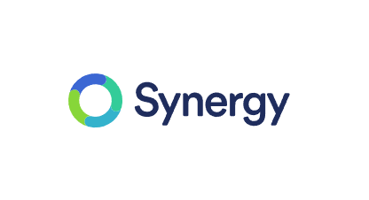

# Synergy - 

> **Summary**
> 소프트웨어 기반 KVM에 대한 내용으로, 14일마다 재가입하면 무한 사용이 가능하다는 정보가 포함되어 있습니다. 무료 체험 링크도 제공됩니다.

---

> 💡 **여기서 14일마다 재가입해주면 무한 사용가능**
> 심지어 그것도 안함
>
> [https://symless.com/synergy/account/free-trial](https://symless.com/synergy/account/free-trial)
>
>

