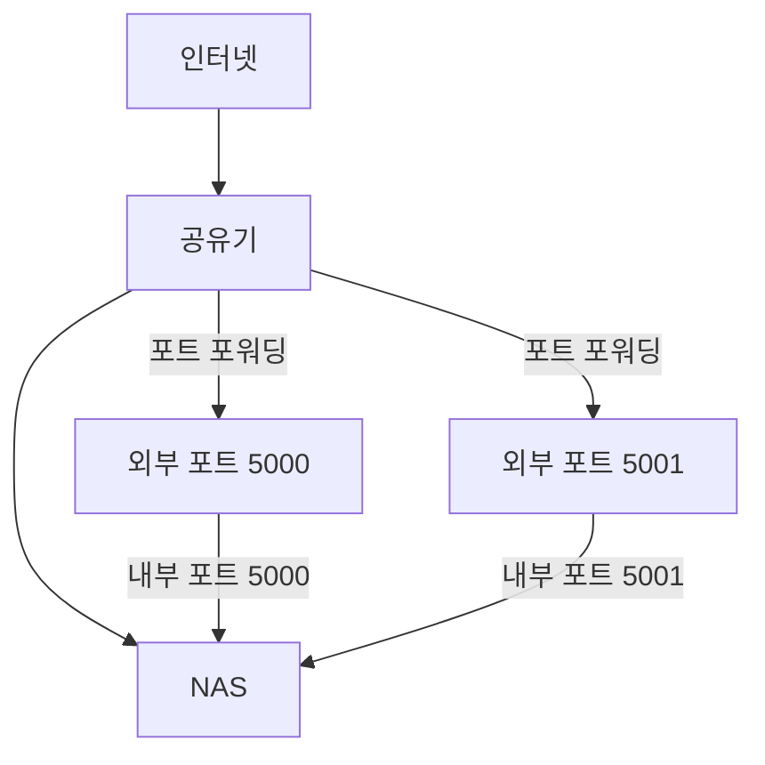
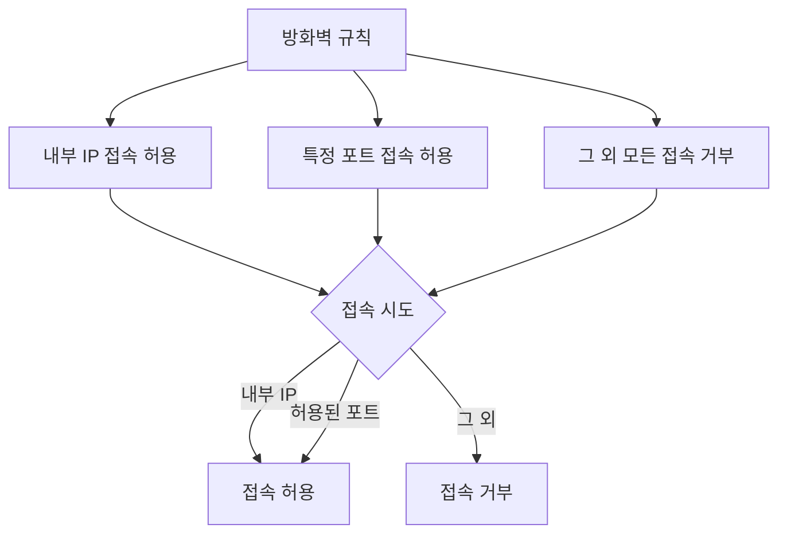

# Synology NAS 보안 관련 세팅

> **Summary**
> NAS의 보안을 강화하기 위해 DDNS 사용 시의 위험성을 인식하고, 역방향 프록시와 방화벽 설정을 통해 외부 접근을 차단하는 방법을 설명합니다. 내부 IP와 특정 포트에 대한 접근을 허용하고, 그 외의 모든 접근은 거부하는 규칙을 설정하여 안전한 NAS 사용을 권장합니다.

---

[https://www.youtube.com/watch?v=5j_vXgXkk7k&t=403s](https://www.youtube.com/watch?v=5j_vXgXkk7k&t=403s)

[https://www.youtube.com/watch?v=nFYK7y1-Y_o&pp=ygUT67Kg7YWM7Jqw7IqkIOuztOyViA==](https://www.youtube.com/watch?v=nFYK7y1-Y_o&pp=ygUT67Kg7YWM7Jqw7IqkIOuztOyViA==)

---

# 시놀로지 NAS의 방화벽 설정: 보안 강화하기

## 들어가며: 개인정보 보호의 중요성

과거 전화번호부를 떠올려보세요. 개인의 이름, 전화번호, 심지어 집 주소까지 모두가 볼 수 있는 책으로 만들어져 있었습니다. 지금 생각하면 매우 위험한 일이죠. 영화 '터미네이터'에서 사라 코너를 찾는 장면을 기억하시나요? 단순히 이름 정보만으로 전화번호부를 통해 주소를 찾아낼 수 있었습니다.

현대의 디지털 환경에서 우리의 NAS(Network Attached Storage)도 이와 비슷한 위험에 노출될 수 있습니다. 특히 DDNS(Dynamic DNS)를 사용하는 경우, 이는 마치 디지털 세계의 전화번호와 같은 역할을 합니다.

## NAS 접근성과 보안의 딜레마

많은 사용자들이 NAS를 외부에서 접근 가능하게 설정합니다. 이는 편리하지만, 동시에 보안 위험을 초래할 수 있습니다. 일반적으로 사용되는 설정 방식을 살펴봅시다:

이런 방식으로 설정하면, NAS에 쉽게 접근할 수 있지만, 동시에 보안 취약점이 될 수 있습니다.

## DDNS와 IP 노출의 위험성

NAS를 외부에서 접근 가능하게 설정하면, 필연적으로 DDNS 주소를 공유하게 됩니다. 이는 파일 공유나 특정 서비스 접근을 위해 불가피한 경우가 많습니다. 하지만 이 DDNS 주소가 노출되면, 악의적인 사용자가 다음과 같은 방식으로 IP 주소를 알아낼 수 있습니다:

1. 커맨드 창에서 DDNS 주소 조회
1. IP 주소 확인 (공유기의 외부 IP)
결과적으로, DDNS가 노출되는 순간 NAS의 로그인 화면까지 접근이 가능해질 수 있습니다.

## 보안 강화 방법: 역방향 프록시와 방화벽

이러한 보안 위험을 해결하기 위해 두 가지 주요 방법을 사용할 수 있습니다:

1. 역방향 프록시 설정
1. 방화벽 구성
### 역방향 프록시 설정

역방향 프록시를 설정하면 DSM 로그인 주소를 변경할 수 있습니다. 이를 통해 HTTP나 HTTPS로 접속 가능한 대부분의 서비스를 안전하게 관리할 수 있습니다.

### 방화벽 구성

방화벽 설정은 다음과 같은 단계로 진행할 수 있습니다:

1. 내부 IP 접속 허용 규칙 생성
1. 특정 포트 접속 허용 규칙 생성
1. 그 외 모든 접속 거부 규칙 생성

이러한 방화벽 설정을 통해, 내부 네트워크에서의 접근은 자유롭게 허용하면서 외부에서의 무단 접근을 효과적으로 차단할 수 있습니다.

## 결론

NAS의 보안은 매우 중요합니다. DDNS 사용의 편리함과 동시에 발생할 수 있는 보안 위험을 인지하고, 역방향 프록시와 방화벽을 적절히 설정함으로써 이러한 위험을 최소화할 수 있습니다. 각자의 사용 환경과 필요에 맞는 보안 정책을 수립하고 적용하는 것이 중요합니다.

안전한 NAS 사용으로 여러분의 소중한 데이터를 보호하세요!

