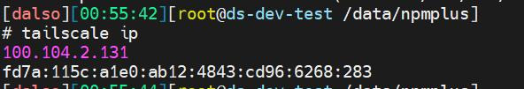

# Synology NAS 

> **Summary**
> 외부 포트오픈이 불가능한 환경에서 Tailscale을 이용해 서버를 운영하는 방법을 소개합니다. Oracle Cloud 인스턴스를 사용하여 내부 서비스용 서버와 연결하고, NPM을 통해 프록시 설정을 간단히 할 수 있습니다. 이를 통해 NAS와 다양한 서비스에 접근할 수 있습니다.

---

[https://svrforum.com/svr/1041144](https://svrforum.com/svr/1041144)

안녕하세요. 달소입니다.

이번에 소개해드릴 가이드는 외부 포트오픈이 안되는 환경(인터넷은 되야합니다)에서 서버를 구축해서 운영하는방법 2탄입니다.

기본적으로 홈서버를 운영할때는 포트포워딩을 통해서 내부서버에 트래픽을 연계해서 연결하는방식을 주로 사용하는데요.

(반대로 외부에 집 공인 IP를 노출하기 싫을때)

통신사의 환경이나 공유 네트워크를 사용하는 환경에서는 이러한 포트포워딩이 불가능하고 그런경우에 외부에서 접속할 방법이 막막해집니다.

앞서 Cloudflare Tunnel을 이용한 방법은 소개해드렸고 이번에는 Tailscale을 이용한 방법입니다 ㅎ

[외부 포트오픈이 안되는 환경에서 서버 운영하기.(Feat. 클라우드플레어...[서버 구축(Self-Hosted)] 달소 2023.11.05  안녕하세요. 달소입니다.   이번에 소개해드릴 가이드는 외부 포트오픈이 안되는 환경(인터넷은 되야합...](https://svrforum.com/1029447)

Tailscale을 이용한 방법이니 Tailscale에 대해서 알아야겠죠?

이것도 이전에 쓴글이 있으니..

[Tailscale이란 무엇인가?? 기본적인 개념과 사용방법.[서버 구축(Self-Hosted)] 달소 2023.09.09  안녕하세요. 달소입니다.   이번글은 Tailscale의 기본적인 개념과 사용방법에 대해서 소개해드...](https://svrforum.com/940760)

## 구성환경

Oracle Cloud 인스턴스

내부 서비스용 서버

DNS를 Oracle 서버로 연결

모두 Tailscale이 설치되고 연결되어있어야합니다.

## 구성방법

구성은 간단합니다.

오라클 클라우드에서 Client의 요청을 받아주고 Tailscale로 연결된 내부 VM으로 프록시해주면됩니다!

쉽죠?

아래 과정으로 NPM을 구성해주세요.

[오라클 클라우드 무료인스턴스를 이용한 서비스 가이드 1단계(NPM)[서버 구축(Self-Hosted)] 달소 2023.09.13  안녕하세요. 달소입니다.   오늘부터,, 프로젝트성으로 오라클 클라우드 무료인스턴...](https://svrforum.com/945146)

그리고 나서 내부 서비스용 tailscale ip를 확인해줍니다.

오라클클라우드에서 아래처럼 ping이 잘되면 통신도 잘되는것 입니다.

이제 npm으로 프록시만 잘해주면 되겠죠?

## 연동하기

연동은 매우쉽습니다 ㅎ

NPM에서 새로운 프록시를해주시면 되는데요.

Foward IP만 아래처럼 Tailscale ip를 넣어주시면됩니다.

그리고나서 연결해보면 짠! 잘됩니다.

잘 응용하시면 NAS도 연결가능하고 여러가지로 활용가능하니~ 참고해주시면 되겠습니다!

