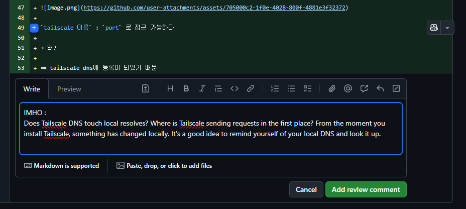
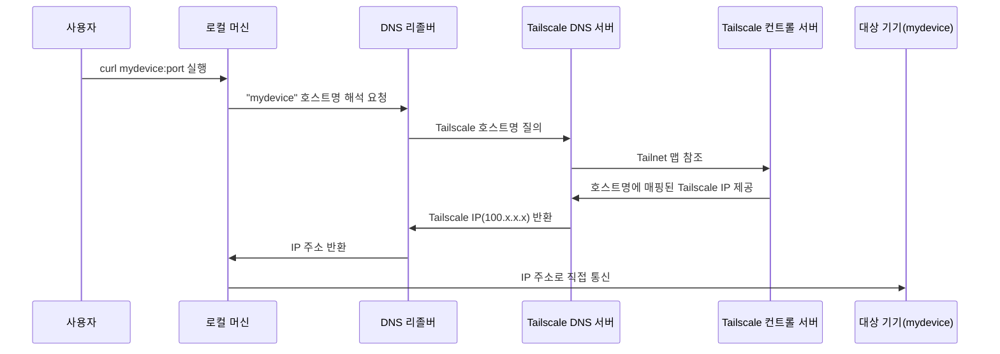
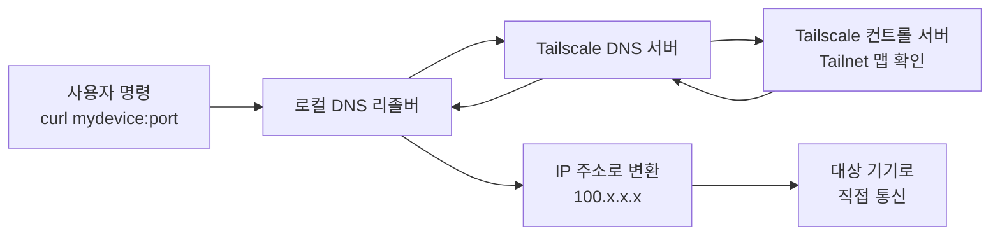

# Tailscale의 MagicDNS 작동 원리

> **Summary**
> Tailscale의 MagicDNS는 VPN 기능을 통해 기기들이 호스트 이름으로 상호 접근할 수 있도록 자동으로 DNS를 설정합니다. MagicDNS가 활성화되면 로컬 DNS 설정이 수정되어 Tailscale DNS 서버로 질의가 전달되며, 이는 Tailnet 맵을 참조하여 IP 주소를 반환합니다. 이 과정은 Tailscale 네트워크 내에서만 작동하며, 외부 DNS에는 영향을 미치지 않습니다.

---

# TailScale 설치 후에, tailscale DNS는 어디에 먼저 질의하는가?

PR 적다가, 도리어 내가 궁금해졌다.

> Tailscale DNS은 로컬 resolve를 건드릴까? 최초에 요청을 보내는 Tailscale은 어디에 있을까? Tailscale을 설치하는 순간부터, 로컬에 무언가 변경점이 있었을것이다. 로컬DNS를 다시한번 상기해보며, 한번 찾아보면 좋을것같다.

## 요약본

**Tailscale DNS 작동 원리**

- MagicDNS 활성화 시 각 디바이스는 자동으로 DNS 도메인에 등록되어 호스트 이름으로 상호 접근 가능
- Tailscale 클라이언트는 시스템의 DNS Resolver 설정을 업데이트하여 특정 도메인을 Tailscale DNS 서버로 연결
- 로컬 DNS 설정에 Tailscale DNS 서버가 추가되거나 특정 검색 도메인이 등록됨
**네트워크 통신 흐름**

- 각 디바이스는 Tailscale IP와 고유한 호스트명을 할당받아 Tailnet 맵에 저장
- 사용자의 DNS 질의는 Tailscale 리졸버를 통해 컨트롤 서버의 Tailnet 맵 참조
- MagicDNS는 Tailscale 네트워크 내부에서만 작동하며 외부 DNS에는 영향을 주지 않음
# TailScale 설치 후 MagicDNS는 어디에 질의하며 어떻게 작동하는가?

TailScale을 설치하고 MagicDNS를 활성화하면, 네트워크 내 기기들이 서로를 호스트 이름으로 쉽게 찾을 수 있게 됩니다. 그렇다면 이 과정에서 DNS 질의는 어디로 가며, 로컬 시스템에 어떤 변화가 생길까요? 

아래에서 TailScale MagicDNS의 작동 원리와 흐름을 단계별로 정리해 봅시다~~~

## 1. TailScale 설치와 MagicDNS 활성화

TailScale은 VPN과 유사한 기능을 제공하며, 기기들을 가상 네트워크(Tailnet)에 연결합니다. MagicDNS는 이 네트워크 내에서 기기들이 IP 주소 대신 호스트 이름(예: `mydevice.ts.net`)으로 서로 접근할 수 있도록 DNS를 자동 설정하는 기능입니다. TailScale을 설치하고 MagicDNS를 켜면, 로컬 시스템에 즉각적인 변화가 시작됩니다.

## 2. 로컬 DNS 설정의 변경

MagicDNS가 활성화되면, TailScale 클라이언트는 시스템의 DNS 설정을 수정합니다:

- **Linux**: `/etc/resolv.conf`에 TailScale DNS 서버(예: 100.64.0.1)를 추가하거나 검색 도메인(예: `ts.net`)을 등록합니다.
- **Windows/macOS**: 네트워크 어댑터 설정에 TailScale DNS 서버를 추가합니다.
이 변경은 TailScale 클라이언트가 동적으로 관리하며, TailScale이 종료되거나 설정이 바뀌면 원래 상태로 복구됩니다.
## 3. DNS 질의 흐름

사용자가 `curl mydevice:port`와 같은 명령을 실행하면, 다음 과정을 거칩니다:

1. **로컬 요청 시작**: 요청은 TailScale 클라이언트가 설치된 로컬 머신에서 발생합니다.
1. **로컬 DNS 리졸버로 전달**: OS의 DNS 리졸버가 호스트 이름(`mydevice`)을 해석하려 합니다.
1. **TailScale DNS 서버로 질의**: MagicDNS 설정 덕분에, 리졸버는 TailScale이 지정한 DNS 서버로 질의를 보냅니다. 이는 TailScale 네트워크 내 호스트명에만 적용되며, 외부 도메인(예: `google.com`)은 기존 DNS 설정을 따릅니다.
1. **Tailnet 맵 참조**: TailScale DNS 서버는 TailScale 컨트롤 서버가 관리하는 Tailnet 맵(기기별 호스트명과 IP 매핑 정보)을 확인합니다.
1. **IP 반환**: 해당 호스트명에 매핑된 TailScale IP(예: 100.x.x.x)를 로컬 머신에 반환합니다.
1. **직접 통신**: 반환된 IP로 요청이 전달되어 기기 간 연결이 이루어집니다.

## 4. MagicDNS의 범위와 한계

MagicDNS는 TailScale 네트워크 내부에서만 작동합니다. 즉, `mydevice.ts.net` 같은 TailScale 도메인은 TailScale DNS 서버가 처리하지만, 일반 인터넷 도메인은 영향을 받지 않습니다. 이는 로컬 DNS 설정에 TailScale 전용 검색 도메인이 추가된 결과로, TailScale 클라이언트가 종료되면 이 설정도 사라집니다.

## 요약

TailScale 설치 후 MagicDNS가 활성화되면:

- **질의 대상**: 로컬 DNS 리졸버가 TailScale DNS 서버로 질의를 보냅니다.
- **변경점**: 시스템 DNS 설정이 TailScale 클라이언트에 의해 업데이트되어 TailScale 네트워크 내 호스트명 해석이 가능해집니다.
- **흐름**: 로컬 요청 → TailScale DNS 서버 → Tailnet 맵 참조 → IP 반환 → 통신.
## MagicDNS의 동작방식에대해 더욱 알아봅시다.

공식 문서에 따르면, Tailscale의 MagicDNS는 다음과 같이 동작합니다:

1. **노드 등록 및 Tailnet 맵 구성**
  - Tailscale에 가입하면 각 디바이스는 고유한 Tailscale IP와 함께 안정적인 호스트명이 할당됩니다. 이 정보는 Tailscale 컨트롤 서버에 의해 관리되는 Tailnet 맵에 저장됩니다.
1. **로컬 DNS 설정 업데이트**
  - MagicDNS가 활성화되면, Tailscale 클라이언트는 로컬 시스템의 DNS 리졸버 설정을 업데이트합니다. 예를 들어, Linux의 `/etc/resolv.conf`나 Windows의 네트워크 어댑터 설정에 Tailscale 전용 DNS 서버나 검색 도메인이 추가됩니다.
  - 이 변경으로 인해, 시스템은 tailscale 호스트명(예: `hostname:port`)에 대한 DNS 질의를 Tailscale 리졸버로 우선 전달하게 됩니다.
1. **DNS 질의 처리**
  - 사용자가 `hostname:port`로 접근하면, 로컬에서 발생한 DNS 질의는 Tailscale 리졸버 또는 Tailscale 전용 DNS 서버로 전달됩니다.
  - 이 때, Tailscale 데몬은 컨트롤 서버에서 관리하는 Tailnet 맵을 참조하여, 해당 호스트명에 매핑된 Tailscale IP를 찾아 응답합니다.
1. **내부 네트워크에서의 통신 보장**
  - 이러한 과정을 통해, Tailscale 네트워크 내에서는 각 디바이스가 안정적인 호스트명과 IP 매핑을 기반으로 통신할 수 있습니다.
  - MagicDNS 설정은 Tailscale 네트워크 내부에서만 적용되므로, 외부 일반 DNS 동작에는 영향을 주지 않습니다.
자세한 내용은 [Tailscale 공식 문서의 MagicDNS 설명](https://tailscale.com/kb/1019/magicdns/)에서 확인할 수 있습니다.

