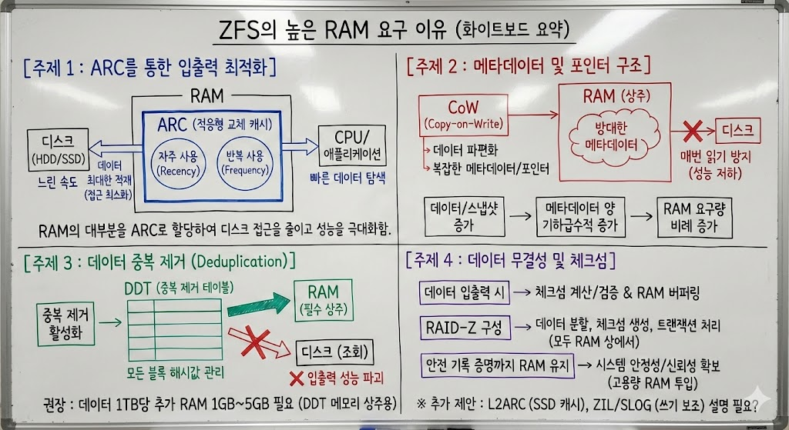
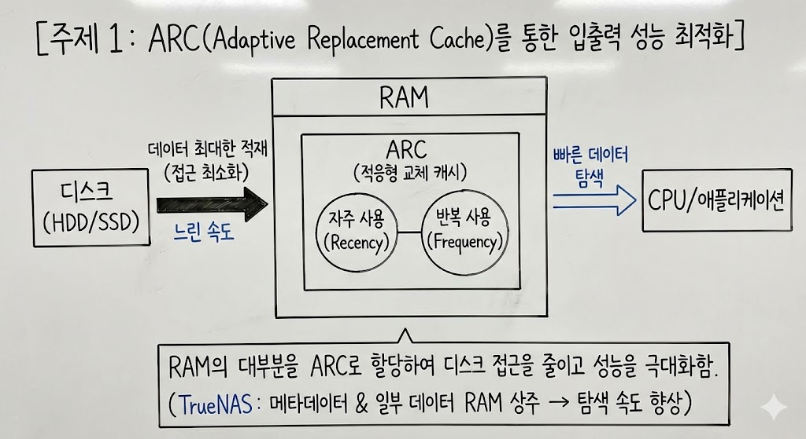
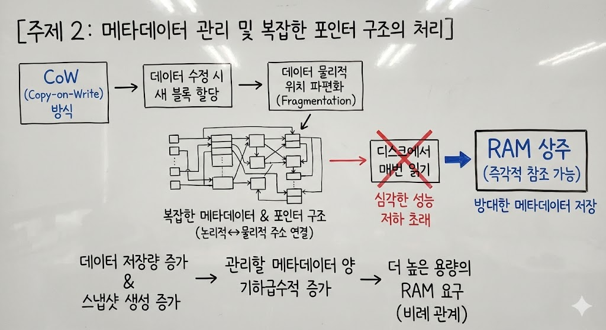
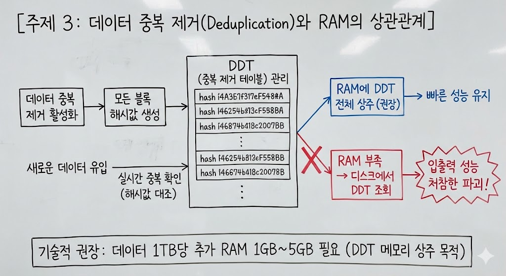
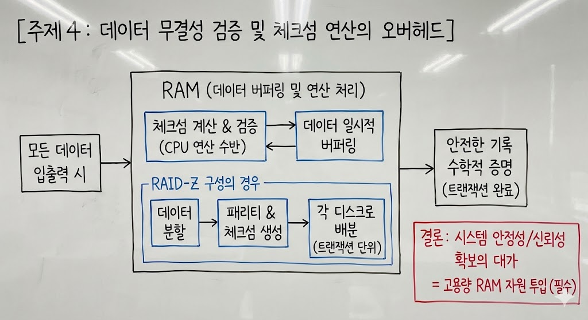

# True NAS에서 ZFS는 RAM을 장난아니게 먹는다! ZFS.. 너 뭐 돼…?

> **Summary**
> ZFS는 ARC를 통해 RAM을 대량으로 사용하여 입출력 성능을 최적화하며, 복잡한 메타데이터 관리와 데이터 중복 제거 기능이 RAM 요구량을 증가시킨다. 데이터 무결성 검증 과정에서도 RAM이 필수적이며, 시스템의 안정성과 신뢰성을 높이기 위해 고용량의 RAM 자원이 필요하다.

---

## [주제 1: ARC(Adaptive Replacement Cache)를 통한 입출력 성능 최적화]

ZFS가 대용량의 RAM을 요구하는 가장 주요한 이유는 ARC(적응형 교체 캐시)라는 독자적인 캐싱 메커니즘을 운영하기 때문이다. 일반적인 파일 시스템은 운영체제의 표준 페이지 캐시를 사용하지만, ZFS는 RAM의 대부분을 ARC로 할당하여 자주 사용되는 데이터(Recency)와 반복적으로 사용되는 데이터(Frequency)를 동시에 관리한다. ZFS의 핵심 설계가 기계적인 하드 드라이브의 느린 속도를 소프트웨어적으로 극복하는 데 있으므로, RAM에 최대한 많은 데이터를 적재하여 디스크로의 직접적인 접근을 최소화하는 것이 성능 유지의 핵심 논거가 된다. 특히 TrueNAS와 같은 스토리지 운영체제에서는 파일 시스템의 모든 메타데이터와 실제 데이터의 일부를 RAM에 유지함으로써 데이터 탐색 속도를 비약적으로 향상시킨다.

## [주제 2: 메타데이터 관리 및 복잡한 포인터 구조의 처리]

[앞서 언급된 Copy-on-Write(CoW) 방식](/2ee1bab9e3f88032ae6bfe2ef4ea8dda)은 데이터를 수정할 때마다 새로운 블록을 할당하기 때문에, 데이터의 물리적 위치가 파편화되기 쉬운 구조적 특성을 가진다. 이를 효율적으로 관리하기 위해서는 파일의 논리적 위치와 물리적 블록 주소를 연결하는 메타데이터와 포인터 구조가 매우 복잡해지며, 이러한 정보를 디스크에서 매번 읽어오는 것은 심각한 성능 저하를 초래한다. 따라서 ZFS는 이 방대한 메타데이터를 RAM에 상주시켜 즉각적인 참조가 가능하도록 설계되었다. 결과적으로 사용자가 더 많은 데이터를 저장하고 더 많은 스냅샷을 생성할수록 관리해야 할 메타데이터의 양도 기하급수적으로 늘어나며, 이에 비례하여 더 높은 용량의 RAM이 요구되는 인과관계가 형성된다.

## [주제 3: 데이터 중복 제거(Deduplication)와 RAM의 상관관계]

ZFS의 고급 기능 중 하나인 데이터 중복 제거(Deduplication) 기능을 활성화할 경우, RAM 요구량은 임계치를 넘어서게 된다. 중복 제거를 위해서는 저장되는 모든 데이터 블록의 해시값을 테이블(DDT: Deduplication Table)로 만들어 관리해야 하는데, 새로운 데이터가 들어올 때마다 기존 데이터와 중복되는지 확인하기 위해 이 테이블을 실시간으로 조회해야 한다. 만약 이 테이블이 RAM에 다 들어가지 못해 디스크에서 조회하게 되면 입출력 성능이 처참하게 파괴되는 현상이 발생한다. 기술적으로는 저장된 데이터 1TB당 약 1GB에서 5GB 사이의 RAM을 추가로 권장하는 이유가 바로 이 중복 제거 테이블을 메모리에 상주시키기 위함이다.

## [주제 4: 데이터 무결성 검증 및 체크섬 연산의 오버헤드]

ZFS의 정체성인 데이터 무결성 보장 역시 RAM 자원과 밀접하게 연계되어 있다. 모든 입출력 시 발생하는 체크섬 계산과 검증 과정은 CPU 연산뿐만 아니라 해당 데이터를 일시적으로 메모리에 버퍼링하는 과정을 수반한다. 특히 여러 디스크에 데이터와 패리티를 동시에 기록하는 RAID-Z 구성에서는 데이터를 분할하고 체크섬을 생성하여 각 디스크로 배분하는 과정이 모두 RAM 상에서 트랜잭션 단위로 처리된다. 데이터가 안전하게 기록되었다는 것이 수학적으로 증명될 때까지 해당 정보를 메모리에서 유지해야 하므로, 시스템의 안정성과 신뢰성을 높이기 위한 대가로 고용량의 RAM 자원을 투입하는 전략적 선택이 이루어진 것이다.

