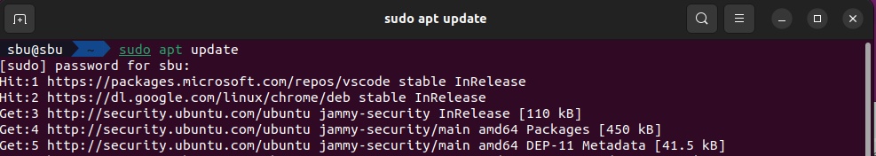

# Ubuntu ssh 원격 접속 for Ipad

> **Summary**
> 아이패드에서 우분투 서버에 SSH 원격 접속을 위해 SSH 서버를 설치하고, 포트를 설정한 후, 비밀번호 없이 SSH 키를 이용해 접속하는 방법을 설명합니다. 필요한 명령어와 설정 파일 편집 방법도 포함되어 있습니다.

---

> 💡 **bing AI says…**
> Ubuntu22.04 버추얼 머신에서 SSH 원격 접속을 위해서는 먼저 Ubuntu22.04 버추얼 머신에서 SSH 서버를 설치해야 합니다. SSH 서버를 설치하려면 다음 명령어를 입력합니다.
>
> `**sudo apt-get install openssh-server**`
>
> 설치가 완료되면 SSH 서버가 자동으로 실행됩니다. 이제 아이패드에서 bash앱을 통해 SSH 원격 접속을 시도할 수 있습니다. 다음 명령어를 입력합니다.
>
> `**ssh username@virtual_machine_ip_address**`
>
> 여기서 username은 Ubuntu22.04 버추얼 머신에 로그인한 사용자 이름이고 virtual_machine_ip_address는 Ubuntu22.04 버추얼 머신의 IP 주소입니다. 이제 아이패드에서 Ubuntu22.04 버추얼 머신에 SSH 원격 접속이 가능합니다.
>
>
>


🔗 [https://osg.kr/archives/1269#:~:text=Ubuntu%2022.04%20ssh%20%EC%A0%91%EC%86%8D%20%ED%97%88%EC%9A%A9%20%28%ED%99%9C%EC%84%B1%ED%99%94%29%2C%20%ED%8F%AC%ED%8A%B8%20%EC%84%A4%EC%A0%95%2C,%EB%B3%B4%EC%95%88%20%EC%88%98%EC%A4%80%EC%9D%84%20%EB%86%92%EC%97%AC%20ssh%20%EC%A0%91%EC%86%8D%ED%95%98%EA%B8%B0%20...%20%EA%B8%B0%ED%83%80%20%ED%95%AD%EB%AA%A9](https://osg.kr/archives/1269#:~:text=Ubuntu%2022.04%20ssh%20%EC%A0%91%EC%86%8D%20%ED%97%88%EC%9A%A9%20%28%ED%99%9C%EC%84%B1%ED%99%94%29%2C%20%ED%8F%AC%ED%8A%B8%20%EC%84%A4%EC%A0%95%2C,%EB%B3%B4%EC%95%88%20%EC%88%98%EC%A4%80%EC%9D%84%20%EB%86%92%EC%97%AC%20ssh%20%EC%A0%91%EC%86%8D%ED%95%98%EA%B8%B0%20...%20%EA%B8%B0%ED%83%80%20%ED%95%AD%EB%AA%A9)

🔗 [https://codechacha.com/ko/ubuntu-install-openssh/](https://codechacha.com/ko/ubuntu-install-openssh/)

# ssh 서버 설치

```shell
sudo apt update
```




```shell
sudo apt install openssh-server
```


# 서버 IP 확인

```shell
ifconfig
```

> 💡 **`ifconfig` 명령어를 찾을 수 없을때**
> ```shell
> sudo apt install net-tools
> ```
>
>


# **SSH 서버의 포트 설정하기**

SSH 서버의 기본 포트는 22번입니다. 그 얘긴 22번 포트라면 누구나 접속을 시도할 수 있다는 것입니다. 공격자들은 특정 포트로 공격하는 시도를 계속 하지요. 그런 시도를 완전히 없앨 수는 없겠지만, 최소한 포트를 22로 설정하지 않으면 외부의 침입자로부터 뻔하게 당할 수 있는 공격을 막을 수 있습니다.

라우터 단에서 포트 포워딩을 해서 12345번 포트로 들어오는 것을 22번으로 넘겨줄 수도 있지만, 여기에서는 ssh 서버 자체의 포트 번호를 세팅하는 방법을 알아보겠습니다.

ssh 서버의 설정파일은 /etc/ssh/sshd_config입니다. 해당 파일은 root 계정이 소유자이므로 sudo nano 명령을 이용해서 편집하도록 하겠습니다.

```shell
sudo nano /etc/ssh/sshd_config
```

#Port 22 라고 적혀있는 곳이 있습니다. 포트번호를 별다른 설정하지 않아도 22번으로 설정되는 부분입니다.

#Port 22 아래에 `Port 12345` 를 작성해줍니다.


```shell
systemctl restart sshd
```


```shell
ssh -p 12345 당신계정이름@당신의IPv4
```

```shell
ssh -p 12345 sbu@10.0.2.15
```


**SSH 키 비밀번호 없이 이용하기**

```javascript
ssh-keygen -t rsa -b 4096 -m PEM
```

```javascript
sbu@sbu $ ssh-keygen -t rsa -b 4096 -m PEM
Generating public/private rsa key pair.
Enter file in which to save the key (/home/sbu/.ssh/id_rsa): 
Enter passphrase (empty for no passphrase): 
Enter same passphrase again: 
Your identification has been saved in /home/sbu/.ssh/id_rsa
Your public key has been saved in /home/sbu/.ssh/id_rsa.pub
The key fingerprint is:
SHA256:/LWlSzXXfZojm+UUZT1L1fgtgVUXI4wkIiyjfd46cSQ sbu@sbu
The key's randomart image is:
+---[RSA 4096]----+
|    .. . ...o+.=*|
|---|
|   o .. . ....+ *|
|---|
|  o o          ==|
|---|
| . . E o      ooB|
|---|
|    o + S   . =o=|
|---|
|     o o . . = *.|
|---|
|      +   . = *  |
|---|
|     o     . O . |
|---|
|      .     + .  |
+----[SHA256]-----+
```

```javascript
cat ~/.ssh/id_rsa.pub
```

```javascript
ssh-rsa AAAAB3NzaC1yc2EAAAADAQABAAACAQDHmSDi3uNx3f520Gre0CIYGuGHToKjGDx87PubsHSRui56oMUdjHMCarF0owZpI7YJoBkwge38f0B9qULzDO6ZTRticxXb5wQqjFDw44Jg7dp8J2ABchOoHoKuRrIvmrp3qs1Jp28nVZ/gkaSCUK5H0DYQThzclwb3OnPF4dRG7Yw3t6NFu1kwZKgYE/XM53/ByyOPsPgOKYuZQkrZYw82EXOTMBZpH5cecOIvgK9xkuABXFcRUtgck/fahD8CihlEJ4Vzja2Ygvjgj021JJHW/+AuVWqvUbfAUKEGLnLATF699gv1rT6TkdDhRrMRO6nf20vfBGezBRslQGqaJMEWVfjgys1kPx96QdiVxJ+HPMqWvKlJ5PW49aTTgtIS+Q7eLHUY4gQCySIxFg+8Ni3s5hUBZmFMtjvHyjWjiNwi2/bJ42IvT2BurGhpZWZzkfy35UrxJ8nDtc1QNRREZpDN2WLYsJhRRJe6clgaMgutIEHW4nbFsgwKHvCpKSuZvCJI7oIL582Kom9O9p89FBdOM7yEdjlOzErlvB+8JpOz4BwgpvUO0IJLki+YU77sw5VI9yfXZHlnM1ULXa0CJTd0o7gatL5wKitmyUbqE5GGiRp+kWV1AUGc/NlDqSF3ZyRddp8s9NddnEpYw05CI1Mvk75WPy+OPeYDMVrCv0QCUw== sbu@sbu
```


이제 클라이언트의 공개키를 복사해서 서버에 아래와 같은 명령어를 입력해 주면, ~/.ssh/authorized_keys에 해당 공개키의 내용이 추가됩니다. 이제 ssh 서버는 등록한 해당 공개키의 쌍인 개인키를 이용한 ssh 접속을 허용하게 됩니다.

```javascript
echo "YOUR PUBLIC SSH KEY" >> ~/.ssh/authorized_keys
```

```c
echo "ssh-rsa AAAAB3NzaC1yc2EAAAADAQABAAACAQDHmSDi3uNx3f520Gre0CIYGu
GHToKjGDx87PubsHSRui56oMUdjHMCarF0owZpI7YJoBkwge38f0B9qULzDO6ZTRticxXb5wQqjFDw44Jg7dp
8J2ABchOoHoKuRrIvmrp3qs1Jp28nVZ/gkaSCUK5H0DYQThzclwb3OnPF4dRG7Yw3t6NFu1kwZKgYE/XM53/B
yyOPsPgOKYuZQkrZYw82EXOTMBZpH5cecOIvgK9xkuABXFcRUtgck/fahD8CihlEJ4Vzja2Ygvjgj021JJHW/
+AuVWqvUbfAUKEGLnLATF699gv1rT6TkdDhRrMRO6nf20vfBGezBRslQGqaJMEWVfjgys1kPx96QdiVxJ+HPM
qWvKlJ5PW49aTTgtIS+Q7eLHUY4gQCySIxFg+8Ni3s5hUBZmFMtjvHyjWjiNwi2/bJ42IvT2BurGhpZWZzkfy
35UrxJ8nDtc1QNRREZpDN2WLYsJhRRJe6clgaMgutIEHW4nbFsgwKHvCpKSuZvCJI7oIL582Kom9O9p89FBdO
M7yEdjlOzErlvB+8JpOz4BwgpvUO0IJLki+YU77sw5VI9yfXZHlnM1ULXa0CJTd0o7gatL5wKitmyUbqE5GGi
Rp+kWV1AUGc/NlDqSF3ZyRddp8s9NddnEpYw05CI1Mvk75WPy+OPeYDMVrCv0QCUw== sbu@sbu" >> ~/.ss
h/authorized_keys
```

그러면 ssh 서버에 비밀번호 없이 해당 개인키로 접속할 수 있게 된다.

# IPAD 설정 (ISH)

🔗 [https://technoglitz.com/korea/ios에서-linux-셸을-실행하는-방법-cloudsavvy-it/](https://technoglitz.com/korea/ios에서-linux-셸을-실행하는-방법-cloudsavvy-it/)

