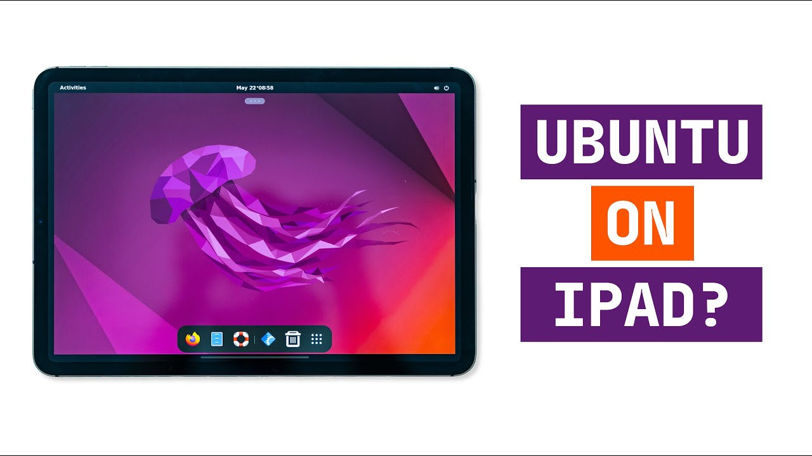

# Ubuntu 원격 데스크탑

> **Summary**
> 홈서버 구축을 위한 Ubuntu 원격 데스크탑 설정 방법으로 팀뷰어, 애니데스크, freenx 사용을 추천하며, VNC 설정을 위해 remina를 사용할 수 있습니다. 추가로 iPad에서 Linux PC로의 원격 데스크탑 연결 및 Raspberry Pi 4에서 Ubuntu Desktop 설정에 대한 링크도 포함되어 있습니다.

---

팀뷰어나 애니데스크를 쓰라고하네요 혹은 freenx

🔗 [https://linustechtips.com/topic/1402047-remote-desktop-from-ipad-to-linux-pc/](https://linustechtips.com/topic/1402047-remote-desktop-from-ipad-to-linux-pc/)

🔗 [https://techcraft.co/videos/2022/4/ubuntu-desktop-on-ipad-raspberry-pi-4-setup/](https://techcraft.co/videos/2022/4/ubuntu-desktop-on-ipad-raspberry-pi-4-setup/)

🔗 [https://linuxhint.com/best_remote_desktop_sharing_apps_ubuntu/](https://linuxhint.com/best_remote_desktop_sharing_apps_ubuntu/)

remina를 통해 VNC 설정

🔗 [https://ubuntu.com/tutorials/access-remote-desktop#1-overview](https://ubuntu.com/tutorials/access-remote-desktop#1-overview)

