# Ubuntu에 C++ 세팅

> **Summary**
> Ubuntu에서 C++ 개발 환경을 설정하는 방법: apt 업데이트 후 g++ 또는 build-essential 설치, CMake 설치, VSCode에서 C/C++ 확장 설치 및 설정, tasks.json 파일 생성 및 단축키 설정을 포함합니다.

---

> 💡 **목차**
> ---
>
>
>


🔗 [https://roytravel.tistory.com/381](https://roytravel.tistory.com/381)

🔗 [https://wikidocs.net/205073](https://wikidocs.net/205073)


> 💡 **목차**
> ---
>
>

# Terminal에서 C++ 및 CMake 설치

### apt 업데이트

```shell
sudo apt update
sudo apt upgrade
```

### 두 방법 중 하나 선택하여 설치

```shell
sudo apt install g++
```

```shell
sudo apt install build-essential
```


대부분의 경우, sudo apt install build-essential 명령을 사용하는 것이 더 편리하며, C++ 개발 환경을 한 번에 설정할 수 있습니다. 이 명령을 사용하면 필수 도구뿐만 아니라 다른 유용한 도구도 함께 설치됩니다.


### 설치 확인

```shell
which c++
```


### CMake 설치

```shell
sudo apt install cmake
```


# VSCode에서 C/C++ extension 설치

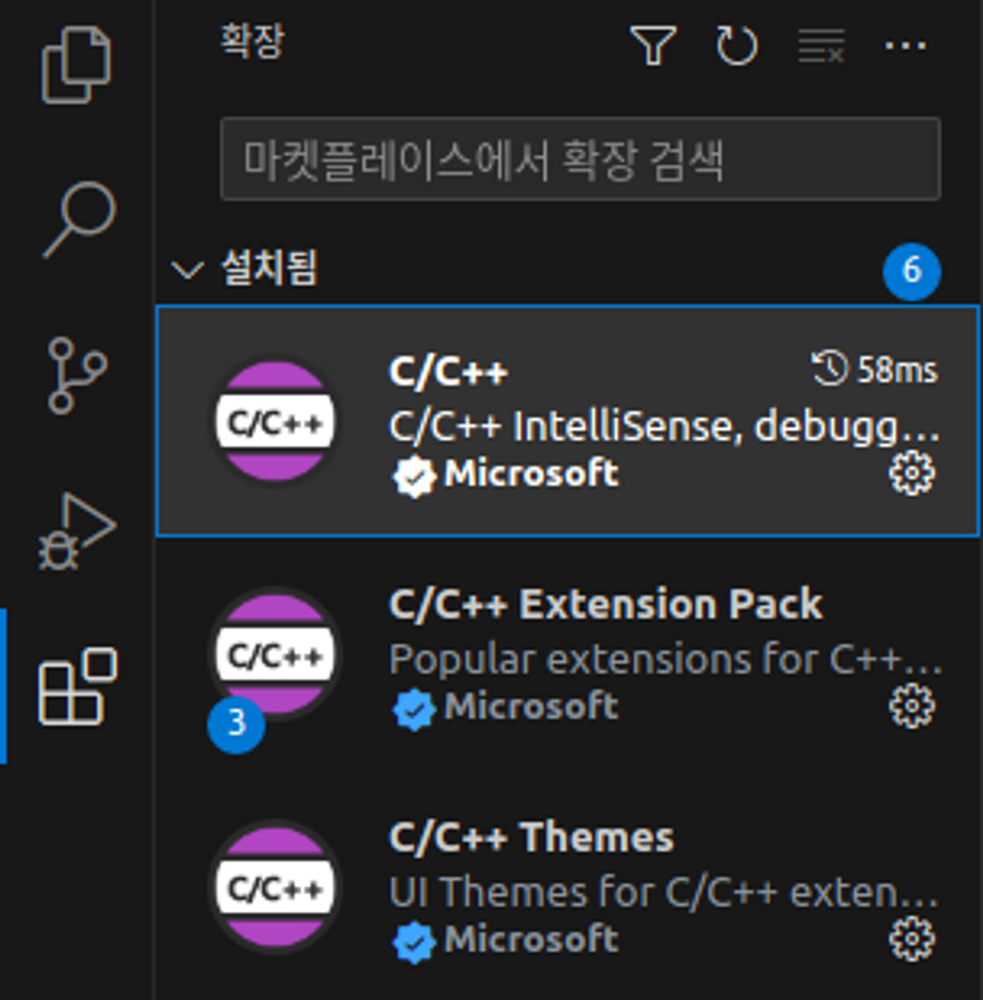

3. Ctrl + Shift + P로 구성 편집(UI) 선택

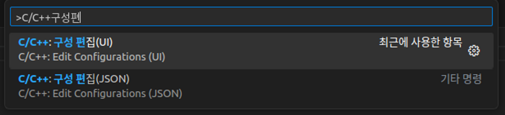

4. 컴파일러 선택 (C: gcc, C++: g++)

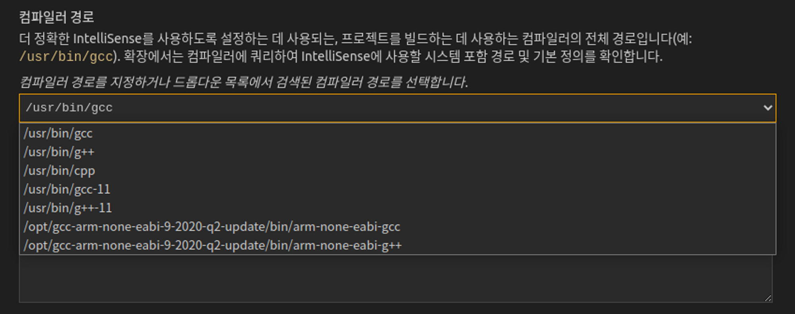

5. IntelliSense 모드

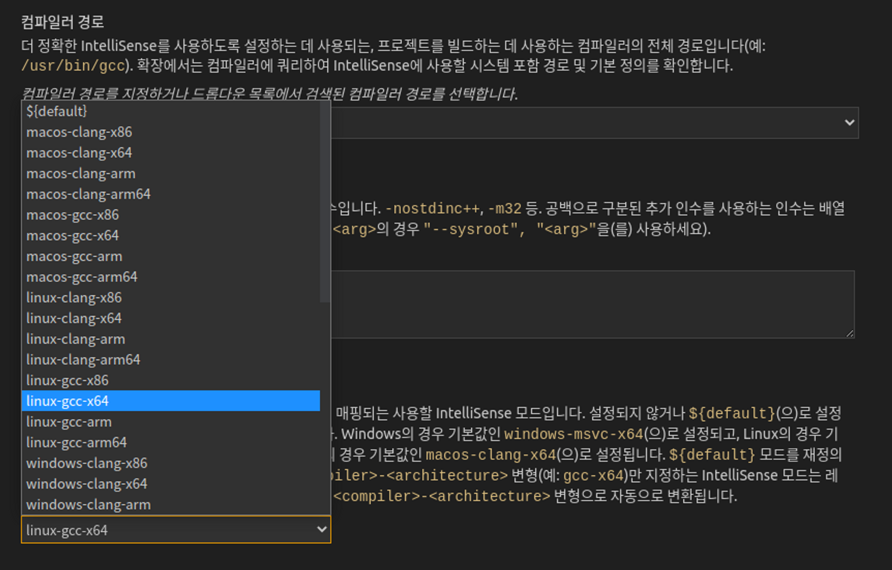

6. 설정파일 확인

- 위 설정한 값들이 아래 json 파일 형태로 저장됨을 확인


7. 템플릿에서 task.json 파일 만들기

- 터미널 → 작업 구성 → 템플릿에서 tasks.json 파일 만들기 → Others
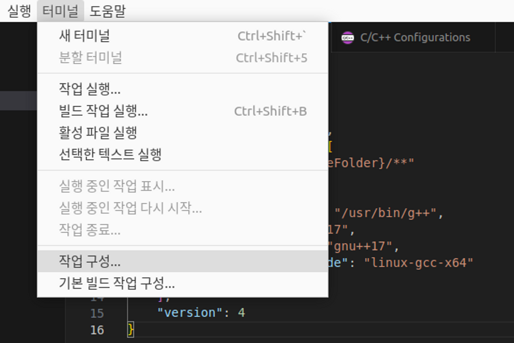

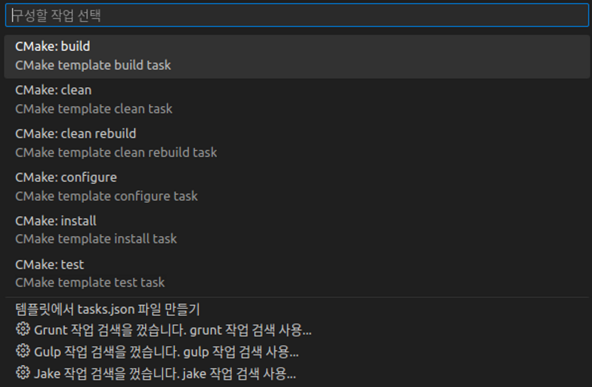

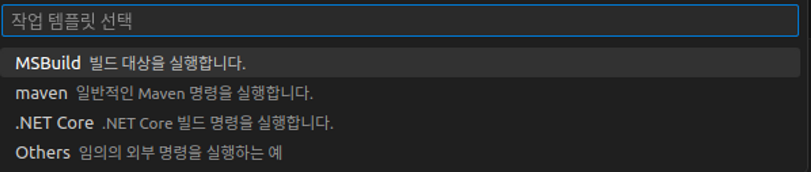

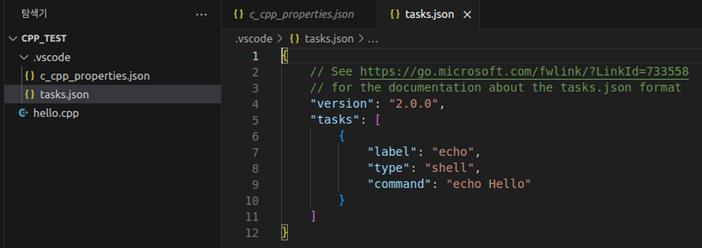

8. 코드 복사 수정

- tasks.json에 아래 내용 복사 붙여넣기
```html
{
    "version": "2.0.0",
    "runner": "terminal",
    "type": "shell",
    "echoCommand": true,
    "presentation" : { "reveal": "always" },
    "tasks": [
          //C++ 컴파일
          {
            "label": "save and compile for C++",
            "command": "g++",
            "args": [
                "${file}",
                "-o",
                "${fileDirname}/${fileBasenameNoExtension}"
            ],
            "group": "build",

            //컴파일시 에러를 편집기에 반영
            //참고:   https://code.visualstudio.com/docs/editor/tasks#_defining-a-problem-matcher

            "problemMatcher": {
                "fileLocation": [
                    "relative",
                    "${workspaceRoot}"
                ],
                "pattern": {
                    // The regular expression.
                  //Example to match: helloWorld.c:5:3: warning: implicit declaration of function 'prinft'
                    "regexp": "^(.*):(\\d+):(\\d+):\\s+(warning error):\\s+(.*)$",
                    "file": 1,
                    "line": 2,
                    "column": 3,
                    "severity": 4,
                    "message": 5
                }
            }
        },
        //C 컴파일
        {
            "label": "save and compile for C",
            "command": "gcc",
            "args": [
                "${file}",
                "-o",
                "${fileDirname}/${fileBasenameNoExtension}"
            ],
            "group": "build",

            //컴파일시 에러를 편집기에 반영
            //참고:   https://code.visualstudio.com/docs/editor/tasks#_defining-a-problem-matcher

            "problemMatcher": {
                "fileLocation": [
                    "relative",
                    "${workspaceRoot}"
                ],
                "pattern": {
                    // The regular expression.
                  //Example to match: helloWorld.c:5:3: warning: implicit declaration of function 'prinft'
                    "regexp": "^(.*):(\\d+):(\\d+):\\s+(warning error):\\s+(.*)$",
                    "file": 1,
                    "line": 2,
                    "column": 3,
                    "severity": 4,
                    "message": 5
                }
            }
        },
        // 바이너리 실행(Ubuntu)
        {
            "label": "execute",
            "command": "${fileDirname}/${fileBasenameNoExtension}",
            "group": "test"
        }
        // 바이너리 실행(Windows)
        // {
        //     "label": "execute",
        //     "command": "cmd",
        //     "group": "test",
        //     "args": [
        //         "/C", "${fileDirname}\\${fileBasenameNoExtension}"
        //     ]

        // }
    ]
}
```

9. 단축키 설정

- 파일 → 기본 설정 → 바로 가기 키 [Ctrl+K, Ctrl+S]
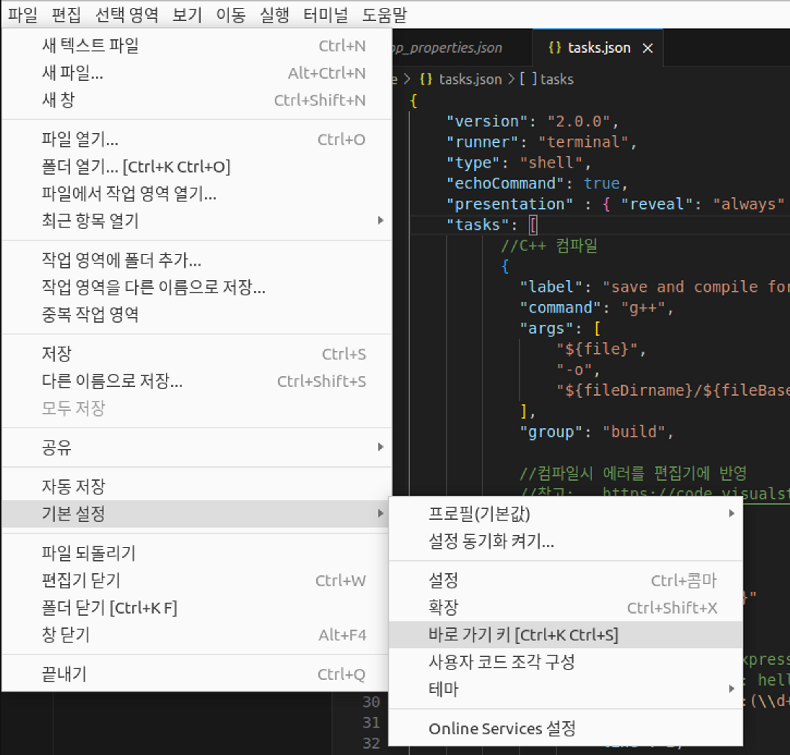

우측 상단 마우스 포인터가 가리키는 아이콘 클릭

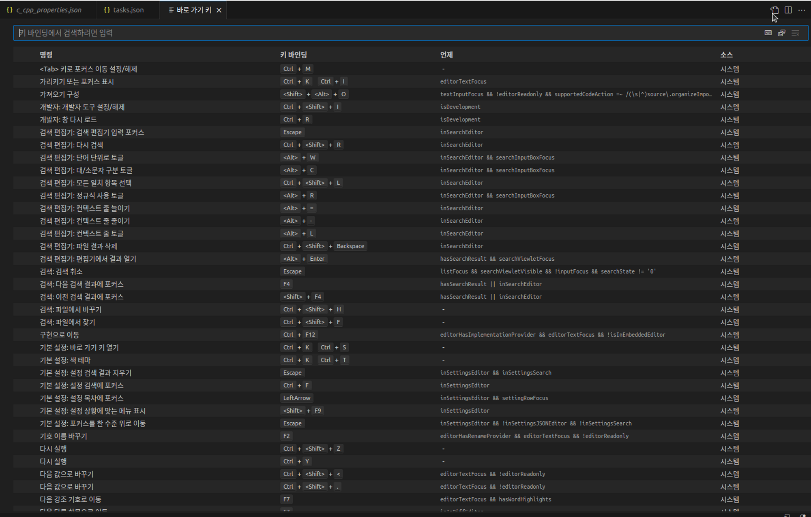

빈 파일 확인

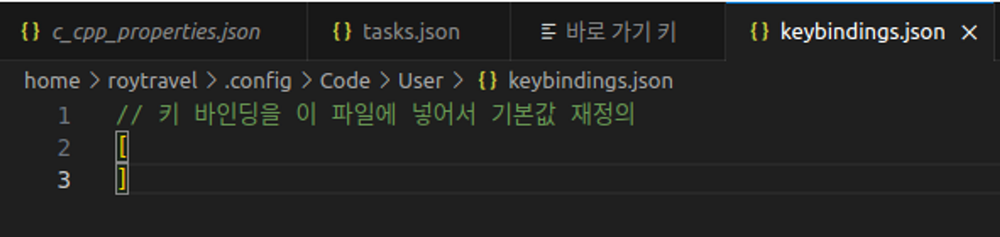

아래 내용 복사 붙여넣기

```html
// 키 바인딩을 이 파일에 넣어서 기본값을 덮어씁니다.
[
    //컴파일
    { "key": "ctrl+alt+c", "command": "workbench.action.tasks.build" },

    //실행
    { "key": "ctrl+alt+r", "command": "workbench.action.tasks.test" }
]
```

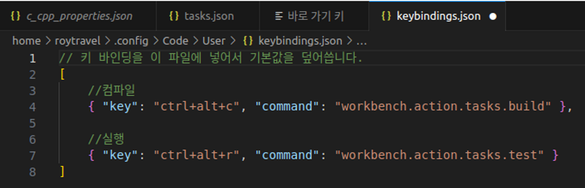

Ctrl + Alt + C

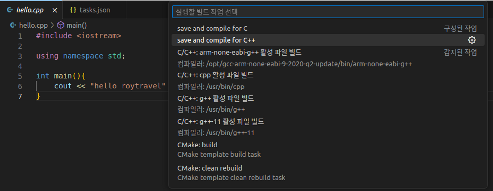

save and compile for C++ 선택

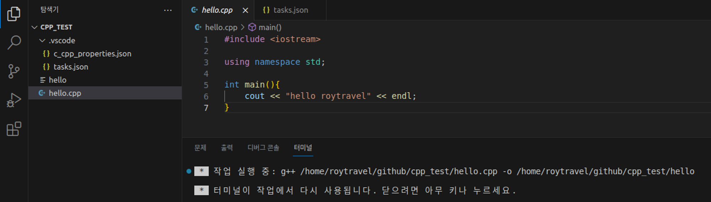

Ctrl + Alt + R

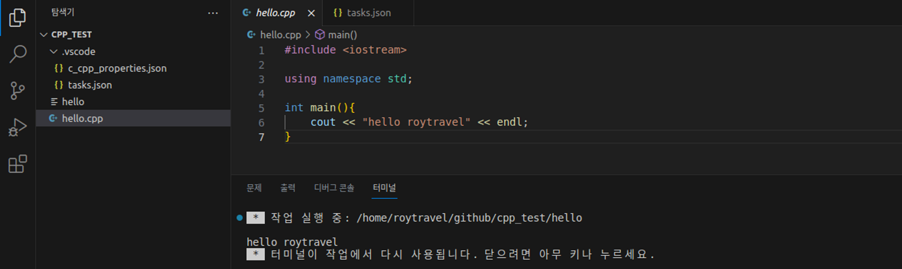

