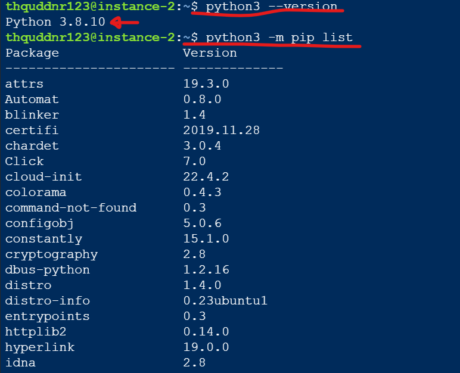

# Ubuntu에 Python 3.11설치

> **Summary**
> Ubuntu에 Python 3.11을 설치하는 방법은 소스 코드 다운로드 또는 PPA를 통해 설치할 수 있으며, pip 설치 후 beautifulsoup4와 requests를 추가로 설치하는 방법도 설명되어 있습니다. 설치 후 버전 확인을 통해 정상 설치 여부를 확인할 수 있습니다.

---

# apt upgrade && update

```latex
sudo su
```

```latex
sudo apt upgrade
sudo apt-get upgrade
```

```latex
sudo apt update
sudo apt-get update
```

# 파이썬 Ubuntu에 설치

> 💡 ****ubuntu 20 에 python을 설치하는 방법****
>
> 우선 beautifulsoup4을 쓰기 전에 서버상에 파이썬부터 설치해야겠죠?
>
> Ubuntu 에서 Python 을 설치하는 방법은 아래의 방법 중 하나를 선택하시면 됩니다.
>
>
> <details>
> <summary>소스 코드를 다운로드 받아서 설치하는 방법 (토글 열기)</summary>
>
> ```shell
> wget https://www.python.org/ftp/python/3.11.2/Python-3.11.2.tgz
> tar -xvf Python-3.11.2.tgz
> cd Python-3.11.2/
> ./configure --enable-optimizations
> make -j 4
> sudo make altinstall
>
> ```
>
> </details>
>
> **터미널을열고 아래의 명령어를 입력하여 설치하는 방법 (권장)**
>
> ```shell
> sudo add-apt-repository ppa:deadsnakes/ppa
> sudo apt update
> sudo apt install python3.11
> ```
>
>
> **기본 명령어 파이썬 3.11 로 변경하는 방법**
>
> `nano` 혹은 `vim` 편집기로 터미널 설정을 열어준다
>
> ```shell
> nano ~/.bashrc
> ```
>
> ```shell
> nano ~/.zshrc
> ```
>
> 그리고 맨 아래에 다음 명령어를 추가해준다
>
> ```shell
> alias python="python3.11"
> ```
>
>
> 그리고 다음 명령어로 설정을 적용해준다 (둘 중 하나 사용하는 터미널로)
>
> ```shell
> source ~/.bashrc
> ```
>
> ```shell
> source ~/.zshrc
> ```
>
>
>
> Python 을 설치하실 때 특정 디렉토리에 설치하실 필요는 없습니다. 
>
> 위에서 안내드린 명령어를 입력하시면 자동으로 시스템에 설치됩니다.
>
>

# 파이썬 pip설치

> 💡 ****ubuntu 에서 beautifulsoup4 를 설치하는 방법****
>
> 일단 pip부터 설치합시다
>
> ```shell
> curl -O https://bootstrap.pypa.io/get-pip.py
> python3 get-pip.py --user
> pip install awsebcli --upgrade --user
> ```
>
>
> Ubuntu 20 에서 Python 3.11 을 설치하신 후에는 pip3 를 이용하여 beautifulsoup4 를 설치하실 수 있습니다. 아래의 명령어를 터미널에서 실행해보세요.
>
> ```shell
> sudo apt-get install python3-pip
> sudo pip3 install beautifulsoup4
> sudo pip3 install requests
> ```
>
>
> 우분투에 파이썬과 pip를 모두 설치하면 다음 명령어로 설치를 확인해봅시다
>
> ```shell
> python3 --version
> python3 -m pip list
> ```
>
> 
>
>
> <details>
> <summary>ubuntu에서 파이썬을 3.11 을 설치했는데, python3 --version 을 입력하니 python 3.8.10 이 등장하는 이유가 뭘까?</summary>
>
> </details>
>
>

