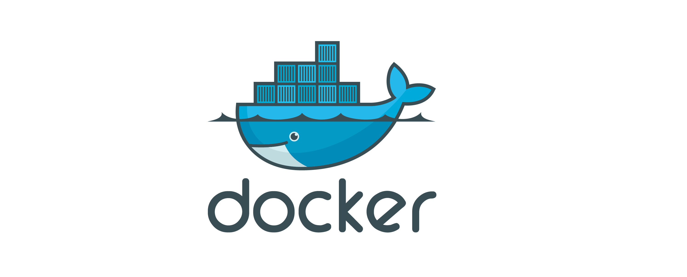

# Ubuntu에 도커 설치

> **Summary**
> 우분투 22.04에 도커를 설치하는 방법은 두 가지가 있다. 첫 번째는 인스톨러를 사용하는 방법으로, Mac에서는 공식 홈페이지에서 dmg 파일을 다운로드하여 설치할 수 있으나, CPU 사용량 버그가 있어 Edge 버전을 사용하는 것이 좋다. 두 번째 방법은 터미널을 통해 설치하는 것으로, 시스템 패키지를 업데이트하고 필요한 패키지를 설치한 후, 공식 GPG 키와 apt 저장소를 추가하여 도커를 설치한다. 설치 후 도커의 실행 상태를 확인할 수 있다.

---



🔗 [https://yohanpro.com/posts/docker/tutorial](https://yohanpro.com/posts/docker/tutorial)

🔗 [https://velog.io/@osk3856/Docker-Ubuntu-22.04-Docker-Installation](https://velog.io/@osk3856/Docker-Ubuntu-22.04-Docker-Installation)

# 실행환경

- Ubuntu 22.04

# Docker 설치방법 1 - 인스톨러로 설치

🔗 [https://docs.docker.com/desktop/release-notes/](https://docs.docker.com/desktop/release-notes/)

# Docker 설치방법 2 - 터미널로 설치

### 1. 우분투 시스템 패키지 업데이트

```shell
sudo apt-get update
```

### 2. 필요한 패키지 설치

```shell
sudo apt-get install apt-transport-https ca-certificates curl gnupg-agent software-properties-common
```

### 3. Docker의 공식 GPG키를 추가

```shell
curl -fsSL https://download.docker.com/linux/ubuntu/gpg | sudo apt-key add -
```

### 4. Docker의 공식 apt 저장소를 추가

```shell
sudo add-apt-repository "deb [arch=amd64] https://download.docker.com/linux/ubuntu $(lsb_release -cs) stable"
```

### 5. 시스템 패키지 업데이트

```shell
sudo apt-get update
```

### 6. Docker 설치

```shell
sudo apt-get install docker-ce docker-ce-cli containerd.io
```

### 7. Docker가 설치 확인

### 7-1 도커 실행상태 확인

```shell
sudo systemctl status docker
```

### 7-2 도커 실행

```shell
sudo docker run hello-world
```

