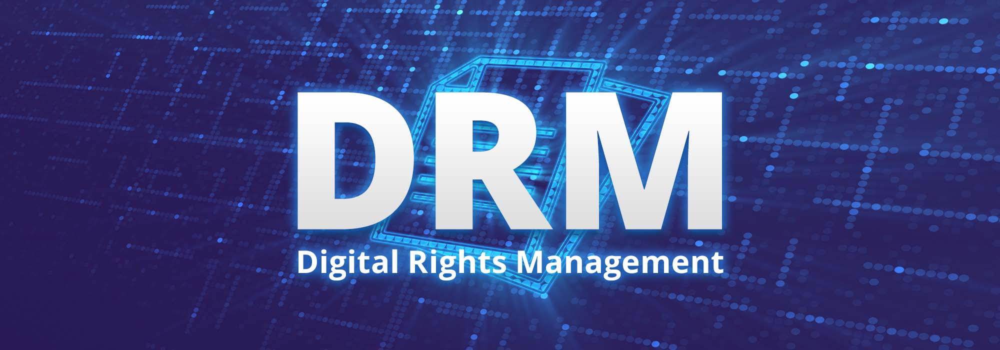
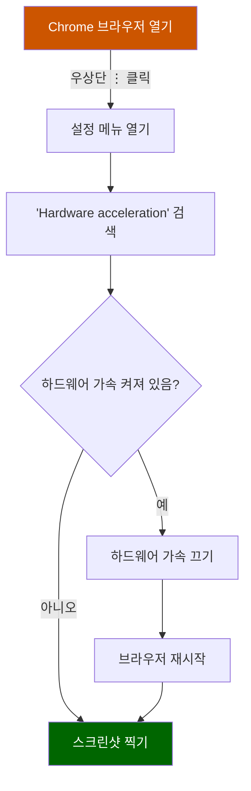

# Udemy , Inflearn 캡처 활성화하는 방법 (DRM 회피 방법)

> **Summary**
> 유데미 웹사이트에서 스크린샷을 찍을 때 검은 화면이 나오는 문제를 해결하려면 Chrome 브라우저의 하드웨어 가속 기능을 끄고 브라우저를 재시작해야 합니다. 설정에서 "하드웨어 가속 사용" 옵션을 비활성화하면 문제를 해결할 수 있습니다. 문제가 지속되면 다른 브라우저를 사용하거나 고객 지원팀에 문의하는 것이 좋습니다.

---

🎥 [동영상 보기](https://www.youtube.com/watch?v=DNf4Lm2y4CI)

# 유데미 웹사이트에서 스크린샷 찍는 방법 - Chrome 브라우저 사용 시

유데미(Udemy) 웹사이트에서 스크린샷을 찍으려고 할 때 검은 화면만 나오는 문제를 해결하는 방법을 소개해드리겠습니다. 이 문제는 Google Chrome의 하드웨어 가속 기능 때문에 발생할 수 있습니다. 아래의 단계를 따라 해결할 수 있습니다.

## 문제 상황

> [!note]
스크린샷을 찍으려고 하지만 검은 화면만 표시됩니다. 화면 녹화를 해도 마찬가지로 검은 화면만 나타납니다.

## 해결 방법

1. Chrome 브라우저 설정 열기
1. 하드웨어 가속 기능 끄기
1. 브라우저 재시작
### 상세 단계

1. Chrome 브라우저 우상단의 점 세 개(⋮) 클릭
1. 설정(Settings) 선택
1. 검색창에 "Hardware acceleration" 입력
1. "하드웨어 가속 사용(Use hardware acceleration when available)" 옵션을 찾아 끄기
1. 브라우저 재시작
## 결과

이제 유데미 웹사이트에서 자유롭게 스크린샷을 찍을 수 있습니다.

> [!tip]
이 방법으로 문제가 해결되지 않는다면, 다른 브라우저를 사용해보거나 유데미 고객 지원팀에 문의해보는 것도 좋은 방법입니다.

스크린샷 기능이 정상적으로 작동하면 원하는 대로 화면을 캡처할 수 있습니다. 이 방법이 도움이 되셨다면 영상에 좋아요와 구독을 누르는 것을 잊지 마세요!

