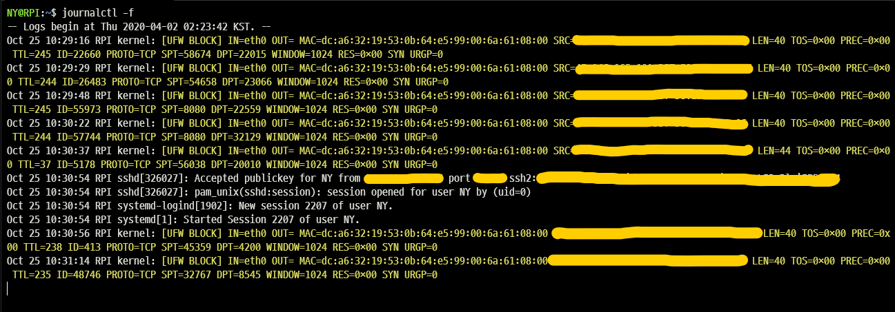

# VPN서버 구축

> **Summary**
> VPN 서버 구축을 위해 Tailscale이나 PiVPN을 설정하고, OpenVPN을 사용할 계획이다. Fail2ban을 통해 SSH 서버의 보안을 강화하고, Docker를 이용해 OpenMediaVault, Nginx Proxy, OpenVPN, Fail2Ban을 설치하여 관리할 수 있다. 각 서비스의 설정 파일을 수정하여 외부에서 안전하게 NAS에 접속할 수 있도록 하고, 무차별 대입 공격을 차단한다.

---


```latex
Tailscale이나 PiVPN 하나 설정해두시고 VPN 접속해서 SSH 접속하시는걸 추천합니다.
```

### proxy서버 설정

🔗 [https://youtu.be/q2lNjV07GlY?si=t3dQx47IFmfovI5l](https://youtu.be/q2lNjV07GlY?si=t3dQx47IFmfovI5l)

🔗 [https://xenostudy.tistory.com/693](https://xenostudy.tistory.com/693)

### VPN서버 설정 (openVPN 사용할거임)

🔗 [https://www.youtube.com/watch?v=kXCvanqUKqg](https://www.youtube.com/watch?v=kXCvanqUKqg)

### fail2ban 으로 무차별 대입공격 막기

🔗 [https://www.lesstif.com/security/fail2ban-ssh-43843899.html](https://www.lesstif.com/security/fail2ban-ssh-43843899.html)

🔗 [https://blog.ny64.kr/posts/setting-up-fail2ban-on-raspberry-pi/](https://blog.ny64.kr/posts/setting-up-fail2ban-on-raspberry-pi/)

<details>
<summary>무차별 공격 확인방법</summary>

# Fail2ban의 필요성

설치에 앞서 먼저 Fail2ban의 필요성을 알아봅시다.

만약 라즈베리파이가 외부 네트워크에 연결되어 있다면 아래 명령어를 한번 실행해 보세요.

```latex
journalctl -f
```



**journalctl -f 실행 결과**

저는 이미 **Fail2ban**과 **OTP** 설정이 완료되어 있어 로그인 시도는 보이지 않지만, 이러한 보안 설정이 되어있지 않을 경우에는

`Failed password for XXX from X.X.X.X port XXX` 이러한 식으로 **무차별 대입 공격 시도**가 수없이 들어오는 것을 확인할 수 있습니다.

~~**글로벌한 내 서버!**~~

Fail2ban이 이러한 SSH 로그인 시도를 필터를 통해 걸러주고, 자동으로 차단 해주는 역할을 합니다.

</details>

### Docker 이용?

🔗 [https://reddb.tistory.com/192](https://reddb.tistory.com/192)

<details>
<summary>도커 이용 시나리오</summary>

라즈베리파이에 OpenMediaVault와 함께 Nginx Proxy, OpenVPN, Fail2Ban을 Docker를 사용하여 간편하게 설치하고 관리할 수 있습니다. 다음은 그 과정을 단계별로 설명한 것입니다.

1. 라즈베리파이에 Docker 설치
```plain text
Copy codecurl -sSL https://get.docker.com | sh
sudo usermod -aG docker pi

```

1. Docker Compose 설치
```plain text
Copy codesudo apt-get install libffi-dev libssl-dev python3 python3-pip
sudo pip3 install docker-compose

```

1. OpenMediaVault Docker 컨테이너 실행
```plain text
Copy codedocker run -d --name openmediavault \
  --net=host \
  --privileged \
  -v /sys/fs/cgroup:/sys/fs/cgroup:ro \
  -v /dev/disk/by-label/DATA:/DATA \
  -v /dev/disk/by-label/BACKUP:/BACKUP \
  linuxserver/openmediavault

```

1. Nginx Proxy Manager Docker 컨테이너 실행
```plain text
Copy codedocker run -d \
  --name nginx-proxy-manager \
  -p 80:80 \
  -p 443:443 \
  -v /path/to/config:/config \
  -v /path/to/letsencrypt:/etc/letsencrypt \
  jc21/nginx-proxy-manager

```

1. OpenVPN Docker 컨테이너 실행
```plain text
Copy codedocker run -d \
  --name openvpn \
  --cap-add=NET_ADMIN \
  -e OPENVPN_PROVIDER=ovpn_udp \
  -v /path/to/openvpn-data:/etc/openvpn \
  -p 1194:1194/udp \
  kylemanna/openvpn

```

1. Fail2Ban Docker 컨테이너 실행
```plain text
Copy codedocker run -d \
  --name fail2ban \
  --cap-add NET_ADMIN \
  --cap-add NET_RAW \
  --network host \
  -v /path/to/fail2ban/data:/data \
  -v /var/log:/var/log:ro \
  crazymax/fail2ban:latest

```

이제 각 서비스의 설정 파일을 적절히 수정하고, Nginx Proxy Manager를 통해 OpenMediaVault 웹 인터페이스에 접속할 수 있도록 설정합니다.

또한, OpenVPN을 통해 외부에서 안전하게 NAS에 접속할 수 있고, Fail2Ban을 통해 SSH, OpenVPN, Nginx Proxy Manager 등에 대한 무차별 대입 공격을 차단할 수 있습니다.

Docker를 사용하면 각 서비스를 독립적인 컨테이너로 실행할 수 있어 설치와 관리가 간편해지며, 필요에 따라 쉽게 업데이트하거나 백업할 수 있습니다.

</details>

