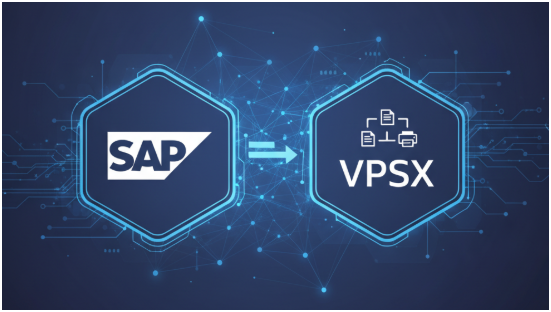

# VPSX와 SAP: 중앙 집중화로 혁신하는 기업 문서 출력

> **Summary**
> VPSX는 SAP와 통합되어 기업의 문서 출력을 중앙 집중화하여 관리 효율성을 높이고 보안을 강화하는 솔루션이다. 이를 통해 복잡한 프린터 설정을 단순화하고, 출력 작업을 하나의 플랫폼에서 통합 관리하며, 클라우드 환경에서도 안정적인 출력 관리를 지원한다. 결과적으로 기업은 IT 인프라를 개선하고 핵심 비즈니스에 집중할 수 있는 환경을 조성할 수 있다.

---

## VPSX와 SAP: 기업의 문서 출력을 혁신하는 강력한 조합

### 들어가며: 보이지 않는 비용, '출력'

기업의 일상적인 업무에서 '출력'은 너무나 당연하게 여겨집니다. 하지만 전사적자원관리(ERP) 시스템의 대명사인 **SAP**를 사용하는 대기업의 경우, 문제는 간단하지 않습니다. 하루에도 수천, 수만 건씩 발생하는 송장, 구매 주문서, 보고서 등의 문서를 수많은 부서의 다양한 프린터로 정확하고 안전하게 전달하는 것은 보이지 않는 큰 비용과 관리 부담을 유발합니다.

이러한 문제를 해결하기 위해 등장한 것이 바로 **VPSX(OutputManager)**이며, SAP와의 긴밀한 연동을 통해 기업 출력 관리의 새로운 표준을 제시합니다.

---

### 본론 1: SAP 출력 관리, 무엇이 문제인가?

SAP는 기업의 재무, 생산, 물류 등 핵심 업무를 처리하는 강력한 시스템이지만, 자체적인 출력 기능만으로는 복잡한 현대 기업 환경의 요구를 모두 충족시키기 어렵습니다.

- **복잡한 프린터 설정:** 수백, 수천 대에 달하는 프린터를 SAP 시스템에 개별적으로 설정하고 관리하는 것은 매우 번거로운 작업입니다.
- **제한적인 기능:** 민감한 정보의 보안 출력, 출력 실패 시 자동 재처리, 사용자별 출력 권한 관리 등 고급 기능을 구현하기 어렵습니다.
- **높은 유지보수 비용:** 각 지역에 분산된 프린트 서버를 운영하고, 드라이버 호환성 문제를 해결하는 데 많은 시간과 비용이 소요됩니다.
이러한 한계는 기업의 업무 효율을 저하시키고, 불필요한 IT 자원 낭비를 초래하는 원인이 됩니다.

---

### 본론 2: 해답은 중앙 집중화, VPSX의 역할

**VPSX**는 Levi, Ray & Shoup, Inc.(LRS)에서 개발한 **기업용 출력 관리 솔루션**입니다. 그 핵심은 **'중앙 집중화'**에 있습니다. SAP를 포함한 기업 내 모든 시스템에서 발생하는 출력 작업을 단일 플랫폼에서 통합하여 관리, 제어, 모니터링하는 역할을 수행합니다.

**주요 기능:**

- **단일 제어 지점:** 모든 출력 작업을 하나의 중앙 서버에서 관리하여 인프라를 단순화합니다.
- **보안 및 감사:** 사용자 인증 후 문서를 수령하는 '풀 프린팅(Pull Printing)' 기능으로 정보 유출을 방지하고, 모든 출력 기록을 추적하여 규정 준수(Compliance) 요건을 충족합니다.
- **안정적인 전송:** 출력 데이터가 프린터까지 확실하게 전달되도록 보장하며, 오류 발생 시 관리자에게 즉시 알림을 보냅니다.
---

### 본론 3: SAP와 VPSX의 완벽한 통합 시너지

VPSX가 특별한 이유는 바로 **SAP와의 공식 인증을 통한 완벽한 통합**에 있습니다. VPSX는 SAP의 표준 인터페이스(BC-XOM, BTP-PRINT-OMS 등)와 직접 연동되도록 설계되었습니다. 이는 두 시스템이 마치 하나처럼 매끄럽게 작동한다는 의미입니다.

**SAP와 VPSX 통합의 핵심 이점:**

1. 인프라 대폭 간소화:
  기존에 필요했던 수많은 윈도우 프린트 서버를 제거하고, VPSX 단일 플랫폼으로 대체할 수 있습니다. 이는 서버 관리 및 라이선스 비용을 획기적으로 절감시킵니다.

1. 향상된 사용자 경험:
  SAP 사용자는 별도의 프로그램 없이 기존에 사용하던 SAP 화면에서 직접 프린터를 선택하고 출력 상태를 확인할 수 있습니다. IT 관리자는 중앙 웹 인터페이스를 통해 모든 출력 현황을 한눈에 파악하고 제어할 수 있습니다.

1. 완벽한 데이터 처리:
  SAP에서 생성되는 고유한 문서 형식(GOF/OTF)을 VPSX가 자동으로 프린터가 이해할 수 있는 언어로 변환해줍니다. 이로 인해 별도의 하드웨어 추가 없이 바코드, 라벨 등 특수 문서 출력도 원활하게 처리됩니다.

1. 클라우드 환경 완벽 지원:
  최신 클라우드 기반 ERP인 SAP S/4HANA 및 RISE with SAP 환경에서도 온프레미스(사내 구축형)와 동일하게 안정적인 출력 관리를 지원하여, 기업의 디지털 전환을 가속화합니다.

---

### 결론: 단순한 비용 절감을 넘어 비즈니스 혁신으로

**VPSX와 SAP의 통합은 단순히 프린터 관리 업무를 줄여주는 것을 넘어섭니다.** 이는 기업의 문서 출력 프로세스 전체를 **표준화하고, 보안을 강화하며, 운영 효율성을 극대화**하는 전략적 선택입니다.

출력과 관련된 보이지 않는 비용과 장애 요소를 제거함으로써, 기업은 핵심 비즈니스에 더욱 집중할 수 있는 환경을 만들 수 있습니다. 결국, VPSX와 SAP의 만남은 기업의 IT 인프라를 더욱 견고하고 미래지향적으로 만드는 현명한 투자라 할 수 있습니다.

