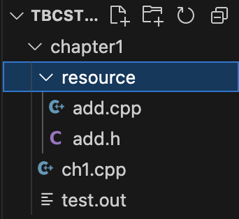

# VS Code C++ 세팅

> **Summary**
> VS Code에서 C++ 개발환경을 설정하는 방법에 대한 안내로, 설치 과정, 헤더 파일 포함 방법, 빌드 설정을 위한 JSON 파일 작성법 등을 설명하고 있습니다. 추가적으로 유용한 링크와 디스코드 커뮤니티 참여를 권장합니다.

---


# 설치

🔗 [https://torbjorn.tistory.com/658](https://torbjorn.tistory.com/658)

🔗 [https://wooono.tistory.com/299](https://wooono.tistory.com/299)


# 헤더 세팅

🔗 [https://www.inflearn.com/questions/1075869/맥에서-makfefile-사용하지-않고-vscode를-사용하여-헤더파일-포함해-실행시키는-법](https://www.inflearn.com/questions/1075869/맥에서-makfefile-사용하지-않고-vscode를-사용하여-헤더파일-포함해-실행시키는-법)

> 💡 **헤더파일 포함 방법**
> ---
>
> 
>
> 일단 이건 제 폴더 화면이구요 ch1.cpp가 메인함수이고, 리소스에 add함수(헤더파일 및 바디)를 넣었습니다.
>
> # add.cpp
>
> 
>
> 
>
> # add.h
>
> 
>
>
> ---
>
>
> cpp 에서 그냥 헤더파일 디렉토리만 명시해주면 되는거였음
>
>
> # 근데 헤더파일을 모두 포함시켜버릴 수 있음
>
> > 참고로 vscode에서 Folder와 Workspace의 차이는 [이 글](https://stackoverflow.com/a/57134632)을 참고하기 바란다. 
> 간단히 말하면 하나의 폴더 아래서 모든 작업을 할 때는 [Open Folder]로 열면 되고 
> 여러개의 루트 폴더가 있는 경우에는 워크스페이스를 만들어야 한다.
>
> 안녕하세요? 불친절에 대한 분노가 느껴지는 글입니다만 결과적으로 스스로 해결을 하셨네요. 저도 한 성격 하기 때문에 이 자리를 빌어서 학생때 이런적이 많았다는 고백을 하고 싶습니다. 되돌아보면 분노가 결과적으로 공부에 긍정적인 에너지로 활용되는 경우도 많았습니다.
>
> 일주일 차에 이정도를 스스로 추론해내신 것은 아주 잘하신 것 같습니다만, 매번 여러 개의 파일 이름들을 타이핑 하는 것은 번거로우실 것 같아서 VSCode 팁 알려드리려고 합니다.
>
> VSCode 자체에서 빌드에 사용하는 설정들을 바꿀 수 있도록 *.json 파일들을 만들어 주는데,
>
>
> ```json
> "configurations": [
>
> {
>
> "name": "Linux",
>
> "includePath": [
>
> "${workspaceFolder}/**" **<- 여러 헤더 파일들(*.h)을 모두 포함(include)시키겠다.**
>
> ],
> ```
>
> ```json
> {
>
> "tasks": [
>
> {
>
> "type": "cppbuild",
>
> "label": "C/C++: g++ build active file",
>
> "command": "/usr/bin/g++",
>
> "args": [
>
> "-fdiagnostics-color=always",
>
> "-g",
>
> "${fileDirname}/*.cpp", **<- 여러개의 cpp 파일들을 모두 빌드하겠다**
> ```
>
> 는 의미입니다. 이 설정파일들을 사용하는 방법은 아쉽게도 외부링크에 있습니다.
>
> [https://www.youtube.com/watch?v=UqCZda8DLGc](https://www.youtube.com/watch?v=UqCZda8DLGc)
>
> 여기 앞부분 설치 방법 참고해보세요.
>
> 박성국님 요약도 참고하세요.
>
> 박성국님의 요약
>
> [https://blog.naver.com/sungkukshawnpark/223167856926](https://blog.naver.com/sungkukshawnpark/223167856926) (윈도우)
>
> [https://blog.naver.com/sungkukshawnpark/223168149338](https://blog.naver.com/sungkukshawnpark/223168149338) (맥OS)
>
> 다른 수강생들로부터 도움을 받고 싶으시면 디스코드로 오세요. 디스코드에 질문 올리셔도 됩니다. [https://discord.gg/QkVU8QWUzS](https://discord.gg/QkVU8QWUzS)
>
>

🔗 [https://modoocode.com/311](https://modoocode.com/311)

🔗 [https://80000coding.oopy.io/4dfac992-da7b-490f-a957-6d86f81334be](https://80000coding.oopy.io/4dfac992-da7b-490f-a957-6d86f81334be)

🔗 [https://bluishhot-star.tistory.com/117](https://bluishhot-star.tistory.com/117)

🔗 [https://goodgodgd.github.io/ian-flow/archivers/vscode-tutorial](https://goodgodgd.github.io/ian-flow/archivers/vscode-tutorial)

