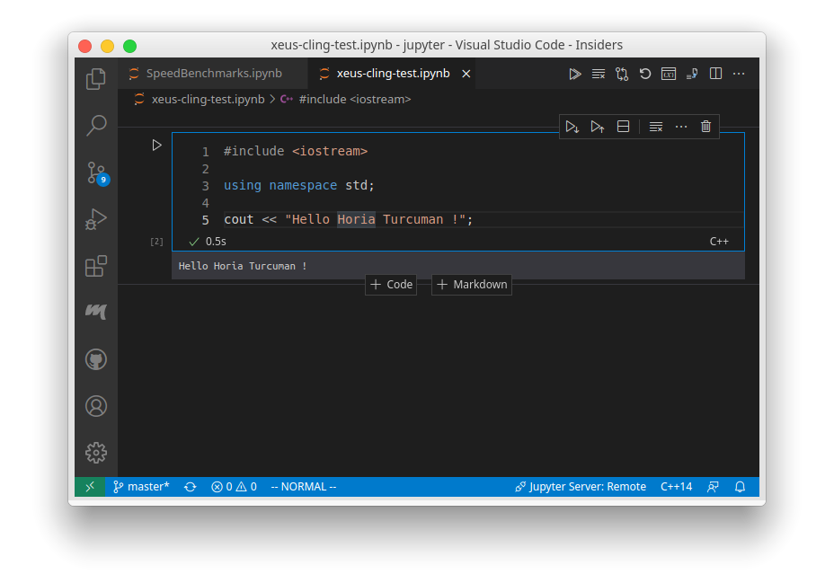

# VS code 주피터 노트북에서 C++ 구동하기

> **Summary**
> VSCode에서 C++를 실행하기 위해서는 MAC 환경에서 homebrew와 anaconda를 설치하고, zsh를 설정한 후, Jupyter Notebook 플러그인을 설치해야 합니다. xeus-cling 커널을 설치하여 C++ 코드를 실행할 수 있으며, 필요한 명령어와 설정 방법이 안내되어 있습니다.

---



🔗 [https://stackoverflow.com/questions/66408814/running-c-jupiter-notebook-in-vscode-insiders](https://stackoverflow.com/questions/66408814/running-c-jupiter-notebook-in-vscode-insiders)

🔗 [https://learnopencv.com/xeus-cling-run-c-code-in-jupyter-notebook/](https://learnopencv.com/xeus-cling-run-c-code-in-jupyter-notebook/)

### 환경 조건

1. MAC환경에서 homebrew 설치
1. 터미널에 zsh 설치
1. VSCode
1. VSCode 내부에서 C/C++ 환경설정

1. VSCode jupyterNotebook 플러그인 설치
1. anaconda 설치
1. xeus-cling 설치

# ananconda 설치


```c
brew install --cask anaconda
```


### →conda 사용을 위해 zsh에 conda path 등록

```shell
/usr/local/anaconda3/bin/conda init zsh
```

```shell
/opt/homebrew/anaconda3/bin/conda init zsh
```


> 💡 **homebrew로 설치한 anconda 디렉토리 위치 확인하는방법**
> → 다음 명령어로 디렉토리 위치 확인하기
>
> ```shell
> brew info anaconda
> ```
>
> → 과감하게 다음 멍령어로 conda 디렉토리 위치를 확인할수 있다
>
> ```shell
> brew uninstall acanonda
> ```
>
>


### → 다음명령어를 통해 zsh를 적용합시다

```shell
source ~/.zsh
```


### → conda upda

```shell
conda update conda
```


Visual Studio Code에서 Jupyter Notebook을 사용하려면, View 탭에서 jupyter로 검색하면 "select interpreter to start jupyter server"를 선택합니다. 작업할 폴더를 VS code로 열고 확장자 ".ipynb"로 파일을 만든 후 클릭하면 VS code 내 Jupyter Notebook이 실행됩니다¹.

C++를 실행하기 위해서는 xeus-cling을 설치해야 합니다. xeus-cling은 C++ 커널입니다. xeus-cling을 설치한 후에는 VS Code Insiders에서 xeus-cling 커널을 사용하여 C++ 코드를 실행할 수 있습니다.


xeus-cling은 C++ 프로그래밍 언어를 위한 커널입니다. xeus-cling은 Jupyter 프로토콜을 구현한 것으로, Jupyter 노트북에서 C++ 코드를 실행할 수 있도록 합니다


```c
conda install -c conda-forge xeus-cling
```


