# VirtualBox 네트워크 모드 정리 (NAT , NAT network , Bridge , HostOnly)

> **Summary**
> VirtualBox의 네트워크 모드에는 Bridged Adapter, Host-Only Adapter, NAT, NAT Network가 있으며, 각 모드는 호스트와 게스트 간의 통신 방식이 다릅니다. Bridged Adapter는 실제 네트워크와 연결되어 독립적인 IP를 사용하고, Host-Only Adapter는 사설 네트워크를 구성하여 인터넷 연결이 불가능합니다. NAT 모드는 게스트가 외부 인터넷에 접근할 수 있지만 호스트에서 게스트로의 접근은 포트포워딩이 필요합니다. NAT Network는 게스트 간의 통신이 가능하지만 호스트와의 직접 통신은 불가능합니다. 포트포워딩 설정을 통해 호스트에서 특정 게스트 VM에 접근할 수 있습니다.

---


> 교장님이 칠수에게 크게 노했습니다!!
하지만.. 도대체 어떤 칠수에게 노하신거죠?

# VM 포트포워딩

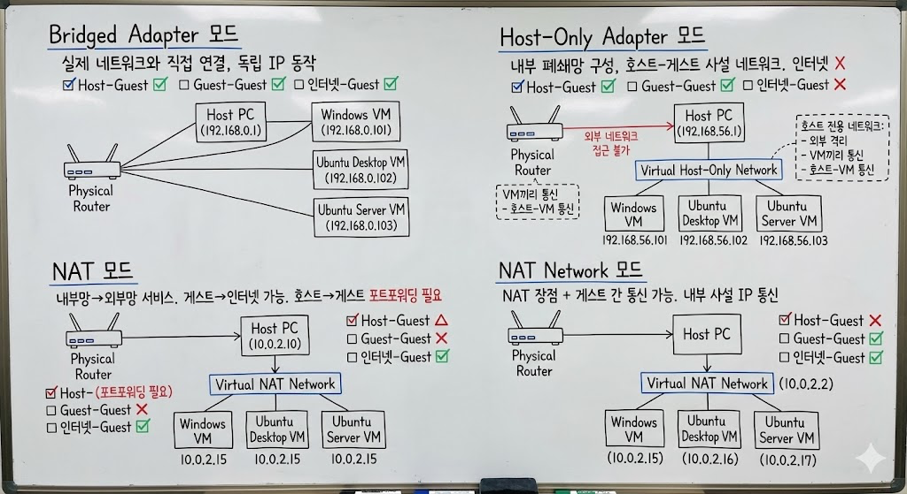

실습을 시작하기 전에, VirtualBox에서 제공하는 네트워크 모드(NAT, 브리지, 내부 네트워크 등)에 대해 충분히 숙지하고, 호스트와 게스트 간 통신을 설정하기 위해 필요한 포트 포워딩의 개념을 이해한 후 본문으로 넘어가는 것이 좋습니다.

## → VirtualBox 네트워크 모드 정리

### **Bridged Adapter 모드**

>> 리얼 PC와 동일한 서비스를 제공하기 위해

실제 네트워크와 직접 연결

VM이 실제 네트워크 상에서 독립적인 IP로 동작

- Host - Guest 간의 통신 여부 - ✅
- Guest - Guest 간의 통신 여부 - ✅
- 인터넷 - Guest 간의 통신 여부 - ✅
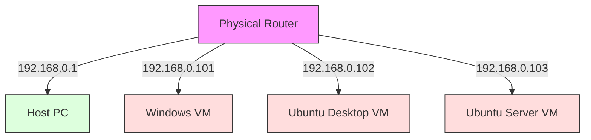


---

### **Host-Only dapter 모드**

>> 내부의 폐쇄망을 구성해야할때

호스트와 게스트 간(및 게스트 간) 사설 네트워크 구성

인터넷 연결은 안 됨(원하면 별도의 어댑터 추가 필요)

- Host - Guest 간의 통신 여부 - ✅
- Guest - Guest 간의 통신 여부 - ✅
- 인터넷 - Guest 간의 통신 여부 - ❌ 
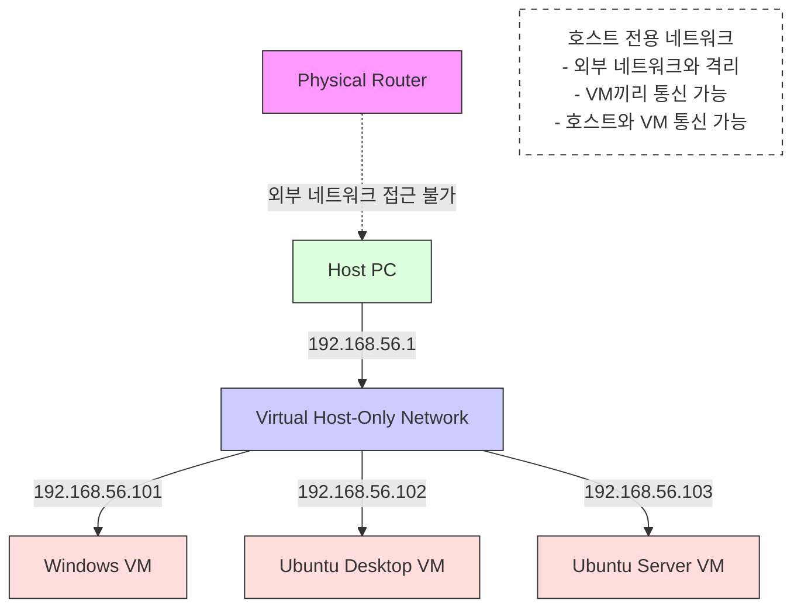


---

### **NAT 모드**

>> 내부망에 서비스가 외부망으로 빠져나가야할때

게스트에서 호스트 및 외부 인터넷 접근 가능

호스트에서 게스트 접근은 **포트포워딩** 설정 필요

- Host - Guest 간의 통신 여부 - 🔺
  - Guest → Host 의 사설 게이트웨이 대역대는 가능
  - Host → Guest 는 포트포워딩 없이는 불가능.
- Guest - Guest 간의 통신 여부 - ❌
- 인터넷 - Guest 간의 통신 여부 - ✅


### **NAT Network 모드**

NAT 모드 장점 + **게스트 간 통신** 가능

포트포워딩이 필요할 수 있지만, VM들끼리는 내부적으로 사설 IP를 통해 통신

- Host - Guest 간의 통신 여부 - ❌
- Guest - Guest 간의 통신 여부 - ✅
- 인터넷 - Guest 간의 통신 여부 - ✅
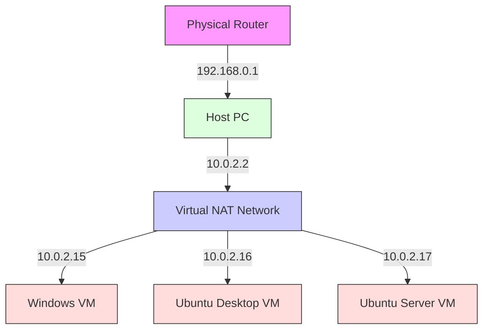

---


## → NAT 모드에서 포트포워딩이 필요한 이유

NAT 모드에서는 게스트 VM이 가상 NAT를 통해 외부로 통신하기 때문에, **게스트 → 호스트** 혹은 **게스트 → 인터넷** 통신은 문제가 없습니다.

하지만 **호스트 → 게스트**로 들어오는 연결은 기본적으로 차단됩니다. 모든 게스트 VM이 “10.0.2.15” 같은 동일한 사설 IP를 부여받기 때문에, 호스트 입장에서는 “같은 IP를 쓰는 여러 대 중 어느 VM에게 패킷을 보내야 할지” 식별할 수 없기 때문입니다.

이를 해결하기 위해 **포트포워딩**을 설정하면, 호스트의 특정 포트로 들어오는 연결을 특정 게스트 VM의 22번(SSH), 80번(HTTP) 등으로 매핑할 수 있습니다. 예를 들어,

- 호스트 IP `10.234.41.47`의 `2222` 포트 → 게스트 IP `10.0.2.15`의 `22` 포트(SSH)
- 호스트 IP `10.234.41.47`의 `3380` 포트 → 게스트 IP `10.0.2.15`의 `80` 포트(웹 서버)
이런 식으로 설정해두면, 호스트에서 `ssh -p 2222 user@10.234.41.47` 명령을 통해 게스트 VM에 접근할 수 있게 됩니다.


### 동명이인의 철수를 찾는 이야기로 이해해봅시다!

클클초등학교에 ‘철수’라는 이름을 가진 학생이 3명 있다고 가정해봅시다.

만약 교장 선생님(호스트)이 “철수, 교장실로 와!”라고 외친다면,

이름이 같은 3명의 철수는 동시에 “나를 부른 건가?” 하고 헷갈릴 수밖에 없습니다.


> 왜 헷갈릴까?

---

### 클클초등학교 = 공인 IP

클클초등학교 자체를 공인 IP(예: 10.234.41.47)에 비유해볼 수 있습니다.

- 클클초등학교(공인 IP)라는 ‘건물(주소)’는 하나이지만,
- 그 안에는 여러 교실(포트, 혹은 실제로는 사설 IP를 쓰는 여러 VM)이 존재합니다.
### A반에 가면 1번 철수가 있다 = 포트포워딩

그러면 어떻게 특정 철수만 확실하게 호출할 수 있을까요?

- 교장 선생님이 “A반 1번 철수, 교장실로 와!”라고 구체적으로 이야기한다면,A반 1번 철수만 정확히 자기 호출임을 알 수 있습니다.
---

### NAT 포트포워딩도 같은 원리로 동작합니다.

1. **호스트(공인 IP) 측 포트**를 ‘A반’이라고 부여합니다. (예: 2222번 포트)
1. 그 ‘A반(호스트 포트)’ 안에 있는 ‘1번 철수(사설 IP: 10.0.2.15, 사설 포트: 22번)’에게 전달하도록 설정합니다.
---

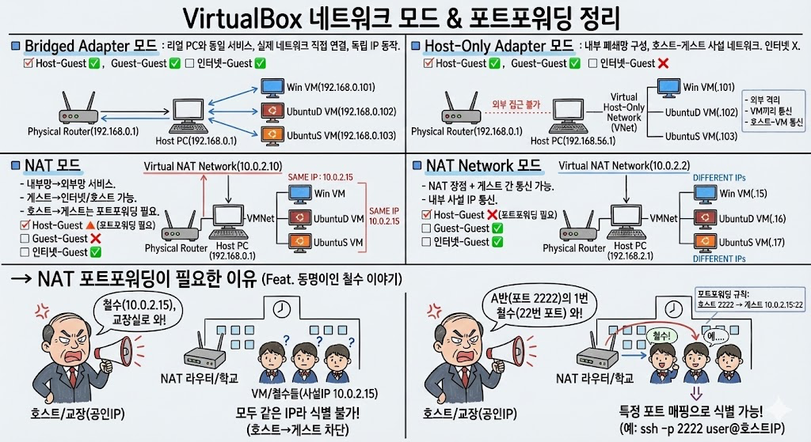

# Virtual Machine을 이용한 인프라 구성을 직접 해볼까요?!


### 각 단계별 점검사항

```javascript
1. Host - Guest 간의 통신 여부
2. Guest - Guest 간의 통신 여부
3. 인터넷 - Guest 간의 통신 여부
```

1. 모두 Bridge 모드일 경우 VM 끼리 통신
<details>
<summary>O O O</summary>


</details>

1. Window-Desktop 과 Ubuntu-Server 를 Host-Only Adapter로 연결하여 ping 통신
<details>
<summary>O O X</summary>

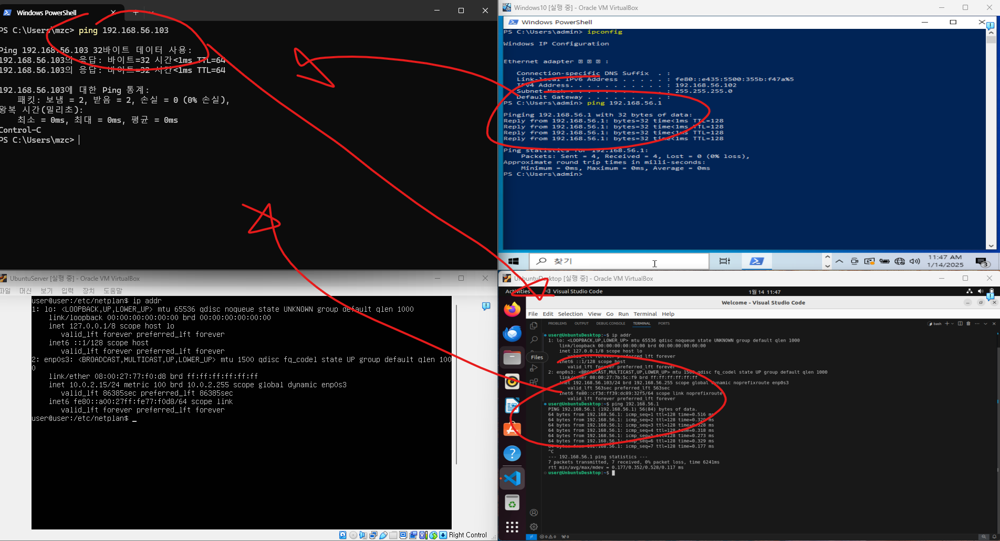


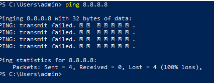

</details>

1. Window-Desktop 과 Ubuntu-Desktop을 Host-Only Adapter#2로 연결하여 ping 통신
<details>
<summary>사전 설정</summary>

- 새로운 어댑터를 만들어줘야함


</details>

<details>
<summary>O O X</summary>

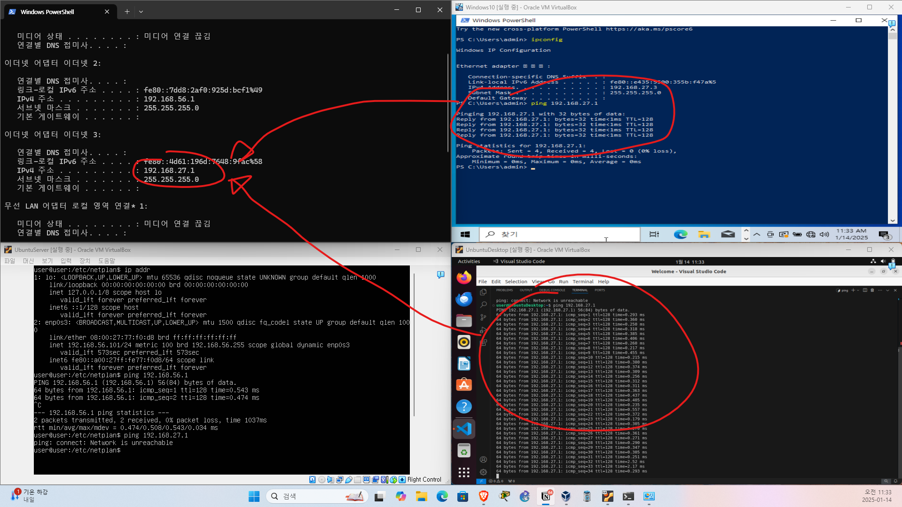


</details>

1. 각 VM에서 NAT 연결을 통해 apt 업데이트
<details>
<summary>🔺 X O</summary>


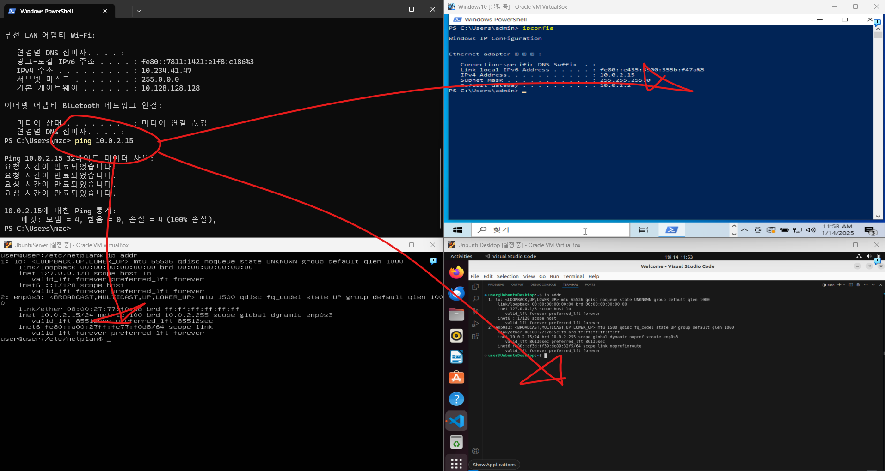


</details>

<details>
<summary>APT는 잘 됨</summary>

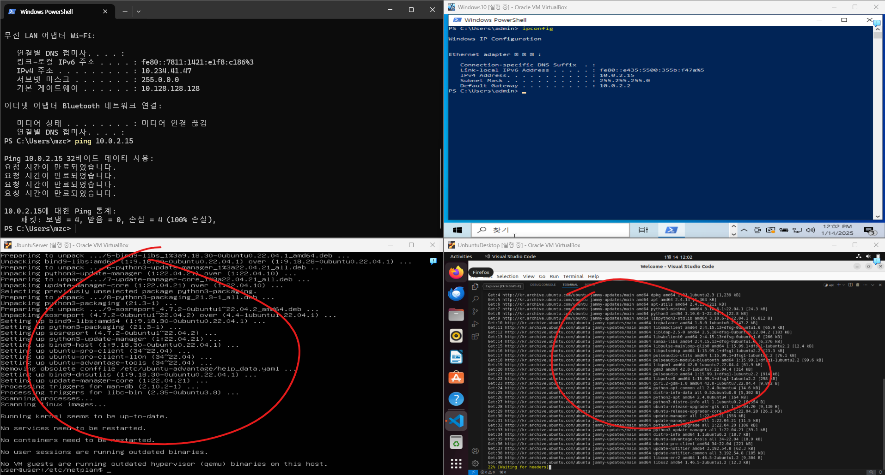

</details>

1. 다른 LAN카드를 사용하는 VM을 하나의 스위치로 연결하여 ping 통신
<details>
<summary>6.1. 방법 A - L3 스위치 사용 (라우티드 포트 활용)</summary>

<details>
<summary>네트워크 추가</summary>


```javascript
이더넷 어댑터 이더넷 2:

   연결별 DNS 접미사. . . . :
   설명. . . . . . . . . . . . : VirtualBox Host-Only Ethernet Adapter
   물리적 주소 . . . . . . . . : 0A-00-27-00-00-31
   DHCP 사용 . . . . . . . . . : 아니요
   자동 구성 사용. . . . . . . : 예
   링크-로컬 IPv6 주소 . . . . : fe80::7dd8:2af0:925d:bcf1%49(기본 설정)
   IPv4 주소 . . . . . . . . . : 192.168.56.1(기본 설정)
   서브넷 마스크 . . . . . . . : 255.255.255.0
   기본 게이트웨이 . . . . . . :
   DHCPv6 IAID . . . . . . . . : 822738983
   DHCPv6 클라이언트 DUID. . . : 00-01-00-01-2A-07-F9-0B-8C-B0-E9-1D-08-94
   Tcpip를 통한 NetBIOS. . . . : 사용

이더넷 어댑터 이더넷 3:

   연결별 DNS 접미사. . . . :
   설명. . . . . . . . . . . . : VirtualBox Host-Only Ethernet Adapter #2
   물리적 주소 . . . . . . . . : 0A-00-27-00-00-3A
   DHCP 사용 . . . . . . . . . : 아니요
   자동 구성 사용. . . . . . . : 예
   링크-로컬 IPv6 주소 . . . . : fe80::4d61:196d:7648:9fac%58(기본 설정)
   IPv4 주소 . . . . . . . . . : 192.168.27.1(기본 설정)
   서브넷 마스크 . . . . . . . : 255.255.255.0
   기본 게이트웨이 . . . . . . :
   DHCPv6 IAID . . . . . . . . : 973733927
   DHCPv6 클라이언트 DUID. . . : 00-01-00-01-2A-07-F9-0B-8C-B0-E9-1D-08-94
   Tcpip를 통한 NetBIOS. . . . : 사용
```

</details>

<details>
<summary>GNS3 구성</summary>


</details>

<details>
<summary>스위치 구성파일 (L3 스위치로 만드는게 핵심임!)</summary>

```plain text
L3SW#show running-config
Building configuration...

Current configuration : 1527 bytes
!
version 12.4
service timestamps debug datetime msec
service timestamps log datetime msec
no service password-encryption
!
hostname L3SW
!
boot-start-marker
boot-end-marker
!
!
no aaa new-model
memory-size iomem 5
no ip icmp rate-limit unreachable
!
!
ip cef
no ip domain lookup
!
!
!
multilink bundle-name authenticated
!
!
!
!
!
!
!
!
!
!
!
!
!
!
!
archive
 log config
  hidekeys
!
!
!
vlan internal allocation policy ascending
!
ip tcp synwait-time 5
!
!
!
!
interface FastEthernet0/0
 no ip address
 shutdown
 duplex auto
 speed auto
!
interface FastEthernet0/1
 no ip address
 shutdown
 duplex auto
 speed auto
!
**interface FastEthernet1/0
 no switchport
 ip address 192.168.56.254 255.255.255.0**
!
**interface FastEthernet1/1
 no switchport
 ip address 192.168.27.254 255.255.255.0**
!
interface FastEthernet1/2
!
interface FastEthernet1/3
!
interface FastEthernet1/4
!
interface FastEthernet1/5
!
interface FastEthernet1/6
!
interface FastEthernet1/7
!
interface FastEthernet1/8
!
interface FastEthernet1/9
!
interface FastEthernet1/10
!
interface FastEthernet1/11
!
interface FastEthernet1/12
!
interface FastEthernet1/13
!
interface FastEthernet1/14
!
interface FastEthernet1/15
!
interface Vlan1
 no ip address
!
no ip http server
no ip http secure-server
ip forward-protocol nd
!
!
!
no cdp log mismatch duplex
!
!
!
!
control-plane
!
!
!
!
!
!
!
!
!
line con 0
 exec-timeout 0 0
 privilege level 15
 logging synchronous
line aux 0
 exec-timeout 0 0
 privilege level 15
 logging synchronous
line vty 0 4
 login
!
!
end

```

</details>

<details>
<summary>UbuntuServer (VirtualBox Host-Only Ethernet Adapter) `192.168.56.X`</summary>

**기본 게이트웨이 192.168.56.1 은 알지만, **

**gns3에서 구축한 L3스위치의 라우티드 포트 게이트웨이 정보를 알 수 없음**

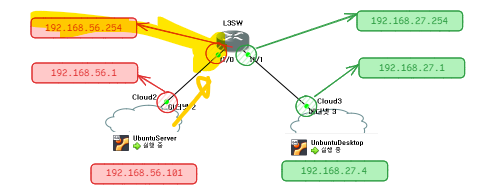

그래서 게스트측에서도 라우팅을 해줘야함

```plain text
ip route
```

```plain text
sudo ip route add default via 192.168.56.254
```

</details>

<details>
<summary>UbuntuDesktop (VirtualBox Host-Only Ethernet Adapter #2) `192.168.27.X`</summary>

**다른 게스트측도 게이트웨이를 알려주자**

```plain text
sudo ip route add default via 192.168.27.254
```

</details>

<details>
<summary>연결확인</summary>

이제 `192.168.56.X` 와 `192.168.27.X` 는 자신의 게이트웨이도 알고, 이 게이트웨이가 L3SW로 Connected로 연결되어있으니, 이제 서로 핑이 가능하다

UbuntuDesktop → UbuntuServer


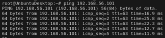

</details>

</details>

<details>
<summary>6.2. 방법 B - L2 스위치 사용 (서브넷 활용)</summary>

1. Adapter 
<details>
<summary>서브넷을 애초에 적게주자</summary>


그리고 host PC 에서 ipconfig 를 통해 어댑터가 생성되었는지 확인해보자


</details>

<details>
<summary>IP를 수동으로주자</summary>

하지만 해당 방법은 컴퓨터 껐다 키면 다시 원래대로 돌아오는 형태입니다.

현재 실습에서는 스위치를 통해 같은 네트워크로 묶을 수 있다는 것을 보기 위함이니, 간단하게 해당 명령어로 진행할것입니다.

**ubuntu server (Adapt)**

```plain text
sudo ip addr add 192.168.56.12/24 dev enp0s3
```

**ubuntu desktop (Adapt #2)**

```plain text
sudo ip addr add 192.168.56.23/24 dev enp0s3
```

</details>

<details>
<summary>GNS3 설정을 해주자</summary>


</details>

</details>

## Virtual Machine 을 이용한 인프라구성 telent , ssh 테스트

1. **Ubuntu Desktop, Ubuntu Server, Windows Desktop에 SSH 서버 설치(NAT)**
<details>
<summary>설치방법</summary>

**1. 각 VM에 SSH 서버 설치**

- **Ubuntu Desktop 및 Ubuntu Server:**
  - 터미널을 열고 다음 명령어를 실행하여 OpenSSH 서버를 설치합니다:
```shell
sudo apt update
sudo apt install openssh-server
```

  - 설치 후 SSH 서버를 시작하고, 부팅 시 자동 시작하도록 설정합니다:
```shell
sudo systemctl start ssh
sudo systemctl enable ssh
```

  - SSH 서버 상태를 확인하여 정상적으로 실행 중인지 확인합니다:
```shell
sudo systemctl status ssh
```

- **Windows 10:**
  - Windows 10에는 기본적으로 OpenSSH 서버가 포함되어 있습니다. 이를 활성화하려면:
    - **설정** > **앱** > **선택적 기능**으로 이동합니다.
    - **기능 추가**를 클릭하고, **OpenSSH 서버**를 찾아 설치합니다.
    - 설치 후 **서비스** 앱을 열어 **OpenSSH SSH Server**를 찾아 시작하고, 시작 유형을 **자동**으로 설정합니다.
  - 혹은…
    - Powershell 관리자 권한으로 실행시켜서
```plain text
Add-WindowsCapability -Online -Name OpenSSH.Server~~~~0.0.1.0
```

---

</details>

1. **NAT 모드에서 SSH 연결을 위한 네트워크 설정**
<details>
<summary>10.234.41.47:2222 → ubuntu desktop 10.0.2.15:22</summary>

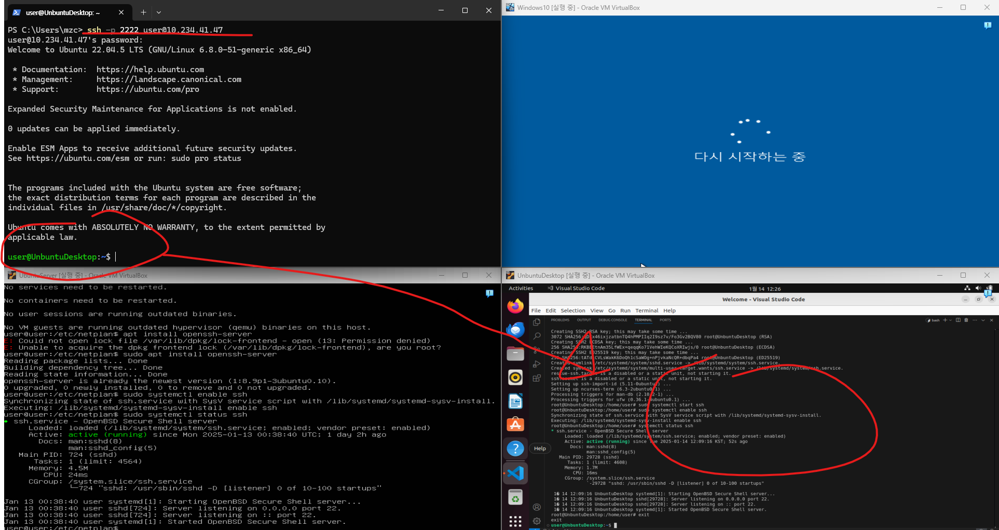

</details>

<details>
<summary>10.234.41.47:2223 → ubuntu server 10.0.2.15:22</summary>


</details>

<details>
<summary>10.234.41.47:2224 → windows 10.0.2.15:22</summary>


</details>

<details>
<summary>설정방법</summary>


</details>

<details>
<summary>접속방법 (windows to…)</summary>

```javascript
ssh -p 2222 user@10.234.41.47
```

</details>


---

# 추가미션 (웹서버 띄우기)

## 1. 아파치 웹서버

**1. 시스템 패키지 업데이트**

```shell
sudo apt update
```

**2. 아파치 웹 서버 설치**

```shell
sudo apt install apache2 -y
```

**3. 아파치 서비스 시작 및 상태 확인**

```shell
sudo systemctl status apache2
```

출력 결과에 'active (running)'이 표시되면 아파치가 정상적으로 실행 중인 것입니다.

**4. 방화벽 설정 (필요한 경우)**

우분투의 UFW(Uncomplicated Firewall)를 사용 중이라면, 

웹 트래픽을 허용하도록 설정해야 합니다:

```shell
sudo ufw allow 'Apache Full'
```

이 명령어는 HTTP(80번 포트)와 HTTPS(443번 포트) 트래픽을 모두 허용합니다.

**4. 포트포워딩**

