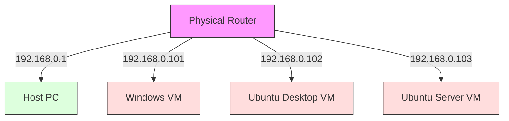
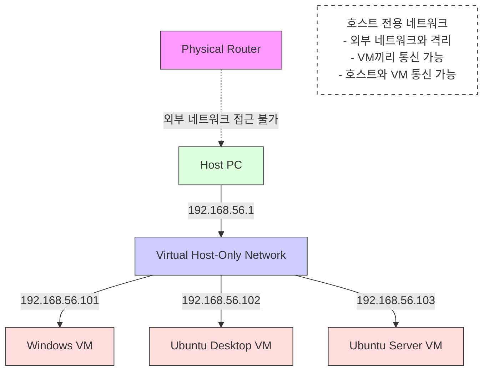
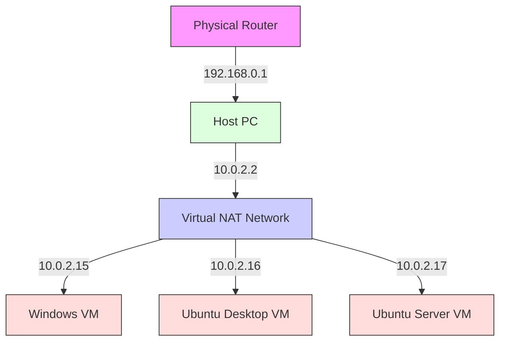

# VirtualBox 네트워크 모드 정리 (NAT , NAT network , Bridge , HostOnly)

> **Summary**
> VirtualBox의 네트워크 모드에는 Bridged Adapter, Host-Only Adapter, NAT, NAT Network가 있으며, 각 모드는 호스트와 게스트 간의 통신 방식이 다릅니다. Bridged Adapter는 실제 네트워크와 연결되어 독립적인 IP를 사용하고, Host-Only Adapter는 사설 네트워크를 구성하여 인터넷 연결이 불가능합니다. NAT 모드는 게스트가 외부 인터넷에 접근할 수 있지만, 호스트에서 게스트로의 접근은 포트포워딩이 필요합니다. NAT Network는 게스트 간의 통신을 가능하게 하며, 포트포워딩 설정을 통해 호스트에서 특정 게스트에 접근할 수 있습니다.

---

> 교장님이 칠수에게 크게 노했습니다!!
하지만.. 도대체 어떤 칠수에게 노하신거죠?

# VM 포트포워딩

실습을 시작하기 전에, VirtualBox에서 제공하는 네트워크 모드(NAT, 브리지, 내부 네트워크 등)에 대해 충분히 숙지하고, 호스트와 게스트 간 통신을 설정하기 위해 필요한 포트 포워딩의 개념을 이해한 후 본문으로 넘어가는 것이 좋습니다.

## → VirtualBox 네트워크 모드 정리

### **Bridged Adapter 모드**

>> 리얼 PC와 동일한 서비스를 제공하기 위해

실제 네트워크와 직접 연결

VM이 실제 네트워크 상에서 독립적인 IP로 동작

- Host - Guest 간의 통신 여부 - ✅
- Guest - Guest 간의 통신 여부 - ✅
- 인터넷 - Guest 간의 통신 여부 - ✅

---

### **Host-Only dapter 모드**

>> 내부의 폐쇄망을 구성해야할때

호스트와 게스트 간(및 게스트 간) 사설 네트워크 구성

인터넷 연결은 안 됨(원하면 별도의 어댑터 추가 필요)

- Host - Guest 간의 통신 여부 - ✅
- Guest - Guest 간의 통신 여부 - ✅
- 인터넷 - Guest 간의 통신 여부 - ❌ 

---

### **NAT 모드**

>> 내부망에 서비스가 외부망으로 빠져나가야할때

게스트에서 호스트 및 외부 인터넷 접근 가능

호스트에서 게스트 접근은 **포트포워딩** 설정 필요

- Host - Guest 간의 통신 여부 - 🔺
  - Guest → Host 의 사설 게이트웨이 대역대는 가능
  - Host → Guest 는 포트포워딩 없이는 불가능.
- Guest - Guest 간의 통신 여부 - ❌
- 인터넷 - Guest 간의 통신 여부 - ✅

### **NAT Network 모드**

NAT 모드 장점 + **게스트 간 통신** 가능

포트포워딩이 필요할 수 있지만, VM들끼리는 내부적으로 사설 IP를 통해 통신

- Host - Guest 간의 통신 여부 - ❌
- Guest - Guest 간의 통신 여부 - ✅
- 인터넷 - Guest 간의 통신 여부 - ✅

---

## → NAT 모드에서 포트포워딩이 필요한 이유

NAT 모드에서는 게스트 VM이 가상 NAT를 통해 외부로 통신하기 때문에, **게스트 → 호스트** 혹은 **게스트 → 인터넷** 통신은 문제가 없습니다.

하지만 **호스트 → 게스트**로 들어오는 연결은 기본적으로 차단됩니다. 모든 게스트 VM이 “10.0.2.15” 같은 동일한 사설 IP를 부여받기 때문에, 호스트 입장에서는 “같은 IP를 쓰는 여러 대 중 어느 VM에게 패킷을 보내야 할지” 식별할 수 없기 때문입니다.

이를 해결하기 위해 **포트포워딩**을 설정하면, 호스트의 특정 포트로 들어오는 연결을 특정 게스트 VM의 22번(SSH), 80번(HTTP) 등으로 매핑할 수 있습니다. 예를 들어,

- 호스트 IP `10.234.41.47`의 `2222` 포트 → 게스트 IP `10.0.2.15`의 `22` 포트(SSH)
- 호스트 IP `10.234.41.47`의 `3380` 포트 → 게스트 IP `10.0.2.15`의 `80` 포트(웹 서버)
이런 식으로 설정해두면, 호스트에서 `ssh -p 2222 user@10.234.41.47` 명령을 통해 게스트 VM에 접근할 수 있게 됩니다.

### 동명이인의 철수를 찾는 이야기로 이해해봅시다!

클클초등학교에 ‘철수’라는 이름을 가진 학생이 3명 있다고 가정해봅시다.

만약 교장 선생님(호스트)이 “철수, 교장실로 와!”라고 외친다면,

이름이 같은 3명의 철수는 동시에 “나를 부른 건가?” 하고 헷갈릴 수밖에 없습니다.

> 왜 헷갈릴까?

---

### 클클초등학교 = 공인 IP

클클초등학교 자체를 공인 IP(예: 10.234.41.47)에 비유해볼 수 있습니다.

- 클클초등학교(공인 IP)라는 ‘건물(주소)’는 하나이지만,
- 그 안에는 여러 교실(포트, 혹은 실제로는 사설 IP를 쓰는 여러 VM)이 존재합니다.
### A반에 가면 1번 철수가 있다 = 포트포워딩

그러면 어떻게 특정 철수만 확실하게 호출할 수 있을까요?

- 교장 선생님이 “A반 1번 철수, 교장실로 와!”라고 구체적으로 이야기한다면,A반 1번 철수만 정확히 자기 호출임을 알 수 있습니다.
---

### NAT 포트포워딩도 같은 원리로 동작합니다.

1. **호스트(공인 IP) 측 포트**를 ‘A반’이라고 부여합니다. (예: 2222번 포트)
1. 그 ‘A반(호스트 포트)’ 안에 있는 ‘1번 철수(사설 IP: 10.0.2.15, 사설 포트: 22번)’에게 전달하도록 설정합니다.
