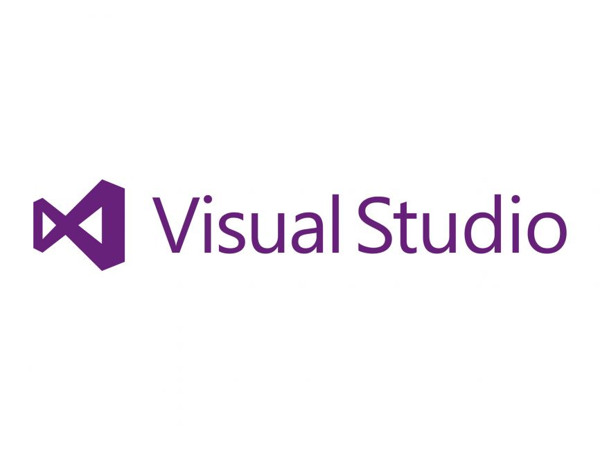

# Visual Studio Extension

> **Summary**
> 유용한 Visual Studio 익스텐션으로는 CodeMaid, GhostDoc Community, Viasfora, Image Optimizer, SonarLint, Output Enhancer, AWS Toolkit, MarkDown Editor v2, Rainbow Braces, IndentRainbow 등이 있으며, 각각 코드 정리, XML 주석 생성, 텍스트 편집기 색상 추가, 이미지 최적화, 코드 문제 감지, 출력 창 색상 추가, AWS 개발 지원, Markdown 편집 기능, 중괄호 색상화, 들여쓰기 구분 기능을 제공합니다.

---

> 💡 ****Code Made****
> 🔗 [https://marketplace.visualstudio.com/items?itemName=SteveCadwallader.CodeMaidVS2022](https://marketplace.visualstudio.com/items?itemName=SteveCadwallader.CodeMaidVS2022)
>
>

> ⭐ ****GhostDoc Community****
> 🔗 [https://marketplace.visualstudio.com/items?itemName=sergeb.GhostDoc](https://marketplace.visualstudio.com/items?itemName=sergeb.GhostDoc)
>
>

> 💡 ****Viasfora****
> 🔗 [https://marketplace.visualstudio.com/items?itemName=TomasRestrepo.Viasfora](https://marketplace.visualstudio.com/items?itemName=TomasRestrepo.Viasfora)
>
>

> 💡 ****image optimizer****
> 🔗 [https://marketplace.visualstudio.com/items?itemName=MadsKristensen.ImageOptimizer64bit](https://marketplace.visualstudio.com/items?itemName=MadsKristensen.ImageOptimizer64bit)
>
>

> 💡 ****SonarLint for Visual Studio 2022****
> 🔗 [https://marketplace.visualstudio.com/items?itemName=SonarSource.SonarLintforVisualStudio2022](https://marketplace.visualstudio.com/items?itemName=SonarSource.SonarLintforVisualStudio2022)
>
>

> ⭐ ****Output enhancer****
> 🔗 [https://marketplace.visualstudio.com/items?itemName=NikolayBalakin.Outputenhancer](https://marketplace.visualstudio.com/items?itemName=NikolayBalakin.Outputenhancer)
>
>

> 💡 ****Visual Studio 2022용 AWS 도구 키트****
> 🔗 [https://marketplace.visualstudio.com/items?itemName=AmazonWebServices.AWSToolkitforVisualStudio2022](https://marketplace.visualstudio.com/items?itemName=AmazonWebServices.AWSToolkitforVisualStudio2022)
>
>

> ⭐ **MarkDown Editor v2**
> 🔗 [https://marketplace.visualstudio.com/items?itemName=MadsKristensen.MarkdownEditor2](https://marketplace.visualstudio.com/items?itemName=MadsKristensen.MarkdownEditor2)
>
>

> 💡 **Rainbow Braces**
> 🔗 [https://marketplace.visualstudio.com/items?itemName=MadsKristensen.RainbowBraces](https://marketplace.visualstudio.com/items?itemName=MadsKristensen.RainbowBraces)
>
>

> 💡 ****IndentRainbow****
> 🔗 [https://marketplace.visualstudio.com/items?itemName=chingucoding.IndentRainbow](https://marketplace.visualstudio.com/items?itemName=chingucoding.IndentRainbow)
>
>

