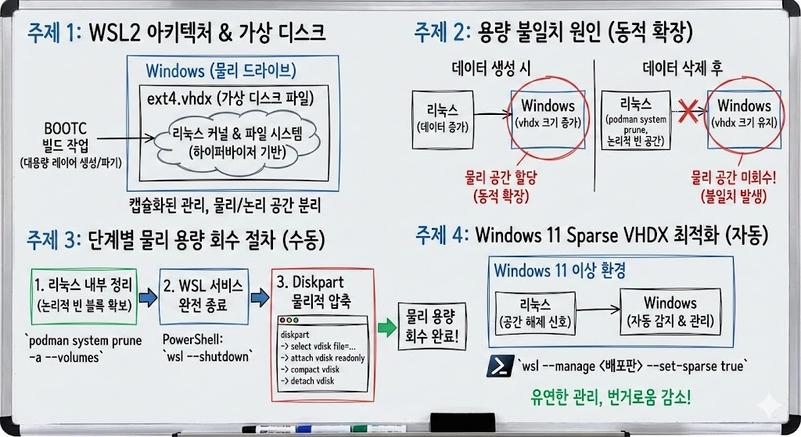

# WSL2 용량 왜 안줄어드냐? - Diskpart를 활용한 가상 디스크 압축방법

> **Summary**
> WSL2의 가상 디스크는 동적 확장 방식으로 설계되어 데이터 삭제 후에도 물리적 용량이 줄어들지 않는 문제가 발생한다. 이를 해결하기 위해 데이터 정리, WSL 서비스 종료, Diskpart를 통한 물리적 압축 절차를 따라야 한다. Windows 11 이상에서는 Sparse VHDX 기능을 통해 자동으로 물리적 용량을 관리할 수 있다.

---



## [주제 1: WSL2 아키텍처와 가상 디스크 도입 배경]

현대적인 컨테이너 기반 개발 환경인 BOOTC 빌드 작업은 대용량의 레이어를 수시로 생성하고 파기하는 특성을 가집니다. 이러한 작업 흐름을 지원하기 위해 도입된 WSL2는 기존의 WSL1과 달리 실제 리눅스 커널을 활용하는 하이퍼바이저 기반 가상화 방식을 채택하고 있습니다. 이 구조에서 리눅스 파일 시스템은 윈도우의 물리 드라이브에 직접 기록되는 대신, `ext4.vhdx`라는 가상 하드 디스크 파일 내에 캡슐화되어 관리됩니다. 이는 성능과 호환성 면에서 이점을 제공하지만, 저장 공간의 관리 측면에서는 윈도우 파일 시스템과 리눅스 파일 시스템 간의 분리를 초래하여 물리적 용량 점유 문제를 야기하는 배경이 됩니다.

## [주제 2: 가상 디스크의 동적 확장 구조와 용량 불일치 원인]

WSL2의 가상 디스크 파일(.vhdx)은 데이터 양에 따라 크기가 자동으로 늘어나는 동적 확장(Dynamic Expansion) 방식으로 설계되었습니다. 리눅스 내부에서 대규모 빌드 작업을 수행하여 데이터를 생성하면 윈도우는 그에 상응하는 물리 공간을 할당하여 파일 크기를 키웁니다. 그러나 리눅스 내부에서 `podman system prune` 등의 명령으로 데이터를 삭제하여 논리적 공간을 비우더라도, 윈도우 OS는 해당 가상 디스크 내부의 어떤 블록이 비워졌는지 실시간으로 인지하지 못합니다. 결과적으로 리눅스 내 가용 용량은 증가하지만 윈도우 상의 `.vhdx` 파일 크기는 축소되지 않는 물리적 공간의 불일치 현상이 발생하게 됩니다.

## [주제 3: 단계별 물리 용량 회수 절차 및 실행 방법]

점유된 물리 공간을 실제로 회수하기 위해서는 논리적 정리와 물리적 압축의 단계별 절차를 준수해야 합니다. 전체 프로세스는 가상 디스크 내부 정리, 서비스 종료, 물리적 압축의 순서로 진행됩니다.

### 1. 리눅스 내부 데이터 정리

가장 먼저 가상 디스크 내에서 제거 가능한 데이터를 모두 삭제하여 빈 블록을 최대로 확보해야 합니다. 터미널에서 다음 명령어를 실행하여 사용하지 않는 컨테이너와 캐시를 정리합니다.

```plain text
podman system prune -a --volumes
```

### 2. WSL 서비스의 완전한 종료

가상 디스크 파일을 수정하기 위해서는 해당 파일을 점유하고 있는 모든 프로세스를 중단해야 합니다. 윈도우 파워셸(PowerShell)에서 실행 중인 모든 WSL 인스턴스를 종료합니다.

```plain text
wsl --shutdown
```

### 3. Diskpart를 활용한 가상 디스크 압축

파일 시스템이 오프라인 상태가 되면 윈도우 내장 도구인 `diskpart`를 사용하여 실제 물리적 크기를 축소합니다. 아래는 관리자 권한으로 실행되는 표준 압축 절차입니다.

```plain text
# 디스크 관리 도구 진입
diskpart

# 대상 vhdx 파일 선택 (사용자 환경의 실제 경로 입력)
select vdisk file="C:\Users\<사용자명>\AppData\Local\Packages\...\ext4.vhdx"

# 가상 디스크를 읽기 전용으로 연결
attach vdisk readonly

# 물리적 압축 수행
compact vdisk

# 연결 해제 및 도구 종료
detach vdisk
exit
```

## [주제 4: Windows 11 환경의 Sparse VHDX 최적화 적용]

Windows 11 이상의 환경에서는 사용자가 매번 수동으로 압축을 수행하는 번거로움을 줄이기 위해 `Sparse VHDX` 기능을 제공합니다. 이 설정은 리눅스 파일 시스템에서 발생한 공간 해제 신호를 윈도우가 감지하여 물리적 용량을 보다 유연하게 관리하도록 돕습니다. 관리자 권한의 파워셸에서 대상 배포판을 지정하여 기능을 활성화할 수 있습니다.

```plain text
# 특정 배포판에 대해 sparse 설정 활성화 (예: Ubuntu)
wsl --manage <배포판이름> --set-sparse true
```

```plain text
# 예시 - Ubuntu-24.04 배포판에 대해 sparse 설정 적용
wsl --manage Ubuntu-24.04 --set-sparse true
```


