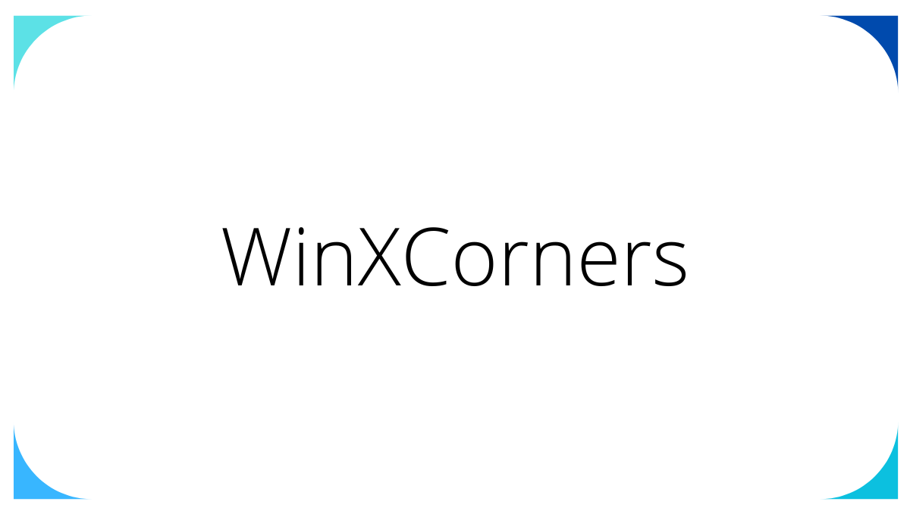
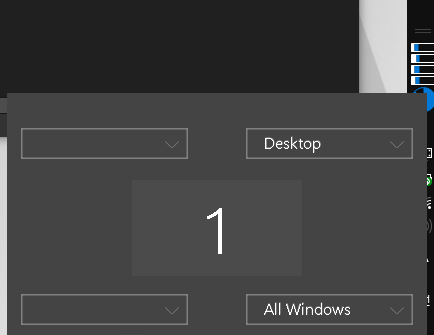

# WinXConers - 윈도우에서 핫코너 사용

> **Summary**
> 윈도우에서 핫코너 기능을 사용하여 트랙패드를 편리하게 활용할 수 있지만, 2019년 이후 업데이트가 중지되었고 다중 모니터는 지원되지 않습니다. 컴퓨터 시작 시 자동 실행 설정 방법도 안내합니다.

---



🔗 [https://apps.codigobit.info/2021/07/winxcorners-hot-corners-for-windows-10.html](https://apps.codigobit.info/2021/07/winxcorners-hot-corners-for-windows-10.html)



윈도우도 맥의 핫코너처럼 편리하게 트랙패드를 활용할 수 있다

하지만 업데이트는 2019년 베타 이후로 중지되었고, **다중모니터에선 지원하지 않으니** 단일 랩탑용으로 용이합니다


### 컴퓨터가 시작될때마다 자동으로 실행하게 설정해둡시다

🔗 [https://support.microsoft.com/ko-kr/windows/windows-10에서-시작할-때-자동으로-실행되는-앱-추가-150da165-dcd9-7230-517b-cf3c295d89dd](https://support.microsoft.com/ko-kr/windows/windows-10에서-시작할-때-자동으로-실행되는-앱-추가-150da165-dcd9-7230-517b-cf3c295d89dd)

```c
shell:startup
```

