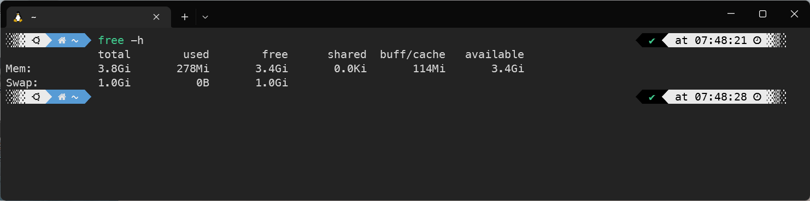
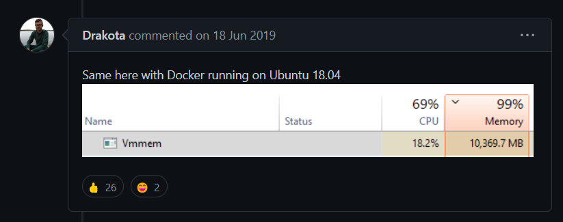

# Windows WSL2 Vmmem RAM 점유율 해결방법

> **Summary**
> WSL2의 Vmmem RAM 점유율 문제를 해결하기 위해, 사용자는 .wslconfig 파일을 생성하고 메모리 사용량을 설정할 수 있다. 기본적으로 WSL2는 RAM을 최대한 활용하는 리눅스의 특성으로 인해 과도한 메모리 점유가 발생하며, 이를 조정하기 위해 메모리 최대값을 설정하고 swap 기능을 관리하는 방법을 설명한다.

---


🔗 [https://xpectation.tistory.com/216](https://xpectation.tistory.com/216)

이 포스팅에서 살짝 언급한 WSL2는 램을 얼마나 잡아먹고 있는걸까?

작업 관리자에 표시되는 Vmmem 프로세스가 아마도 VmMemory를 뜻하는 것 같은데, 이 프로세스가 WSL2의 전부는 아니다. WSL2에서 잡아먹고 있는 램은 아래 명령어를 통해 확인 가능하다.

```plain text
$ free -h
```


보시다시피, 물리 메모리가 7.6GB, Swap기술을 통해 SSD에서 땡겨온 메모리가 2.0GB. 도합 8.6GB 되시겠다.

충격적인 사실은 used는 2.1GB밖에 되지 않는다는 점이다. 컴퓨터의 램 사용량이 95%를 찍으며 허덕이고 있는 와중에 4.9GB나 되는 램이 태업(?)하고 있는 셈.

따라서 이 망할 태업 RAM들을 손봐주는 방법에 대해 이야기 해보려한다.

## [**WSL2 RAM 사용량 최대값 설정하기**](https://xpectation.tistory.com/216#WSL-%--RAM%--%EC%--%AC%EC%-A%A-%EB%-F%--%--%EC%B-%-C%EB%-C%--%EA%B-%--%--%EC%--%A-%EC%A-%--%ED%--%--%EA%B-%B-)

WSL은 어디까지나 Windows의 하위 시스템이므로 WSL의 설정은 WSL이 아니라 Windows에서 이루어진다.

**C:\Users\<사용자>**

위 경로로 이동하여, **.wslconfig** 파일을 생성해주자. 맨 앞에 마침표(.)를 빼먹으면 안된다.

해당 파일을 열고 아래의 내용을 입력하자.

```shell
[wsl2]memory=4GB
```

앞서 살펴보았을 때, 실제 사용 RAM이 2.1GB 였다는 점에서 이 사용공간을 기준으로 2배 정도로 설정 해주었다. 아래는 위 설정을 해준 이후의 모습.



swap 기능은 SSD 용량을 땡겨와서 가상RAM으로 활용하는 기술인데, SSD 사용량이 증가하고 Read/Write 횟수가 많아진다는 단점은 있지만, 요즘은 SSD 기술이 많이 발전하여 일반적으로 많이 쓰이는 기술이라는 점에서 켜두었다. 또한, 4GB로 설정해둔 점이 그리 넉넉한 세팅은 아니라고 생각하기에 RAM이 갑작스럽게 부족해지면 예기치 못한 문제가 발생할 수 있다는 점에서 급할 때 땡겨쓸 수 있는 Swap 기능을 켜두었다.

만약 swap 기능을 끄고 싶다면, swap=0 을 한 줄 더 써주면 된다.

```shell
[wsl2]memory=4GBswap=0
```

## [**문제의 원인**](https://xpectation.tistory.com/216#%EB%AC%B-%EC%A-%-C%EC%-D%--%--%EC%-B%--%EC%-D%B-)

약간 순서가 거꾸로 되어버렸지만, 이 문제의 원인을 이야기 해보려 한다.

🔗 [https://github.com/microsoft/WSL/issues/4166](https://github.com/microsoft/WSL/issues/4166)

사실 이 문제는 WSL2를 이용하는 사람들에게는 꽤 유명한 이슈이다.

위 링크에 들어가면 아래과 같은 짤도 볼 수 있다.



나보다 더 하다.

이러한 미친듯한 메모리 점유는 WSL2의 특성과 리눅스의 특성이 묘하게 맞아 떨어지면서 발생한다.

- 리눅스 : RAM의 한계치까지 파일의 정보를 최대한 캐시로 보존함.
- WSL2 : WSL2에 할당된 RAM이 부족해지면 WSL2에 추가적인 RAM을 할당함.
그러니까 리눅스는 RAM을 한계치까지 꽉꽉 채워서 RAM을 십분 활용하는 녀석인데, WSL2는 또 거기에 오냐오냐 해주다보니 리눅스가 전체 시스템의 RAM을 잠식해버리는 현상이 발생하는 것이다.

