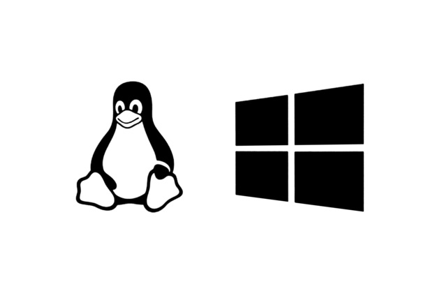

# Windows WSL2 초기세팅

> **Summary**
> 윈도우에서 WSL2를 설치하기 위해 PowerShell에서 "wsl --install" 명령어를 입력하고 컴퓨터를 재시작합니다. 설치 후, 리눅스에서 윈도우 파일에 접근할 수 있으며, 리눅스에서 생성한 파일은 윈도우에서 수정하지 않는 것이 좋습니다. 파이썬은 윈도우 스토어에서 설치할 수 있습니다.

---



🔗 [https://nomadcoders.co/windows-setup-for-developers](https://nomadcoders.co/windows-setup-for-developers)

🔗 [https://learn.microsoft.com/ko-kr/windows/wsl/install](https://learn.microsoft.com/ko-kr/windows/wsl/install)

🔗 [https://wikidocs.net/205061](https://wikidocs.net/205061)

🔗 [https://frenchline.tistory.com/18](https://frenchline.tistory.com/18)

## **WSL 설치 명령**

이제 단일 명령으로 WSL을 실행하는 데 필요한 모든 항목을 설치할 수 있습니다. 

**관리자** 모드에서 PowerShell 또는 Windows 명령 프롬프트를 마우스 오른쪽 단추로 클릭하고 "관리자 권한으로 실행"을 선택하여 열고 wsl --install 명령을 입력한 다음 컴퓨터를 다시 시작합니다.

```plain text
wsl --install
```

```javascript
wsl --set-default-version 2
```

### 다음 명령어로 설치된 우분투와 wsl버전을 확인할 수 있습니다

```shell
wsl --list --verbose
```

### 다음 명령어로 wsl 버전을 설정할 수 있습니다

```shell
wsl --set-default-version 2
```


# WSL2 설치 후

### 다음 명령어로 사용자의 윈도우로 접근할 수 있습니다

```shell
cd ~/../../mnt/c
```

리눅스에서 생성한 파일은 가급적 윈도우에서 수정하지말고, 리눅스한경에서만 수정합시다

추가로 프로젝트들은 윈도우에 저장하여 관리하는것을 권장합니다.


# 파이썬은 윈도우 스토어에서 설치해도 잘 작동합니다

🔗 [https://www.microsoft.com/store/productid/9NRWMJP3717K?ocid=pdpshare](https://www.microsoft.com/store/productid/9NRWMJP3717K?ocid=pdpshare)

