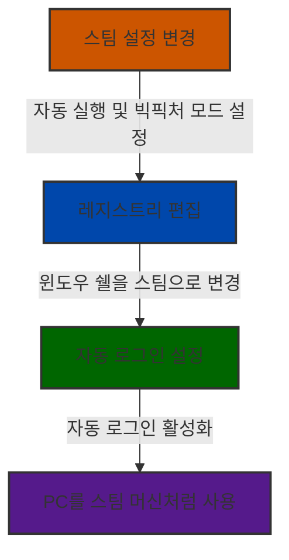

# Windows 를 steam머신으로 만들어보자

> **Summary**
> 윈도우 PC를 스팀 머신처럼 설정하는 방법에 대한 가이드로, 스팀 자동 실행, 빅픽처 모드 활성화, 윈도우 쉘 변경, 자동 로그인 설정을 포함합니다. 스팀 머신의 장점은 간편한 설정과 직관적인 인터페이스이며, 단점은 스팀 OS용 게임 부족입니다. 이러한 설정을 통해 PC 게임 경험을 향상시킬 수 있습니다.

---

[https://www.tumblr.com/bugbear5/135763151126/윈도우-pc를-스팀-머신으로-만들기](https://www.tumblr.com/bugbear5/135763151126/윈도우-pc를-스팀-머신으로-만들기)

비디오 게임기인 스팀 머신이 일반적인 컴퓨터와 다른 점은 바로 사용자 경험입니다. PC는 세팅하는데만해도 꽤 복잡한 과정이 필요합니다. 특히 PC에서의 게임을 하려면 하드웨어 부품, 드라이버, 운영체제 등 컴퓨터에 대한 상당한 지식이 없다면 하기 매우 어렵습니다. 더욱이 모니터 앞이 아니라 TV 앞에서 하는 게임이라면 PC에서는 더욱 힘듭니다.

스팀 머신은 이런 경험을 매우 간단하게 만들었는데요, 하드웨어를 사서 TV에 연결하고 스팀 아이디와 네트워크 정도만 잡아주면 모든게 끝납니다. 처음 세팅뿐 아니라 게임을 구동하는 것도 간단한데요, 스팀에 있는 빅픽쳐 인터페이스 덕분에 어제 밤에 하던 게임을 패드의 A 버튼을 두번 눌러서 바로 이어서 할 수 있습니다.

여러가지 장점이 있는 스팀머신이지만 아직 단점이라면 스팀 OS용으로 나오는 게임들이 많지 않다는 점입니다. 밸브에서 제작한 게임, 일부 인디 게임, 오래된 게임들이 있지만 아무래도 대작 게임들은 아직도 윈도용으로 많이 나오고 있습니다. 저도 사실 이런 이유 때문에 스팀 머신의 윈도 변종(?)인 에일리언 웨어 알파를 샀지요.

알파도 Hivemind UI라는, 티비에 적합한 인터페이스를 갖고 있지만 윈도 기반이기 때문에 사용자 경험이 완전히 편하지 않습니다. 스팀을 빅픽쳐로 구동할 수도 있지만 Hivemind UI 위에서 실행하기 때문에 뭔가 편하지 않습니다. 무엇보다도 Hivemind UI에서 걸어놓은 보안 정책 때문에 GTA5 같은 게임은 실행하지 못하기도 합니다.

전 이것을 해결하기 위해 Hivemind UI를 스팀 빅픽쳐로 대체하는 작업을 하기로 했습니다. 단순히 윈도 시작시 스팀을 자동 실행하게 하는 것이 아니라 윈도의 기본 쉘을 탐색기가 아니라 스팀으로 대체하는 것입니다. 이렇게 세팅을 해두면 스팀 머신과 거의 동일한 경험을 누릴 수 있습니다.

(만약 에일리언웨어 알파 사용자라면 정신 건강을 위해 원격 조종이나 키보드 연결을 권장합니다.)

(안전한 삽질을 위해 아래 설정은 새로운 윈도 사용자 계정을 만들어서 하실 것을 권장합니다.)

1. 가장 먼저 스팀을 실행하여 설정을 실행합니다.
1. 설정에 인터페이스 탭으로 이동하여 “컴퓨터를 시작할 때 Steam 자동 실행”과 “Big Picture 모드로 스팀 시작”을 클릭합니다.
1. 스팀 라이브러리에서 “스팀에 없는 게임 추가”를 클릭하여 explorer.exe 를 추가합니다.
1. 스팀을 종료한 다음 윈도키 + R을 클릭한 다음 regedit을 실행합니다.
1. 레지스트리 편집기가 실행되면 다음 키를 찾습니다.
`컴퓨터\HKEY_CURRENT_USER\SOFTWARE\Microsoft\Windows NT\CurrentVersion\Winlogon`

1. 해당 키에서 오른클릭한 다음 새 문자열을 클릭하여 “Shell”이란 값을 등록합니다.
1. Shell을 더블 클릭한 다음 값으로 스팀 실행 경로를 입력합니다. 예) "C:\Program Files (x86)\Steam\Steam.exe”
1. 여기까지하면 해당 계정으로 로그인할 때마다 스팀이 빅픽쳐 모드로 자동 실행됩니다만, 좀 더 완벽한 콘솔 경험을 위해 자동 로그인 세팅까지 해주면 완벽합니다.
1. 윈도키 + R을 눌러 실행 창을 띄운 다음 netplwiz 를 실행합니다.
1. 고급 사용자 설정 창이 실행되면 자동 로그인을 원하는 계정을 클릭한 다음 “사용자 이름과 암호를 입력해야 컴퓨터를 사용할 수 있음” 항목을 해제합니다.
1. 해당 항목을 해제하면 자동 로그인을 원하는 계정의 암호를 한번 더 입력해주어야 합니다.
1. 여기까지 하면 다음부터는 완벽하게 스팀을 기본 쉘로 실행하여 스팀 머신과 비슷한 경험으로 컴퓨터를 사용할 수 있게 됩니다.
1. 만약 다시 데스크탑 인터페이스로 사용하고 싶다면 아까 3번에서 등록시켰던 explorer.exe를 실행한 다음, 빅픽쳐 모드를 종료하면 됩니다. 영구적으로 데스크탑 인터페이스를 사용하고 싶다면 5번에서 등록했던 Shell 값을 삭제해주시면 됩니다.
스팀을 기본 쉘로 사용할 경우 윈도 인터페이스 구동에 사용되는 자원까지 끌어모아 게임 실행에 사용할 수 있다는 장점이 있습니다. 윈도 인터페이스가 자원을 얼마나 소모할까 싶지만 PC가 저사양일수록 게임 프레임에 눈에 띄는 영향을 미칩니다.

윈도 10으로 오면서 이렇게 쓰는 것의 또 다른 장점은 엑박 패드의 가이드 버튼을 스팀에서 사용할 수 있다는 점입니다. 윈도 10은 엑박 패드 연결시 가이드 버튼(중앙의 엑박 버튼)을 누르면 엑스 박스 지원 기능이 실행되는데요, 스팀을 기본 쉘로 사용하고 있으면 엑스박스 앱이 실행되는 대신에 스팀의 Overlay가 실행됩니다.

또한 Alt Tab을 눌러도 스팀 외에 다른 것들이 실행되지 않기 때문에 게임의 집중도가 높아지는 것도 장점입니다. 무엇보다 PC 게임을 즐기기가 훨씬 간편해진다는 장점이 있죠. 바로가기로 Kodi(구 XBMC) 같은 것을 등록해두면 동영상이나 음악 같은 미디어도 어느정도 해결할 수 있습니다.

# 스팀 머신과 유사한 PC 게임 환경 구축하기

## 스팀 머신의 장점

스팀 머신은 일반 PC와 달리 사용자 경험에 초점을 맞춘 게임 전용 기기입니다. 다음과 같은 장점이 있습니다:

1. 간편한 설정
1. TV 연결 최적화
1. 직관적인 인터페이스
1. 빠른 게임 실행
> [!note]
스팀 머신은 하드웨어 연결과 네트워크 설정만으로 바로 사용할 수 있어 매우 편리합니다.

## 스팀 머신의 한계

그러나 스팀 머신에도 한계가 있습니다:

- 스팀 OS용 게임 부족
- 대작 게임의 윈도우 종속성
이러한 이유로 일부 사용자들은 에일리언웨어 알파와 같은 윈도우 기반 대안을 선택합니다.

## PC를 스팀 머신처럼 만들기

윈도우 PC를 스팀 머신과 유사한 환경으로 구성할 수 있습니다. 주요 단계는 다음과 같습니다:

1. 스팀 자동 실행 설정
1. 빅픽처 모드 활성화
1. 윈도우 쉘 변경
1. 자동 로그인 설정
### 단계별 가이드

### 1. 스팀 설정 변경

1. 스팀 실행 후 설정으로 이동
1. 인터페이스 탭에서 다음 옵션 활성화:
  - "컴퓨터를 시작할 때 Steam 자동 실행"
  - "Big Picture 모드로 스팀 시작"
1. 스팀 라이브러리에 `explorer.exe` 추가
### 2. 레지스트리 편집

1. `regedit` 실행
1. `HKEY_CURRENT_USER\\Software\\Microsoft\\WindowsNT\\CurrentVersion\\Winlogon` 경로로 이동
1. 새 문자열 값 "Shell" 생성
1. "Shell" 값에 스팀 실행 경로 입력 (예: `"C:\\Program Files (x86)\\Steam\\Steam.exe"`)
### 3. 자동 로그인 설정

1. `netplwiz` 실행
1. 원하는 계정 선택
1. "사용자 이름과 암호를 입력해야 컴퓨터를 사용할 수 있음" 옵션 해제
1. 계정 암호 입력하여 확인
> [!warning]
안전한 설정을 위해 새로운 윈도우 사용자 계정을 만들어 진행하는 것이 좋습니다.

## 스팀 기본 쉘 사용의 장점

| 장점 | 설명 |
| 자원 효율 | 윈도우 인터페이스 구동 자원을 게임에 활용 |
| 패드 호환성 | 엑스박스 패드의 가이드 버튼을 스팀에서 사용 가능 |
| 집중도 향상 | Alt+Tab 시 다른 프로그램 노출 최소화 |
| 편의성 | PC 게임 실행 및 관리가 간편해짐 |

### 미디어 재생 팁

> [!tip]
Kodi(구 XBMC)를 스팀에 등록하면 동영상과 음악 재생도 쉽게 할 수 있습니다.

이렇게 설정하면 PC를 스팀 머신과 유사한 환경으로 사용할 수 있어, 편리하고 몰입도 높은 게임 경험을 즐길 수 있습니다.

