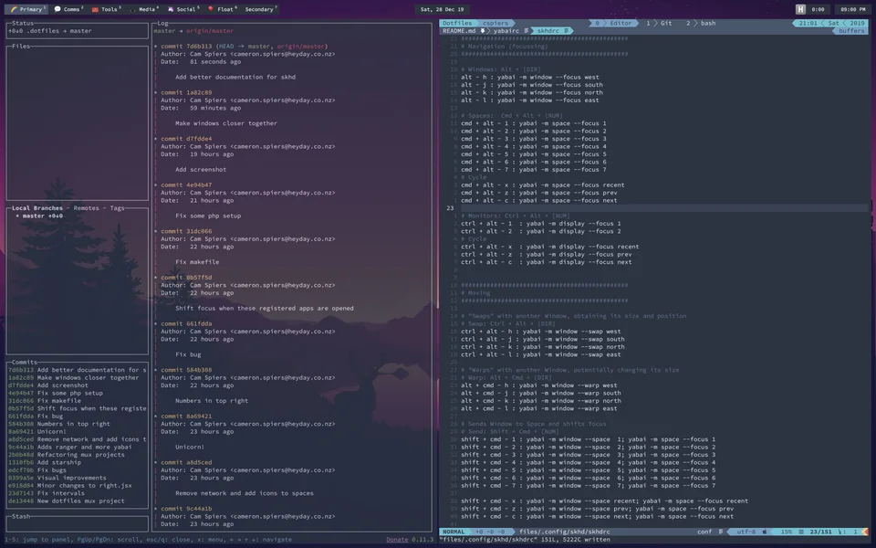

# Yabai 맥용 i3

> **Summary**
> Yabai는 Mac에서 타일링 창 관리자를 사용하는 방법에 대한 가이드를 제공하며, 관련 링크와 리소스가 포함되어 있습니다.

---

🔗 [https://github.com/koekeishiya/yabai](https://github.com/koekeishiya/yabai)

🔗 [https://www.youtube.com/watch?v=k94qImbFKWE](https://www.youtube.com/watch?v=k94qImbFKWE)

