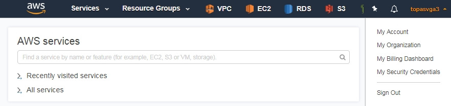
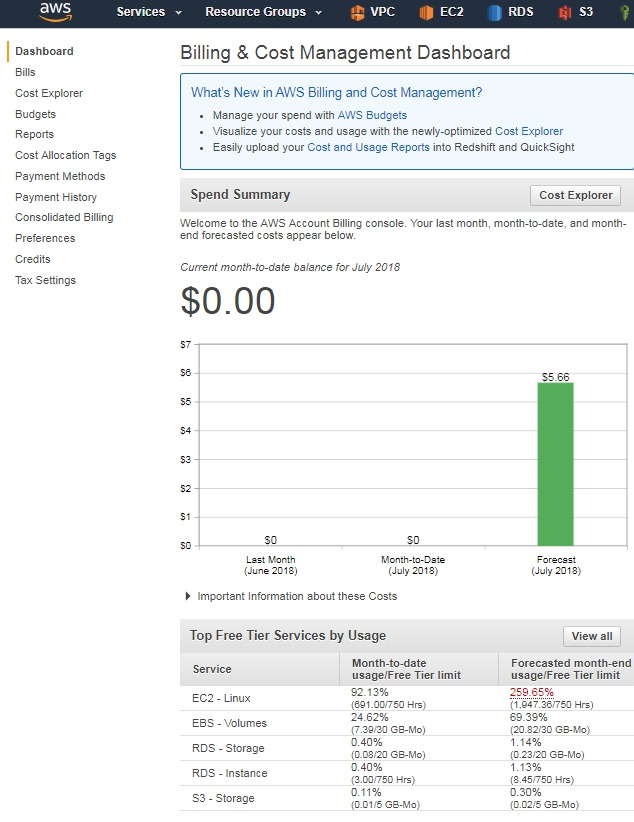
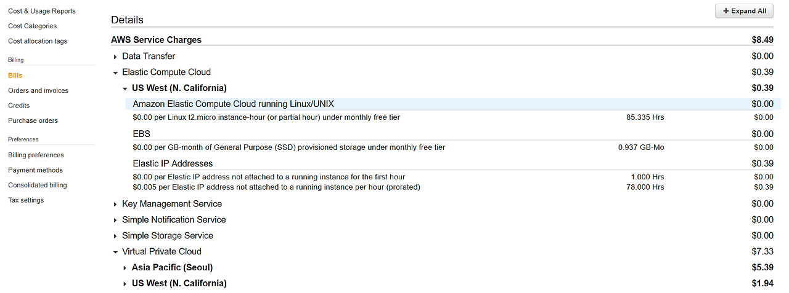

# aws 비용 폭탄 방지

> **Summary**
> AWS에서 사용하지 않는 인스턴스와 계정은 반드시 삭제해야 하며, 비용 발생을 방지하기 위해 청구서를 정기적으로 확인하고, 필요 없는 리소스는 삭제해야 합니다. 또한, 계정 해킹 방지를 위해 구글 OTP 설정과 비용 알림 설정이 필요합니다.

---

🔗 [https://brunch.co.kr/@topasvga/342](https://brunch.co.kr/@topasvga/342)

### 아래 내용은 개인적으로 정리한 내용이라 틀릴수 있습니다.

### 무조건 지워라!!!!

야간에도 비용이 발생한다.

공부하겠다고 남겨두지 마라. 사용할떄 다시 만들어도 된다.

무조건 지워라. 이후 사용할때 만들어라!!!

AWS는  1년간  일정 용량만 무료이다.

그래서,  삭제하지 않으면 다음 달에 요금이 나와버린다.

사용하지 않는 AWS Accountid는 삭제하고 비용 나오지 않도록 하라~

비용 나가서 마음 고생하지 마세요. 진심~!

### <1> 어디서 비용이 나가고 있을까?

### <2> 가장 중요한 것!!! Bills 확인하라. 청구서

### <3> 사용하지 않는 계정은 아예 삭제하라.

### <4> 삭제해야 할 것들

### <5> VPC 지우기

### <6> 다 지웠다고 생각하는데 안 지워지는 경우 ENI에서 확인하라.

### <7> 네트워크 VPC에 서버(EC2)가 있다면 VPC가 지워지지 않는다.

### <8> NATGW 삭제 , 로드 밸런서 삭제, EIP 삭제하기

### <9> S3 삭제하기

### <10> DB 생성했다면 RDS에서 DB 삭제하라.

### <11> 이미지 복사본 AMI를 만들었다면 EC2- AMI에서 삭제하라.

### <12> ECR도 삭제하라.

### <13> 일정 금액 이상 나오면 메일 노티를 받을 수 있도록 설정하자.

### <14> 계정이 해킹당해 내 통장에서 돈이 빠져나가지 않도록 [구글 OTP] 설정하자.

### <15> AZ 간 통신도 돈 나간다.

### <16> 요금 폭탄 피하는 법

### <1> 어디서 비용이 나가고 있을까?

### 1

### 회면 오른쪽 위에 계정을 리스트업 하면, [My Bliiling Dashboard]에서 확인하라.

다음 달에 나올 예상 금액이 나오며, 어떤 부분에서 과금될 예정인지 표시된다.

### 2

### 아래처럼 EC2 서버를 여러 개 생성해서 기본 무료 용량을 초과했기 때문에 발생하는 것이다.

### 사용하지 않는 EC2 서버를 삭제하도록 한다.

### <2> 가장 중요한 것!!! Bills 확인하라. 청구서

### 1

### 실제 카드에서 나가는 돈이다!!!

### (크래딧도 포함해 처리되고, 실제 내가 내는 돈이다. 크래딧 있다고 안심말자!)

### 어디서 돈이 빠져나가는지 보인다.

### 어느 리전에 어떤 서비스로 돈이 나가는지 보인다.

### 가서 지워라 ~

### EBS스냅셧으로 비용이 나오는 것이다.

### 꼭 필요한 게 아니면 지워라~

### 2

### 오늘쓴 비용은 다음날 나온다.

### 안지운 리소스가 남아있다면 오늘 비용과 내일 비용이 틀리다.

### 며칠간은 매일 비용 확인을 해야 한다.

### 특히, AWS 고객센터에 환불요청하는 경우 1순위가 남은 리소스 모두 지우라고 가이드 받는다.

### 몇몇 서비스는 알려주지만, 그래도 남은 서비스가 있을수 있어 비용이 계속 나올수 있다.

### 내가 모두 확인해 지워야 한다.

### <3> 사용하지 않는 계정은 아예 삭제하라.

### 1

계정을 최소화하라. 사용하지 않는  AWS 계정은 아예 삭제하라.

매일 로그온해 비용 확인을 하라.

안 쓰는 리소스는 모두 지워라.

리소스는 중지해놔도 스토리지는 사용돼서 돈이 나갑니다.

### 2

### 리소스를 모두 삭제하지 않고, AWS계정 탈퇴를 하면 탈퇴 기간 동안 비용이 계속 나올 수 있다.

이 경우 다시 계정 복구 후 리소스를 모두 지운 후 탈퇴하라.

그래서 반드시 리소스를 지워야 한다.

매일 초(3일) 경  카드 요금이 나간다. - -

미리 점검하자!!

### 3

### 해지 신청한 계정도 해지가 완료되기 전까지 결제가 되니 반드시 리소스를 지워야 한다.

### [https://aws.amazon.com/ko/premiumsupport/knowledge-center/closed-account-bill/](https://aws.amazon.com/ko/premiumsupport/knowledge-center/closed-account-bill/)

[해지한 AWS 계정에 대한 결제 이해](https://aws.amazon.com/ko/premiumsupport/knowledge-center/closed-account-bill/)[aws.amazon.com](https://aws.amazon.com/ko/premiumsupport/knowledge-center/closed-account-bill/)

### <4> 삭제해야 할 것들 매일 체크하라.

### 1

### 삭제할 것.

### 1. VPC 지우기

### 2. EC2 지우기

