# aws 비용 폭탄 방지

> **Summary**
> AWS에서 사용하지 않는 인스턴스와 계정은 반드시 삭제해야 하며, 비용 발생을 방지하기 위해 청구서를 정기적으로 확인하고, 필요 없는 리소스는 삭제해야 합니다. 또한, 계정 해킹 방지를 위해 구글 OTP 설정과 비용 알림 설정이 필요합니다.

---

🔗 [https://brunch.co.kr/@topasvga/342](https://brunch.co.kr/@topasvga/342)

### 아래 내용은 개인적으로 정리한 내용이라 틀릴수 있습니다.

### 무조건 지워라!!!!

야간에도 비용이 발생한다.

공부하겠다고 남겨두지 마라. 사용할떄 다시 만들어도 된다.

무조건 지워라. 이후 사용할때 만들어라!!!

AWS는  1년간  일정 용량만 무료이다.

그래서,  삭제하지 않으면 다음 달에 요금이 나와버린다.

사용하지 않는 AWS Accountid는 삭제하고 비용 나오지 않도록 하라~

비용 나가서 마음 고생하지 마세요. 진심~!

### <1> 어디서 비용이 나가고 있을까?

### <2> 가장 중요한 것!!! Bills 확인하라. 청구서

### <3> 사용하지 않는 계정은 아예 삭제하라.

### <4> 삭제해야 할 것들

### <5> VPC 지우기

### <6> 다 지웠다고 생각하는데 안 지워지는 경우 ENI에서 확인하라.

### <7> 네트워크 VPC에 서버(EC2)가 있다면 VPC가 지워지지 않는다.

### <8> NATGW 삭제 , 로드 밸런서 삭제, EIP 삭제하기

### <9> S3 삭제하기

### <10> DB 생성했다면 RDS에서 DB 삭제하라.

### <11> 이미지 복사본 AMI를 만들었다면 EC2- AMI에서 삭제하라.

### <12> ECR도 삭제하라.

### <13> 일정 금액 이상 나오면 메일 노티를 받을 수 있도록 설정하자.

### <14> 계정이 해킹당해 내 통장에서 돈이 빠져나가지 않도록 [구글 OTP] 설정하자.

### <15> AZ 간 통신도 돈 나간다.

### <16> 요금 폭탄 피하는 법

### <1> 어디서 비용이 나가고 있을까?

### 1

### 회면 오른쪽 위에 계정을 리스트업 하면, [My Bliiling Dashboard]에서 확인하라.

다음 달에 나올 예상 금액이 나오며, 어떤 부분에서 과금될 예정인지 표시된다.

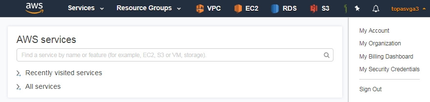

### 2

### 아래처럼 EC2 서버를 여러 개 생성해서 기본 무료 용량을 초과했기 때문에 발생하는 것이다.

### 사용하지 않는 EC2 서버를 삭제하도록 한다.

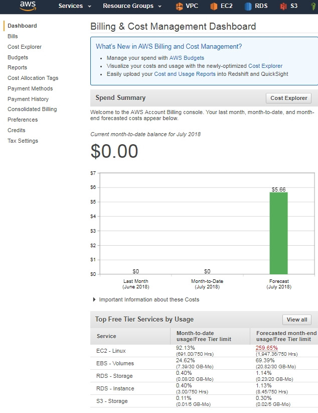

### <2> 가장 중요한 것!!! Bills 확인하라. 청구서

### 1

### 실제 카드에서 나가는 돈이다!!!

### (크래딧도 포함해 처리되고, 실제 내가 내는 돈이다. 크래딧 있다고 안심말자!)

### 어디서 돈이 빠져나가는지 보인다.

### 어느 리전에 어떤 서비스로 돈이 나가는지 보인다.

### 가서 지워라 ~

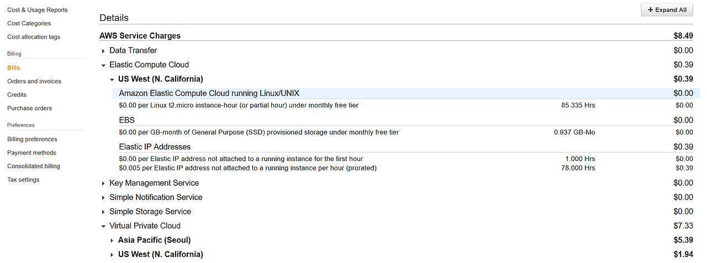

### EBS스냅셧으로 비용이 나오는 것이다.

### 꼭 필요한 게 아니면 지워라~

### 2

### 오늘쓴 비용은 다음날 나온다.

### 안지운 리소스가 남아있다면 오늘 비용과 내일 비용이 틀리다.

### 며칠간은 매일 비용 확인을 해야 한다.

### 특히, AWS 고객센터에 환불요청하는 경우 1순위가 남은 리소스 모두 지우라고 가이드 받는다.

### 몇몇 서비스는 알려주지만, 그래도 남은 서비스가 있을수 있어 비용이 계속 나올수 있다.

### 내가 모두 확인해 지워야 한다.

### <3> 사용하지 않는 계정은 아예 삭제하라.

### 1

계정을 최소화하라. 사용하지 않는  AWS 계정은 아예 삭제하라.

매일 로그온해 비용 확인을 하라.

안 쓰는 리소스는 모두 지워라.

리소스는 중지해놔도 스토리지는 사용돼서 돈이 나갑니다.

### 2

### 리소스를 모두 삭제하지 않고, AWS계정 탈퇴를 하면 탈퇴 기간 동안 비용이 계속 나올 수 있다.

이 경우 다시 계정 복구 후 리소스를 모두 지운 후 탈퇴하라.

그래서 반드시 리소스를 지워야 한다.

매일 초(3일) 경  카드 요금이 나간다. - -

미리 점검하자!!

### 3

### 해지 신청한 계정도 해지가 완료되기 전까지 결제가 되니 반드시 리소스를 지워야 한다.

### [https://aws.amazon.com/ko/premiumsupport/knowledge-center/closed-account-bill/](https://aws.amazon.com/ko/premiumsupport/knowledge-center/closed-account-bill/)

[해지한 AWS 계정에 대한 결제 이해](https://aws.amazon.com/ko/premiumsupport/knowledge-center/closed-account-bill/)[aws.amazon.com](https://aws.amazon.com/ko/premiumsupport/knowledge-center/closed-account-bill/)

### <4> 삭제해야 할 것들 매일 체크하라.

### 1

### 삭제할 것.

### 1. VPC 지우기

### 2. EC2 지우기

### 3. EIP 삭제하기

### 4. S3 삭제하기

### 5. DB 생성했다면 RDS에서 DB삭제, 스냅숏 삭제 (필수)

### 6. 이미지 복사본 AMI를 만들었다면 EC2- AMI에서 삭제 하기

### 7. 사용하지 않는 AWS 계정은 아예 삭제하라.

### 2

### 매일 체크할 것

### [https://brunch.co.kr/@topasvga/2186](https://brunch.co.kr/@topasvga/2186)

[610. AWS 리소스 삭제하기-2022](https://brunch.co.kr/@topasvga/2186)[비용 발생 중 것 확인하고 지우기 매일 확인하기 <1> 비용 발생 중 것 확인하기? <2> 삭제 하기 <1> 비용 발생 중 것 확인하기? 1 AWS콘솔 로그인 https://console.aws.amazon.com/ 2 오른쪽 위 본인 계정 클릭 Bi](https://brunch.co.kr/@topasvga/2186)[brunch.co.kr/@topasvga/2186](https://brunch.co.kr/@topasvga/2186)

### <5> VPC 지우기

### 1

### VPC를 지우려 하면 연관된 서버 등 삭제해야 할 것을 알 수 있다.

[VPC] 클릭

[See All regions]을 눌러  어느 지역에 VPC를 만들었는지 확인한다.

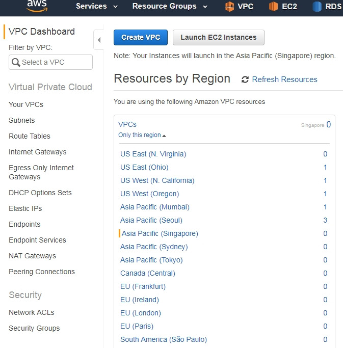

### 2

### US East(Ohio) 옆에 [1]이라는 숫자를 클릭해서 해당 지역의 네트워크를 지워보자.

지우고자 하는 네트워크 부분인  체크되도록 한다.

만들어놓은  VPC를 지우기 위해   [Actions ]에

[Delete VPC]를 클릭해 삭제한다.

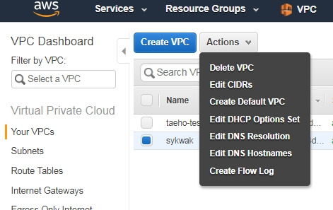

### 1) I acknowledge that i want to delete my default VPC를 [체크]하고

### 2) [ Yes, Delete]를 누르면 만들어진 서브넷, 보안 그룹 등등 같이 삭제된다.

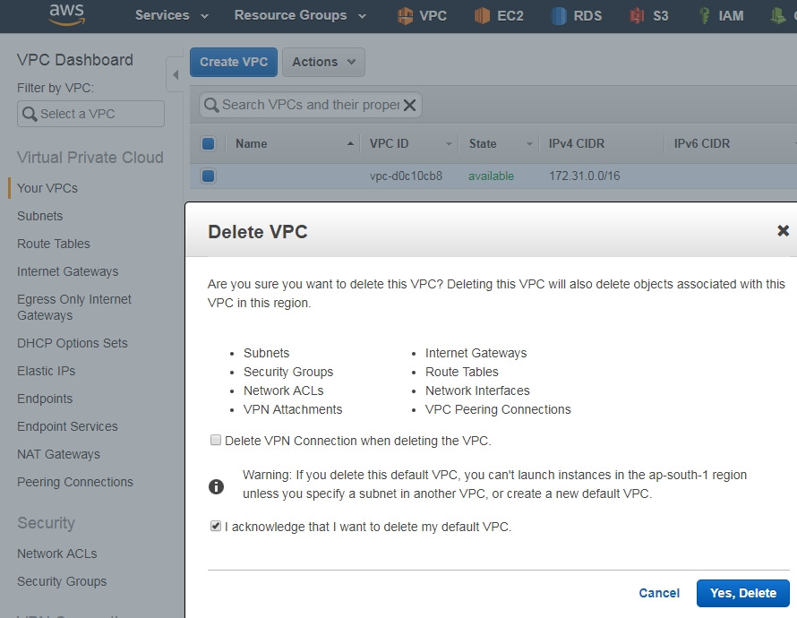

### 3

### VPC 삭제 시 종속성 문제 해결

### [https://aws.amazon.com/ko/premiumsupport/knowledge-center/troubleshoot-dependency-error-delete-vpc/](https://aws.amazon.com/ko/premiumsupport/knowledge-center/troubleshoot-dependency-error-delete-vpc/)

[VPC 삭제 시 발생하는 종속성 오류 문제 해결](https://aws.amazon.com/ko/premiumsupport/knowledge-center/troubleshoot-dependency-error-delete-vpc/)[aws.amazon.com](https://aws.amazon.com/ko/premiumsupport/knowledge-center/troubleshoot-dependency-error-delete-vpc/)

### <6> 다 지웠다고 생각하는데 안 지워지는 경우 ENI에서 확인하라.

### 1

### VPC > Network Interface 가서 확인하라.

### ENI 설명에 있다.

### 어떤 서비스에서 ENI를 쓰고 있는지 확인하라.

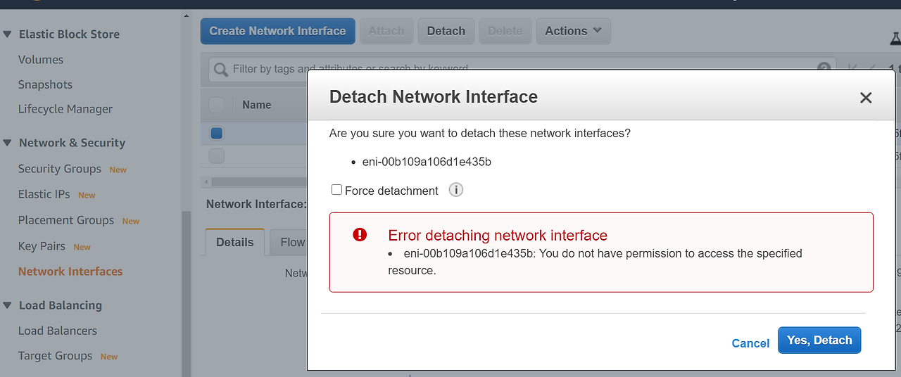

### 2

### 예)

### 안 지워지는 원인을 찾았다.

### ENI 설명에 있다

directory 서비스 삭제 후 VPC삭제가 가능했다.

언제 사용했었는지 directory 서비스를 쓰고 있었다.

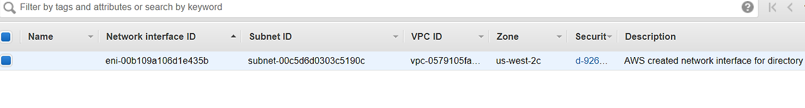

### 3

### 참고

### [https://docs.aws.amazon.com/AWSEC2/latest/UserGuide/using-eni.html](https://docs.aws.amazon.com/AWSEC2/latest/UserGuide/using-eni.html)

[Elastic network interfaces - Amazon Elastic Compute Cloud](https://docs.aws.amazon.com/AWSEC2/latest/UserGuide/using-eni.html)[docs.aws.amazon.com](https://docs.aws.amazon.com/AWSEC2/latest/UserGuide/using-eni.html)

### <7> 네트워크 VPC에 서버(EC2)가 있다면 VPC가 지워지지 않는다.

### 1

### 서버(EC2)를 모두 지워야 네트워크(VPC)를 지울 수 있다.

VPC자체는 비용이 발생되지 않는다.

하지만  NATGateway는 비용이 발생한다.

그래서 VPC자체를 지우는것인다.

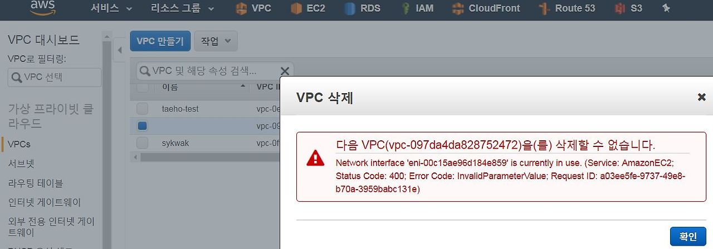

### 2

### 해외 리전의 경우

Click here to view your instances를 클릭해보면 어떤 서버가 생성되어 있는지 확인 가능하다.

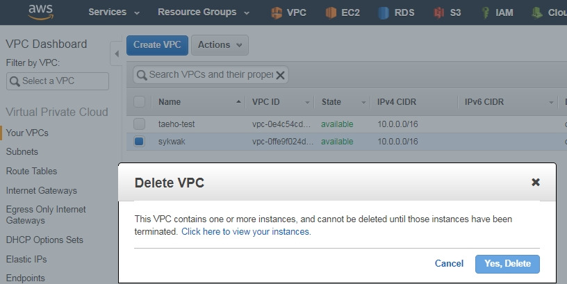

### 3

### 사용하는 않는 서버 EC2를 반드시 지워야 한다.

[EC2]를 클릭하면  생성되어 운영 중인 서버 EC2 숫자가 보인다.

3 Running Instances   <- 3개가 돌아가고 있네요.

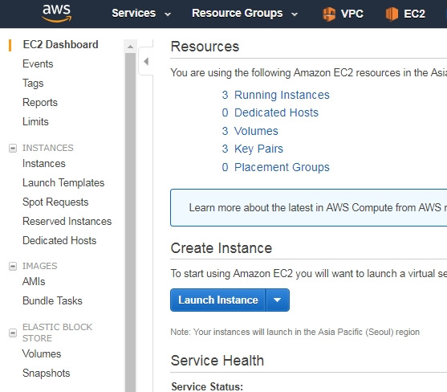

### 4

### 삭제법

### 1) [EC2] 클릭 [Instaces] 클릭하고 삭제하고자 하는 인스턴스를 체크한다.

### 2) [Actions]-> [Instance State]- [Terminate]를 클릭해서 삭제한다.

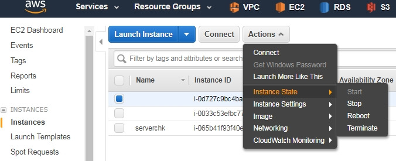

### 삭제하겠냐고 묻는다.

Yes, terminate 하고  서버 EC2를 삭제하면 된다.

서버를 삭제하면 서버에 데이터를 복구할 수 없으니 주의하기 바란다.

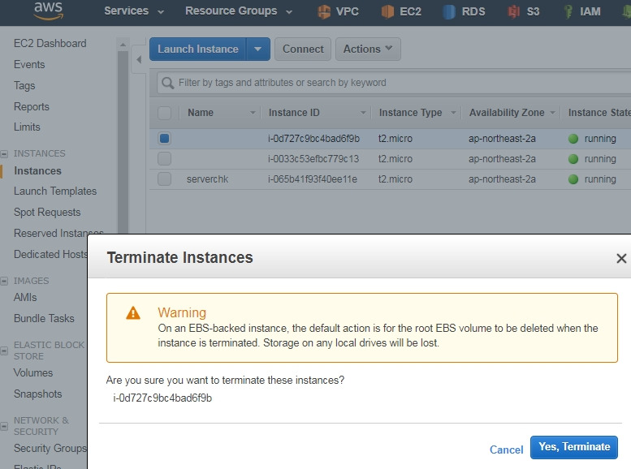

### <8> NATGW 삭제 , 로드 밸런서 삭제, EIP 삭제하기

### 할당받고 사용하지 않으면 과금된다.

할당받고 사용하면 비용이 발생되지 않는다.

### 1

### NATGW 삭제한다. > EIP 삭제한다.

### 2

### EC2 > 로드 밸런서 삭제 > 타깃 그룹 로드 밸런서 삭제 삭제 > EIP 삭제로 진행한다.

### <9> S3 삭제하기

### 1

### 스토리지 S3를 테스트하고 삭제하는 법이다.

### 2

### [S3] 클릭

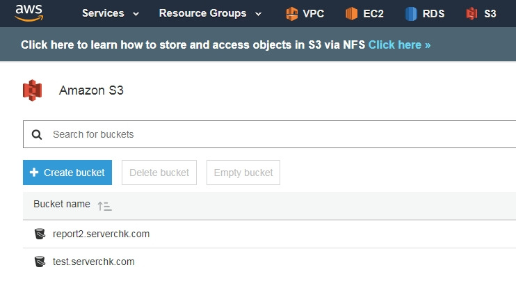

### 위처럼 2개의 S3를 만들어 놓은 것이 보인다.

### 왼편 쓰레기통 모양을 클릭하고 삭제한다. Delete Bucket 클릭해서 삭제한다.

### 3

### 해당 버킷 이름을 넣어야 삭제가 가능하다.

report2.serverchk.com  버킷을 삭제하고자 하는 것이라면 해당 버킷 이름(도메인)을 입력한다.

스토리지 데이터는 중요 데이터가 많으므로  한번 더 확인하고 삭제하기 위해 버킷 이름을 요구한다.

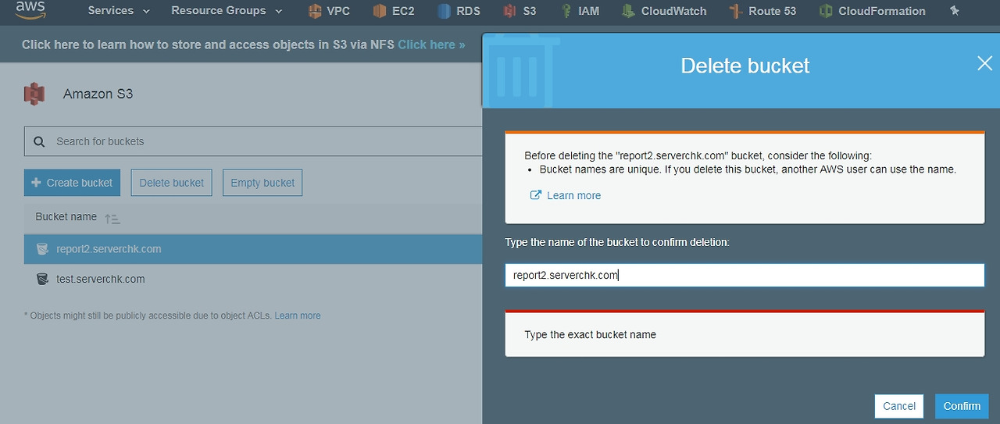

### 혹, S3 삭제가 안된다고 오류가 뜨는 경우는 S3 버킷 안에 데이터를 모두 지워야 삭제가 된다.

S3 버킷 안에 데이터를 모두 지운 후 다시 삭제 시도하라.

### <10> DB 생성했다면 RDS에서 DB 삭제하라.

Slave부터 삭제가 가능하다.

이후 Master 삭제하라.

EC2에서 스냅숏도 삭제하라.

### <11> 이미지 복사본 AMI를 만들었다면 EC2- AMI에서 삭제하라.

### AMI도 삭제하자.

### <12> ECR도 삭제하라.

### 1

### ECR console at [https://console.aws.amazon.com/ecr/repositories](https://console.aws.amazon.com/ecr/repositories)

[console.aws.amazon.com](https://console.aws.amazon.com/ecr/repositories)[console.aws.amazon.com](https://console.aws.amazon.com/ecr/repositories)

### 2

### Region 선택

### 3

### Repositories

### 4

### Private tab , Delete.

### <13> 일정 금액 이상 나오면 메일 노티를 받을 수 있도록 설정하자.

이 기능을 이용하여  0.1달러 정도 100원이라도  나오면 메일로 인지가 되도록

설정하는 법도 참고해 설정하기 바란다.

### [https://brunch.co.kr/@topasvga/96](https://brunch.co.kr/@topasvga/96)

### <14> 계정이 해킹당해 내 통장에서 돈이 빠져나가지 않도록 [구글 OTP] 설정하자.

반드시 구글 OTP설정을 하여  계정 해킹당하지 않도록 설정해서 사용하기 바란다.

### [https://brunch.co.kr/@topasvga/95](https://brunch.co.kr/@topasvga/95)

### <15> AZ 간 통신도 돈 나간다.

돈 나가는 경우이다.

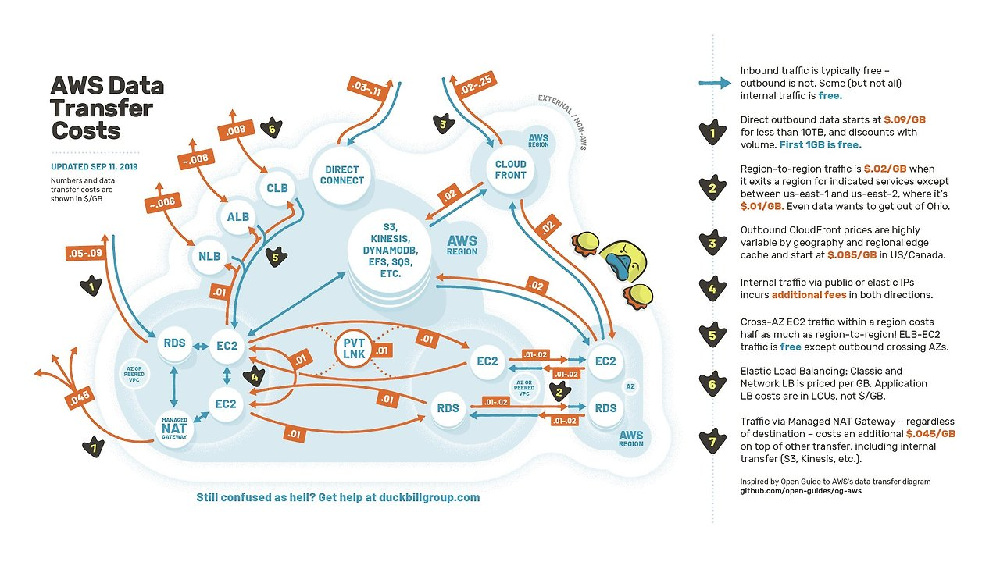

### [https://aws.amazon.com/ko/premiumsupport/knowledge-center/vpc-reduce-nat-gateway-transfer-costs/](https://aws.amazon.com/ko/premiumsupport/knowledge-center/vpc-reduce-nat-gateway-transfer-costs/)

[NAT 게이트웨이 데이터 전송 비용 절감](https://aws.amazon.com/ko/premiumsupport/knowledge-center/vpc-reduce-nat-gateway-transfer-costs/)[aws.amazon.com](https://aws.amazon.com/ko/premiumsupport/knowledge-center/vpc-reduce-nat-gateway-transfer-costs/)

### <16> 요금 폭탄 피하는 법

### 1

### [https://brunch.co.kr/@topasvga/840](https://brunch.co.kr/@topasvga/840)

[205.(추천) AWS 요금폭탄 피하는 법,환불 요청](https://brunch.co.kr/@topasvga/840)[본 내용은 개인적인 의견이라 내용이 틀릴수 있습니다~ AWS 공식적인 내용은 아니므로 참고로만 보기 바란다. 다음은 AWS 요금폭탄을 피하는 방법이다. <1> 지금 바로 해야 하는 것 <2> 요금 폭탄이](https://brunch.co.kr/@topasvga/840)[brunch.co.kr/@topasvga/840](https://brunch.co.kr/@topasvga/840)

### 2

### AWS공식 가이드

### [https://aws.amazon.com/ko/premiumsupport/knowledge-center/free-tier-charges/](https://aws.amazon.com/ko/premiumsupport/knowledge-center/free-tier-charges/)

[AWS 프리 티어 사용 시 요금 청구 방지](https://aws.amazon.com/ko/premiumsupport/knowledge-center/free-tier-charges/)[aws.amazon.com](https://aws.amazon.com/ko/premiumsupport/knowledge-center/free-tier-charges/)

### 3

### [https://aws.amazon.com/ko/premiumsupport/knowledge-center/charges-from-unknown-account/](https://aws.amazon.com/ko/premiumsupport/knowledge-center/charges-from-unknown-account/)

[알 수 없는 요금과 연결된 AWS 계정 찾기](https://aws.amazon.com/ko/premiumsupport/knowledge-center/charges-from-unknown-account/)[aws.amazon.com](https://aws.amazon.com/ko/premiumsupport/knowledge-center/charges-from-unknown-account/)

### 4

### [https://cafe.naver.com/dnspro](https://cafe.naver.com/dnspro)

[Cloud 전문가 카페 : 네이버 카페](https://cafe.naver.com/dnspro)[Cloud 전문가가 되기 위한 사람들의 모임입니다.](https://cafe.naver.com/dnspro)[cafe.naver.com](https://cafe.naver.com/dnspro)

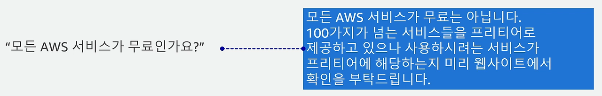

### 감사합니다.

