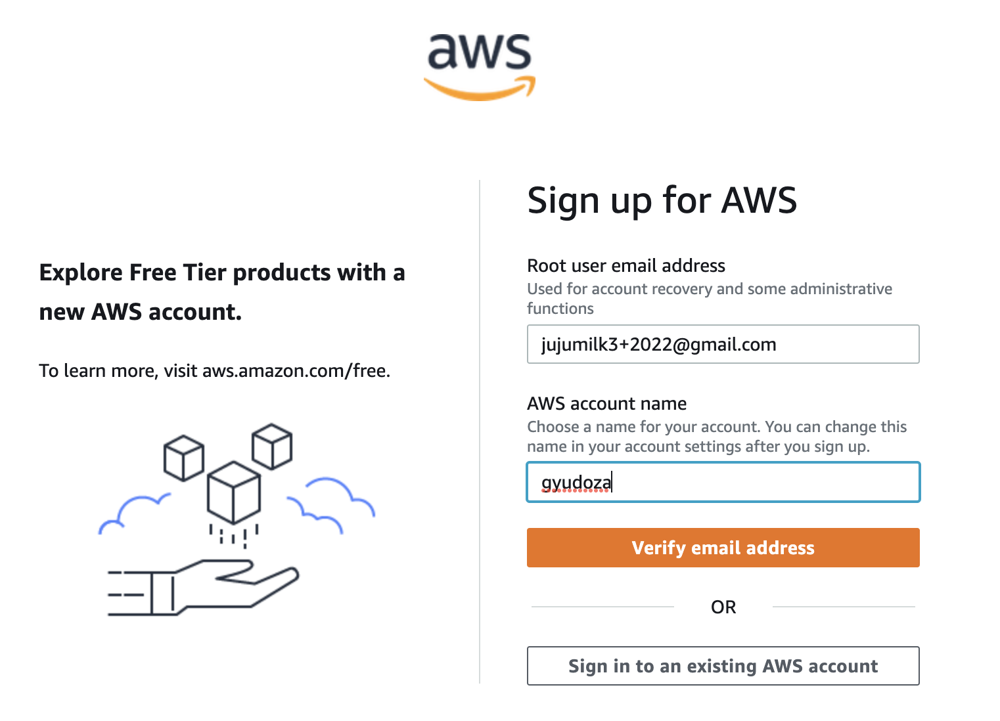
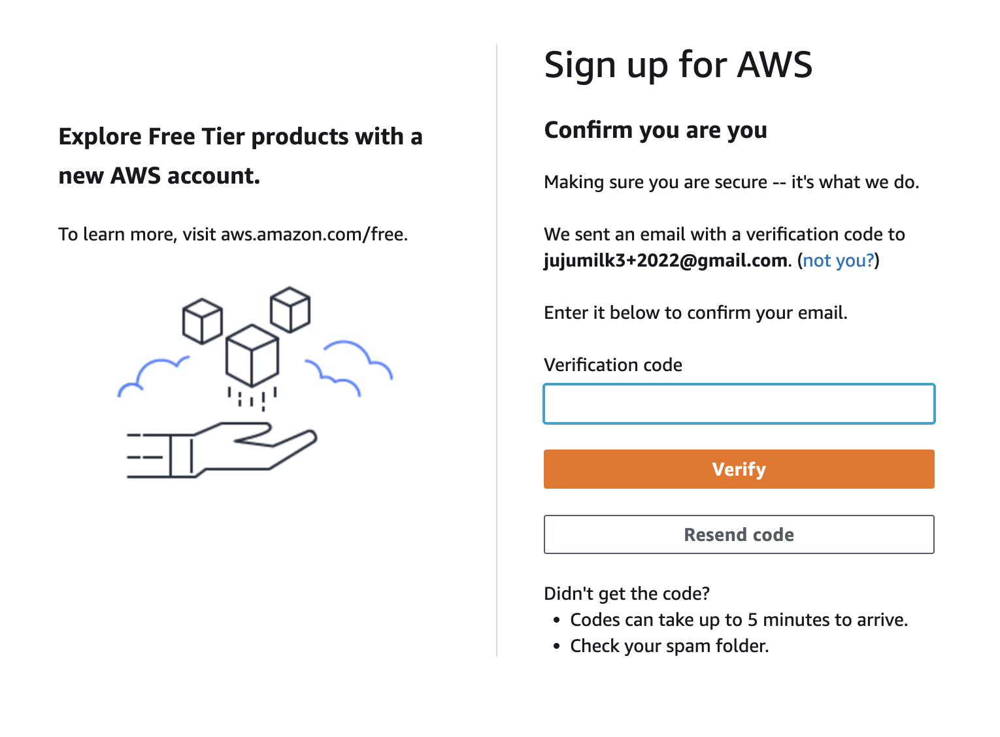
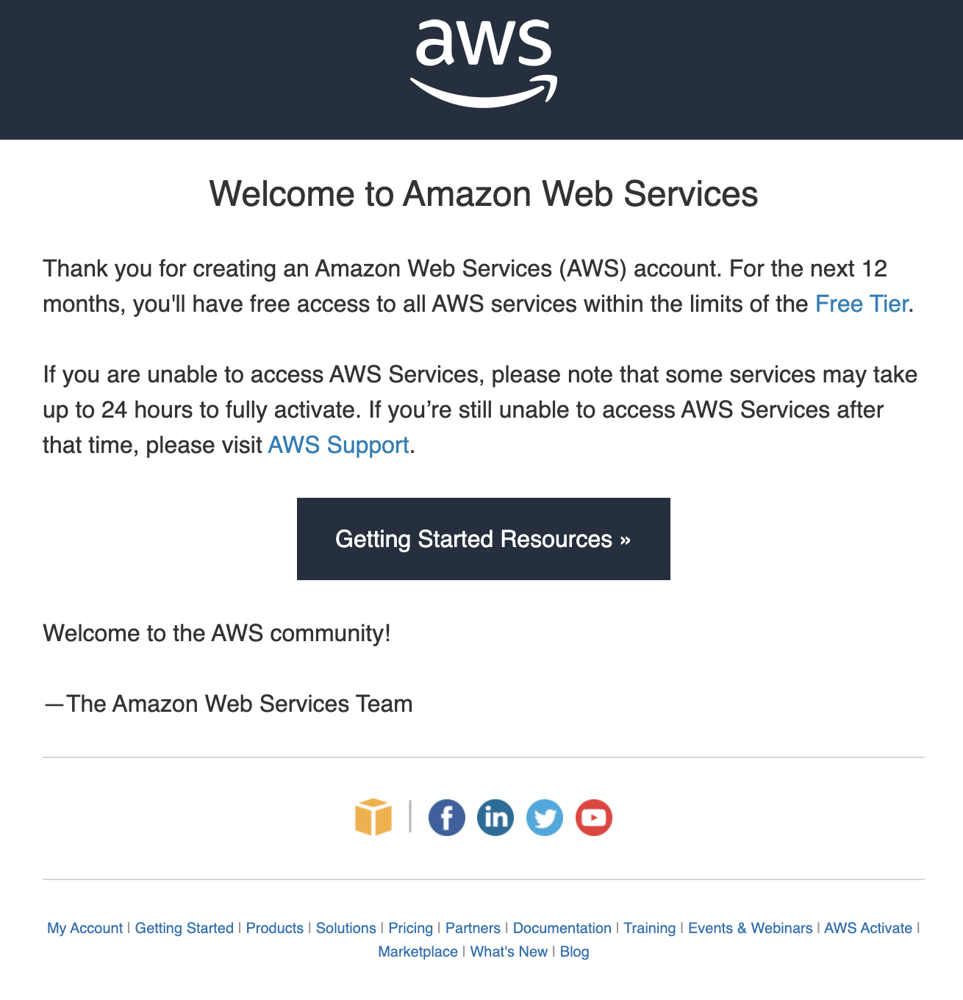

# aws 프리티어 무한 재가입

> **Summary**
> Gmail의 + 기능을 활용하여 동일한 이메일로 여러 AWS 프리티어 계정을 생성할 수 있으며, 매년 새로운 계정을 만들어 사용할 수 있어 편리하다. 이를 통해 가입 시도를 쉽게 관리하고, 확인 메일을 통해 프리티어 기능을 정상적으로 사용할 수 있음을 확인할 수 있다.

---

🔗 [https://this-programmer.tistory.com/472](https://this-programmer.tistory.com/472)

gmail에는 여러 용도로 사용할 수 있게 아이디 뒤에 +{something}을 붙여서도 사용할 수 있는 기능이 있다. 예를 들어 내 이메일주소가 jujumilk3@gmail.com인데 여기에 jujumilk3+2022@gmail.com을 붙여도 내 원래 계정으로 온다.

이렇게 말이다. 물론 숫자뿐만이 아니라 영어도 되므로 특정 메일을 리스팅하거나 라벨링할 때 쓰기 좋은 기능이지만 이 기능을 aws계정가입과 함께 활용하면 같은 gmail계정으로 여러개의 프리티어계정을 계속 생성할 수 있다. 프리티어계정은 1년 후에 종료되기 때문에 나 같은 경우에는 뒤에 해당년도를 붙여 새로운 계정을 만들어 사용하고 있다.

이렇게 가입시도를 하면

멀쩡히 잘 진행된다.

프리티어 기능을 정상적으로 사용할 수 있다는 확인메일이 온다.

이 방법도 역시 1년마다 가입해야하긴 하지만 언제 어떤 메일로 가입했는지 나조차도 추적이 되지 않는 상황은 면할 수 있고 새로운 메일계정을 만들어서 등록하는 방법보다 훨씬 편리하다. 구글 아마존 만세다.

