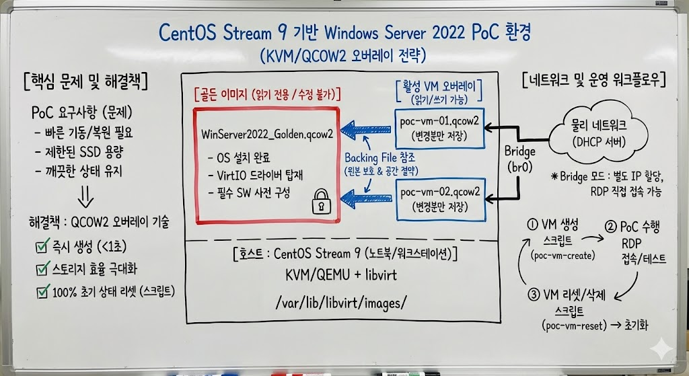

# centOS에서 windows server 를 구동시키자

> **Summary**
> CentOS Stream 9에서 Windows Server 2022를 가상화하는 방법을 다루며, KVM/QEMU와 libvirt를 사용한 최적의 설정을 제안한다. 세 가지 접근법을 비교하고, QCOW2 기반의 백킹 파일 전략을 통해 스토리지 효율성과 빠른 VM 생성을 강조한다. 또한, VirtIO 드라이버 설치, RDP 활성화, 및 PoC 환경 구축을 위한 스크립트 사용법을 제공하며, 성능 최적화 및 문제 해결 방법도 포함된다.

---




🎥 [동영상 보기](https://youtu.be/y1ic8lc8cn8?si=igkwOt2CiX6T3EpR)

# 3가지 방법 조사

| [https://gemini.google.com/share/af4bf420db16](https://gemini.google.com/share/af4bf420db16) | [https://claude.ai/public/artifacts/5c605d08-5c41-4dd7-bb09-eab8f4c7b803](https://claude.ai/public/artifacts/5c605d08-5c41-4dd7-bb09-eab8f4c7b803) | [https://chatgpt.com/s/t_696bab773550819198e9415c244b4e5a](https://chatgpt.com/s/t_696bab773550819198e9415c244b4e5a) |

## 세 문서 비교 분석

### 문서별 특성 요약

| 구분 | 문서 1 (심층 보고서) | 문서 2 (실용 가이드) | 문서 3 (종합 가이드) |
| --- | --- | --- | --- |
| **대상 독자** | 엔터프라이즈 인프라 엔지니어 | 개발자/시스템 관리자 | 중급 시스템 관리자 |
| **환경 규모** | 대규모 (수십~수백 VM) | 소규모 (1-2개 VM) | 중소규모 (다수 VM) |
| **핵심 초점** | 고빈도 라이프사이클 자동화 | 빠른 구축과 실용성 | 성능 최적화와 유연성 |
| **복잡도** | 높음 | 낮음 | 중간 |
| **자동화 수준** | Packer + Terraform + Vagrant | Virt-Manager GUI 중심 | CLI + 스크립트 + Cockpit |

---

### 공통점

세 문서 모두 동일한 기술 스택과 핵심 원칙을 공유한다.

**1. KVM/QEMU + libvirt가 최적의 선택**

모든 문서가 CentOS/RHEL 환경에서 VirtualBox나 VMware보다 KVM이 우월하다는 점에 동의한다. 커널 통합형 하이퍼바이저로서 성능 오버헤드가 최소화되고, 리눅스 생태계와의 호환성이 완벽하다.

**2. VirtIO 드라이버 필수**

Windows 게스트에서 VirtIO 드라이버(vioscsi, NetKVM, Balloon)와 QEMU Guest Agent 설치가 성능 최적화의 핵심이라는 점을 공통적으로 강조한다.

**3. QCOW2 기반 이미지 전략**

골든 이미지를 QCOW2로 만들고, 이를 기반으로 클론 또는 오버레이를 생성하는 방식이 효율적이라는 점에 합의한다.

**4. Bridge 네트워킹 권장**

RDP 접근성과 네트워크 편의성을 위해 NAT보다 Bridge 모드를 권장한다.

---

### 핵심 차이점

**1. 이미지 복제 전략**

| 문서 | 접근법 | 특징 |
| --- | --- | --- |
| 문서 1 | **QCOW2 Backing File (Overlay)** | 원본 읽기전용, 변경분만 별도 저장. 1초 미만 생성. |
| 문서 2 | **virt-clone (Full Clone)** | 전체 복사. 안전하지만 느리고 용량 소모. |
| 문서 3 | **백킹 파일 + 상태별 오버레이** | 문서 1과 유사하나 상태 전환 스크립트 제공. |

**2. 자동화 도구 선택**

문서 1은 Packer로 이미지 빌드 자동화 + Vagrant/Terraform으로 라이프사이클 관리라는 엔터프라이즈급 파이프라인을 제시한다. 문서 2는 Virt-Manager GUI와 수동 스냅샷을 기본으로 하고, 필요시 Vagrant/Ansible을 선택적으로 도입한다. 문서 3은 virsh CLI와 쉘 스크립트 기반 자동화를 중심으로 Cockpit 웹 UI를 보조 도구로 활용한다.

**3. Sysprep 처리 방식**

문서 1과 2는 Sysprep을 통한 이미지 일반화를 강조하지만, 문서 3은 Sysprep 후 복잡한 애플리케이션이 손상될 수 있다는 경고를 추가하고, 템플릿을 VM 형태로 유지하라고 조언한다.

**4. 성능 튜닝 깊이**

문서 1은 CPU Pinning, NUMA 인식, Hugepages, I/O 스케줄러 튜닝 등 하드웨어 레벨 최적화를 상세히 다룬다. 문서 3은 Hyper-V Enlightenments, IOThreads, 캐시 모드 등 VM 레벨 최적화에 집중한다. 문서 2는 기본 VirtIO 설치 외에 심층 튜닝을 다루지 않는다.

---

### 사용 사례에 대한 권장사항

노트북에서 CentOS Stream 9, PoC용 Windows Server 1-2개, 특정 소프트웨어가 설치된 골든 이미지가 필요한 환경이라면 **문서 3의 접근법을 기반으로, 문서 1의 QCOW2 Backing File 전략을 결합**하는 것이 최적이다.

**이유:**

**문서 1의 방식이 과한 이유**

- Packer, Terraform, Vagrant 도입은 1-2개 VM 관리에 오버엔지니어링
- CPU Pinning, Hugepages 등 하드웨어 튜닝은 노트북 환경에서 효과 제한적
- 학습 곡선이 높아 PoC 목적에 비해 초기 투자 시간이 과다
**문서 2의 방식이 부족한 이유**

- Full Clone 방식은 SSD 용량이 제한된 노트북에서 비효율적
- 스냅샷 의존적 접근은 "올렸다 내렸다" 반복 시 파일 비대화 문제
- GUI 중심 워크플로우는 반복 작업에 비효율
**문서 3의 방식이 적합한 이유**

- 백킹 파일 전략으로 빠른 생성/삭제와 스토리지 효율성 확보
- virsh CLI와 간단한 쉘 스크립트로 적절한 자동화 수준
- Cockpit으로 필요시 GUI 접근 가능
- CentOS Stream 9의 특성(SPICE deprecated 등)을 고려한 설정 제공
---

# CentOS Stream 9 기반 Windows Server 2022 PoC 가상화 환경 구축 가이드

## 문서 정보

| 항목 | 내용 |
| --- | --- |
| 작성일 | 2025년 1월 |
| 대상 환경 | CentOS Stream 9 (노트북/워크스테이션) |
| 게스트 OS | Windows Server 2022 |
| 용도 | PoC(Proof of Concept) 및 기술 검증 |

---

## 1. 서론: 가이드 작성 배경

### 1.1 문제 정의

Pre-Sales Engineer나 기술 컨설턴트가 고객에게 솔루션을 시연하거나 내부 기술 검증을 수행할 때, Windows Server 환경이 필수적으로 요구되는 경우가 빈번하다. 이러한 PoC 환경은 다음과 같은 특성을 갖는다.

**운영 패턴의 특수성:**

- 시연이나 테스트를 위해 VM을 빠르게 기동
- 작업 완료 후 즉시 종료 또는 삭제
- 다음 시연을 위해 "깨끗한 상태"로 신속하게 복원
- 특정 소프트웨어(데모용 애플리케이션, 에이전트 등)가 항상 사전 설치되어 있어야 함
**물리적 제약:**

- 노트북이라는 제한된 하드웨어 리소스
- SSD 용량의 효율적 활용 필요
- 이동 중에도 오프라인 환경에서 구동 가능해야 함
**관리 요구사항:**

- 동시에 운영하는 VM은 1-2개로 소규모
- 복잡한 자동화 파이프라인보다 빠른 구축과 간편한 운영 우선
- 필요시 CLI나 스크립트로 반복 작업 자동화
### 1.2 기존 접근법의 한계

이러한 요구사항을 충족하기 위한 기존 접근법들을 검토한 결과, 각각 한계점이 존재했다.

**엔터프라이즈급 자동화 (Packer + Terraform + Vagrant):**

- 학습 곡선이 높아 초기 구축에 수일 소요
- 1-2개 VM 관리에 과도한 오버엔지니어링
- 노트북 환경에서 불필요한 복잡성 증가
**GUI 중심 수동 관리 (Virt-Manager + Full Clone):**

- 매번 전체 디스크를 복제하므로 SSD 용량 낭비
- 스냅샷 누적 시 이미지 파일 비대화
- 반복 작업에 비효율적
**단순 스냅샷 의존:**

- 스냅샷 체인이 깊어질수록 I/O 성능 저하
- 72시간 이상 유지 시 권장되지 않음
- "깨끗한 복원"이 아닌 "시점 복원"에 가까움
### 1.3 본 가이드의 접근 방식

본 가이드는 **QCOW2 Backing File(오버레이) 전략**을 핵심으로 채택한다. 이 방식은 다음과 같은 이점을 제공한다.

| 이점 | 설명 |
| --- | --- |
| 즉시 생성 | 골든 이미지 기반 오버레이 생성에 1초 미만 소요 |
| 스토리지 효율 | 변경분만 저장하므로 SSD 용량 절약 |
| 완전한 복원 | 오버레이 삭제 후 재생성으로 100% 초기 상태 복원 |
| 원본 보호 | 골든 이미지는 읽기 전용으로 절대 변경되지 않음 |
| 적정 자동화 | 쉘 스크립트 수준의 간단한 자동화로 충분 |

---

## 2. 아키텍처 설계

### 2.1 전체 구조

```plain text
┌─────────────────────────────────────────────────────────────────┐
│                    CentOS Stream 9 Host                         │
│  ┌───────────────────────────────────────────────────────────┐  │
│  │                    KVM/QEMU + libvirt                     │  │
│  │  ┌─────────────────────────────────────────────────────┐  │  │
│  │  │              골든 이미지 (읽기 전용)                  │  │  │
│  │  │         WinServer2022_Golden.qcow2                  │  │  │
│  │  │    - Windows Server 2022 설치 완료                   │  │  │
│  │  │    - VirtIO 드라이버 설치                            │  │  │
│  │  │    - 필수 소프트웨어 사전 설치                        │  │  │
│  │  │    - RDP 활성화                                      │  │  │
│  │  └────────────────────┬────────────────────────────────┘  │  │
│  │                       │ Backing File 참조                 │  │
│  │         ┌─────────────┴─────────────┐                     │  │
│  │         ▼                           ▼                     │  │
│  │  ┌─────────────┐             ┌─────────────┐              │  │
│  │  │ poc-vm-01   │             │ poc-vm-02   │              │  │
│  │  │ .qcow2      │             │ .qcow2      │              │  │
│  │  │ (변경분만)   │             │ (변경분만)   │              │  │
│  │  └─────────────┘             └─────────────┘              │  │
│  └───────────────────────────────────────────────────────────┘  │
│                              │                                   │
│                    Bridge Network (br0)                          │
│                              │                                   │
└──────────────────────────────┼───────────────────────────────────┘
                               │
                        물리 네트워크
                    (DHCP로 IP 할당)

```

### 2.2 기술 선택 근거

**하이퍼바이저: KVM/QEMU**

| 비교 항목 | KVM | VirtualBox | VMware Workstation |
| --- | --- | --- | --- |
| 아키텍처 | Type 1 (커널 통합) | Type 2 | Type 2 |
| CentOS 호환성 | 완벽 (기본 제공) | 커널 모듈 의존 | 모듈 재컴파일 필요 |
| I/O 성능 | 최상 (VirtIO) | 보통 | 우수 |
| 오버레이 지원 | 네이티브 (QCOW2) | 제한적 | 링크드 클론 (유료) |
| 라이선스 | 오픈소스 | 무료 | 상용 |

KVM은 리눅스 커널의 일부로 작동하므로 CentOS Stream 9에서 추가 설치 없이 최적의 성능을 제공한다. 특히 QCOW2 포맷의 Backing File 기능은 본 가이드의 핵심 전략을 가능하게 한다.

**네트워크: Bridge 모드**

NAT 모드는 설정이 간편하지만, RDP 접속을 위해 포트 포워딩이 필요하고 호스트와 다른 서브넷에 위치하게 된다. Bridge 모드를 사용하면 VM이 물리 네트워크에서 독립적인 장치로 인식되어 별도의 IP를 DHCP로 할당받으며, 호스트나 다른 장치에서 직접 RDP 접속이 가능하다.

**GUI 접근: RDP 우선**

| 접근 방법 | 용도 | 성능 |
| --- | --- | --- |
| RDP | 일상 작업, 시연 | 최상 (네이티브급) |
| SPICE | USB 리다이렉션 필요 시 | 우수 |
| VNC | OS 설치, 부팅 문제 해결 | 보통 |

Windows Server 환경에서는 RDP가 가장 효율적이다. SPICE는 CentOS Stream 9에서 deprecated 추세이며, VNC는 콘솔 접근 용도로만 활용한다.

### 2.3 디렉토리 구조

```plain text
/var/lib/libvirt/images/
├── Templates/
│   └── WinServer2022_Golden.qcow2    # 골든 이미지 (읽기 전용)
├── Active/
│   ├── poc-vm-01.qcow2               # 활성 오버레이
│   └── poc-vm-02.qcow2               # 활성 오버레이
└── ISO/
    ├── Win2022_Eval.iso              # Windows 설치 ISO
    └── virtio-win.iso                # VirtIO 드라이버 ISO

```

---

