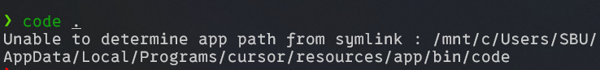

# cursor 완전삭제

> **Summary**
> WSL2에서 cursor 문제를 해결하기 위해 cursor 프로그램을 삭제하고 관련 디렉토리를 비운 후, 특정 코드를 복사하여 cursor를 대체하면 정상적으로 작동한다.

---


힙스터 병이 있어서 잘 돌아가는 vs code 냅두고 cursor 사용중인데,


wsl2을 통한 ubuntu에서 vscode를 실행할일이 있을때 곤란한 상황이 펼쳐지곤 한다


cursor를 지우면 깔끔하게 해결되는 문제지만…. cursor를 안쓸 순 없는걸=…


최초 cursor 설정때 cursor 커맨드를 code 커맨드로도 대체하는 속성이 있는데, 멋도 모르고 내가 그걸 체크해버려서 지웠다 깔아도 해당 옵션이 유지되었다…


### 일단 프로그램 추가 제거에서 cursor를 삭제하자

### 그리고 아래 디렉토리들을 전부 비워주면 된다

```c++
C:\Users\SBU\AppData\Roaming\Cursor
```

```c++
C:\Users\SBU\AppData\Local\Programs\cursor
```

```c++
C:\Users\SBU\AppData\Local\cursor-updater
```

# WSL2 cursor 문제 해결

🔗 [https://github.com/getcursor/cursor/issues/807](https://github.com/getcursor/cursor/issues/807)



cursor . 했을때 위 문제 생김..


아래 코드를 복사하고 wsl2 기준 아래 디렉토리의 cursor 를 대체한다.

🔗 [https://gist.github.com/ddwang/0046da801bcb29d241869d37ad719394](https://gist.github.com/ddwang/0046da801bcb29d241869d37ad719394)

```c++
/mnt/c/Users/SBU/AppData/Local/Programs/cursor/resources/app/bin
```


그럼 이제 cursor . 하면 제대로 열림

