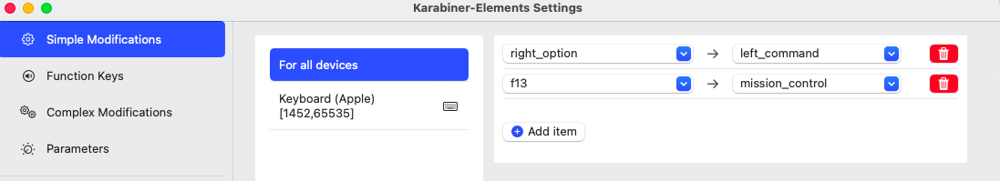

# for mac : tex shinobi & 카라비너 ANSII배열 키맵핑

> **Summary**
> 맥에서 Tex Shinobi와 카라비너를 사용하여 키 매핑을 설정하는 방법에 대한 안내. Karabiner Complex Rules Generator를 통해 IJKL 및 UO 키 조합을 설정하고, T480 모델에 맞게 조정하는 방법도 설명. Hammerspoon을 사용하여 CTRL+HJKL로 방향키 이동을 설정하는 방법도 포함되어 있습니다.

---


🔗 [https://matdulgi.tistory.com/124](https://matdulgi.tistory.com/124)

🔗 [https://genesy.github.io/karabiner-complex-rules-generator/#eyJ0aXRsZSI6IklKS0xVTyIsInJ1bGVzIjpbeyJkZXNjcmlwdGlvbiI6IklKS0wiLCJtYW5pcHVsYXRvcnMiOlt7InR5cGUiOiJiYXNpYyIsImZyb20iOnsibW9kaWZpZXJzIjp7Im1hbmRhdG9yeSI6WyJsZWZ0X2d1aSJdfSwia2V5X2NvZGUiOiJpIn0sInRvIjpbeyJyZXBlYXQiOnRydWUsImtleV9jb2RlIjoidXBfYXJyb3cifV19LHsidHlwZSI6ImJhc2ljIiwiZnJvbSI6eyJtb2RpZmllcnMiOnsibWFuZGF0b3J5IjpbImxlZnRfZ3VpIl19LCJrZXlfY29kZSI6ImoifSwidG8iOlt7InJlcGVhdCI6dHJ1ZSwia2V5X2NvZGUiOiJsZWZ0X2Fycm93In1dfSx7InR5cGUiOiJiYXNpYyIsImZyb20iOnsibW9kaWZpZXJzIjp7Im1hbmRhdG9yeSI6WyJsZWZ0X2d1aSJdfSwia2V5X2NvZGUiOiJrIn0sInRvIjpbeyJyZXBlYXQiOnRydWUsImtleV9jb2RlIjoiZG93bl9hcnJvdyJ9XX0seyJ0eXBlIjoiYmFzaWMiLCJmcm9tIjp7Im1vZGlmaWVycyI6eyJtYW5kYXRvcnkiOlsibGVmdF9ndWkiXX0sImtleV9jb2RlIjoibCJ9LCJ0byI6W3sicmVwZWF0Ijp0cnVlLCJrZXlfY29kZSI6InJpZ2h0X2Fycm93In1dfV19LHsiZGVzY3JpcHRpb24iOiJVTyIsIm1hbmlwdWxhdG9ycyI6W3sidHlwZSI6ImJhc2ljIiwiZnJvbSI6eyJtb2RpZmllcnMiOnsibWFuZGF0b3J5IjpbImxlZnRfZ3VpIl19LCJrZXlfY29kZSI6InUifSwidG8iOlt7InJlcGVhdCI6dHJ1ZSwia2V5X2NvZGUiOiJsZWZ0X2Fycm93IiwibW9kaWZpZXJzIjpbImxlZnRfZ3VpIl19XX0seyJ0eXBlIjoiYmFzaWMiLCJmcm9tIjp7Im1vZGlmaWVycyI6eyJtYW5kYXRvcnkiOlsibGVmdF9ndWkiXX0sImtleV9jb2RlIjoibyJ9LCJ0byI6W3sicmVwZWF0Ijp0cnVlLCJrZXlfY29kZSI6InJpZ2h0X2Fycm93IiwibW9kaWZpZXJzIjpbImxlZnRfZ3VpIl19XX1dfV19](https://genesy.github.io/karabiner-complex-rules-generator/#eyJ0aXRsZSI6IklKS0xVTyIsInJ1bGVzIjpbeyJkZXNjcmlwdGlvbiI6IklKS0wiLCJtYW5pcHVsYXRvcnMiOlt7InR5cGUiOiJiYXNpYyIsImZyb20iOnsibW9kaWZpZXJzIjp7Im1hbmRhdG9yeSI6WyJsZWZ0X2d1aSJdfSwia2V5X2NvZGUiOiJpIn0sInRvIjpbeyJyZXBlYXQiOnRydWUsImtleV9jb2RlIjoidXBfYXJyb3cifV19LHsidHlwZSI6ImJhc2ljIiwiZnJvbSI6eyJtb2RpZmllcnMiOnsibWFuZGF0b3J5IjpbImxlZnRfZ3VpIl19LCJrZXlfY29kZSI6ImoifSwidG8iOlt7InJlcGVhdCI6dHJ1ZSwia2V5X2NvZGUiOiJsZWZ0X2Fycm93In1dfSx7InR5cGUiOiJiYXNpYyIsImZyb20iOnsibW9kaWZpZXJzIjp7Im1hbmRhdG9yeSI6WyJsZWZ0X2d1aSJdfSwia2V5X2NvZGUiOiJrIn0sInRvIjpbeyJyZXBlYXQiOnRydWUsImtleV9jb2RlIjoiZG93bl9hcnJvdyJ9XX0seyJ0eXBlIjoiYmFzaWMiLCJmcm9tIjp7Im1vZGlmaWVycyI6eyJtYW5kYXRvcnkiOlsibGVmdF9ndWkiXX0sImtleV9jb2RlIjoibCJ9LCJ0byI6W3sicmVwZWF0Ijp0cnVlLCJrZXlfY29kZSI6InJpZ2h0X2Fycm93In1dfV19LHsiZGVzY3JpcHRpb24iOiJVTyIsIm1hbmlwdWxhdG9ycyI6W3sidHlwZSI6ImJhc2ljIiwiZnJvbSI6eyJtb2RpZmllcnMiOnsibWFuZGF0b3J5IjpbImxlZnRfZ3VpIl19LCJrZXlfY29kZSI6InUifSwidG8iOlt7InJlcGVhdCI6dHJ1ZSwia2V5X2NvZGUiOiJsZWZ0X2Fycm93IiwibW9kaWZpZXJzIjpbImxlZnRfZ3VpIl19XX0seyJ0eXBlIjoiYmFzaWMiLCJmcm9tIjp7Im1vZGlmaWVycyI6eyJtYW5kYXRvcnkiOlsibGVmdF9ndWkiXX0sImtleV9jb2RlIjoibyJ9LCJ0byI6W3sicmVwZWF0Ijp0cnVlLCJrZXlfY29kZSI6InJpZ2h0X2Fycm93IiwibW9kaWZpZXJzIjpbImxlZnRfZ3VpIl19XX1dfV19)

# Tex Shinobi 용

🔗 [https://genesy.github.io/karabiner-complex-rules-generator/#eyJ0aXRsZSI6IklKS0xVTyIsInJ1bGVzIjpbeyJkZXNjcmlwdGlvbiI6IklKS0wiLCJtYW5pcHVsYXRvcnMiOlt7InR5cGUiOiJiYXNpYyIsImZyb20iOnsibW9kaWZpZXJzIjp7Im1hbmRhdG9yeSI6WyJsZWZ0X2d1aSJdfSwia2V5X2NvZGUiOiJpIn0sInRvIjpbeyJyZXBlYXQiOnRydWUsImtleV9jb2RlIjoidXBfYXJyb3cifV19LHsidHlwZSI6ImJhc2ljIiwiZnJvbSI6eyJtb2RpZmllcnMiOnsibWFuZGF0b3J5IjpbImxlZnRfZ3VpIl19LCJrZXlfY29kZSI6ImoifSwidG8iOlt7InJlcGVhdCI6dHJ1ZSwia2V5X2NvZGUiOiJsZWZ0X2Fycm93In1dfSx7InR5cGUiOiJiYXNpYyIsImZyb20iOnsibW9kaWZpZXJzIjp7Im1hbmRhdG9yeSI6WyJsZWZ0X2d1aSJdfSwia2V5X2NvZGUiOiJrIn0sInRvIjpbeyJyZXBlYXQiOnRydWUsImtleV9jb2RlIjoiZG93bl9hcnJvdyJ9XX0seyJ0eXBlIjoiYmFzaWMiLCJmcm9tIjp7Im1vZGlmaWVycyI6eyJtYW5kYXRvcnkiOlsibGVmdF9ndWkiXX0sImtleV9jb2RlIjoibCJ9LCJ0byI6W3sicmVwZWF0Ijp0cnVlLCJrZXlfY29kZSI6InJpZ2h0X2Fycm93In1dfV19LHsiZGVzY3JpcHRpb24iOiJVTyIsIm1hbmlwdWxhdG9ycyI6W3sidHlwZSI6ImJhc2ljIiwiZnJvbSI6eyJtb2RpZmllcnMiOnsibWFuZGF0b3J5IjpbImxlZnRfZ3VpIl19LCJrZXlfY29kZSI6InUifSwidG8iOlt7InJlcGVhdCI6dHJ1ZSwia2V5X2NvZGUiOiJsZWZ0X2Fycm93IiwibW9kaWZpZXJzIjpbImxlZnRfZ3VpIl19XX0seyJ0eXBlIjoiYmFzaWMiLCJmcm9tIjp7Im1vZGlmaWVycyI6eyJtYW5kYXRvcnkiOlsibGVmdF9ndWkiXX0sImtleV9jb2RlIjoibyJ9LCJ0byI6W3sicmVwZWF0Ijp0cnVlLCJrZXlfY29kZSI6InJpZ2h0X2Fycm93IiwibW9kaWZpZXJzIjpbImxlZnRfZ3VpIl19XX1dfSx7ImRlc2NyaXB0aW9uIjoiU0hJRlQgKyBJSktMIiwibWFuaXB1bGF0b3JzIjpbeyJ0eXBlIjoiYmFzaWMiLCJmcm9tIjp7Im1vZGlmaWVycyI6eyJtYW5kYXRvcnkiOlsibGVmdF9ndWkiXSwib3B0aW9uYWwiOlsibGVmdF9zaGlmdCJdfSwia2V5X2NvZGUiOiJpIn0sInRvIjpbeyJyZXBlYXQiOnRydWUsImtleV9jb2RlIjoidXBfYXJyb3ciLCJtb2RpZmllcnMiOlsibGVmdF9zaGlmdCJdfV19LHsidHlwZSI6ImJhc2ljIiwiZnJvbSI6eyJtb2RpZmllcnMiOnsibWFuZGF0b3J5IjpbImxlZnRfZ3VpIl0sIm9wdGlvbmFsIjpbImxlZnRfc2hpZnQiXX0sImtleV9jb2RlIjoiaiJ9LCJ0byI6W3sicmVwZWF0Ijp0cnVlLCJrZXlfY29kZSI6ImxlZnRfYXJyb3ciLCJtb2RpZmllcnMiOlsibGVmdF9zaGlmdCJdfV19LHsidHlwZSI6ImJhc2ljIiwiZnJvbSI6eyJtb2RpZmllcnMiOnsibWFuZGF0b3J5IjpbImxlZnRfZ3VpIl0sIm9wdGlvbmFsIjpbImxlZnRfc2hpZnQiXX0sImtleV9jb2RlIjoiayJ9LCJ0byI6W3sicmVwZWF0Ijp0cnVlLCJrZXlfY29kZSI6ImRvd25fYXJyb3ciLCJtb2RpZmllcnMiOlsibGVmdF9zaGlmdCJdfV19LHsidHlwZSI6ImJhc2ljIiwiZnJvbSI6eyJtb2RpZmllcnMiOnsibWFuZGF0b3J5IjpbImxlZnRfZ3VpIl0sIm9wdGlvbmFsIjpbImxlZnRfc2hpZnQiXX0sImtleV9jb2RlIjoibCJ9LCJ0byI6W3sicmVwZWF0Ijp0cnVlLCJrZXlfY29kZSI6InJpZ2h0X2Fycm93IiwibW9kaWZpZXJzIjpbImxlZnRfc2hpZnQiXX1dfV19LHsiZGVzY3JpcHRpb24iOiJTSElGVCArIFVPIiwibWFuaXB1bGF0b3JzIjpbeyJ0eXBlIjoiYmFzaWMiLCJmcm9tIjp7Im1vZGlmaWVycyI6eyJtYW5kYXRvcnkiOlsibGVmdF9ndWkiXSwib3B0aW9uYWwiOlsibGVmdF9zaGlmdCJdfSwia2V5X2NvZGUiOiJ1In0sInRvIjpbeyJyZXBlYXQiOnRydWUsImtleV9jb2RlIjoibGVmdF9hcnJvdyIsIm1vZGlmaWVycyI6WyJsZWZ0X2d1aSIsImxlZnRfc2hpZnQiXSwibGF6eSI6ZmFsc2UsImhhbHQiOmZhbHNlfV19LHsidHlwZSI6ImJhc2ljIiwiZnJvbSI6eyJtb2RpZmllcnMiOnsibWFuZGF0b3J5IjpbImxlZnRfZ3VpIl0sIm9wdGlvbmFsIjpbImxlZnRfc2hpZnQiXX0sImtleV9jb2RlIjoibyJ9LCJ0byI6W3sicmVwZWF0Ijp0cnVlLCJrZXlfY29kZSI6InJpZ2h0X2Fycm93IiwibW9kaWZpZXJzIjpbImxlZnRfZ3VpIiwibGVmdF9zaGlmdCJdfV19XX0seyJkZXNjcmlwdGlvbiI6Ik9wdCtJSyIsIm1hbmlwdWxhdG9ycyI6W3sidHlwZSI6ImJhc2ljIiwiZnJvbSI6eyJtb2RpZmllcnMiOnsibWFuZGF0b3J5IjpbImxlZnRfYWx0IiwibGVmdF9zaGlmdCJdfSwia2V5X2NvZGUiOiJpIn0sInRvIjpbeyJyZXBlYXQiOnRydWUsImtleV9jb2RlIjoidXBfYXJyb3ciLCJtb2RpZmllcnMiOlsibGVmdF9ndWkiLCJsZWZ0X3NoaWZ0Il19XX0seyJ0eXBlIjoiYmFzaWMiLCJmcm9tIjp7Im1vZGlmaWVycyI6eyJtYW5kYXRvcnkiOlsibGVmdF9hbHQiLCJsZWZ0X3NoaWZ0Il19LCJrZXlfY29kZSI6ImsifSwidG8iOlt7InJlcGVhdCI6dHJ1ZSwia2V5X2NvZGUiOiJkb3duX2Fycm93IiwibW9kaWZpZXJzIjpbImxlZnRfZ3VpIiwibGVmdF9zaGlmdCJdfV19XX1dfQ==](https://genesy.github.io/karabiner-complex-rules-generator/#eyJ0aXRsZSI6IklKS0xVTyIsInJ1bGVzIjpbeyJkZXNjcmlwdGlvbiI6IklKS0wiLCJtYW5pcHVsYXRvcnMiOlt7InR5cGUiOiJiYXNpYyIsImZyb20iOnsibW9kaWZpZXJzIjp7Im1hbmRhdG9yeSI6WyJsZWZ0X2d1aSJdfSwia2V5X2NvZGUiOiJpIn0sInRvIjpbeyJyZXBlYXQiOnRydWUsImtleV9jb2RlIjoidXBfYXJyb3cifV19LHsidHlwZSI6ImJhc2ljIiwiZnJvbSI6eyJtb2RpZmllcnMiOnsibWFuZGF0b3J5IjpbImxlZnRfZ3VpIl19LCJrZXlfY29kZSI6ImoifSwidG8iOlt7InJlcGVhdCI6dHJ1ZSwia2V5X2NvZGUiOiJsZWZ0X2Fycm93In1dfSx7InR5cGUiOiJiYXNpYyIsImZyb20iOnsibW9kaWZpZXJzIjp7Im1hbmRhdG9yeSI6WyJsZWZ0X2d1aSJdfSwia2V5X2NvZGUiOiJrIn0sInRvIjpbeyJyZXBlYXQiOnRydWUsImtleV9jb2RlIjoiZG93bl9hcnJvdyJ9XX0seyJ0eXBlIjoiYmFzaWMiLCJmcm9tIjp7Im1vZGlmaWVycyI6eyJtYW5kYXRvcnkiOlsibGVmdF9ndWkiXX0sImtleV9jb2RlIjoibCJ9LCJ0byI6W3sicmVwZWF0Ijp0cnVlLCJrZXlfY29kZSI6InJpZ2h0X2Fycm93In1dfV19LHsiZGVzY3JpcHRpb24iOiJVTyIsIm1hbmlwdWxhdG9ycyI6W3sidHlwZSI6ImJhc2ljIiwiZnJvbSI6eyJtb2RpZmllcnMiOnsibWFuZGF0b3J5IjpbImxlZnRfZ3VpIl19LCJrZXlfY29kZSI6InUifSwidG8iOlt7InJlcGVhdCI6dHJ1ZSwia2V5X2NvZGUiOiJsZWZ0X2Fycm93IiwibW9kaWZpZXJzIjpbImxlZnRfZ3VpIl19XX0seyJ0eXBlIjoiYmFzaWMiLCJmcm9tIjp7Im1vZGlmaWVycyI6eyJtYW5kYXRvcnkiOlsibGVmdF9ndWkiXX0sImtleV9jb2RlIjoibyJ9LCJ0byI6W3sicmVwZWF0Ijp0cnVlLCJrZXlfY29kZSI6InJpZ2h0X2Fycm93IiwibW9kaWZpZXJzIjpbImxlZnRfZ3VpIl19XX1dfSx7ImRlc2NyaXB0aW9uIjoiU0hJRlQgKyBJSktMIiwibWFuaXB1bGF0b3JzIjpbeyJ0eXBlIjoiYmFzaWMiLCJmcm9tIjp7Im1vZGlmaWVycyI6eyJtYW5kYXRvcnkiOlsibGVmdF9ndWkiXSwib3B0aW9uYWwiOlsibGVmdF9zaGlmdCJdfSwia2V5X2NvZGUiOiJpIn0sInRvIjpbeyJyZXBlYXQiOnRydWUsImtleV9jb2RlIjoidXBfYXJyb3ciLCJtb2RpZmllcnMiOlsibGVmdF9zaGlmdCJdfV19LHsidHlwZSI6ImJhc2ljIiwiZnJvbSI6eyJtb2RpZmllcnMiOnsibWFuZGF0b3J5IjpbImxlZnRfZ3VpIl0sIm9wdGlvbmFsIjpbImxlZnRfc2hpZnQiXX0sImtleV9jb2RlIjoiaiJ9LCJ0byI6W3sicmVwZWF0Ijp0cnVlLCJrZXlfY29kZSI6ImxlZnRfYXJyb3ciLCJtb2RpZmllcnMiOlsibGVmdF9zaGlmdCJdfV19LHsidHlwZSI6ImJhc2ljIiwiZnJvbSI6eyJtb2RpZmllcnMiOnsibWFuZGF0b3J5IjpbImxlZnRfZ3VpIl0sIm9wdGlvbmFsIjpbImxlZnRfc2hpZnQiXX0sImtleV9jb2RlIjoiayJ9LCJ0byI6W3sicmVwZWF0Ijp0cnVlLCJrZXlfY29kZSI6ImRvd25fYXJyb3ciLCJtb2RpZmllcnMiOlsibGVmdF9zaGlmdCJdfV19LHsidHlwZSI6ImJhc2ljIiwiZnJvbSI6eyJtb2RpZmllcnMiOnsibWFuZGF0b3J5IjpbImxlZnRfZ3VpIl0sIm9wdGlvbmFsIjpbImxlZnRfc2hpZnQiXX0sImtleV9jb2RlIjoibCJ9LCJ0byI6W3sicmVwZWF0Ijp0cnVlLCJrZXlfY29kZSI6InJpZ2h0X2Fycm93IiwibW9kaWZpZXJzIjpbImxlZnRfc2hpZnQiXX1dfV19LHsiZGVzY3JpcHRpb24iOiJTSElGVCArIFVPIiwibWFuaXB1bGF0b3JzIjpbeyJ0eXBlIjoiYmFzaWMiLCJmcm9tIjp7Im1vZGlmaWVycyI6eyJtYW5kYXRvcnkiOlsibGVmdF9ndWkiXSwib3B0aW9uYWwiOlsibGVmdF9zaGlmdCJdfSwia2V5X2NvZGUiOiJ1In0sInRvIjpbeyJyZXBlYXQiOnRydWUsImtleV9jb2RlIjoibGVmdF9hcnJvdyIsIm1vZGlmaWVycyI6WyJsZWZ0X2d1aSIsImxlZnRfc2hpZnQiXSwibGF6eSI6ZmFsc2UsImhhbHQiOmZhbHNlfV19LHsidHlwZSI6ImJhc2ljIiwiZnJvbSI6eyJtb2RpZmllcnMiOnsibWFuZGF0b3J5IjpbImxlZnRfZ3VpIl0sIm9wdGlvbmFsIjpbImxlZnRfc2hpZnQiXX0sImtleV9jb2RlIjoibyJ9LCJ0byI6W3sicmVwZWF0Ijp0cnVlLCJrZXlfY29kZSI6InJpZ2h0X2Fycm93IiwibW9kaWZpZXJzIjpbImxlZnRfZ3VpIiwibGVmdF9zaGlmdCJdfV19XX0seyJkZXNjcmlwdGlvbiI6Ik9wdCtJSyIsIm1hbmlwdWxhdG9ycyI6W3sidHlwZSI6ImJhc2ljIiwiZnJvbSI6eyJtb2RpZmllcnMiOnsibWFuZGF0b3J5IjpbImxlZnRfYWx0IiwibGVmdF9zaGlmdCJdfSwia2V5X2NvZGUiOiJpIn0sInRvIjpbeyJyZXBlYXQiOnRydWUsImtleV9jb2RlIjoidXBfYXJyb3ciLCJtb2RpZmllcnMiOlsibGVmdF9ndWkiLCJsZWZ0X3NoaWZ0Il19XX0seyJ0eXBlIjoiYmFzaWMiLCJmcm9tIjp7Im1vZGlmaWVycyI6eyJtYW5kYXRvcnkiOlsibGVmdF9hbHQiLCJsZWZ0X3NoaWZ0Il19LCJrZXlfY29kZSI6ImsifSwidG8iOlt7InJlcGVhdCI6dHJ1ZSwia2V5X2NvZGUiOiJkb3duX2Fycm93IiwibW9kaWZpZXJzIjpbImxlZnRfZ3VpIiwibGVmdF9zaGlmdCJdfV19XX1dfQ==)

🔗 [https://genesy.github.io/karabiner-complex-rules-generator/#eyJ0aXRsZSI6IkN1c3RvbV9JSktMVU8iLCJydWxlcyI6W3siZGVzY3JpcHRpb24iOiJJSktMIiwibWFuaXB1bGF0b3JzIjpbeyJ0eXBlIjoiYmFzaWMiLCJmcm9tIjp7Im1vZGlmaWVycyI6eyJtYW5kYXRvcnkiOlsibGVmdF9ndWkiXX0sImtleV9jb2RlIjoiaSJ9LCJ0byI6W3sicmVwZWF0Ijp0cnVlLCJrZXlfY29kZSI6InVwX2Fycm93In1dfSx7InR5cGUiOiJiYXNpYyIsImZyb20iOnsibW9kaWZpZXJzIjp7Im1hbmRhdG9yeSI6WyJsZWZ0X2d1aSJdfSwia2V5X2NvZGUiOiJqIn0sInRvIjpbeyJyZXBlYXQiOnRydWUsImtleV9jb2RlIjoibGVmdF9hcnJvdyJ9XX0seyJ0eXBlIjoiYmFzaWMiLCJmcm9tIjp7Im1vZGlmaWVycyI6eyJtYW5kYXRvcnkiOlsibGVmdF9ndWkiXX0sImtleV9jb2RlIjoiayJ9LCJ0byI6W3sicmVwZWF0Ijp0cnVlLCJrZXlfY29kZSI6ImRvd25fYXJyb3cifV19LHsidHlwZSI6ImJhc2ljIiwiZnJvbSI6eyJtb2RpZmllcnMiOnsibWFuZGF0b3J5IjpbImxlZnRfZ3VpIl19LCJrZXlfY29kZSI6ImwifSwidG8iOlt7InJlcGVhdCI6dHJ1ZSwia2V5X2NvZGUiOiJyaWdodF9hcnJvdyJ9XX1dfSx7ImRlc2NyaXB0aW9uIjoiVU8iLCJtYW5pcHVsYXRvcnMiOlt7InR5cGUiOiJiYXNpYyIsImZyb20iOnsibW9kaWZpZXJzIjp7Im1hbmRhdG9yeSI6WyJsZWZ0X2d1aSJdfSwia2V5X2NvZGUiOiJ1In0sInRvIjpbeyJyZXBlYXQiOnRydWUsImtleV9jb2RlIjoibGVmdF9hcnJvdyIsIm1vZGlmaWVycyI6WyJsZWZ0X2d1aSJdfV19LHsidHlwZSI6ImJhc2ljIiwiZnJvbSI6eyJtb2RpZmllcnMiOnsibWFuZGF0b3J5IjpbImxlZnRfZ3VpIl19LCJrZXlfY29kZSI6Im8ifSwidG8iOlt7InJlcGVhdCI6dHJ1ZSwia2V5X2NvZGUiOiJyaWdodF9hcnJvdyIsIm1vZGlmaWVycyI6WyJsZWZ0X2d1aSJdfV19XX0seyJkZXNjcmlwdGlvbiI6IlNISUZUICsgSUpLTCIsIm1hbmlwdWxhdG9ycyI6W3sidHlwZSI6ImJhc2ljIiwiZnJvbSI6eyJtb2RpZmllcnMiOnsibWFuZGF0b3J5IjpbImxlZnRfZ3VpIl0sIm9wdGlvbmFsIjpbImxlZnRfc2hpZnQiXX0sImtleV9jb2RlIjoiaSJ9LCJ0byI6W3sicmVwZWF0Ijp0cnVlLCJrZXlfY29kZSI6InVwX2Fycm93IiwibW9kaWZpZXJzIjpbImxlZnRfc2hpZnQiXX1dfSx7InR5cGUiOiJiYXNpYyIsImZyb20iOnsibW9kaWZpZXJzIjp7Im1hbmRhdG9yeSI6WyJsZWZ0X2d1aSJdLCJvcHRpb25hbCI6WyJsZWZ0X3NoaWZ0Il19LCJrZXlfY29kZSI6ImoifSwidG8iOlt7InJlcGVhdCI6dHJ1ZSwia2V5X2NvZGUiOiJsZWZ0X2Fycm93IiwibW9kaWZpZXJzIjpbImxlZnRfc2hpZnQiXX1dfSx7InR5cGUiOiJiYXNpYyIsImZyb20iOnsibW9kaWZpZXJzIjp7Im1hbmRhdG9yeSI6WyJsZWZ0X2d1aSJdLCJvcHRpb25hbCI6WyJsZWZ0X3NoaWZ0Il19LCJrZXlfY29kZSI6ImsifSwidG8iOlt7InJlcGVhdCI6dHJ1ZSwia2V5X2NvZGUiOiJkb3duX2Fycm93IiwibW9kaWZpZXJzIjpbImxlZnRfc2hpZnQiXX1dfSx7InR5cGUiOiJiYXNpYyIsImZyb20iOnsibW9kaWZpZXJzIjp7Im1hbmRhdG9yeSI6WyJsZWZ0X2d1aSJdLCJvcHRpb25hbCI6WyJsZWZ0X3NoaWZ0Il19LCJrZXlfY29kZSI6ImwifSwidG8iOlt7InJlcGVhdCI6dHJ1ZSwia2V5X2NvZGUiOiJyaWdodF9hcnJvdyIsIm1vZGlmaWVycyI6WyJsZWZ0X3NoaWZ0Il19XX1dfSx7ImRlc2NyaXB0aW9uIjoiU0hJRlQgKyBVTyIsIm1hbmlwdWxhdG9ycyI6W3sidHlwZSI6ImJhc2ljIiwiZnJvbSI6eyJtb2RpZmllcnMiOnsibWFuZGF0b3J5IjpbImxlZnRfZ3VpIl0sIm9wdGlvbmFsIjpbImxlZnRfc2hpZnQiXX0sImtleV9jb2RlIjoidSJ9LCJ0byI6W3sicmVwZWF0Ijp0cnVlLCJrZXlfY29kZSI6ImxlZnRfYXJyb3ciLCJtb2RpZmllcnMiOlsibGVmdF9ndWkiLCJsZWZ0X3NoaWZ0Il0sImxhenkiOmZhbHNlLCJoYWx0IjpmYWxzZX1dfSx7InR5cGUiOiJiYXNpYyIsImZyb20iOnsibW9kaWZpZXJzIjp7Im1hbmRhdG9yeSI6WyJsZWZ0X2d1aSJdLCJvcHRpb25hbCI6WyJsZWZ0X3NoaWZ0Il19LCJrZXlfY29kZSI6Im8ifSwidG8iOlt7InJlcGVhdCI6dHJ1ZSwia2V5X2NvZGUiOiJyaWdodF9hcnJvdyIsIm1vZGlmaWVycyI6WyJsZWZ0X2d1aSIsImxlZnRfc2hpZnQiXX1dfV19LHsiZGVzY3JpcHRpb24iOiJPcHQrSUsiLCJtYW5pcHVsYXRvcnMiOlt7InR5cGUiOiJiYXNpYyIsImZyb20iOnsibW9kaWZpZXJzIjp7Im1hbmRhdG9yeSI6WyJsZWZ0X2FsdCIsImxlZnRfc2hpZnQiXX0sImtleV9jb2RlIjoiaSJ9LCJ0byI6W3sicmVwZWF0Ijp0cnVlLCJrZXlfY29kZSI6InVwX2Fycm93IiwibW9kaWZpZXJzIjpbImxlZnRfZ3VpIiwibGVmdF9zaGlmdCJdfV19LHsidHlwZSI6ImJhc2ljIiwiZnJvbSI6eyJtb2RpZmllcnMiOnsibWFuZGF0b3J5IjpbImxlZnRfYWx0IiwibGVmdF9zaGlmdCJdfSwia2V5X2NvZGUiOiJrIn0sInRvIjpbeyJyZXBlYXQiOnRydWUsImtleV9jb2RlIjoiZG93bl9hcnJvdyIsIm1vZGlmaWVycyI6WyJsZWZ0X2d1aSIsImxlZnRfc2hpZnQiXX1dfV19LHsiZGVzY3JpcHRpb24iOiJPcHQrQ21kK1VLSSIsIm1hbmlwdWxhdG9ycyI6W3sidHlwZSI6ImJhc2ljIiwiZnJvbSI6eyJtb2RpZmllcnMiOnsibWFuZGF0b3J5IjpbImxlZnRfZ3VpIiwibGVmdF9hbHQiXX0sImtleV9jb2RlIjoidSJ9LCJ0byI6W3sicmVwZWF0Ijp0cnVlLCJrZXlfY29kZSI6InUiLCJwb2ludGluZ19idXR0b24iOiIiLCJtb2RpZmllcnMiOlsibGVmdF9ndWkiXX1dfSx7InR5cGUiOiJiYXNpYyIsImZyb20iOnsibW9kaWZpZXJzIjp7Im1hbmRhdG9yeSI6WyJsZWZ0X2d1aSIsImxlZnRfYWx0Il19LCJrZXlfY29kZSI6ImkifSwidG8iOlt7InJlcGVhdCI6dHJ1ZSwia2V5X2NvZGUiOiJpIiwibW9kaWZpZXJzIjpbImxlZnRfZ3VpIl19XX0seyJ0eXBlIjoiYmFzaWMiLCJmcm9tIjp7Im1vZGlmaWVycyI6eyJtYW5kYXRvcnkiOlsibGVmdF9ndWkiLCJsZWZ0X2FsdCJdfSwia2V5X2NvZGUiOiJrIn0sInRvIjpbeyJyZXBlYXQiOnRydWUsImtleV9jb2RlIjoiayIsIm1vZGlmaWVycyI6WyJsZWZ0X2d1aSJdfV19XX1dfQ==](https://genesy.github.io/karabiner-complex-rules-generator/#eyJ0aXRsZSI6IkN1c3RvbV9JSktMVU8iLCJydWxlcyI6W3siZGVzY3JpcHRpb24iOiJJSktMIiwibWFuaXB1bGF0b3JzIjpbeyJ0eXBlIjoiYmFzaWMiLCJmcm9tIjp7Im1vZGlmaWVycyI6eyJtYW5kYXRvcnkiOlsibGVmdF9ndWkiXX0sImtleV9jb2RlIjoiaSJ9LCJ0byI6W3sicmVwZWF0Ijp0cnVlLCJrZXlfY29kZSI6InVwX2Fycm93In1dfSx7InR5cGUiOiJiYXNpYyIsImZyb20iOnsibW9kaWZpZXJzIjp7Im1hbmRhdG9yeSI6WyJsZWZ0X2d1aSJdfSwia2V5X2NvZGUiOiJqIn0sInRvIjpbeyJyZXBlYXQiOnRydWUsImtleV9jb2RlIjoibGVmdF9hcnJvdyJ9XX0seyJ0eXBlIjoiYmFzaWMiLCJmcm9tIjp7Im1vZGlmaWVycyI6eyJtYW5kYXRvcnkiOlsibGVmdF9ndWkiXX0sImtleV9jb2RlIjoiayJ9LCJ0byI6W3sicmVwZWF0Ijp0cnVlLCJrZXlfY29kZSI6ImRvd25fYXJyb3cifV19LHsidHlwZSI6ImJhc2ljIiwiZnJvbSI6eyJtb2RpZmllcnMiOnsibWFuZGF0b3J5IjpbImxlZnRfZ3VpIl19LCJrZXlfY29kZSI6ImwifSwidG8iOlt7InJlcGVhdCI6dHJ1ZSwia2V5X2NvZGUiOiJyaWdodF9hcnJvdyJ9XX1dfSx7ImRlc2NyaXB0aW9uIjoiVU8iLCJtYW5pcHVsYXRvcnMiOlt7InR5cGUiOiJiYXNpYyIsImZyb20iOnsibW9kaWZpZXJzIjp7Im1hbmRhdG9yeSI6WyJsZWZ0X2d1aSJdfSwia2V5X2NvZGUiOiJ1In0sInRvIjpbeyJyZXBlYXQiOnRydWUsImtleV9jb2RlIjoibGVmdF9hcnJvdyIsIm1vZGlmaWVycyI6WyJsZWZ0X2d1aSJdfV19LHsidHlwZSI6ImJhc2ljIiwiZnJvbSI6eyJtb2RpZmllcnMiOnsibWFuZGF0b3J5IjpbImxlZnRfZ3VpIl19LCJrZXlfY29kZSI6Im8ifSwidG8iOlt7InJlcGVhdCI6dHJ1ZSwia2V5X2NvZGUiOiJyaWdodF9hcnJvdyIsIm1vZGlmaWVycyI6WyJsZWZ0X2d1aSJdfV19XX0seyJkZXNjcmlwdGlvbiI6IlNISUZUICsgSUpLTCIsIm1hbmlwdWxhdG9ycyI6W3sidHlwZSI6ImJhc2ljIiwiZnJvbSI6eyJtb2RpZmllcnMiOnsibWFuZGF0b3J5IjpbImxlZnRfZ3VpIl0sIm9wdGlvbmFsIjpbImxlZnRfc2hpZnQiXX0sImtleV9jb2RlIjoiaSJ9LCJ0byI6W3sicmVwZWF0Ijp0cnVlLCJrZXlfY29kZSI6InVwX2Fycm93IiwibW9kaWZpZXJzIjpbImxlZnRfc2hpZnQiXX1dfSx7InR5cGUiOiJiYXNpYyIsImZyb20iOnsibW9kaWZpZXJzIjp7Im1hbmRhdG9yeSI6WyJsZWZ0X2d1aSJdLCJvcHRpb25hbCI6WyJsZWZ0X3NoaWZ0Il19LCJrZXlfY29kZSI6ImoifSwidG8iOlt7InJlcGVhdCI6dHJ1ZSwia2V5X2NvZGUiOiJsZWZ0X2Fycm93IiwibW9kaWZpZXJzIjpbImxlZnRfc2hpZnQiXX1dfSx7InR5cGUiOiJiYXNpYyIsImZyb20iOnsibW9kaWZpZXJzIjp7Im1hbmRhdG9yeSI6WyJsZWZ0X2d1aSJdLCJvcHRpb25hbCI6WyJsZWZ0X3NoaWZ0Il19LCJrZXlfY29kZSI6ImsifSwidG8iOlt7InJlcGVhdCI6dHJ1ZSwia2V5X2NvZGUiOiJkb3duX2Fycm93IiwibW9kaWZpZXJzIjpbImxlZnRfc2hpZnQiXX1dfSx7InR5cGUiOiJiYXNpYyIsImZyb20iOnsibW9kaWZpZXJzIjp7Im1hbmRhdG9yeSI6WyJsZWZ0X2d1aSJdLCJvcHRpb25hbCI6WyJsZWZ0X3NoaWZ0Il19LCJrZXlfY29kZSI6ImwifSwidG8iOlt7InJlcGVhdCI6dHJ1ZSwia2V5X2NvZGUiOiJyaWdodF9hcnJvdyIsIm1vZGlmaWVycyI6WyJsZWZ0X3NoaWZ0Il19XX1dfSx7ImRlc2NyaXB0aW9uIjoiU0hJRlQgKyBVTyIsIm1hbmlwdWxhdG9ycyI6W3sidHlwZSI6ImJhc2ljIiwiZnJvbSI6eyJtb2RpZmllcnMiOnsibWFuZGF0b3J5IjpbImxlZnRfZ3VpIl0sIm9wdGlvbmFsIjpbImxlZnRfc2hpZnQiXX0sImtleV9jb2RlIjoidSJ9LCJ0byI6W3sicmVwZWF0Ijp0cnVlLCJrZXlfY29kZSI6ImxlZnRfYXJyb3ciLCJtb2RpZmllcnMiOlsibGVmdF9ndWkiLCJsZWZ0X3NoaWZ0Il0sImxhenkiOmZhbHNlLCJoYWx0IjpmYWxzZX1dfSx7InR5cGUiOiJiYXNpYyIsImZyb20iOnsibW9kaWZpZXJzIjp7Im1hbmRhdG9yeSI6WyJsZWZ0X2d1aSJdLCJvcHRpb25hbCI6WyJsZWZ0X3NoaWZ0Il19LCJrZXlfY29kZSI6Im8ifSwidG8iOlt7InJlcGVhdCI6dHJ1ZSwia2V5X2NvZGUiOiJyaWdodF9hcnJvdyIsIm1vZGlmaWVycyI6WyJsZWZ0X2d1aSIsImxlZnRfc2hpZnQiXX1dfV19LHsiZGVzY3JpcHRpb24iOiJPcHQrSUsiLCJtYW5pcHVsYXRvcnMiOlt7InR5cGUiOiJiYXNpYyIsImZyb20iOnsibW9kaWZpZXJzIjp7Im1hbmRhdG9yeSI6WyJsZWZ0X2FsdCIsImxlZnRfc2hpZnQiXX0sImtleV9jb2RlIjoiaSJ9LCJ0byI6W3sicmVwZWF0Ijp0cnVlLCJrZXlfY29kZSI6InVwX2Fycm93IiwibW9kaWZpZXJzIjpbImxlZnRfZ3VpIiwibGVmdF9zaGlmdCJdfV19LHsidHlwZSI6ImJhc2ljIiwiZnJvbSI6eyJtb2RpZmllcnMiOnsibWFuZGF0b3J5IjpbImxlZnRfYWx0IiwibGVmdF9zaGlmdCJdfSwia2V5X2NvZGUiOiJrIn0sInRvIjpbeyJyZXBlYXQiOnRydWUsImtleV9jb2RlIjoiZG93bl9hcnJvdyIsIm1vZGlmaWVycyI6WyJsZWZ0X2d1aSIsImxlZnRfc2hpZnQiXX1dfV19LHsiZGVzY3JpcHRpb24iOiJPcHQrQ21kK1VLSSIsIm1hbmlwdWxhdG9ycyI6W3sidHlwZSI6ImJhc2ljIiwiZnJvbSI6eyJtb2RpZmllcnMiOnsibWFuZGF0b3J5IjpbImxlZnRfZ3VpIiwibGVmdF9hbHQiXX0sImtleV9jb2RlIjoidSJ9LCJ0byI6W3sicmVwZWF0Ijp0cnVlLCJrZXlfY29kZSI6InUiLCJwb2ludGluZ19idXR0b24iOiIiLCJtb2RpZmllcnMiOlsibGVmdF9ndWkiXX1dfSx7InR5cGUiOiJiYXNpYyIsImZyb20iOnsibW9kaWZpZXJzIjp7Im1hbmRhdG9yeSI6WyJsZWZ0X2d1aSIsImxlZnRfYWx0Il19LCJrZXlfY29kZSI6ImkifSwidG8iOlt7InJlcGVhdCI6dHJ1ZSwia2V5X2NvZGUiOiJpIiwibW9kaWZpZXJzIjpbImxlZnRfZ3VpIl19XX0seyJ0eXBlIjoiYmFzaWMiLCJmcm9tIjp7Im1vZGlmaWVycyI6eyJtYW5kYXRvcnkiOlsibGVmdF9ndWkiLCJsZWZ0X2FsdCJdfSwia2V5X2NvZGUiOiJrIn0sInRvIjpbeyJyZXBlYXQiOnRydWUsImtleV9jb2RlIjoiayIsIm1vZGlmaWVycyI6WyJsZWZ0X2d1aSJdfV19XX1dfQ==)

```json
{
  "title": "Custom_IJKLUO",
  "rules": [
    {
      "description": "IJKL",
      "manipulators": [
        {
          "type": "basic",
          "from": {
            "modifiers": {
              "mandatory": [
                "left_gui"
              ]
            },
            "key_code": "i"
          },
          "to": [
            {
              "repeat": true,
              "key_code": "up_arrow"
            }
          ]
        },
        {
          "type": "basic",
          "from": {
            "modifiers": {
              "mandatory": [
                "left_gui"
              ]
            },
            "key_code": "j"
          },
          "to": [
            {
              "repeat": true,
              "key_code": "left_arrow"
            }
          ]
        },
        {
          "type": "basic",
          "from": {
            "modifiers": {
              "mandatory": [
                "left_gui"
              ]
            },
            "key_code": "k"
          },
          "to": [
            {
              "repeat": true,
              "key_code": "down_arrow"
            }
          ]
        },
        {
          "type": "basic",
          "from": {
            "modifiers": {
              "mandatory": [
                "left_gui"
              ]
            },
            "key_code": "l"
          },
          "to": [
            {
              "repeat": true,
              "key_code": "right_arrow"
            }
          ]
        }
      ]
    },
    {
      "description": "UO",
      "manipulators": [
        {
          "type": "basic",
          "from": {
            "modifiers": {
              "mandatory": [
                "left_gui"
              ]
            },
            "key_code": "u"
          },
          "to": [
            {
              "repeat": true,
              "key_code": "left_arrow",
              "modifiers": [
                "left_gui"
              ]
            }
          ]
        },
        {
          "type": "basic",
          "from": {
            "modifiers": {
              "mandatory": [
                "left_gui"
              ]
            },
            "key_code": "o"
          },
          "to": [
            {
              "repeat": true,
              "key_code": "right_arrow",
              "modifiers": [
                "left_gui"
              ]
            }
          ]
        }
      ]
    },
    {
      "description": "SHIFT + IJKL",
      "manipulators": [
        {
          "type": "basic",
          "from": {
            "modifiers": {
              "mandatory": [
                "left_gui"
              ],
              "optional": [
                "left_shift"
              ]
            },
            "key_code": "i"
          },
          "to": [
            {
              "repeat": true,
              "key_code": "up_arrow",
              "modifiers": [
                "left_shift"
              ]
            }
          ]
        },
        {
          "type": "basic",
          "from": {
            "modifiers": {
              "mandatory": [
                "left_gui"
              ],
              "optional": [
                "left_shift"
              ]
            },
            "key_code": "j"
          },
          "to": [
            {
              "repeat": true,
              "key_code": "left_arrow",
              "modifiers": [
                "left_shift"
              ]
            }
          ]
        },
        {
          "type": "basic",
          "from": {
            "modifiers": {
              "mandatory": [
                "left_gui"
              ],
              "optional": [
                "left_shift"
              ]
            },
            "key_code": "k"
          },
          "to": [
            {
              "repeat": true,
              "key_code": "down_arrow",
              "modifiers": [
                "left_shift"
              ]
            }
          ]
        },
        {
          "type": "basic",
          "from": {
            "modifiers": {
              "mandatory": [
                "left_gui"
              ],
              "optional": [
                "left_shift"
              ]
            },
            "key_code": "l"
          },
          "to": [
            {
              "repeat": true,
              "key_code": "right_arrow",
              "modifiers": [
                "left_shift"
              ]
            }
          ]
        }
      ]
    },
    {
      "description": "SHIFT + UO",
      "manipulators": [
        {
          "type": "basic",
          "from": {
            "modifiers": {
              "mandatory": [
                "left_gui"
              ],
              "optional": [
                "left_shift"
              ]
            },
            "key_code": "u"
          },
          "to": [
            {
              "repeat": true,
              "key_code": "left_arrow",
              "modifiers": [
                "left_gui",
                "left_shift"
              ],
              "lazy": false,
              "halt": false
            }
          ]
        },
        {
          "type": "basic",
          "from": {
            "modifiers": {
              "mandatory": [
                "left_gui"
              ],
              "optional": [
                "left_shift"
              ]
            },
            "key_code": "o"
          },
          "to": [
            {
              "repeat": true,
              "key_code": "right_arrow",
              "modifiers": [
                "left_gui",
                "left_shift"
              ]
            }
          ]
        }
      ]
    },
    {
      "description": "Opt+IK",
      "manipulators": [
        {
          "type": "basic",
          "from": {
            "modifiers": {
              "mandatory": [
                "left_alt",
                "left_shift"
              ]
            },
            "key_code": "i"
          },
          "to": [
            {
              "repeat": true,
              "key_code": "up_arrow",
              "modifiers": [
                "left_gui",
                "left_shift"
              ]
            }
          ]
        },
        {
          "type": "basic",
          "from": {
            "modifiers": {
              "mandatory": [
                "left_alt",
                "left_shift"
              ]
            },
            "key_code": "k"
          },
          "to": [
            {
              "repeat": true,
              "key_code": "down_arrow",
              "modifiers": [
                "left_gui",
                "left_shift"
              ]
            }
          ]
        }
      ]
    },
    {
      "description": "Opt+Cmd+UKI",
      "manipulators": [
        {
          "type": "basic",
          "from": {
            "modifiers": {
              "mandatory": [
                "left_gui",
                "left_alt"
              ]
            },
            "key_code": "u"
          },
          "to": [
            {
              "repeat": true,
              "key_code": "u",
              "pointing_button": "",
              "modifiers": [
                "left_gui"
              ]
            }
          ]
        },
        {
          "type": "basic",
          "from": {
            "modifiers": {
              "mandatory": [
                "left_gui",
                "left_alt"
              ]
            },
            "key_code": "i"
          },
          "to": [
            {
              "repeat": true,
              "key_code": "i",
              "modifiers": [
                "left_gui"
              ]
            }
          ]
        },
        {
          "type": "basic",
          "from": {
            "modifiers": {
              "mandatory": [
                "left_gui",
                "left_alt"
              ]
            },
            "key_code": "k"
          },
          "to": [
            {
              "repeat": true,
              "key_code": "k",
              "modifiers": [
                "left_gui"
              ]
            }
          ]
        }
      ]
    }
  ]
}
```


# T480 용

(T480은 alt 하고 cmd 위치가 달라서 조정해줘야한다)



🔗 [https://genesy.github.io/karabiner-complex-rules-generator/#eyJ0aXRsZSI6IlQ0ODBfQ3VzdG9tX0lKS0xVTyIsInJ1bGVzIjpbeyJkZXNjcmlwdGlvbiI6IlQ0ODBfSUpLTCIsIm1hbmlwdWxhdG9ycyI6W3sidHlwZSI6ImJhc2ljIiwiZnJvbSI6eyJtb2RpZmllcnMiOnsibWFuZGF0b3J5IjpbImxlZnRfYWx0Il19LCJrZXlfY29kZSI6ImkifSwidG8iOlt7InJlcGVhdCI6dHJ1ZSwia2V5X2NvZGUiOiJ1cF9hcnJvdyJ9XX0seyJ0eXBlIjoiYmFzaWMiLCJmcm9tIjp7Im1vZGlmaWVycyI6eyJtYW5kYXRvcnkiOlsibGVmdF9hbHQiXX0sImtleV9jb2RlIjoiaiJ9LCJ0byI6W3sicmVwZWF0Ijp0cnVlLCJrZXlfY29kZSI6ImxlZnRfYXJyb3cifV19LHsidHlwZSI6ImJhc2ljIiwiZnJvbSI6eyJtb2RpZmllcnMiOnsibWFuZGF0b3J5IjpbImxlZnRfYWx0Il19LCJrZXlfY29kZSI6ImsifSwidG8iOlt7InJlcGVhdCI6dHJ1ZSwia2V5X2NvZGUiOiJkb3duX2Fycm93In1dfSx7InR5cGUiOiJiYXNpYyIsImZyb20iOnsibW9kaWZpZXJzIjp7Im1hbmRhdG9yeSI6WyJsZWZ0X2FsdCJdfSwia2V5X2NvZGUiOiJsIn0sInRvIjpbeyJyZXBlYXQiOnRydWUsImtleV9jb2RlIjoicmlnaHRfYXJyb3cifV19XX0seyJkZXNjcmlwdGlvbiI6IlQ0ODBfVU8iLCJtYW5pcHVsYXRvcnMiOlt7InR5cGUiOiJiYXNpYyIsImZyb20iOnsibW9kaWZpZXJzIjp7Im1hbmRhdG9yeSI6WyJsZWZ0X2FsdCJdfSwia2V5X2NvZGUiOiJ1In0sInRvIjpbeyJyZXBlYXQiOnRydWUsImtleV9jb2RlIjoibGVmdF9hcnJvdyIsIm1vZGlmaWVycyI6WyJsZWZ0X2d1aSJdfV19LHsidHlwZSI6ImJhc2ljIiwiZnJvbSI6eyJtb2RpZmllcnMiOnsibWFuZGF0b3J5IjpbImxlZnRfYWx0Il19LCJrZXlfY29kZSI6Im8ifSwidG8iOlt7InJlcGVhdCI6dHJ1ZSwia2V5X2NvZGUiOiJyaWdodF9hcnJvdyIsIm1vZGlmaWVycyI6WyJsZWZ0X2d1aSJdfV19XX0seyJkZXNjcmlwdGlvbiI6IlQ0ODBfU0hJRlQgKyBJSktMIiwibWFuaXB1bGF0b3JzIjpbeyJ0eXBlIjoiYmFzaWMiLCJmcm9tIjp7Im1vZGlmaWVycyI6eyJtYW5kYXRvcnkiOlsibGVmdF9hbHQiXSwib3B0aW9uYWwiOlsibGVmdF9zaGlmdCJdfSwia2V5X2NvZGUiOiJpIn0sInRvIjpbeyJyZXBlYXQiOnRydWUsImtleV9jb2RlIjoidXBfYXJyb3ciLCJtb2RpZmllcnMiOlsibGVmdF9zaGlmdCJdfV19LHsidHlwZSI6ImJhc2ljIiwiZnJvbSI6eyJtb2RpZmllcnMiOnsibWFuZGF0b3J5IjpbImxlZnRfYWx0Il0sIm9wdGlvbmFsIjpbImxlZnRfc2hpZnQiXX0sImtleV9jb2RlIjoiaiJ9LCJ0byI6W3sicmVwZWF0Ijp0cnVlLCJrZXlfY29kZSI6ImxlZnRfYXJyb3ciLCJtb2RpZmllcnMiOlsibGVmdF9zaGlmdCJdfV19LHsidHlwZSI6ImJhc2ljIiwiZnJvbSI6eyJtb2RpZmllcnMiOnsibWFuZGF0b3J5IjpbImxlZnRfYWx0Il0sIm9wdGlvbmFsIjpbImxlZnRfc2hpZnQiXX0sImtleV9jb2RlIjoiayJ9LCJ0byI6W3sicmVwZWF0Ijp0cnVlLCJrZXlfY29kZSI6ImRvd25fYXJyb3ciLCJtb2RpZmllcnMiOlsibGVmdF9zaGlmdCJdfV19LHsidHlwZSI6ImJhc2ljIiwiZnJvbSI6eyJtb2RpZmllcnMiOnsibWFuZGF0b3J5IjpbImxlZnRfYWx0Il0sIm9wdGlvbmFsIjpbImxlZnRfc2hpZnQiXX0sImtleV9jb2RlIjoibCJ9LCJ0byI6W3sicmVwZWF0Ijp0cnVlLCJrZXlfY29kZSI6InJpZ2h0X2Fycm93IiwibW9kaWZpZXJzIjpbImxlZnRfc2hpZnQiXX1dfV19LHsiZGVzY3JpcHRpb24iOiJUNDgwX1NISUZUICsgVU8iLCJtYW5pcHVsYXRvcnMiOlt7InR5cGUiOiJiYXNpYyIsImZyb20iOnsibW9kaWZpZXJzIjp7Im1hbmRhdG9yeSI6WyJsZWZ0X2FsdCJdLCJvcHRpb25hbCI6WyJsZWZ0X3NoaWZ0Il19LCJrZXlfY29kZSI6InUifSwidG8iOlt7InJlcGVhdCI6dHJ1ZSwia2V5X2NvZGUiOiJsZWZ0X2Fycm93IiwibW9kaWZpZXJzIjpbImxlZnRfZ3VpIiwibGVmdF9zaGlmdCJdLCJsYXp5IjpmYWxzZSwiaGFsdCI6ZmFsc2V9XX0seyJ0eXBlIjoiYmFzaWMiLCJmcm9tIjp7Im1vZGlmaWVycyI6eyJtYW5kYXRvcnkiOlsibGVmdF9hbHQiXSwib3B0aW9uYWwiOlsibGVmdF9zaGlmdCJdfSwia2V5X2NvZGUiOiJvIn0sInRvIjpbeyJyZXBlYXQiOnRydWUsImtleV9jb2RlIjoicmlnaHRfYXJyb3ciLCJtb2RpZmllcnMiOlsibGVmdF9ndWkiLCJsZWZ0X3NoaWZ0Il19XX1dfSx7ImRlc2NyaXB0aW9uIjoiVDQ4MF9PcHQrSUsiLCJtYW5pcHVsYXRvcnMiOlt7InR5cGUiOiJiYXNpYyIsImZyb20iOnsibW9kaWZpZXJzIjp7Im1hbmRhdG9yeSI6WyJsZWZ0X2d1aSIsImxlZnRfc2hpZnQiXX0sImtleV9jb2RlIjoiaSJ9LCJ0byI6W3sicmVwZWF0Ijp0cnVlLCJrZXlfY29kZSI6InVwX2Fycm93IiwibW9kaWZpZXJzIjpbImxlZnRfYWx0IiwibGVmdF9zaGlmdCJdfV19LHsidHlwZSI6ImJhc2ljIiwiZnJvbSI6eyJtb2RpZmllcnMiOnsibWFuZGF0b3J5IjpbImxlZnRfZ3VpIiwibGVmdF9zaGlmdCJdfSwia2V5X2NvZGUiOiJrIn0sInRvIjpbeyJyZXBlYXQiOnRydWUsImtleV9jb2RlIjoiZG93bl9hcnJvdyIsIm1vZGlmaWVycyI6WyJsZWZ0X2FsdCIsImxlZnRfc2hpZnQiXX1dfV19LHsiZGVzY3JpcHRpb24iOiJUNDgwX09wdCtDbWQrVUtJIiwibWFuaXB1bGF0b3JzIjpbeyJ0eXBlIjoiYmFzaWMiLCJmcm9tIjp7Im1vZGlmaWVycyI6eyJtYW5kYXRvcnkiOlsibGVmdF9ndWkiLCJsZWZ0X2FsdCJdfSwia2V5X2NvZGUiOiJ1In0sInRvIjpbeyJyZXBlYXQiOnRydWUsImtleV9jb2RlIjoidSIsInBvaW50aW5nX2J1dHRvbiI6IiIsIm1vZGlmaWVycyI6WyJsZWZ0X2d1aSJdfV19LHsidHlwZSI6ImJhc2ljIiwiZnJvbSI6eyJtb2RpZmllcnMiOnsibWFuZGF0b3J5IjpbImxlZnRfZ3VpIiwibGVmdF9hbHQiXX0sImtleV9jb2RlIjoiaSJ9LCJ0byI6W3sicmVwZWF0Ijp0cnVlLCJrZXlfY29kZSI6ImkiLCJtb2RpZmllcnMiOlsibGVmdF9ndWkiXX1dfSx7InR5cGUiOiJiYXNpYyIsImZyb20iOnsibW9kaWZpZXJzIjp7Im1hbmRhdG9yeSI6WyJsZWZ0X2d1aSIsImxlZnRfYWx0Il19LCJrZXlfY29kZSI6ImsifSwidG8iOlt7InJlcGVhdCI6dHJ1ZSwia2V5X2NvZGUiOiJrIiwibW9kaWZpZXJzIjpbImxlZnRfZ3VpIl19XX1dfV19](https://genesy.github.io/karabiner-complex-rules-generator/#eyJ0aXRsZSI6IlQ0ODBfQ3VzdG9tX0lKS0xVTyIsInJ1bGVzIjpbeyJkZXNjcmlwdGlvbiI6IlQ0ODBfSUpLTCIsIm1hbmlwdWxhdG9ycyI6W3sidHlwZSI6ImJhc2ljIiwiZnJvbSI6eyJtb2RpZmllcnMiOnsibWFuZGF0b3J5IjpbImxlZnRfYWx0Il19LCJrZXlfY29kZSI6ImkifSwidG8iOlt7InJlcGVhdCI6dHJ1ZSwia2V5X2NvZGUiOiJ1cF9hcnJvdyJ9XX0seyJ0eXBlIjoiYmFzaWMiLCJmcm9tIjp7Im1vZGlmaWVycyI6eyJtYW5kYXRvcnkiOlsibGVmdF9hbHQiXX0sImtleV9jb2RlIjoiaiJ9LCJ0byI6W3sicmVwZWF0Ijp0cnVlLCJrZXlfY29kZSI6ImxlZnRfYXJyb3cifV19LHsidHlwZSI6ImJhc2ljIiwiZnJvbSI6eyJtb2RpZmllcnMiOnsibWFuZGF0b3J5IjpbImxlZnRfYWx0Il19LCJrZXlfY29kZSI6ImsifSwidG8iOlt7InJlcGVhdCI6dHJ1ZSwia2V5X2NvZGUiOiJkb3duX2Fycm93In1dfSx7InR5cGUiOiJiYXNpYyIsImZyb20iOnsibW9kaWZpZXJzIjp7Im1hbmRhdG9yeSI6WyJsZWZ0X2FsdCJdfSwia2V5X2NvZGUiOiJsIn0sInRvIjpbeyJyZXBlYXQiOnRydWUsImtleV9jb2RlIjoicmlnaHRfYXJyb3cifV19XX0seyJkZXNjcmlwdGlvbiI6IlQ0ODBfVU8iLCJtYW5pcHVsYXRvcnMiOlt7InR5cGUiOiJiYXNpYyIsImZyb20iOnsibW9kaWZpZXJzIjp7Im1hbmRhdG9yeSI6WyJsZWZ0X2FsdCJdfSwia2V5X2NvZGUiOiJ1In0sInRvIjpbeyJyZXBlYXQiOnRydWUsImtleV9jb2RlIjoibGVmdF9hcnJvdyIsIm1vZGlmaWVycyI6WyJsZWZ0X2d1aSJdfV19LHsidHlwZSI6ImJhc2ljIiwiZnJvbSI6eyJtb2RpZmllcnMiOnsibWFuZGF0b3J5IjpbImxlZnRfYWx0Il19LCJrZXlfY29kZSI6Im8ifSwidG8iOlt7InJlcGVhdCI6dHJ1ZSwia2V5X2NvZGUiOiJyaWdodF9hcnJvdyIsIm1vZGlmaWVycyI6WyJsZWZ0X2d1aSJdfV19XX0seyJkZXNjcmlwdGlvbiI6IlQ0ODBfU0hJRlQgKyBJSktMIiwibWFuaXB1bGF0b3JzIjpbeyJ0eXBlIjoiYmFzaWMiLCJmcm9tIjp7Im1vZGlmaWVycyI6eyJtYW5kYXRvcnkiOlsibGVmdF9hbHQiXSwib3B0aW9uYWwiOlsibGVmdF9zaGlmdCJdfSwia2V5X2NvZGUiOiJpIn0sInRvIjpbeyJyZXBlYXQiOnRydWUsImtleV9jb2RlIjoidXBfYXJyb3ciLCJtb2RpZmllcnMiOlsibGVmdF9zaGlmdCJdfV19LHsidHlwZSI6ImJhc2ljIiwiZnJvbSI6eyJtb2RpZmllcnMiOnsibWFuZGF0b3J5IjpbImxlZnRfYWx0Il0sIm9wdGlvbmFsIjpbImxlZnRfc2hpZnQiXX0sImtleV9jb2RlIjoiaiJ9LCJ0byI6W3sicmVwZWF0Ijp0cnVlLCJrZXlfY29kZSI6ImxlZnRfYXJyb3ciLCJtb2RpZmllcnMiOlsibGVmdF9zaGlmdCJdfV19LHsidHlwZSI6ImJhc2ljIiwiZnJvbSI6eyJtb2RpZmllcnMiOnsibWFuZGF0b3J5IjpbImxlZnRfYWx0Il0sIm9wdGlvbmFsIjpbImxlZnRfc2hpZnQiXX0sImtleV9jb2RlIjoiayJ9LCJ0byI6W3sicmVwZWF0Ijp0cnVlLCJrZXlfY29kZSI6ImRvd25fYXJyb3ciLCJtb2RpZmllcnMiOlsibGVmdF9zaGlmdCJdfV19LHsidHlwZSI6ImJhc2ljIiwiZnJvbSI6eyJtb2RpZmllcnMiOnsibWFuZGF0b3J5IjpbImxlZnRfYWx0Il0sIm9wdGlvbmFsIjpbImxlZnRfc2hpZnQiXX0sImtleV9jb2RlIjoibCJ9LCJ0byI6W3sicmVwZWF0Ijp0cnVlLCJrZXlfY29kZSI6InJpZ2h0X2Fycm93IiwibW9kaWZpZXJzIjpbImxlZnRfc2hpZnQiXX1dfV19LHsiZGVzY3JpcHRpb24iOiJUNDgwX1NISUZUICsgVU8iLCJtYW5pcHVsYXRvcnMiOlt7InR5cGUiOiJiYXNpYyIsImZyb20iOnsibW9kaWZpZXJzIjp7Im1hbmRhdG9yeSI6WyJsZWZ0X2FsdCJdLCJvcHRpb25hbCI6WyJsZWZ0X3NoaWZ0Il19LCJrZXlfY29kZSI6InUifSwidG8iOlt7InJlcGVhdCI6dHJ1ZSwia2V5X2NvZGUiOiJsZWZ0X2Fycm93IiwibW9kaWZpZXJzIjpbImxlZnRfZ3VpIiwibGVmdF9zaGlmdCJdLCJsYXp5IjpmYWxzZSwiaGFsdCI6ZmFsc2V9XX0seyJ0eXBlIjoiYmFzaWMiLCJmcm9tIjp7Im1vZGlmaWVycyI6eyJtYW5kYXRvcnkiOlsibGVmdF9hbHQiXSwib3B0aW9uYWwiOlsibGVmdF9zaGlmdCJdfSwia2V5X2NvZGUiOiJvIn0sInRvIjpbeyJyZXBlYXQiOnRydWUsImtleV9jb2RlIjoicmlnaHRfYXJyb3ciLCJtb2RpZmllcnMiOlsibGVmdF9ndWkiLCJsZWZ0X3NoaWZ0Il19XX1dfSx7ImRlc2NyaXB0aW9uIjoiVDQ4MF9PcHQrSUsiLCJtYW5pcHVsYXRvcnMiOlt7InR5cGUiOiJiYXNpYyIsImZyb20iOnsibW9kaWZpZXJzIjp7Im1hbmRhdG9yeSI6WyJsZWZ0X2d1aSIsImxlZnRfc2hpZnQiXX0sImtleV9jb2RlIjoiaSJ9LCJ0byI6W3sicmVwZWF0Ijp0cnVlLCJrZXlfY29kZSI6InVwX2Fycm93IiwibW9kaWZpZXJzIjpbImxlZnRfYWx0IiwibGVmdF9zaGlmdCJdfV19LHsidHlwZSI6ImJhc2ljIiwiZnJvbSI6eyJtb2RpZmllcnMiOnsibWFuZGF0b3J5IjpbImxlZnRfZ3VpIiwibGVmdF9zaGlmdCJdfSwia2V5X2NvZGUiOiJrIn0sInRvIjpbeyJyZXBlYXQiOnRydWUsImtleV9jb2RlIjoiZG93bl9hcnJvdyIsIm1vZGlmaWVycyI6WyJsZWZ0X2FsdCIsImxlZnRfc2hpZnQiXX1dfV19LHsiZGVzY3JpcHRpb24iOiJUNDgwX09wdCtDbWQrVUtJIiwibWFuaXB1bGF0b3JzIjpbeyJ0eXBlIjoiYmFzaWMiLCJmcm9tIjp7Im1vZGlmaWVycyI6eyJtYW5kYXRvcnkiOlsibGVmdF9ndWkiLCJsZWZ0X2FsdCJdfSwia2V5X2NvZGUiOiJ1In0sInRvIjpbeyJyZXBlYXQiOnRydWUsImtleV9jb2RlIjoidSIsInBvaW50aW5nX2J1dHRvbiI6IiIsIm1vZGlmaWVycyI6WyJsZWZ0X2d1aSJdfV19LHsidHlwZSI6ImJhc2ljIiwiZnJvbSI6eyJtb2RpZmllcnMiOnsibWFuZGF0b3J5IjpbImxlZnRfZ3VpIiwibGVmdF9hbHQiXX0sImtleV9jb2RlIjoiaSJ9LCJ0byI6W3sicmVwZWF0Ijp0cnVlLCJrZXlfY29kZSI6ImkiLCJtb2RpZmllcnMiOlsibGVmdF9ndWkiXX1dfSx7InR5cGUiOiJiYXNpYyIsImZyb20iOnsibW9kaWZpZXJzIjp7Im1hbmRhdG9yeSI6WyJsZWZ0X2d1aSIsImxlZnRfYWx0Il19LCJrZXlfY29kZSI6ImsifSwidG8iOlt7InJlcGVhdCI6dHJ1ZSwia2V5X2NvZGUiOiJrIiwibW9kaWZpZXJzIjpbImxlZnRfZ3VpIl19XX1dfV19)

```json
{
  "title": "T480_Custom_IJKLUO",
  "rules": [
    {
      "description": "T480_IJKL",
      "manipulators": [
        {
          "type": "basic",
          "from": {
            "modifiers": {
              "mandatory": [
                "left_alt"
              ]
            },
            "key_code": "i"
          },
          "to": [
            {
              "repeat": true,
              "key_code": "up_arrow"
            }
          ]
        },
        {
          "type": "basic",
          "from": {
            "modifiers": {
              "mandatory": [
                "left_alt"
              ]
            },
            "key_code": "j"
          },
          "to": [
            {
              "repeat": true,
              "key_code": "left_arrow"
            }
          ]
        },
        {
          "type": "basic",
          "from": {
            "modifiers": {
              "mandatory": [
                "left_alt"
              ]
            },
            "key_code": "k"
          },
          "to": [
            {
              "repeat": true,
              "key_code": "down_arrow"
            }
          ]
        },
        {
          "type": "basic",
          "from": {
            "modifiers": {
              "mandatory": [
                "left_alt"
              ]
            },
            "key_code": "l"
          },
          "to": [
            {
              "repeat": true,
              "key_code": "right_arrow"
            }
          ]
        }
      ]
    },
    {
      "description": "T480_UO",
      "manipulators": [
        {
          "type": "basic",
          "from": {
            "modifiers": {
              "mandatory": [
                "left_alt"
              ]
            },
            "key_code": "u"
          },
          "to": [
            {
              "repeat": true,
              "key_code": "left_arrow",
              "modifiers": [
                "left_gui"
              ]
            }
          ]
        },
        {
          "type": "basic",
          "from": {
            "modifiers": {
              "mandatory": [
                "left_alt"
              ]
            },
            "key_code": "o"
          },
          "to": [
            {
              "repeat": true,
              "key_code": "right_arrow",
              "modifiers": [
                "left_gui"
              ]
            }
          ]
        }
      ]
    },
    {
      "description": "T480_SHIFT + IJKL",
      "manipulators": [
        {
          "type": "basic",
          "from": {
            "modifiers": {
              "mandatory": [
                "left_alt"
              ],
              "optional": [
                "left_shift"
              ]
            },
            "key_code": "i"
          },
          "to": [
            {
              "repeat": true,
              "key_code": "up_arrow",
              "modifiers": [
                "left_shift"
              ]
            }
          ]
        },
        {
          "type": "basic",
          "from": {
            "modifiers": {
              "mandatory": [
                "left_alt"
              ],
              "optional": [
                "left_shift"
              ]
            },
            "key_code": "j"
          },
          "to": [
            {
              "repeat": true,
              "key_code": "left_arrow",
              "modifiers": [
                "left_shift"
              ]
            }
          ]
        },
        {
          "type": "basic",
          "from": {
            "modifiers": {
              "mandatory": [
                "left_alt"
              ],
              "optional": [
                "left_shift"
              ]
            },
            "key_code": "k"
          },
          "to": [
            {
              "repeat": true,
              "key_code": "down_arrow",
              "modifiers": [
                "left_shift"
              ]
            }
          ]
        },
        {
          "type": "basic",
          "from": {
            "modifiers": {
              "mandatory": [
                "left_alt"
              ],
              "optional": [
                "left_shift"
              ]
            },
            "key_code": "l"
          },
          "to": [
            {
              "repeat": true,
              "key_code": "right_arrow",
              "modifiers": [
                "left_shift"
              ]
            }
          ]
        }
      ]
    },
    {
      "description": "T480_SHIFT + UO",
      "manipulators": [
        {
          "type": "basic",
          "from": {
            "modifiers": {
              "mandatory": [
                "left_alt"
              ],
              "optional": [
                "left_shift"
              ]
            },
            "key_code": "u"
          },
          "to": [
            {
              "repeat": true,
              "key_code": "left_arrow",
              "modifiers": [
                "left_gui",
                "left_shift"
              ],
              "lazy": false,
              "halt": false
            }
          ]
        },
        {
          "type": "basic",
          "from": {
            "modifiers": {
              "mandatory": [
                "left_alt"
              ],
              "optional": [
                "left_shift"
              ]
            },
            "key_code": "o"
          },
          "to": [
            {
              "repeat": true,
              "key_code": "right_arrow",
              "modifiers": [
                "left_gui",
                "left_shift"
              ]
            }
          ]
        }
      ]
    },
    {
      "description": "T480_Opt+IK",
      "manipulators": [
        {
          "type": "basic",
          "from": {
            "modifiers": {
              "mandatory": [
                "left_gui",
                "left_shift"
              ]
            },
            "key_code": "i"
          },
          "to": [
            {
              "repeat": true,
              "key_code": "up_arrow",
              "modifiers": [
                "left_alt",
                "left_shift"
              ]
            }
          ]
        },
        {
          "type": "basic",
          "from": {
            "modifiers": {
              "mandatory": [
                "left_gui",
                "left_shift"
              ]
            },
            "key_code": "k"
          },
          "to": [
            {
              "repeat": true,
              "key_code": "down_arrow",
              "modifiers": [
                "left_alt",
                "left_shift"
              ]
            }
          ]
        }
      ]
    },
    {
      "description": "T480_Opt+Cmd+UKI",
      "manipulators": [
        {
          "type": "basic",
          "from": {
            "modifiers": {
              "mandatory": [
                "left_gui",
                "left_alt"
              ]
            },
            "key_code": "u"
          },
          "to": [
            {
              "repeat": true,
              "key_code": "u",
              "pointing_button": "",
              "modifiers": [
                "left_gui"
              ]
            }
          ]
        },
        {
          "type": "basic",
          "from": {
            "modifiers": {
              "mandatory": [
                "left_gui",
                "left_alt"
              ]
            },
            "key_code": "i"
          },
          "to": [
            {
              "repeat": true,
              "key_code": "i",
              "modifiers": [
                "left_gui"
              ]
            }
          ]
        },
        {
          "type": "basic",
          "from": {
            "modifiers": {
              "mandatory": [
                "left_gui",
                "left_alt"
              ]
            },
            "key_code": "k"
          },
          "to": [
            {
              "repeat": true,
              "key_code": "k",
              "modifiers": [
                "left_gui"
              ]
            }
          ]
        }
      ]
    }
  ]
}
```


# HHKB PRO2 용 

> 💡 **카라비너 말고 따로 쓰는게 있나봄**
> 🔗 [https://www.clien.net/service/board/cm_mac/17797232](https://www.clien.net/service/board/cm_mac/17797232)
>
> 아래처럼 하시면 CTRL+HJKL로 방향키 이동이 될 겁니다. 블럭 지정, 단어 이동 같은 추가 기능들도 SHIFT, ALT 추가 조합하면 잘 됩니다.
>
> 1. Hammerspoon 설치
>
> - 
> [https://github.com/Hammerspoon/hammerspoon/releases/tag/0.9.97](https://github.com/Hammerspoon/hammerspoon/releases/tag/0.9.97)
>
> 2. Hammerspoon Preferences
>
> - Behavior
> - Launch Hammerspoon at login
> - Show menu icon
> - Accessibility
> - Accessibility is enabled. You're all set!
> - Enable Accessbility (녹색)
> 3. Open Config (init.lua)
>
> 4. Reload Config
>
>


