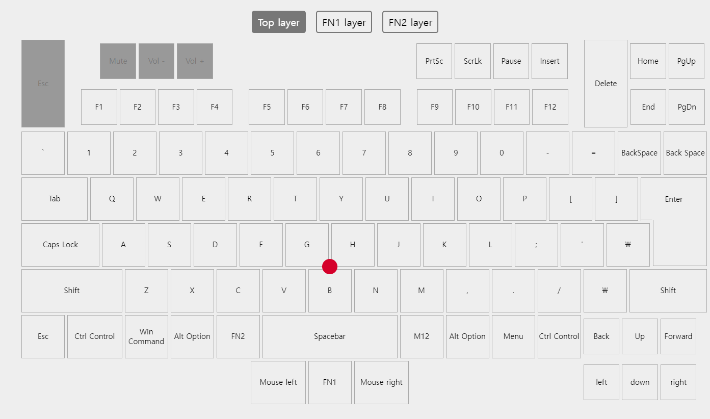

# for mac : tex shinobi & 카라비너 ANSII배열 키맵핑

> **Summary**
> 맥에서 Tex Shinobi와 카라비너를 사용하여 키 매핑을 설정하는 방법에 대한 안내. Karabiner Complex Rules Generator를 통해 IJKL 및 UO 키 조합을 설정하고, T480 모델에 맞게 조정하는 방법도 설명. Hammerspoon을 사용하여 CTRL+HJKL로 방향키 이동을 설정하는 방법도 포함되어 있습니다.

---

🔗 [https://matdulgi.tistory.com/124](https://matdulgi.tistory.com/124)

🔗 [https://genesy.github.io/karabiner-complex-rules-generator/#eyJ0aXRsZSI6IklKS0xVTyIsInJ1bGVzIjpbeyJkZXNjcmlwdGlvbiI6IklKS0wiLCJtYW5pcHVsYXRvcnMiOlt7InR5cGUiOiJiYXNpYyIsImZyb20iOnsibW9kaWZpZXJzIjp7Im1hbmRhdG9yeSI6WyJsZWZ0X2d1aSJdfSwia2V5X2NvZGUiOiJpIn0sInRvIjpbeyJyZXBlYXQiOnRydWUsImtleV9jb2RlIjoidXBfYXJyb3cifV19LHsidHlwZSI6ImJhc2ljIiwiZnJvbSI6eyJtb2RpZmllcnMiOnsibWFuZGF0b3J5IjpbImxlZnRfZ3VpIl19LCJrZXlfY29kZSI6ImoifSwidG8iOlt7InJlcGVhdCI6dHJ1ZSwia2V5X2NvZGUiOiJsZWZ0X2Fycm93In1dfSx7InR5cGUiOiJiYXNpYyIsImZyb20iOnsibW9kaWZpZXJzIjp7Im1hbmRhdG9yeSI6WyJsZWZ0X2d1aSJdfSwia2V5X2NvZGUiOiJrIn0sInRvIjpbeyJyZXBlYXQiOnRydWUsImtleV9jb2RlIjoiZG93bl9hcnJvdyJ9XX0seyJ0eXBlIjoiYmFzaWMiLCJmcm9tIjp7Im1vZGlmaWVycyI6eyJtYW5kYXRvcnkiOlsibGVmdF9ndWkiXX0sImtleV9jb2RlIjoibCJ9LCJ0byI6W3sicmVwZWF0Ijp0cnVlLCJrZXlfY29kZSI6InJpZ2h0X2Fycm93In1dfV19LHsiZGVzY3JpcHRpb24iOiJVTyIsIm1hbmlwdWxhdG9ycyI6W3sidHlwZSI6ImJhc2ljIiwiZnJvbSI6eyJtb2RpZmllcnMiOnsibWFuZGF0b3J5IjpbImxlZnRfZ3VpIl19LCJrZXlfY29kZSI6InUifSwidG8iOlt7InJlcGVhdCI6dHJ1ZSwia2V5X2NvZGUiOiJsZWZ0X2Fycm93IiwibW9kaWZpZXJzIjpbImxlZnRfZ3VpIl19XX0seyJ0eXBlIjoiYmFzaWMiLCJmcm9tIjp7Im1vZGlmaWVycyI6eyJtYW5kYXRvcnkiOlsibGVmdF9ndWkiXX0sImtleV9jb2RlIjoibyJ9LCJ0byI6W3sicmVwZWF0Ijp0cnVlLCJrZXlfY29kZSI6InJpZ2h0X2Fycm93IiwibW9kaWZpZXJzIjpbImxlZnRfZ3VpIl19XX1dfV19](https://genesy.github.io/karabiner-complex-rules-generator/#eyJ0aXRsZSI6IklKS0xVTyIsInJ1bGVzIjpbeyJkZXNjcmlwdGlvbiI6IklKS0wiLCJtYW5pcHVsYXRvcnMiOlt7InR5cGUiOiJiYXNpYyIsImZyb20iOnsibW9kaWZpZXJzIjp7Im1hbmRhdG9yeSI6WyJsZWZ0X2d1aSJdfSwia2V5X2NvZGUiOiJpIn0sInRvIjpbeyJyZXBlYXQiOnRydWUsImtleV9jb2RlIjoidXBfYXJyb3cifV19LHsidHlwZSI6ImJhc2ljIiwiZnJvbSI6eyJtb2RpZmllcnMiOnsibWFuZGF0b3J5IjpbImxlZnRfZ3VpIl19LCJrZXlfY29kZSI6ImoifSwidG8iOlt7InJlcGVhdCI6dHJ1ZSwia2V5X2NvZGUiOiJsZWZ0X2Fycm93In1dfSx7InR5cGUiOiJiYXNpYyIsImZyb20iOnsibW9kaWZpZXJzIjp7Im1hbmRhdG9yeSI6WyJsZWZ0X2d1aSJdfSwia2V5X2NvZGUiOiJrIn0sInRvIjpbeyJyZXBlYXQiOnRydWUsImtleV9jb2RlIjoiZG93bl9hcnJvdyJ9XX0seyJ0eXBlIjoiYmFzaWMiLCJmcm9tIjp7Im1vZGlmaWVycyI6eyJtYW5kYXRvcnkiOlsibGVmdF9ndWkiXX0sImtleV9jb2RlIjoibCJ9LCJ0byI6W3sicmVwZWF0Ijp0cnVlLCJrZXlfY29kZSI6InJpZ2h0X2Fycm93In1dfV19LHsiZGVzY3JpcHRpb24iOiJVTyIsIm1hbmlwdWxhdG9ycyI6W3sidHlwZSI6ImJhc2ljIiwiZnJvbSI6eyJtb2RpZmllcnMiOnsibWFuZGF0b3J5IjpbImxlZnRfZ3VpIl19LCJrZXlfY29kZSI6InUifSwidG8iOlt7InJlcGVhdCI6dHJ1ZSwia2V5X2NvZGUiOiJsZWZ0X2Fycm93IiwibW9kaWZpZXJzIjpbImxlZnRfZ3VpIl19XX0seyJ0eXBlIjoiYmFzaWMiLCJmcm9tIjp7Im1vZGlmaWVycyI6eyJtYW5kYXRvcnkiOlsibGVmdF9ndWkiXX0sImtleV9jb2RlIjoibyJ9LCJ0byI6W3sicmVwZWF0Ijp0cnVlLCJrZXlfY29kZSI6InJpZ2h0X2Fycm93IiwibW9kaWZpZXJzIjpbImxlZnRfZ3VpIl19XX1dfV19)

# Tex Shinobi 용

# T480 용

# HHKB PRO2 용 

