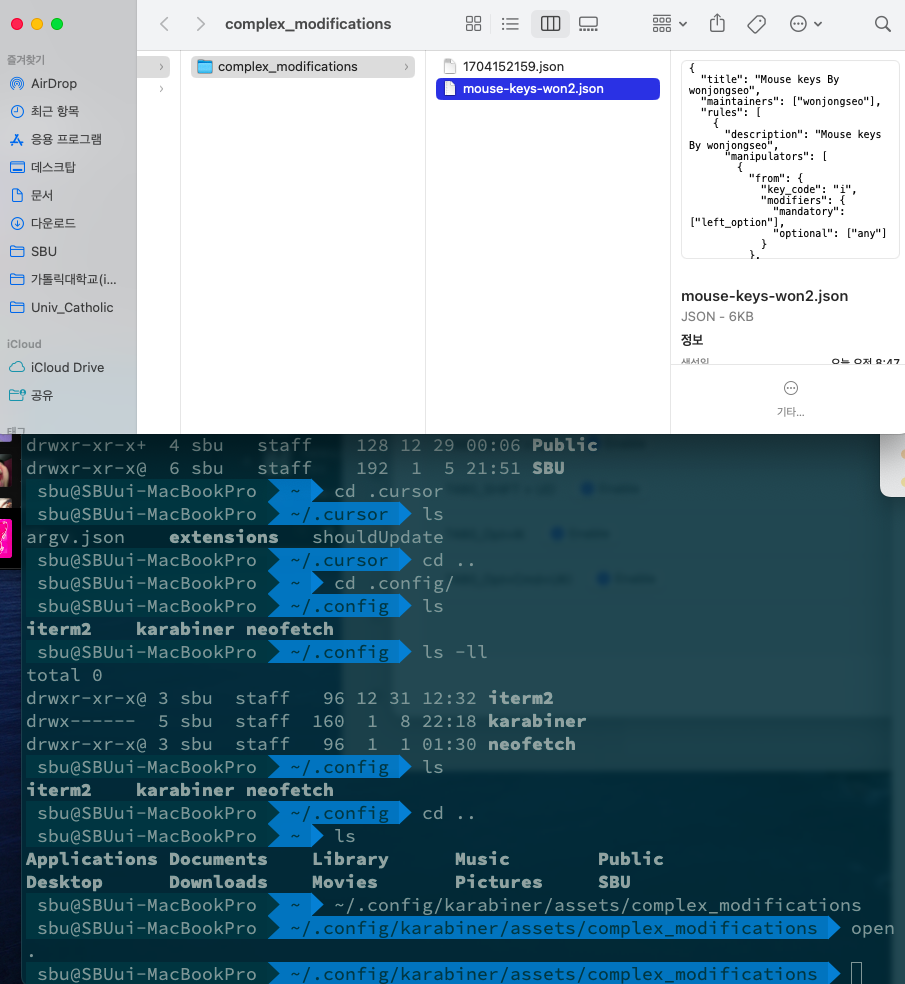
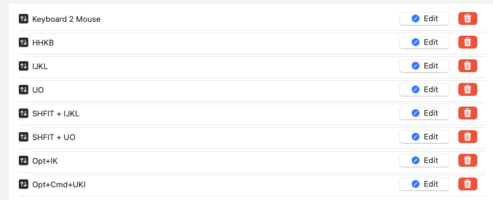

# for mac : 카라비너 키보드로 마우스 컨트롤 

> **Summary**
> 키보드로 마우스를 조작하는 방법에 대한 안내로, Karabiner를 사용하여 Mac에서 마우스 없이 키보드만으로 작업할 수 있는 설정을 설명합니다. JSON 파일을 특정 디렉토리에 복사하여 사용하며, T480 및 Rainy75 모델에 대한 수정된 코드 예시도 포함되어 있습니다. 마우스 이동 및 스크롤을 위한 키 조합도 안내합니다.

---


🔗 [https://www.youtube.com/watch?v=U2gMzPqkrCI&t=11s](https://www.youtube.com/watch?v=U2gMzPqkrCI&t=11s)

🔗 [https://github.com/wonjongseo/mouse-karabiner/blob/main/mouse-keys-won2.json](https://github.com/wonjongseo/mouse-karabiner/blob/main/mouse-keys-won2.json)

```plain text
~/.config/karabiner/assets/complex_modifications
```






# T480 용 (opt → cmd input) 수정한 버전

# Rainy75 용

→ 항상 ctrl 키는 hold하고 있다고 생각

