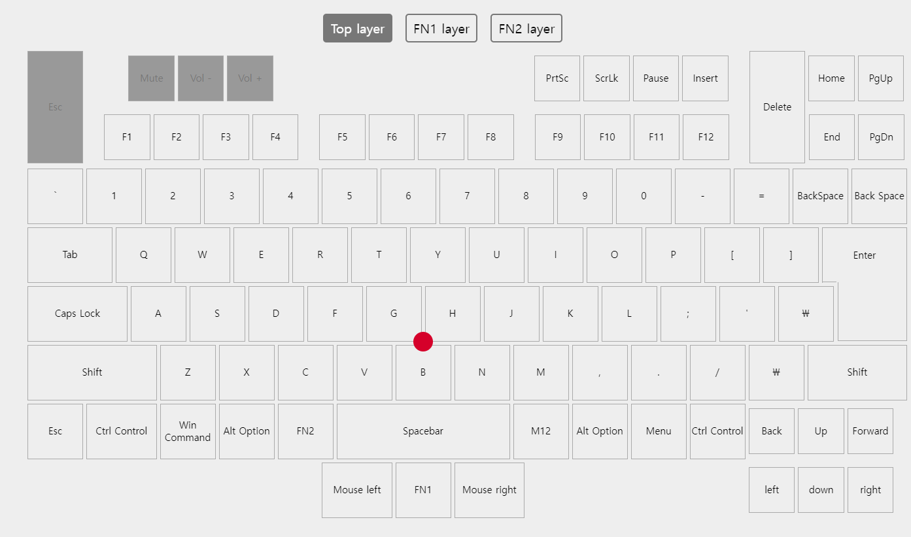
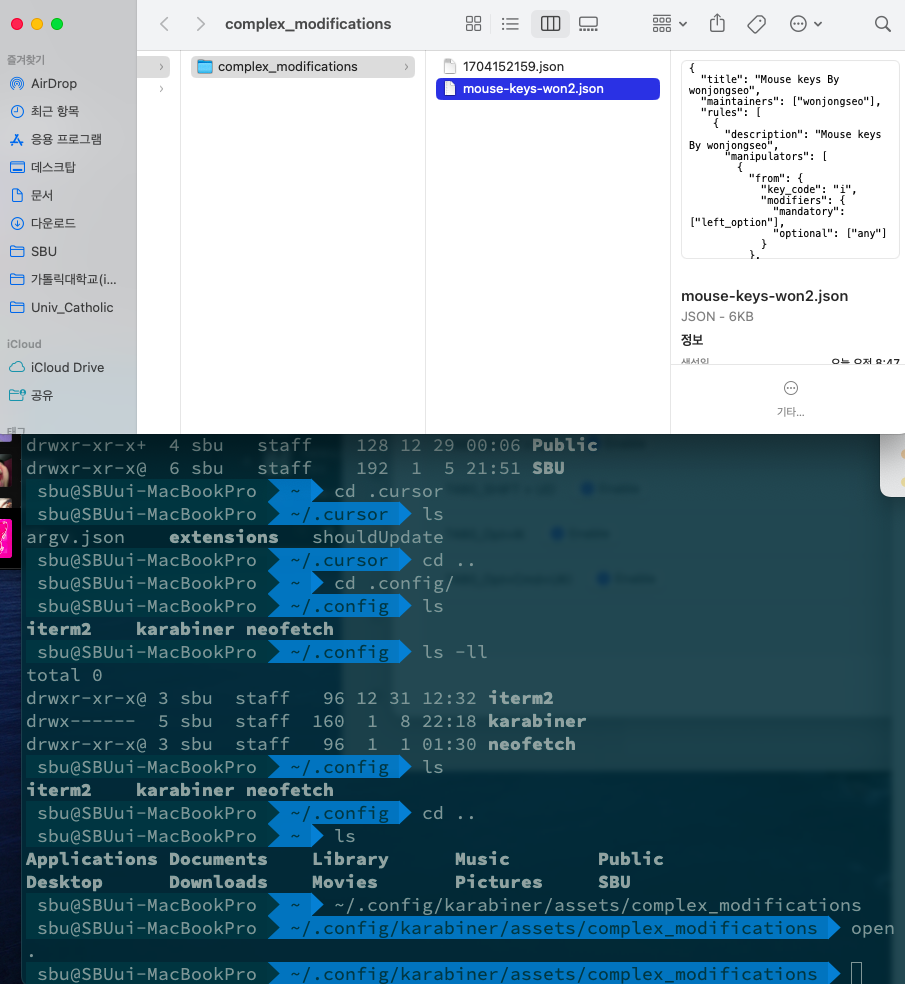
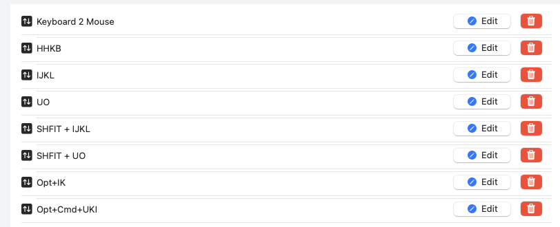

# for mac : 카라비너 키보드로 마우스 컨트롤 

> **Summary**
> 키보드로 마우스를 조작하는 방법에 대한 안내로, Karabiner를 사용하여 Mac에서 마우스 없이 키보드만으로 작업할 수 있는 설정을 설명합니다. JSON 파일을 특정 디렉토리에 복사하여 사용하며, T480 및 Rainy75 모델에 대한 수정된 코드 예시도 포함되어 있습니다. 마우스 이동 및 스크롤을 위한 키 조합도 안내합니다.

---



🔗 [https://www.youtube.com/watch?v=U2gMzPqkrCI&t=11s](https://www.youtube.com/watch?v=U2gMzPqkrCI&t=11s)

🔗 [https://github.com/wonjongseo/mouse-karabiner/blob/main/mouse-keys-won2.json](https://github.com/wonjongseo/mouse-karabiner/blob/main/mouse-keys-won2.json)

```plain text
~/.config/karabiner/assets/complex_modifications
```






# T480 용 (opt → cmd input) 수정한 버전

```c++
{
  "title": "T480 Mouse keys By wonjongseo",
  "maintainers": ["T480 wonjongseo"],
  "rules": [
    {
      "description": "Mouse keys By wonjongseo",
      "manipulators": [
        {
          "from": {
            "key_code": "i",
            "modifiers": {
              "mandatory": ["left_shift","left_control"],
              "optional": ["any"]
            }
          },
          "to": [
            {
              "mouse_key": {
                "vertical_wheel": 24
              }
            }
          ],
          "type": "basic"
        },
        {
          "from": {
            "key_code": "k",
            "modifiers": {
              "mandatory": ["left_shift","left_control"],
              "optional": ["any"]
            }
          },
          "to": [
            {
              "mouse_key": {
                "vertical_wheel": -24
              }
            }
          ],
          "type": "basic"
        },

        {
          "from": {
            "key_code": "l",
            "modifiers": {
              "mandatory": ["left_shift","left_control"],
              "optional": ["any"]
            }
          },
          "to": [
            {
              "mouse_key": {
                "horizontal_wheel": 36
              }
            }
          ],
          "type": "basic"
        },

        {
          "from": {
            "key_code": "j",
            "modifiers": {
              "mandatory": ["left_shift","left_control"],
              "optional": ["any"]
            }
          },
          "to": [
            {
              "mouse_key": {
                "horizontal_wheel": -36
              }
            }
          ],
          "type": "basic"
        },

        {
          "from": {
            "key_code": "j",
            "modifiers": {
              "mandatory": ["left_control", "left_command"],
              "optional": ["any"]
            }
          },
          "to": [
            {
              "mouse_key": {
                "x": -3072
              }
            }
          ],
          "type": "basic"
        },
        {
          "from": {
            "key_code": "k",
            "modifiers": {
              "mandatory": ["left_control", "left_command"],
              "optional": ["any"]
            }
          },
          "to": [
            {
              "mouse_key": {
                "y": 3072
              }
            }
          ],
          "type": "basic"
        },
        {
          "from": {
            "key_code": "i",
            "modifiers": {
              "mandatory": ["left_control", "left_command"],
              "optional": ["any"]
            }
          },
          "to": [
            {
              "mouse_key": {
                "y": -3072
              }
            }
          ],
          "type": "basic"
        },
        {
          "from": {
            "key_code": "l",
            "modifiers": {
              "mandatory": ["left_control", "left_command"],
              "optional": ["any"]
            }
          },
          "to": [
            {
              "mouse_key": {
                "x": 3072
              }
            }
          ],
          "type": "basic"
        },

        {
          "from": {
            "key_code": "j",
            "modifiers": {
              "mandatory": ["left_control", "c"],
              "optional": ["any"]
            }
          },
          "to": [
            {
              "mouse_key": {
                "x": -1536
              }
            }
          ],
          "type": "basic"
        },
        {
          "from": {
            "key_code": "k",
            "modifiers": {
              "mandatory": ["left_control", "left_command"],
              "optional": ["any"]
            }
          },
          "to": [
            {
              "mouse_key": {
                "y": 1536
              }
            }
          ],
          "type": "basic"
        },
        {
          "from": {
            "key_code": "i",
            "modifiers": {
              "mandatory": ["left_control", "left_command"],
              "optional": ["any"]
            }
          },
          "to": [
            {
              "mouse_key": {
                "y": -1536
              }
            }
          ],
          "type": "basic"
        },
        {
          "from": {
            "key_code": "l",
            "modifiers": {
              "mandatory": ["left_control", "left_command"],
              "optional": ["any"]
            }
          },
          "to": [
            {
              "mouse_key": {
                "x": 1536
              }
            }
          ],
          "type": "basic"
        },

        {
          "from": {
            "key_code": "j",
            "modifiers": {
              "mandatory": ["left_control"],
              "optional": ["any"]
            }
          },
          "to": [
            {
              "mouse_key": {
                "x": -512
              }
            }
          ],
          "type": "basic"
        },
        {
          "from": {
            "key_code": "k",
            "modifiers": {
              "mandatory": ["left_control"],
              "optional": ["any"]
            }
          },
          "to": [
            {
              "mouse_key": {
                "y": 512
              }
            }
          ],
          "type": "basic"
        },
        {
          "from": {
            "key_code": "i",
            "modifiers": {
              "mandatory": ["left_control"],
              "optional": ["any"]
            }
          },
          "to": [
            {
              "mouse_key": {
                "y": -512
              }
            }
          ],
          "type": "basic"
        },
        {
          "from": {
            "key_code": "l",
            "modifiers": {
              "mandatory": ["left_control"],
              "optional": ["any"]
            }
          },
          "to": [
            {
              "mouse_key": {
                "x": 512
              }
            }
          ],
          "type": "basic"
        },
        {
          "type": "basic",
          "from": {
            "key_code": "s",
            "modifiers": {
              "mandatory": ["left_control"],
              "optional": ["any"]
            }
          },
          "to": [
            {
              "software_function": {
                "set_mouse_cursor_position": {
                  "x": "50%",
                  "y": "50%",
                  "screen": 0
                }
              }
            }
          ]
        }
      ]
    }
  ]
}
```


# Rainy75 용

```c++
{
    "description": "Keyboard 2 Mouse",
    "manipulators": [
        {
            "from": {
                "key_code": "i",
                "modifiers": {
                    "mandatory": [
                        "left_shift",
                        "left_control"
                    ],
                    "optional": [
                        "any"
                    ]
                }
            },~~
~~            "to": [
                {
                    "mouse_key": {
                        "vertical_wheel": -48
                    }
                }
            ],
            "type": "basic"
        },
        {
            "from": {
                "key_code": "k",
                "modifiers": {
                    "mandatory": [
                        "left_shift",
                        "left_control"
                    ],
                    "optional": [
                        "any"
                    ]
                }
            },
            "to": [
                {
                    "mouse_key": {
                        "vertical_wheel": 48
                    }
                }
            ],
            "type": "basic"
        },
        {
            "from": {
                "key_code": "l",
                "modifiers": {
                    "mandatory": [
                        "left_shift",
                        "left_control"
                    ],
                    "optional": [
                        "any"
                    ]
                }
            },
            "to": [
                {
                    "mouse_key": {
                        "horizontal_wheel": -36
                    }
                }
            ],
            "type": "basic"
        },
        {
            "from": {
                "key_code": "j",
                "modifiers": {
                    "mandatory": [
                        "left_shift",
                        "left_control"
                    ],
                    "optional": [
                        "any"
                    ]
                }
            },
            "to": [
                {
                    "mouse_key": {
                        "horizontal_wheel": 36
                    }
                }
            ],
            "type": "basic"
        },
        {
            "from": {
                "key_code": "j",
                "modifiers": {
                    "mandatory": [
                        "left_control",
                        "left_option"
                    ],
                    "optional": [
                        "any"
                    ]
                }
            },
            "to": [
                {
                    "mouse_key": {
                        "x": -3072
                    }
                }
            ],
            "type": "basic"
        },
        {
            "from": {
                "key_code": "k",
                "modifiers": {
                    "mandatory": [
                        "left_control",
                        "left_option"
                    ],
                    "optional": [
                        "any"
                    ]
                }
            },
            "to": [
                {
                    "mouse_key": {
                        "y": 3072
                    }
                }
            ],
            "type": "basic"
        },
        {
            "from": {
                "key_code": "i",
                "modifiers": {
                    "mandatory": [
                        "left_control",
                        "left_option"
                    ],
                    "optional": [
                        "any"
                    ]
                }
            },
            "to": [
                {
                    "mouse_key": {
                        "y": -3072
                    }
                }
            ],
            "type": "basic"
        },
        {
            "from": {
                "key_code": "l",
                "modifiers": {
                    "mandatory": [
                        "left_control",
                        "left_option"
                    ],
                    "optional": [
                        "any"
                    ]
                }
            },
            "to": [
                {
                    "mouse_key": {
                        "x": 3072
                    }
                }
            ],
            "type": "basic"
        },
        {
            "from": {
                "key_code": "j",
                "modifiers": {
                    "mandatory": [
                        "left_control",
                        "left_option"
                    ],
                    "optional": [
                        "any"
                    ]
                }
            },
            "to": [
                {
                    "mouse_key": {
                        "x": -1536
                    }
                }
            ],
            "type": "basic"
        },
        {
            "from": {
                "key_code": "k",
                "modifiers": {
                    "mandatory": [
                        "left_control",
                        "left_option"
                    ],
                    "optional": [
                        "any"
                    ]
                }
            },
            "to": [
                {
                    "mouse_key": {
                        "y": 1536
                    }
                }
            ],
            "type": "basic"
        },
        {
            "from": {
                "key_code": "i",
                "modifiers": {
                    "mandatory": [
                        "left_control",
                        "left_option"
                    ],
                    "optional": [
                        "any"
                    ]
                }
            },
            "to": [
                {
                    "mouse_key": {
                        "y": -1536
                    }
                }
            ],
            "type": "basic"
        },
        {
            "from": {
                "key_code": "l",
                "modifiers": {
                    "mandatory": [
                        "left_control",
                        "left_option"
                    ],
                    "optional": [
                        "any"
                    ]
                }
            },
            "to": [
                {
                    "mouse_key": {
                        "x": 1536
                    }
                }
            ],
            "type": "basic"
        },
        {
            "from": {
                "key_code": "j",
                "modifiers": {
                    "mandatory": [
                        "left_control"
                    ],
                    "optional": [
                        "any"
                    ]
                }
            },
            "to": [
                {
                    "mouse_key": {
                        "x": -512
                    }
                }
            ],
            "type": "basic"
        },
        {
            "from": {
                "key_code": "k",
                "modifiers": {
                    "mandatory": [
                        "left_control"
                    ],
                    "optional": [
                        "any"
                    ]
                }
            },
            "to": [
                {
                    "mouse_key": {
                        "y": 512
                    }
                }
            ],
            "type": "basic"
        },
        {
            "from": {
                "key_code": "i",
                "modifiers": {
                    "mandatory": [
                        "left_control"
                    ],
                    "optional": [
                        "any"
                    ]
                }
            },
            "to": [
                {
                    "mouse_key": {
                        "y": -512
                    }
                }
            ],
            "type": "basic"
        },
        {
            "from": {
                "key_code": "l",
                "modifiers": {
                    "mandatory": [
                        "left_control"
                    ],
                    "optional": [
                        "any"
                    ]
                }
            },
            "to": [
                {
                    "mouse_key": {
                        "x": 512
                    }
                }
            ],
            "type": "basic"
        },
        {
            "from": {
                "key_code": "q",
                "modifiers": {
                    "mandatory": [
                        "left_control"
                    ],
                    "optional": [
                        "any"
                    ]
                }
            },
            "to": [
                {
                    "software_function": {
                        "set_mouse_cursor_position": {
                            "screen": 0,
                            "x": "50%",
                            "y": "50%"
                        }
                    }
                }
            ],
            "type": "basic"
        }
    ]
}
```


→ 항상 ctrl 키는 hold하고 있다고 생각

| 마우스 이동 (정밀) | `ctrl` | `ijkl` |
| 마우스 이동 (신속) | `ctrl` + `win` | `ijkl` |
| 스크롤 | `ctrl` + `shift` | `ijkl` |

