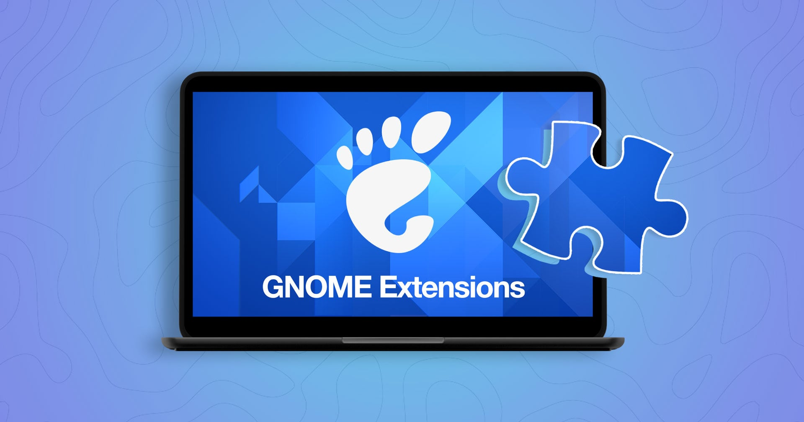

# gnome Extention

> **Summary**
> GNOME 확장 설치 방법과 다양한 유용한 확장 목록을 제공하며, 각 확장에 대한 설명과 설치 링크를 포함하고 있습니다. 주요 확장으로는 블루투스 빠른 연결, 사용자 테마, GSConnect, 다중 모니터 추가 기능 등이 있습니다.

---

# 설치방법

## 배경 불투명하게

## 타일링 시스템

## Other

