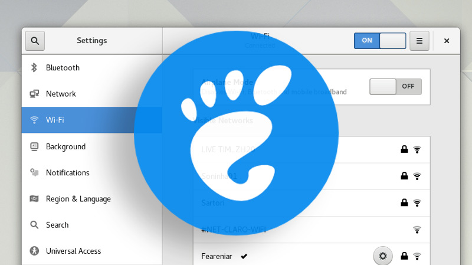

# gnome theme

> **Summary**
> GNOME 테마 적용 방법과 관련된 링크와 추천 테마 목록이 포함되어 있습니다. 추천 테마로는 WhiteSur Gtk Theme, McMojave, Nordic이 있습니다.

---

🔗 [https://memoa.tistory.com/1](https://memoa.tistory.com/1)

🔗 [https://dkje.github.io/2020/08/05/gnomeTheme/](https://dkje.github.io/2020/08/05/gnomeTheme/)

## Theme

🔗 [https://www.opendesktop.org/s/Gnome/p/1403328](https://www.opendesktop.org/s/Gnome/p/1403328)

🔗 [https://www.opendesktop.org/s/Gnome/p/1275087](https://www.opendesktop.org/s/Gnome/p/1275087)

🔗 [https://www.opendesktop.org/s/Gnome/p/1267246](https://www.opendesktop.org/s/Gnome/p/1267246)

