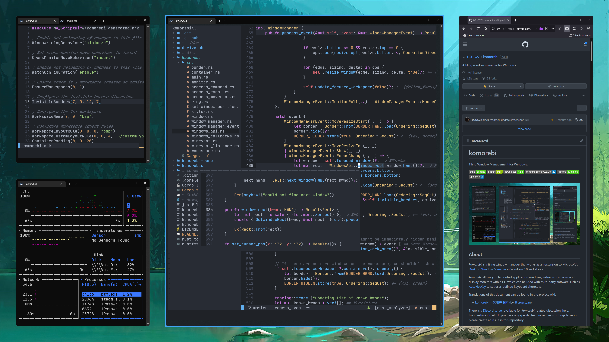

# komorebi - 윈도우 타일링 시스템

> **Summary**
> 윈도우 타일링 시스템인 komorebi의 설치 방법은 Scoop을 통해 komorebi와 whkd를 설치하는 것이며, 제거할 때는 프로세스를 중지한 후 Scoop 또는 WinGet을 사용하여 제거할 수 있습니다. 예제 구성은 제공된 링크에서 확인할 수 있습니다.

---



# 설치 방법

[https://lgug2z.github.io/komorebi/installation.html](https://lgug2z.github.io/komorebi/installation.html)

## → Scoop 으로 설치

### komorebi 및 whkd 설치

먼저 Extras 버킷을 추가하세요.

```latex
scoop bucket add extras
```

그런 다음 다음을 사용하여 `komorebi`및 패키지를 설치하십시오.`whkdscoop install`

```latex
scoop install komorebi whkd
```

komorebi가 설치되면 [예제 구성을](https://lgug2z.github.io/komorebi/example-configurations.html) 가져옵니다 .

# 예제 구성

[https://lgug2z.github.io/komorebi/example-configurations.html](https://lgug2z.github.io/komorebi/example-configurations.html)

[https://zhuanlan.zhihu.com/p/455064481](https://zhuanlan.zhihu.com/p/455064481)

# 삭제 방법

제거하기 전에 먼저 실행하여 및 프로세스가 모두 중지되었는지 `komorebic stop --whkd`확인하세요 .`komorebiwhkd`

그런 다음 Scoop 또는 WinGet을 사용하여 설치했는지 여부에 따라 `scoop uninstall komorebi whkd`또는 `winget uninstall LGUG2Z.komorebi LGUG2Z.whkd`.

`quickstart`마지막으로 PowerShell 프롬프트에서 다음 명령을 실행하여 해당 명령으로 생성된 파일과 기타 런타임 파일을 정리할 수 있습니다 .

`rm $Env:USERPROFILE\komorebi.json
rm $Env:USERPROFILE\applications.yaml
rm $Env:USERPROFILE\.config\whkdrc
rm -r -Force $Env:LOCALAPPDATA\komorebi`

