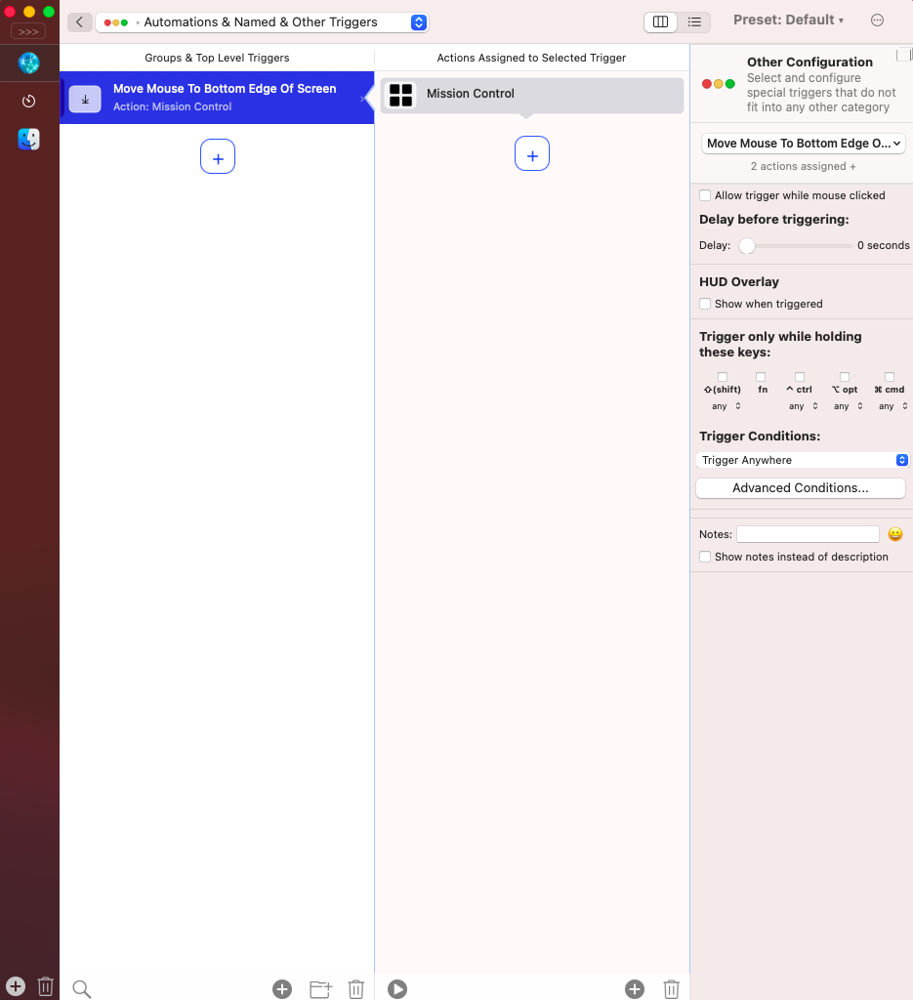

# macOS - BTT로 HotEdge 를 구성해보자

> **Summary**
> BTT를 사용하여 macOS에서 HotEdge를 설정하는 방법에 대한 내용을 다루고 있으며, 관련 이미지와 비디오 링크가 포함되어 있습니다.

---

[https://imgur.com/a/bettertouchtool-hot-corners-B7zwmLb](https://imgur.com/a/bettertouchtool-hot-corners-B7zwmLb)

