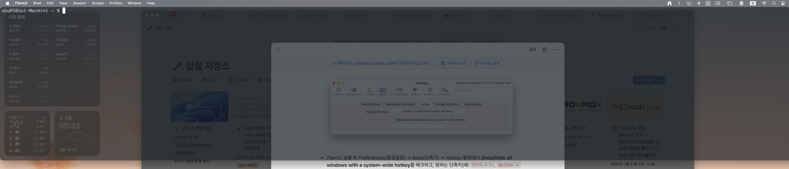
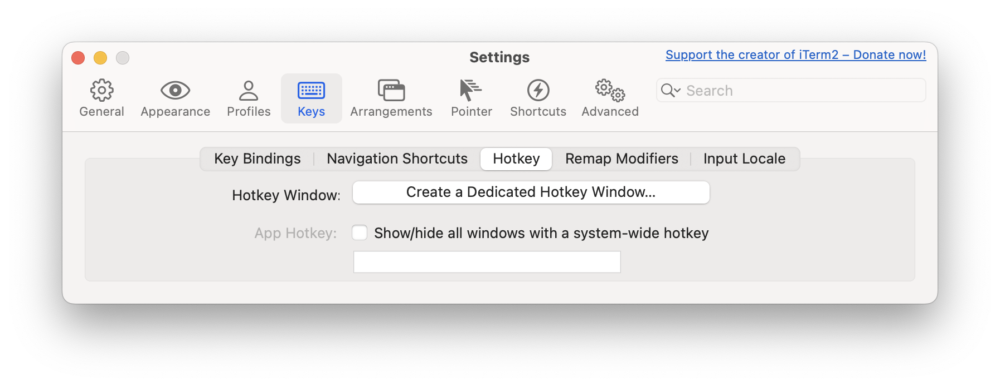

# macOS에서도 KDE의 Yakuake와 같은 “드롭다운 터미널” 기능을 사용하는법

> **Summary**
> iTerm2를 설치하고 핫키를 설정하여 드롭다운 터미널을 만들 수 있습니다. 윈도우 스타일을 화면 상단 전체 너비로 설정하고, Dock과 앱 전환기에서 숨기며, 부팅 시 자동 실행하도록 설정하는 방법을 안내합니다.

---

## iTerm2로 드롭다운 터미널 만드는 방법

1. **iTerm2 설치**
  - [iTerm2 공식 홈페이지](https://iterm2.com/)에서 다운로드하거나 Homebrew로 설치하세요.
1. **핫키 윈도우 설정**

  - iTerm2 실행 후 Preferences(환경설정) → Keys(단축키) → Hotkey 항목에서 **Show/hide all windows with a system-wide hotkey**를 체크하고, 원하는 단축키(예: `Ctrl + ~`, `Option + Space` 등)를 설정합니다.
1. **윈도우 스타일 및 위치 설정**

  - Preferences → Profiles(프로필) → Window(창) 탭에서 다음과 같이 설정하세요:
    - **Style**: **Full-width Top of Screen**(화면 상단 전체 너비)
    - **Screen**: **Screen with Cursor**(커서 위치 스크린)
    - **Space**: **All Spaces**(모든 데스크톱) - 이렇게 설정하면 언제 어디서든 단축키로 터미널을 즉시 불러올 수 있습니다.
1. **독(Dock)과 앱 전환기에서 숨기기**
  - Preferences → Appearance(외형)에서 **Exclude from Dock and ⌘-Tab Switcher** 옵션을 체크합니다.
1. **부팅 시 자동 실행**
  - 시스템 환경설정 → 사용자 및 그룹 → 로그인 항목에 iTerm2를 추가하세요.
