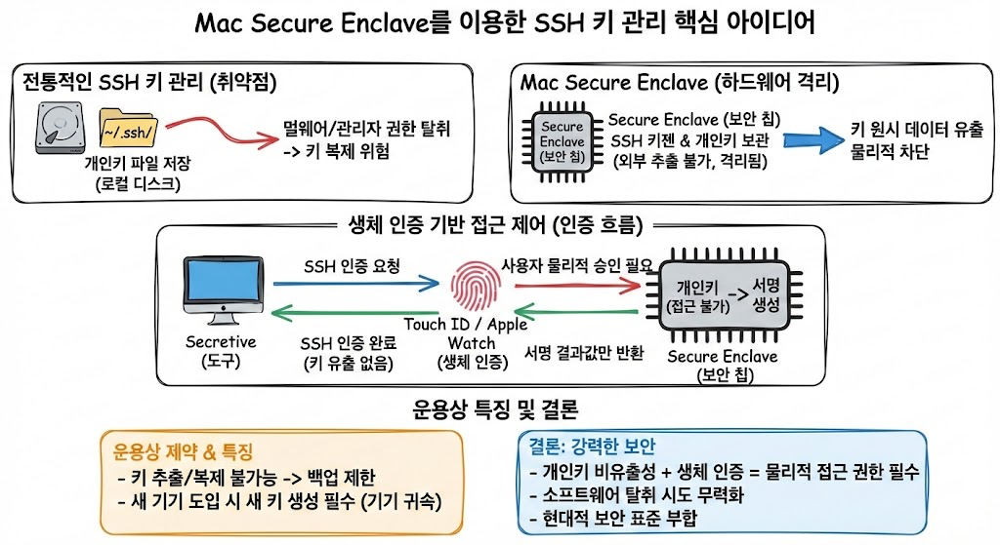

# mac에서 ssh 키젠은 어디서 일어나는가?

> **Summary**
> 맥의 Secure Enclave를 이용한 SSH 키 관리 방식은 개인키를 보안 칩에서 격리하여 보호하고, 생체 인증을 통해 물리적 접근을 제어한다. 이는 기존의 파일 기반 키 관리 방식보다 높은 보안성을 제공하며, 키의 복제가 불가능하여 분실이나 도난 시에도 인증 정보의 오용을 방지한다. 이러한 시스템은 현대적인 보안 표준에 부합하는 우수한 인증 솔루션으로 평가된다.

---

🔗 [https://github.com/maxgoedjen/secretive](https://github.com/maxgoedjen/secretive)

- 맥 보안칩 쓰는거
- ssh 키젠 자체가 이 칩 안에서 작동함
- 이 칩 안에 private키가 있어서 우리도 확인을 못함
- 유일하게 뚫을 수 있는 방법은 내 지문뿐(지문을 인증함으로서 public키를 보내고, public키가 맞는지만 알려줌 그제서야 ssh인증이됨)
## [주제 1: 하드웨어 격리를 통한 개인키 보호의 근본적 변화]

전통적인 SSH 키 관리 방식은 개인키를 파일 형태로 로컬 디스크(`~/.ssh/`)에 저장하며, 이는 파일 시스템의 권한 설정에 의존한다. 그러나 이러한 방식은 시스템이 멀웨어에 감염되거나 관리자 권한이 탈취되었을 때 키 파일 자체가 복제될 위험을 내포하고 있다. 반면, Mac의 Secure Enclave를 활용하면 키 생성 시점부터 개인키가 메인 프로세서와 격리된 별도의 보안 칩 내부에서만 존재하게 된다. 이 하드웨어는 설계상 외부로의 데이터 유출을 물리적으로 차단하므로, 사용자나 운영체제조차 키의 원시 데이터를 추출할 수 없는 구조적 안전성을 확보한다.

## [주제 2: 생체 인증 기반의 물리적 접근 제어 메커니즘]

Secure Enclave 기반 인증의 핵심은 개인키를 사용하기 위한 '승인 절차'에 있다. Secretive 등의 도구를 통해 생성된 키는 사용 시마다 Touch ID 또는 Apple Watch를 통한 생체 인증을 강제한다. 인증 과정은 보안 칩 내부에서 완결되며, 칩은 외부로 키를 내보내는 대신 서버가 보낸 챌린지에 대한 서명 결과값만을 반환한다. 이는 공격자가 원격으로 기기를 제어하더라도 사용자의 물리적인 지문 입력 없이는 SSH 인증을 수행할 수 없음을 의미하며, 소프트웨어 기반의 비밀번호(Passphrase) 입력 방식보다 한층 높은 보안 계층을 형성한다.

## [주제 3: 운용상 제약과 데이터 무결성]

보안 칩 기반 방식은 개인키의 추출이 불가능하므로 기기 간 키 이동이나 백업이 제한된다는 운용상의 특징이 있다. 새로운 기기를 도입할 때마다 매번 새로운 키 쌍을 생성하고 서버에 공개키를 등록해야 하는 번거로움이 발생하지만, 이는 역설적으로 특정 기기에 대한 인증 권한을 해당 하드웨어에 완벽히 귀속시킴으로써 보안 신뢰도를 극대화한다. 키의 복제 가능성을 배제함으로써 분실이나 도난 시에도 해당 기기의 물리적 접근 권한을 상실하지 않는 한 인증 정보가 오용될 여지를 원천 차단한다.

## [결론: 하드웨어 보안 기반 인증의 우수성]

결론적으로 Secure Enclave를 이용한 SSH 키 관리 방식은 **개인키의 비유출성**과 **생체 인증을 통한 물리적 승인**이라는 두 가지 핵심 요소를 결합하여 기존 방식의 보안적 한계를 완벽히 보완한다. 소프트웨어 취약점을 이용한 키 탈취 시도를 무력화하고, 인증의 주체를 하드웨어와 사용자 본인의 생체 정보로 한정한다는 점에서 이 체계는 현대적인 보안 표준에 부합하는 가장 우수한 인증 솔루션이라고 판단할 수 있다.

